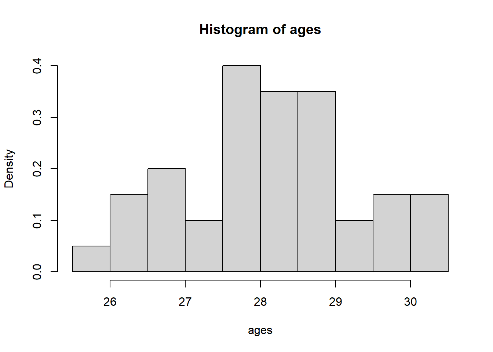
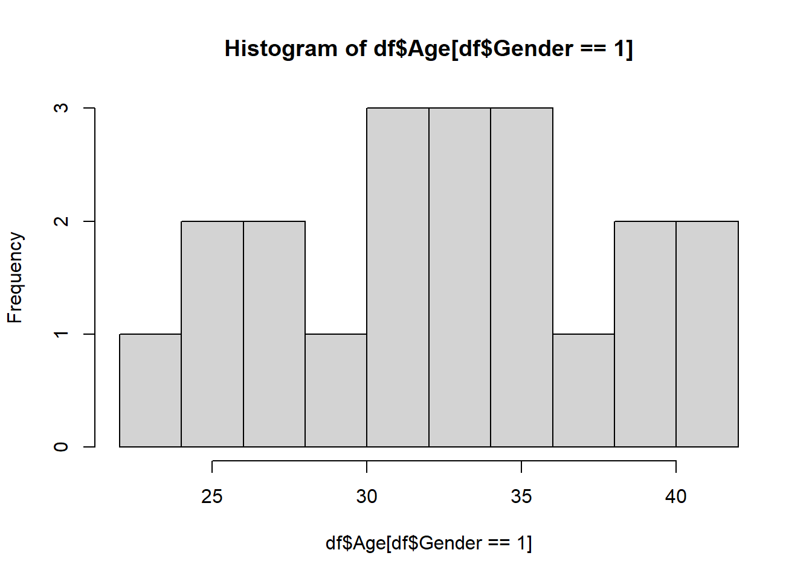

# Review of introductory statistics

The followings are some concepts that you have learned from prerequisites, and/or we have reviewed in the last two lectures.

- Sample vs. Population
- Observation vs. Random variable
- Statistic vs. Parameter
- Estimate vs. Estimator
- Estimator is a random variable and estimate is a number calculated from data
- Mean and variance of random variable
- Relationships between Normal, $t$ , $\chi^2$, $F$ etc.

## Basic premise of statistics

The whole purpose of statistics is to learn something about a population using only a sample of units from that population. A **sample** is a smaller, typically randomly selected, subset of a population. A **population** is a collection of units which we would like to know something about. For example, we may collect a sample of hamburgers from McDonald’s if we want to learn something about the population of McDonald’s hamburgers.

In general, at least for this course, we assume that we have access to a sample of units from a given population. Furthermore, we assume that that sample is a **random sample**. Specifically, we assume that these units in the sample are realizations of random variables. In addition, we also assume that these random variables are mutually independent. For example, we could assume that our sample $X_1,\ldots,X_n$ is Normally distributed with some fixed mean $\mu$ and fixed variance $\sigma^2$. In this case, $\mu$ and $\sigma^2$ are unknown **parameters** of the population. A parameter of a population is some quantity that is a function of the distribution of our given sample. For instance, ${\textrm{E}}\left[X_i\right]=\mu$. Generally, we are concerned with unknown population parameters, which are parts of the distribution that are unknown, and can only ever be estimated. For example, we may know our data is normal, but not know the mean parameter. In that case, we need to use an **estimate** of the parameter. We use a function of the data, typically called the estimator, say $T$, which produces the estimate, given by $T$ computed at the sample we observed: $T(X_1,\ldots,X_n)$.

For example, to estimate $\mu$, we typically use the sample mean. Here, the estimate is given by $\bar X=\sum_{i=1}^nX_i/n$. To be specific, the estimate is the value of $\bar X$ and the estimator $T$ is the function that maps $n$ real numbers to their mean. In general, estimates are used to give our `best guess’ at population parameters.

## Confidence intervals

Recall from the previous section that our estimate of a parameter is only that, an estimate. In other words, it is not exactly equal to the population parameter. For instance, if we drew a different sample our estimate would change. A confidence interval is used to acknowledge this phenomenon in the reporting of our statistics. Its used to give a range of estimates that we might have obtained from any “regular” sample we might observe. It is ultimately used to quantify the error (sometimes called uncertainty) in our estimate.

Confidence intervals consist of a level, usually denoted by $(1-\alpha)100\%$ and two end points. For example, you have learned confidence intervals for the population mean. When we say $(-1,1)$ is $95\%$ confidence interval for the population mean, what does this mean? Colloquially, it means that we expect the sample mean to be somewhere within $(-1,1)$ with high confidence. Note that confidence intervals are computed from the data, which means also that for each new sample, we would get a different confidence interval. However, the population parameter never changes. Therefore, the interval is what is varying from sample to sample. This impacts the interpretation of a confidence interval.

Continuing our example, we have that the interval $(-1,1)$ can be interpreted as: “if we drew many more samples, 95% of the **intervals** will contain the population parameter.” We **do not** say that the parameter has a 95% chance of falling in (-1,1), since the parameter is not random, the interval end points are.

For example, we have the formula for a confidence interval for the population mean is given by: $\bar X\pm 1.96\hat\sigma$. Notice that it is based only on the data. Therefore, it will change if we drew a new sample.

To summarize this section, a confidence interval is used to quantify the uncertainty in our reported estimates. By uncertainty, we specifically mean the uncertainty resulting from the fact that we have only a sample of the population, and our estimate varies depending on the sample.

## Hypothesis tests

Hypothesis tests are used to determine whether an effect is spurious or a real property of the population. A spurious effect is one that is specific to the sample we observed, and is not a real property of the population. For example, if the heights of males and female students are measured, and we observe that the sample mean of both male and females are equal, then this would be a spurious effect. We know that the population heights of males and females are substantially different. If we drew a new sample, we would likely observe something that mirrors the population reality (provided it is large enough).

Formally, a hypothesis test compares two competing beliefs about a population parameter, called the null and alternative hypothesis. For instance, we may wish to test whether the population heights of men is greater than women, vs. the heights being less than or equal to that of men.

We write this as follows: $H_0\colon \mu_{men}\leq \mu_{women}$ vs. $H_a\colon \mu_{men}> \mu_{women}$.

The null hypothesis is usually chosen to be one such that if we make a mistake, the error is most serious. However, it is usually clear from the context.

In general, we compute a test statistic and its distribution **under the null hypothesis.** Then we compute how likely it was to see the observed test statistic we saw, if the null hypothesis was true. This likelihood is given by the **p-value**. If it was sufficiently unlikely (in other words, the p-value is less than the threshold $\alpha$), then we reject the null hypothesis. Otherwise, we fail to reject the null hypothesis. If we fail to reject the null hypothesis then either the null hypothesis is true, it is not true, but there was not enough data collected to show the effect.

There are two types of errors we can make in a hypothesis test: Type 1 and Type 2 error. Type one error occurs when we reject the null hypothesis when it is true. Type two error occurs when we fail to reject the null hypothesis when the alternative is true.

Let’s do an example.

**Exercise 2.7** In a study about online dating, you are interested in determining the average age of individuals who use online dating platforms. You want to know whether the average age of online daters is significantly different from 30. You have a dataset of 40 ages of people using online dating platforms.

How would you answer this question?

$$H_0\colon \mu=30\qquad vs. \qquad H_1\colon \mu\neq 30.$$

First, we can explore the data:

```r
getwd()
```

```
[1] "C:/Users/12RAM/OneDrive - York University/Teaching/Courses/Math 3330 Regression/Math 3330 Notes"
```

```r
ages=read.csv('C:\\Users\\12RAM\\OneDrive - York University\\Teaching\\Courses\\Math 3330 Regression\\Lecture Codes\\Data\\dating_ages.csv')[,2]

hist(ages,freq=F)
```



Now, assume that $X_1,\ldots, X_{40}\sim \mathcal{N}(\mu,\sigma^2)$, and independent. (We can justify normality with the histogram, or we could also invoke the CLT to get normality of the sample mean (not the data itself).) Therefore, we can do a one sample $t$-test. Recall that, under the null hypothesis, we have $\frac{\bar X-30}{\hat\sigma/\sqrt{n}}\sim t_{n-1}$. This means that if $\left|\frac{\bar X-30}{\hat\sigma/\sqrt{n}}\right|\geq t_{n-1,1-\alpha/2}$, then we reject the null hypothesis! Here, $t_{n-1,1-p}$ is the $(1-p)$th quantile of the $t_{n-1}$ distribution. For large $n$ and $p=0.025$, this is roughly equal to 2.

Now, recall that $$ H_0\colon \mu=30\qquad vs. \qquad H_1\colon \mu\neq 30 .$$

```r
# Calculate the mean of the 'ages' data and assign it to xbar
xbar = mean(ages)
xbar  # Print the mean
```

```
[1] 28.16378
```

```r
# Calculate the variance of the 'ages' data and assign it to ssq
ssq = var(ages)
ssq  # Print the variance
```

```
[1] 1.277377
```

```r
# Calculate the length (number of observations) of the 'ages' data and assign it to n
n = length(ages)
n  # Print the number of observations
```

```
[1] 40
```

```r
# Set the significance level 
alpha = 0.05

# print test statistic
ts=(xbar -30)/(sqrt(ssq/n))
print(ts)
```

```
[1] -10.27532
```

```r
# compute p-value
pval=pt(ts,n-1)*2
pval
```

```
[1] 1.179149e-12
```

```r
# Perform a two-sided t-test to check if the mean of 'ages' is significantly different from 30
# t.test() is the function for performing t-tests in R
test = t.test(ages, mu = 30, alternative = 'two.sided')
test  # Print the test result
```

```

    One Sample t-test

data:  ages
t = -10.275, df = 39, p-value = 1.179e-12
alternative hypothesis: true mean is not equal to 30
95 percent confidence interval:
 27.80232 28.52524
sample estimates:
mean of x 
 28.16378 
```

We have that $\left|\frac{\bar X-30}{\hat\sigma/\sqrt{n}}\right|=10.28$. Using R, we get that the p-value is $1.179\times 10^{-12}$.

Here the p-value measures how much evidence there is against the null hypothesis. If the p-value is very small, then this constitutes strong evidence against the null hypothesis. If the p-value is small, but closer to 0.05, then there is evidence against the null. If it is larger, but still small, say 0.1, then this is weak evidence against the null hypothesis. It is not helpful to throw it away if it is above 0.05, therefore we should not just take $\alpha=0.05$. Choosing $\alpha$ depends on how serious a type 1 error is. If it is not that serious, we can take $\alpha$ larger. If it is very serious, we can take $\alpha$ smaller.

In this example, there is very strong evidence against the null hypothesis.

::: {.callout-note}
Note also that we can use the confidence interval method with $$ \bar X\pm t_{n-1,1-\alpha/2}\sqrt{\hat\sigma^2/n}.$$
:::

```r
# Alternative method to calculate the confidence interval
# ci will store the confidence interval values
ci = xbar + c(-1, 1) * qt(1 - alpha / 2, n - 1) * sqrt(ssq / n)
ci  # Print the confidence interval
```

```
[1] 27.80232 28.52524
```

::: {.callout-note}
Moving beyond the one-sample testing problem, we might be interested in other population parameters, say $\theta\in \Theta$. Think Lecture 1: ${\textrm{E}}\left[Y|X\right]=\beta_0+X\beta_1$, we might want to estimate ${\textrm{E}}\left[Y|X\right]$, which amounts to $\beta_0,\beta_1\in \mathbb{R}$! In general, we may estimate $\theta$ by $\hat\theta$. Then we may compute the variance and distribution of $\hat\theta$. From there, we can make confidence intervals and conduct hypothesis tests etc.
:::

Let’s do another example:

**Exercise 2.8** In a study about online dating, you are interested in determining if the average age of those who identify as men who use online dating platforms differs from those who identify as women. You have a dataset of 20 ages of each group using online dating platforms.

What is the population parameter of interest here? It is $\Delta=\mu_{1}-\mu_2$, the difference in means between the two populations. Now, suppose that $X_1,\ldots, X_{20}\sim \mathcal{N}(\mu_1,\sigma^2)$ and $Y_1,\ldots, Y_{20}\sim \mathcal{N}(\mu_2,\sigma^2)$, and are mutually independent. (We could also invoke the CLT instead of assuming normality.) We can estimate those parameters with **estimates.** For instance, $\bar X,\ \bar Y$, $$\hat\sigma^2=\frac{(n_1-1)\hat\sigma_1^2+(n_2-1)\hat\sigma_2^2}{n_1+n_2-2}.$$

**Exercise 2.9** Suppose that $X_1,\ldots, X_{20}\sim \mathcal{N}(\mu_1,\sigma^2)$ and $Y_1,\ldots, Y_{20}\sim \mathcal{N}(\mu_2,\sigma^2)$, and are mutually independent. Compute ${\textrm{Var}}\left[\bar X-\bar Y\right]$.

*Solution 2.3*. Using independence of $\bar X$ and $\bar Y$ and the result of the [Exercise 2.6](#exr-6) , we have that $${\textrm{Var}}\left[\bar X-\bar Y\right]={\textrm{Var}}\left[\bar X\right]+{\textrm{Var}}\left[\bar Y\right]=\sigma_1^2/n_1+\sigma_1^2/n_2.$$

First, we write down the null and alternative hypothesis: $$H_0\colon \Delta=0\qquad vs.. \qquad H_1\colon \Delta\neq 0.$$ Here, we can do a two sample $t$-test.

Recall that the pooled variance is given by: $$\hat\sigma_p^2=\frac{(n_1-1)\hat\sigma_1^2+(n_2-1)\hat\sigma_2}{(n_1+n_2-2)}$$ We previously said that a multiple of a one sample standard deviation follows a Chi-squared distribution. It follows that $(n_1-1)\hat\sigma_1^2/\sigma^2\sim \chi^2_{n_1-1}$ and $(n_2-1)\hat\sigma_2^2/\sigma^2\sim \chi^2_{n_2-1}$. Using the theory from [here](#Useful-properties-of%20normal-and-related-random-variables), specifically, $(n_1-1)\hat\sigma_1^2/\sigma^2+(n_2-1)\hat\sigma_2^2/\sigma^2$ is a sum of independent Chi-squared random variables, and so we have $(n_1-1)\hat\sigma_1^2/\sigma^2+(n_2-1)\hat\sigma_2^2/\sigma^2\sim \chi^2_{n_1+n_2-2}$.

Again, using the theory from [here](#Useful-properties-of%20normal-and-related-random-variables), under the null hypothesis, we have that $$\frac{\bar X-\bar Y}{\hat\sigma_p\sqrt{1/n_1+1/n_2}}=\frac{(\bar X-\bar Y)/\sigma\sqrt{1/n_1+1/n_2}}{\hat\sigma_p/\sigma}\sim t_{n_1+n_2-2}.$$

This follows from 3 facts, first, letting $Z=(\bar X-\bar Y)/\sqrt{{\textrm{Var}}\left[\bar X-\bar Y\right]}$, note that $Z\sim \mathcal{N}(0,1)$. We have that $$Z=(\bar X-\bar Y)/\sqrt{{\textrm{Var}}\left[\bar X-\bar Y\right]}=(\bar X-\bar Y)/\sigma\sqrt{1/n_1+1/n_2}.$$

Next, we said earlier that $\bar X$ is independent of $\hat\sigma_1$ and $\bar Y$ is independent of $\hat\sigma_2$. Now, recall that if two random variables are independent, then any function of them is also independent. In other words, if $X$ and $Y$ are independent, then for real functions $f$ and $g$, we have that $g(X)$ is independent of $f(Y)$. It follows that $\bar X$ is independent of $\hat\sigma_2$ and $\bar Y$ is independent of $\hat\sigma_1$. It follows that $\bar X-\bar Y$ is independent of $\hat\sigma_p$. Then, $$\frac{(\bar X-\bar Y)/\sigma\sqrt{1/n_1+1/n_2}}{\hat\sigma_p/\sigma}$$ is a ratio of a standard normal random variable and the square root of a Chi-squared random variable, divided by its degrees of freedom. Further, the numerator and denominator are independent. Therefore, the above quantity follows a $t$ distribution with $n_1+n_2-2$ degrees of freedom.

This means that if $\left|\frac{\bar X-\bar Y}{\hat\sigma_p\sqrt{1/n_1+1/n_2}}\right|\geq t_{n_1+n_2-2,1-\alpha/2}$, then we reject the null hypothesis.

Let’s execute the test in R:

```r
# Normally, I will give you a dataset. Here I generate the data
set.seed(440) 
female_ages=rnorm(20,28,4)
male_ages=rnorm(20,32,4)

# Check for equal variance
var(female_ages)
```

```
[1] 15.72805
```

```r
var(male_ages)
```

```
[1] 26.22371
```

```r
# Putting the data in a dataframe
cbind("Age"=c(female_ages,male_ages),"Gender"=rep(c(0,1),each=20))
```

```
           Age Gender
 [1,] 37.19809      0
 [2,] 20.69693      0
 [3,] 27.80284      0
 [4,] 27.69463      0
 [5,] 29.53143      0
 [6,] 29.46190      0
 [7,] 30.41164      0
 [8,] 33.27790      0
 [9,] 22.65974      0
[10,] 30.73540      0
[11,] 34.08564      0
[12,] 27.58077      0
[13,] 23.26108      0
[14,] 30.94523      0
[15,] 31.52404      0
[16,] 29.13246      0
[17,] 26.95470      0
[18,] 24.80749      0
[19,] 28.60051      0
[20,] 26.76294      0
[21,] 25.94775      1
[22,] 40.16080      1
[23,] 25.58905      1
[24,] 32.16780      1
[25,] 29.87934      1
[26,] 35.46593      1
[27,] 35.71651      1
[28,] 37.76510      1
[29,] 27.23068      1
[30,] 33.41994      1
[31,] 40.43822      1
[32,] 31.04841      1
[33,] 32.66165      1
[34,] 38.28678      1
[35,] 34.72411      1
[36,] 39.57994      1
[37,] 26.85585      1
[38,] 31.87533      1
[39,] 23.71793      1
[40,] 30.54803      1
```

```r
df=data.frame(cbind("Age"=c(female_ages,male_ages),"Gender"=rep(c(0,1),each=20)))

#exploring the data
#hist(x) creates a histogram of the vector x

hist(df$Age[df$Gender==0])
```


```r
hist(df$Age[df$Gender==1])
```



```r
#boxplot creates boxplots of Age against gender
boxplot(Age~Gender, df)
```


```r
test=t.test(Age~Gender,data=df,var.equal=TRUE)
test
```

```

    Two Sample t-test

data:  Age by Gender
t = -2.7603, df = 38, p-value = 0.008841
alternative hypothesis: true difference in means between group 0 and group 1 is not equal to 0
95 percent confidence interval:
 -6.929630 -1.065749
sample estimates:
mean in group 0 mean in group 1 
       28.65627        32.65396 
```

```r
#Interpret the P value, and CI, what are we going to say to a stakeholder?

#e.g.
test$estimate
```

```
mean in group 0 mean in group 1 
       28.65627        32.65396 
```

::: {.callout-note}
Note also that we can use the confidence interval method, meaning that if if 0 is in the interval: $$ \hat\Delta\pm t_{n_1+n_2-2,1-\alpha/2}\hat\sigma_p\sqrt{1/n_1+1/n_2},$$ then we fail to reject the null hypothesis.
:::

## Homework stop 2

**Exercise 2.10** IBM Human Resources (HR) department is evaluating job applicants from York University.

They are interested to know if the 2020 ITEC graduating class has an average GPA higher than 6 (i.e. average GPA higher than ``B’’). They collected the GPA of 25 ITEC students graduated in 2020.

| 4.92 | 4.79 | 6.76 | 5.64 | 6.12 | 7.37 | 6.45 | 6.31 | 6.68 |
| --- | --- | --- | --- | --- | --- | --- | --- | --- |
| 6.30 | 4.91 | 6.95 | 5.87 | 6.18 | 6.60 | 6.71 | 6.69 | 5.62 |
| 6.40 | 5.51 | 6.44 | 6.13 | 8.55 | 7.94 | 4.78 | - | - |

::: {.callout-tip}
Use chatGPT to convert the above table to an R vector, so you don’t have to waste time!
:::

- For the one sample testing problem, i.e., you have a sample of $n$ normal random variables, with unknown mean and variance and you want to test whether $H_0\colon \mu=0$ vs. $H_0\colon \mu\neq 0$, show that $\frac{\bar X}{\hat\sigma/\sqrt{n}}\sim t_{n-1}$ under the null hypothesis, assuming the observations are normally distributed.
- What is the distribution of each of the following: $\bar X,\hat\sigma^2$ (sample mean and sample variance) under the assumption of normal data with unknown mean and variance?

Compare and contrast the following concepts. That is, define them and explain the difference between them.

- Sample vs. Population
- Observation vs. Random variable
- Statistic vs. Parameter
- Estimate vs. Estimator
