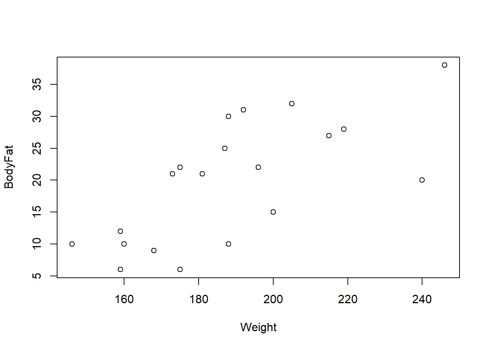

# Basics of linear regression

This section introduces the star of the course: the linear regression model. Everything before this — random variables, confidence intervals and hypothesis tests, matrix algebra, random vectors — was building toward being able to write this model down precisely and eventually estimate and test it. By the end of this section, you should be able to state the (simple and multiple) linear regression model and the normal linear regression model, and say in plain language what it means to assume each one.

## The simple linear regression model

**Example 3.1** It is difficult to accurately determine a person's body fat percentage without immersing them in water. However, we can easily obtain the weight of a person. A researcher would like to know if weight and body fat percentage are related. If so, for a given weight, can the person's body fat percentage be predicted, and how accurate would that prediction be? This researcher collected the following data on 20 individuals:

| Individual | 1 | 2 | 3 | 4 | 5 | 6 | 7 | 8 | 9 | 10 | 11 | 12 | 13 | 14 | 15 | 16 | 17 | 18 | 19 | 20 |
|---|---|---|---|---|---|---|---|---|---|---|---|---|---|---|---|---|---|---|---|---|
| Weight (lb) | 175 | 181 | 200 | 159 | 196 | 192 | 205 | 173 | 187 | 188 | 188 | 240 | 175 | 168 | 246 | 160 | 215 | 159 | 146 | 219 |
| Body Fat (%) | 6 | 21 | 15 | 6 | 22 | 31 | 32 | 21 | 25 | 30 | 10 | 20 | 22 | 9 | 38 | 10 | 27 | 12 | 10 | 28 |

We always start with the same first step: explore the data.

```r
Weight = c(175, 181, 200, 159, 196, 192, 205, 173, 187, 188,
           188, 240, 175, 168, 246, 160, 215, 159, 146, 219)
BodyFat = c(6, 21, 15, 6, 22, 31, 32, 21, 25, 30,
            10, 20, 22, 9, 38, 10, 27, 12, 10, 28)
df = data.frame(Weight = Weight, BodyFat = BodyFat)

hist(df$Weight, freq = FALSE)
hist(df$BodyFat, freq = FALSE)
plot(df)
cor(df)
```

<div style="display:flex; flex-wrap:wrap; gap:10px; justify-content:center; margin:1em 0;">



</div>

The scatter plot (rightmost image, weight on the x-axis, body fat on the y-axis) shows a fairly strong upward, linear-looking trend, and this is confirmed by the correlation, $\textrm{corr}(\text{Weight},\text{BodyFat})\approx0.697$ — a moderately strong positive linear association, in the language of [Unit_1_1](Unit_1_1.qmd).

We have observed a sample of *pairs* $(Y_1,X_1),\ldots,(Y_n,X_n)$ — here $Y_i$ is individual $i$'s body fat percentage and $X_i$ is their weight, and $n=20$. We'd like to say something about the relationship between $X$ and $Y$ at the **population** level, not just in this one sample. One way to do this is to suppose that $${\textrm{E}}\left[Y|X\right]=f(X)$$ for some function $f$ — that is, *on average*, $Y$ equals $f(X)$. Equivalently, we can write $$Y|X=f(X)+\epsilon,$$ where $\epsilon$ is a random variable with ${\textrm{E}}\left[\epsilon\right]=0$. Read this as: $Y_i$ equals $f(X_i)$, plus some random, individual error $\epsilon_i$ that we never actually get to observe.

::: {.callout-tip title="Intuition: why bother with $\\epsilon$ at all?"}
If regression could predict $Y$ perfectly from $X$, we wouldn't need any of this machinery — we'd just write $Y=f(X)$ and be done. But two people can have the same weight and different body fat percentages, because body fat depends on plenty of things besides weight (diet, muscle mass, genetics, measurement error...). The error term $\epsilon$ is a catch-all for "everything about $Y$ that $X$ alone doesn't explain." Assuming ${\textrm{E}}\left[\epsilon\right]=0$ just says these unexplained ups and downs don't systematically push $Y$ in one direction — they average out, so $f(X)$ really is the *center* of $Y$'s distribution given $X$.
:::

Treating $f$ as an arbitrary, completely unknown function is too general to work with. The scatter plot above suggests something simpler: it looks like we could draw a single straight line through the middle of the data. So we make some assumptions that make the statistics tractable:

1. For all $i\in\{1,\ldots,n\}$, $$Y_i|X_i=\beta_0+\beta_1 X_i+\epsilon_i.$$ That is, we assume $f$ is a line, with unknown intercept $\beta_0$ and unknown slope $\beta_1$.
2. ${\textrm{E}}\left[\epsilon_i\right]=0$ and ${\textrm{Var}}\left[\epsilon_i\right]=\sigma^2$ for every $i$ — the errors average to zero and all have the *same* variance $\sigma^2$ (this shared variance doesn't depend on $i$, or on $X_i$).
3. $\epsilon_i\perp\epsilon_j$ for $i\neq j$ — the errors are mutually independent of one another.

**Definition 3.1** Assumptions 1–3 above, taken together, define the **simple linear regression model** (SLR).

It is often also assumed that

4. $\epsilon_i\sim\mathcal{N}(0,\sigma^2)$,

although this fourth assumption is not always needed. A model that includes assumption 4 on top of 1–3 is called the **simple normal linear regression model**.

::: {.callout-note}
In general, a *model* is nothing more than a set of assumptions about a population. "The simple linear regression model" doesn't refer to one specific line — it refers to the whole family of assumptions 1–3, which is compatible with *any* choice of $\beta_0,\beta_1,\sigma^2$.
:::

Some terminology you'll see constantly from here on:

- $Y_i$ is the **response variable** (also called the *dependent* or *outcome* variable).
- $X_i$ is the **covariate** (also called the *explanatory* or *independent* variable).

Whenever you're given a "question about a population" involving regression, the first thing to do is identify the response variable and the covariate(s).

::: {.callout-tip title="Intuition: reading the model assumptions in plain language"}
- Assumption 1 says the *average* body fat percentage, as a function of weight, is a straight line — heavier weight is associated with a constant additive change in average body fat, no matter where you are on the line.
- Assumption 2 says: for any individual, their actual body fat won't land exactly on the line, but the "miss" has mean zero and — crucially — the *typical size* of that miss ($\sigma$) is the same at every weight. A very light person and a very heavy person are assumed to be equally hard (or easy) to predict.
- Assumption 3 says one person's miss tells you nothing about another person's miss — no individual's error is more or less likely given someone else's.

If assumption 4 also holds, then since a Normal random variable rarely strays more than about $2\sigma$ from its mean, most individuals' body fat percentages will fall within roughly $2\sigma$ of the line $\beta_0+\beta_1X$ — and that margin, $2\sigma$, is the *same width* everywhere along the line, again because of assumption 2.
:::

::: {.callout-warning title="Common mistake: thinking the model claims Y *equals* f(X)"}
The model never claims $Y=\beta_0+\beta_1X$ exactly for any individual — only that this line describes the *average*, ${\textrm{E}}\left[Y|X\right]$. Any one person's actual $Y$ is $\beta_0+\beta_1X_i+\epsilon_i$, and it will generally sit above or below the line depending on their individual $\epsilon_i$. Knowing someone's weight lets you make a good *guess* at their body fat percentage — it does not hand you their exact value.
:::

Let's see what data generated by this model actually looks like. Suppose (hypothetically) that $\beta_0=-15$, $\beta_1=0.2$, and $\sigma=5$.

```r
set.seed(3252)

# E(Y|X) is a line under the model:
curve(-15 + .2*x, 125, 280, lwd = 3, xlab = "Weight", ylab = "Expected BF % (E(Y|X))")
```


```r
# Simulate 20 weights, then simulate BF% according to the model:
Weight2 = runif(20, 135, 250)
epsilons = rnorm(n = 20, mean = 0, sd = 5)
Bfs = -15 + .2*Weight2 + epsilons

curve(-15 + .2*x, 125, 280, lwd = 3, xlab = "Weight", ylab = "BF %")
points(Weight2, Bfs, pch = 22, bg = 2)
```


Notice how the simulated points scatter *uniformly* above and below the line — never systematically drifting away from it, and never bunching up more tightly at one end than the other. That is exactly what data generated from a simple linear regression model looks like, and it closely resembles the real weight/body-fat scatter plot we started with — which is exactly why the SLR model is a reasonable fit for this data. (Try re-running the simulation with a different `set.seed()`, or different $\beta_0,\beta_1,\sigma$, to build intuition for how each parameter changes the picture — see Exercise 3.1 below.)

## The multiple linear regression model

Why did we spend a whole section ([Unit_1_3](Unit_1_3.qmd)) on matrices before getting here? Because matrix notation lets us write the regression model compactly, in a form that scales to any number of covariates without changing shape.

Recall the SLR model, $Y_i|X_i=\beta_0+\beta_1X_i+\epsilon_i$, with ${\textrm{E}}\left[\epsilon_i\right]=0$, ${\textrm{Var}}\left[\epsilon_i\right]=\sigma^2$, and $\epsilon_i\perp\epsilon_j$ for $i\neq j$. Let $$
\mathbf{Y}=(Y_1,\ldots,Y_n)^\top,\qquad
\mathbf{X}=\begin{bmatrix}1 & X_1\\ \vdots&\vdots\\ 1& X_n\end{bmatrix}=\left[\,1_n \mid (X_1,\ldots,X_n)^\top\,\right],\qquad
\beta=(\beta_0,\beta_1)^\top,\qquad
\mathbf{\epsilon}=(\epsilon_1,\ldots,\epsilon_n)^\top.
$$ Then the SLR model can be written as $$\mathbf{Y}|\mathbf{X}=\mathbf{X}\beta+\mathbf{\epsilon}.$$ We will often overload notation and just write $Y$ for $\mathbf{Y}$, and $X$ for $\mathbf{X}$.

::: {.callout-tip title="Intuition: where did that column of 1s come from?"}
Multiplying out $X\beta$ row by row, row $i$ of $X\beta$ is $1\cdot\beta_0+X_i\cdot\beta_1=\beta_0+\beta_1X_i$ — exactly the right-hand side of the SLR equation for individual $i$. The column of 1s exists purely so that matrix multiplication produces the intercept term $\beta_0$ in every row; without it, there would be no way to add a constant using $X\beta$ alone.
:::

This form extends to multiple covariates almost for free — just add one column to $X$ and one entry to $\beta$ per new variable. For $k$ covariates $X_{i1},\ldots,X_{ik}$, $$
Y_i|(X_{i1},\ldots,X_{ik})=\beta_0+\beta_1X_{i1}+\cdots+\beta_kX_{ik}+\epsilon_i,
$$ again with ${\textrm{E}}\left[\epsilon_i\right]=0$, ${\textrm{Var}}\left[\epsilon_i\right]=\sigma^2$, and $\epsilon_i\perp\epsilon_j$ for $i\neq j$.

**Definition 3.2** The set of assumptions above (for general $k$) is the **multiple linear regression model** (MLR) — often called just "the linear regression model." In matrix form, letting $$
\mathbf{X}=\begin{bmatrix}1 & X_{11}&\cdots&X_{1k}\\ \vdots&\vdots&&\vdots\\ 1& X_{n1}&\cdots&X_{nk}\end{bmatrix},\qquad \beta=(\beta_0,\ldots,\beta_k)^\top,
$$ the MLR model is $$\mathbf{Y}|\mathbf{X}=\mathbf{X}\beta+\mathbf{\epsilon},$$ where ${\textrm{E}}\left[\epsilon\right]=0$, $\epsilon_i\perp\epsilon_j$ for $i\neq j$, and ${\textrm{Var}}\left[\epsilon\right]=\sigma^2I$.

::: {.callout-tip title="Intuition: ${\\textrm{Var}}[\\epsilon]=\\sigma^2 I$ is just assumptions 2 and 3, bundled"}
Recall from [Unit_1_4](Unit_1_4.qmd) that a covariance matrix has variances on the diagonal and covariances off the diagonal. $\sigma^2I$ is $\sigma^2$ on every diagonal entry and $0$ everywhere else — which says exactly "every $\epsilon_i$ has the same variance $\sigma^2$" (the diagonal) and "every pair of errors has zero covariance, i.e. they don't move together" (the off-diagonal), matching assumptions 2 and 3 written out in scalar form. This is the payoff promised back in [Unit_1_3](Unit_1_3.qmd): one compact matrix statement replaces $n$ separate scalar assumptions, no matter how large $n$ is.
:::

As in the simple case, the **normal MLR** further assumes $\epsilon\sim\mathcal{N}(0,\sigma^2I)$. Notice how compact this is: whether $k=1$ (SLR) or $k=100$, the model is always written $Y|X=X\beta+\epsilon$ — only the *shape* of $X$ and $\beta$ changes. This means we can develop the mathematical theory of regression (estimation, inference, prediction) once, for a general but fixed $k$, and it will automatically apply no matter how many covariates a particular problem has.

::: {.callout-note title="Key takeaways before moving on"}
- Regression starts from ${\textrm{E}}\left[Y|X\right]=f(X)$; assuming $f$ is linear and that the errors $\epsilon_i$ have mean 0, constant variance $\sigma^2$, and are mutually independent gives the (simple) linear regression model.
- $Y=f(X)+\epsilon$ never claims $Y$ equals $f(X)$ exactly for any one observation — only that $f(X)$ is the *average* of $Y$ given $X$.
- Adding $\epsilon_i\sim\mathcal{N}(0,\sigma^2)$ upgrades the model to the (simple) normal linear regression model.
- In matrix form, $Y=X\beta+\epsilon$ describes both the simple case ($X$ has 2 columns) and the multiple case ($X$ has $k+1$ columns) with exactly the same notation, with ${\textrm{Var}}[\epsilon]=\sigma^2I$ packaging "constant variance" and "independent errors" into one statement.
- $Y_i$ is the response; $X_{i1},\ldots,X_{ik}$ are the covariates. Always identify these first when reading a regression question.
:::

## Check Your Understanding

<style>
details.qa-answer { margin: 0 0 1.25em 0; border-left: 3px solid #d6eaf8; padding-left: 0.75em; }
details.qa-answer > summary { cursor: pointer; color: #2e86c1; font-weight: 600; }
details.qa-answer > summary::marker { color: #2e86c1; }
details.qa-answer[open] > summary { margin-bottom: 0.5em; }
details.qa-answer p { margin: 0; }
</style>

Before checking your answers below, work through these on your own: try adjusting $\beta_0,\beta_1,\sigma$ in the simulation code above and see how the data and the line change; think about whether $\beta$ is an estimate or a population parameter and why; try coming up with a non-linear form for $f$ and adjusting the simulation to use it; and write out, side by side, the assumptions of the MLR versus the normal MLR. Then use the questions below as a quick self-check on this page's material — try each one, then click **Show answer**.

**Question 1.** In the body fat example, which variable is the response and which is the covariate?

<details class="qa-answer"><summary>Show answer</summary><p>Body fat percentage is the response $Y$ (the outcome we want to predict); weight is the covariate $X$ (the variable we use to predict it).</p></details>

**Question 2.** Is $\beta=(\beta_0,\beta_1)$ a population parameter or a statistic computed from data? Why does this matter?

<details class="qa-answer"><summary>Show answer</summary><p>$\beta$ is a population parameter — a fixed, unknown number (or vector) describing the true relationship in the population, exactly like $\mu$ or $\sigma^2$ elsewhere in the course. It's unknown and we never observe it directly; the next section is about how to <em>estimate</em> it from a sample, producing $\hat\beta$, which <em>is</em> a statistic (a random variable, since it's computed from random data).</p></details>

**Question 3.** True or False: the simple linear regression model claims that every individual's $Y_i$ lies exactly on the line $\beta_0+\beta_1X_i$.

<details class="qa-answer"><summary>Show answer</summary><p>False. The model says $Y_i=\beta_0+\beta_1X_i+\epsilon_i$, where $\epsilon_i$ is a random error with mean 0 — so the line describes the <em>average</em> of $Y$ given $X$, not any individual's exact value. Individual points scatter around the line because of $\epsilon_i$.</p></details>

**Question 4.** In the MLR model, what does the assumption ${\textrm{Var}}[\epsilon]=\sigma^2I$ tell you, in terms of the individual errors $\epsilon_1,\ldots,\epsilon_n$?

<details class="qa-answer"><summary>Show answer</summary><p>It says every $\epsilon_i$ has the same variance $\sigma^2$ (the diagonal entries of $\sigma^2 I$) and every pair $\epsilon_i,\epsilon_j$ ($i\neq j$) has covariance 0, i.e. they're uncorrelated (the off-diagonal entries, which are 0 in $\sigma^2 I$) — this is exactly assumptions 2 and 3 of the MLR, written as one matrix statement.</p></details>

**Question 5.** What's the difference between the (multiple) linear regression model and the normal (multiple) linear regression model?

<details class="qa-answer"><summary>Show answer</summary><p>The normal MLR adds one extra assumption on top of the MLR's three (or, in matrix form, two): that the error vector is multivariate Normal, $\epsilon\sim\mathcal{N}(0,\sigma^2I)$, rather than just having mean 0 and covariance $\sigma^2I$. The MLR only pins down the first two moments of $\epsilon$; the normal MLR pins down its entire distribution.</p></details>

**Question 6.** Suppose you increase $\sigma$ in the simulation code above (keeping $\beta_0,\beta_1$ fixed) and re-run it. How would you expect the resulting scatter plot to change?

<details class="qa-answer"><summary>Show answer</summary><p>The line itself (the mean function $\beta_0+\beta_1X$) doesn't move, since $\sigma$ doesn't appear in it — but the simulated points would scatter <em>more widely</em> above and below the line, since $\sigma$ is the standard deviation of each $\epsilon_i$. A larger $\sigma$ means individual outcomes are harder to predict from $X$ alone, even though the average relationship is unchanged.</p></details>
