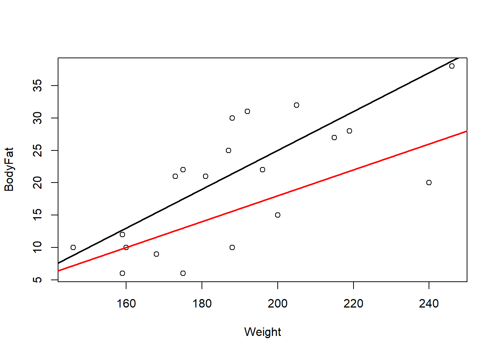

# Least Squares

Now that we've settled on a model for the population, the next step is to use the data to estimate the model parameters — in particular, $\beta$. Once we have an estimate $\hat\beta$, we can use it to estimate ${\textrm{E}}\left[Y|X\right]$ for any value of $X$.

## Notation

Throughout, we study the population model $Y|X=X\beta+\epsilon$, with:

- $Y\in\mathbb{R}^n$: the response variable (a random vector).
- $X\in\mathbb{R}^{n\times p}$: the covariate matrix — its first column is typically $1_n$, to produce the intercept, as in [3.1](Unit_2_1.qmd).
- $X_i\in\mathbb{R}^p$: the $i^{\text{th}}$ observed covariate row — treated as fixed/known, not random (we condition on it).
- $\beta\in\mathbb{R}^{p\times1}$: the unknown, population coefficient vector.
- $\epsilon\in\mathbb{R}^n$: the random error vector.

with $\forall i\in\{1,\ldots,n\}$, ${\textrm{E}}\left[\epsilon_i\right]=0$, ${\textrm{Var}}\left[\epsilon_i\right]=\sigma^2$ (constant variance, also called *homogeneity*), and $\epsilon_i\perp\epsilon_j$ for $i\neq j$.

We'll also refer to actually *observed* values, as opposed to the abstract random variables: $y=(y_1,\ldots,y_n)^\top\in\mathbb{R}^n$ is the observed response, and $x_{ij}$ is the $i^{\text{th}}$ observation of the $j^{\text{th}}$ covariate, giving the data table

| Observation | Observed data point |
|---|---|
| 1 | $(y_1,x_{11},x_{12},\ldots,x_{1p})$ |
| 2 | $(y_2,x_{21},x_{22},\ldots,x_{2p})$ |
| $\vdots$ | $\vdots$ |
| $n$ | $(y_n,x_{n1},x_{n2},\ldots,x_{np})$ |

### Interpreting $\beta$

Suppose (hypothetically) that we *knew* $\beta$. Then $$
{\textrm{E}}\left[Y_i|X_i\right]={\textrm{E}}\left[\beta^\top X_i+\epsilon_i\right]=\beta^\top X_i=\beta_1X_{i,1}+\cdots+\beta_pX_{i,p}.
$$ For a continuous covariate $X_j$, we interpret $\beta_j$ as:

> Holding $X_{i,1},\ldots,X_{i,j-1},X_{i,j+1},\ldots,X_{i,p}$ constant, a one-unit increase in $X_{i,j}$ causes, **on average**, a $\beta_j$-unit increase in $Y_i$.

Equivalently, $\partial{\textrm{E}}[Y]/\partial X=\beta$: the rate of change of the mean response with respect to the $j^{\text{th}}$ covariate is $\beta_j$.

::: {.callout-warning title="Common mistake: dropping \"on average\" or \"holding other covariates constant\""}
Both qualifiers are load-bearing, not boilerplate. "On average" acknowledges the random error $\epsilon$ — a one-unit increase in $X_{i,j}$ does not *guarantee* an increase in $Y_i$ for any specific individual, only in expectation. "Holding other covariates constant" matters because covariates are often correlated with each other; $\beta_j$ isolates the effect of $X_j$ alone, net of whatever the *other* covariates are doing. For example, in a model with both years of education and income as covariates, education and income tend to rise together — so to interpret education's coefficient correctly, you must imagine comparing two people with the *same* income but different education, not just comparing "more education" to "less."
:::

::: {.callout-note}
For now we assume all covariates $X_j$ are continuous. Categorical covariates (which we'll meet later in the course) require a different interpretation of their coefficients.
:::

Returning to [Example 3.1](Unit_2_1.qmd), a one-unit increase in weight causes, on average, a $\beta_2$-unit increase in body fat percentage (here $\beta_1$ is the intercept — the average body fat percentage when weight is 0, which is not a meaningful value on its own, but is needed to fix the height of the line). It's also worth noting ${\textrm{cov}}(Y)=\sigma^2I$, directly from the MLR assumptions in [3.1](Unit_2_1.qmd).

## Least squares estimation

We don't actually know $\beta$ — just as we estimate a population mean with a sample mean, we need to *estimate* $\beta$ from data, producing $\hat\beta$. One principled way to do this is the method of **least squares**.

```r
plot(df)  # weight on x-axis, body fat on y-axis
```


Suppose we're choosing between two candidate lines, $\beta=(-35,0.3)^\top$ or $\beta=(-22,0.2)^\top$. Plotting both on the data doesn't make it obvious which is better —

```r
plot(df)
abline(-35, 0.3, lwd = 2)
abline(-22, 0.2, col = 'red', lwd = 2)
```



— and even if it were, we obviously can't compare *every* possible line by eye. We need a quantitative definition of "best."

::: {.callout-tip title="Intuition: what are we minimizing, geometrically?"}
For a candidate $\beta_0$, the vector $\epsilon_0=Y-X\beta_0$ is the collection of *signed vertical distances* from each observed point to the candidate line (or, with more covariates, to the candidate hyperplane) — positive if the point sits above the line, negative if below. Squaring and summing these distances, $\epsilon_0^\top\epsilon_0=\sum_i(Y_i-X_i^\top\beta_0)^2$, gives a single number measuring total "misfit": squaring makes distances above and below the line count equally (rather than canceling out) and penalizes large misses disproportionately more than small ones. The least squares line is whichever line makes this total squared misfit as small as possible.
:::

Formally, given proposed coefficients $\beta_0\in\mathbb{R}^p$, the squared distance to the hyperplane $X\beta_0$ is $\epsilon_0^\top\epsilon_0=(Y-X\beta_0)^\top(Y-X\beta_0)$. We then define our estimate as whichever $\beta_0$ minimizes this: $$
\hat\beta=\mathop{\mathrm{argmin}}_{\beta\in\mathbb{R}^p}(Y-X\beta)^\top(Y-X\beta).
$$ ("Best" here specifically means smallest *average squared* distance to the line — other notions of "best," like smallest average absolute distance, define different estimators, which we won't use in this course.)

### Deriving the formula

To minimize $g(\beta)=(Y-X\beta)^\top(Y-X\beta)$, we use ordinary calculus: find where the first derivative is zero, and check the second derivative confirms a minimum.

**Step 1 (first derivative).** Expanding, $g(\beta)=Y^\top Y-2(X\beta)^\top Y+(X\beta)^\top X\beta=Y^\top Y-2\beta^\top X^\top Y+\beta^\top X^\top X\beta$. Using $\frac{\partial}{\partial\beta}\beta^\top a=a$ and $\frac{\partial}{\partial\beta}\beta^\top A\beta=2A\beta$ for symmetric $A$: $$
\frac{\partial g}{\partial\beta}=-2X^\top Y+2X^\top X\beta=-2X^\top(Y-X\beta).
$$

**Step 2 (critical point).** We need $X^\top X$ to be invertible, so we assume $X$ is full rank with $n\geq p$. Setting the derivative to zero: $$
-2X^\top(Y-X\beta)=0 \implies X^\top Y=X^\top X\beta \implies \beta=(X^\top X)^{-1}X^\top Y.
$$

**Step 3 (confirm a minimum).** The second derivative is $\frac{\partial^2 g}{\partial\beta\partial\beta^\top}=2X^\top X$. Since $X$ is assumed full rank, $X^\top X$ is positive definite (in the sense of [Definition 2.13](Unit_1_3.qmd)), and a positive-definite Hessian at a critical point confirms that point is a (local, and here also global) minimum.

**Definition 3.3** The **least squares estimate** of the regression coefficients is $$\hat\beta=(X^\top X)^{-1}X^\top Y.$$

::: {.callout-tip title="Intuition: this is exactly the formula Unit_1_3 and Unit_1_4 were pointing toward"}
Back in [Unit_1_3](Unit_1_3.qmd), we noted that the whole reason to learn matrix algebra was that a regression with any number of covariates could be solved with one compact formula, $\hat\beta=(X^\top X)^{-1}X^\top Y$. Here it is, derived from first principles: minimizing squared distances via calculus, using only the matrix-derivative rules and matrix-inverse machinery from earlier sections. No matter how many covariates $p$ has, the formula never changes shape — only the dimensions of $X$ do.
:::

## Example: computing $\hat\beta$ for the body fat data

**Example 3.2** In the body weight example ([Example 3.1](Unit_2_1.qmd)), write down $X$, $y$, and compute and interpret $\hat\beta$.

We have $$
y=(6,21,15,6,22,31,32,21,25,30,10,20,22,9,38,10,27,12,10,28)^\top,
$$ $$
X=\left[\,1_{20}\ \middle|\ (175,181,200,159,196,192,205,173,187,188,188,240,175,168,246,160,215,159,146,219)^\top\right],
$$

::: {.callout-note}
For matrices $A,B$ with the same number of rows, $C=[A\mid B]$ denotes horizontal concatenation — placing $A$ and $B$ side by side to form $C$. So $X$ above is the matrix whose first column is all ones (for the intercept) and whose second column is the observed weights.
:::

```r
X = cbind(rep(1, nrow(df)), df$Weight)
Y = matrix(df$BodyFat, ncol = 1)

X_p_X = t(X) %*% X            # X'X
X_p_X_inverse = solve(X_p_X)  # (X'X)^-1
beta_hat = X_p_X_inverse %*% t(X) %*% Y
beta_hat
```

```
            [,1]
[1,] -27.3762623
[2,]   0.2498741
```

In practice, we almost never compute $\hat\beta$ by hand like this — R's built-in `lm()` function does it for us:

```r
# lm() fits linear regression models: first argument is a formula,
# second is the data frame. This code pattern is essential for the course.
model = lm(BodyFat ~ Weight, data = df)
summary(model)
```

```

Call:
lm(formula = BodyFat ~ Weight, data = df)

Residuals:
     Min       1Q   Median       3Q      Max
-12.5935  -5.7904   0.6536   5.2731  10.4004

Coefficients:
             Estimate Std. Error t value Pr(>|t|)
(Intercept) -27.37626   11.54743  -2.371 0.029119 *
Weight        0.24987    0.06065   4.120 0.000643 ***
---
Signif. codes:  0 '***' 0.001 '**' 0.01 '*' 0.05 '.' 0.1 ' ' 1

Residual standard error: 7.049 on 18 degrees of freedom
Multiple R-squared:  0.4853,    Adjusted R-squared:  0.4567
F-statistic: 16.97 on 1 and 18 DF,  p-value: 0.0006434
```

The least squares estimates are in the `Estimate` column, matching our by-hand calculation exactly. We'll return to the rest of this output (`Std. Error`, `t value`, `Pr(>|t|)`, `Multiple R-squared`, the `F-statistic`) throughout the next section — for now, focus on the `Estimate` column.

::: {.callout-tip title="Intuition: reading the `lm()` formula syntax"}
`lm(formula, data, ...)` fits a linear model. The `data` argument is your data frame; use `names(df)` to see the column names available to reference. The `formula` has the response on the left of `~` and the covariate(s) on the right — `BodyFat ~ Weight` means "regress `BodyFat` on `Weight`," i.e. `BodyFat` is $Y$ and `Weight` is $X$. You'll see this exact syntax pattern reused constantly for the rest of the course, just with different variables (and, later, more than one covariate on the right-hand side).
:::

So our best guess at body fat percentage, given weight, is $$
\widehat{\text{Body Fat}}=-27.3762623+0.2498741\times\text{Weight}.
$$ For someone who weighs 170 lbs, we'd predict body fat of $-27.3762623+0.2498741\times170\approx15.10\%$.

## Properties of the least squares estimator

**Exercise 3.5** Compute ${\textrm{E}}\left[\hat\beta\right]$ and ${\textrm{cov}}(\hat\beta)$.

*Solution 3.1.* It holds that ${\textrm{E}}\left[\hat\beta\right]=\beta$ and ${\textrm{cov}}(\hat\beta)=\sigma^2(X^\top X)^{-1}$.

Recall that an estimator is **unbiased** if its expectation equals the population parameter it targets. This exercise shows $\hat\beta$ is unbiased for $\beta$ — on average (across repeated samples), least squares recovers the true coefficients exactly.

::: {.callout-tip title="Intuition: where does $\\hat\\beta=(X^\\top X)^{-1}X^\\top Y$'s randomness come from?"}
$\hat\beta$ is a random vector purely because $Y$ is random ($X$ is treated as fixed). Substituting $Y=X\beta+\epsilon$ into the formula gives $\hat\beta=(X^\top X)^{-1}X^\top(X\beta+\epsilon)=\beta+(X^\top X)^{-1}X^\top\epsilon$ — so $\hat\beta$ is exactly the true $\beta$ *plus* a linear transformation of the error vector $\epsilon$. This is exactly the setup from [Exercise 2.14](Unit_1_4.qmd): applying the vector expectation/covariance rules from [Unit_1_4](Unit_1_4.qmd) to $B=(X^\top X)^{-1}X^\top$ and the error vector $\epsilon$ (which has mean 0 and covariance $\sigma^2I$) gives exactly ${\textrm{E}}[\hat\beta]=\beta$ and ${\textrm{cov}}(\hat\beta)=\sigma^2(X^\top X)^{-1}$.
:::

The least squares estimator is also the **best linear unbiased estimator (BLUE)** — this is the [Gauss–Markov theorem](https://en.wikipedia.org/wiki/Gauss%E2%80%93Markov_theorem). Among *all* unbiased estimators of $\beta$ that are linear combinations of $Y_1,\ldots,Y_n$, $\hat\beta$ has the smallest variance (and hence the smallest mean squared error — recall for an estimator $\hat\alpha$ of $\beta$, ${\textrm{MSE}}(\hat\alpha)={\textrm{E}}\left[\|\beta-\hat\alpha\|^2\right]$).

Gauss–Markov does *not* require Normal errors. If we're additionally willing to assume $\epsilon\sim\mathcal{N}(0,\sigma^2I)$ (the normal MLR), then $\hat\beta$ is also the [maximum likelihood estimator](https://en.wikipedia.org/wiki/Maximum_likelihood_estimation) and the **uniformly minimum-variance unbiased estimator (UMVUE)** — it has lower variance than *any* other unbiased estimator (linear or not), no matter the true value of $\beta$.

::: {.callout-note title="Key takeaways before moving on"}
- $\hat\beta=(X^\top X)^{-1}X^\top Y$ minimizes the sum of squared vertical distances between the data and the fitted line/hyperplane — this is what "least squares" means.
- Each $\beta_j$ (for continuous $X_j$) is interpreted as the average change in $Y$ per one-unit increase in $X_j$, holding all other covariates fixed.
- $\hat\beta$ is unbiased (${\textrm{E}}[\hat\beta]=\beta$) with ${\textrm{cov}}(\hat\beta)=\sigma^2(X^\top X)^{-1}$, and by Gauss–Markov it has the smallest variance among all linear unbiased estimators — no Normality required. Under the normal MLR, it's also the MLE and UMVUE.
- In R, `lm(response ~ covariate, data = df)` fits the model and `summary()` reports $\hat\beta$ in the `Estimate` column.
:::

## Check Your Understanding

<style>
details.qa-answer { margin: 0 0 1.25em 0; border-left: 3px solid #d6eaf8; padding-left: 0.75em; }
details.qa-answer > summary { cursor: pointer; color: #2e86c1; font-weight: 600; }
details.qa-answer > summary::marker { color: #2e86c1; }
details.qa-answer[open] > summary { margin-bottom: 0.5em; }
details.qa-answer p { margin: 0; }
</style>

Before checking your answers, work through this on your own: using the hours-studied/exam-score data below, write out $X$ and $y$ by hand, and either compute $\hat\beta=(X^\top X)^{-1}X^\top y$ directly or fit it with `lm()`.

| Student | Hours Studied | Exam Score (%) |
|---|---|---|
| 1 | 5 | 55 | | 2 | 8 | 65 | | 3 | 12 | 78 | | 4 | 6 | 58 | | 5 | 10 | 72 |
| 6 | 9 | 68 | | 7 | 15 | 85 | | 8 | 7 | 60 | | 9 | 11 | 74 | | 10 | 13 | 80 |
| 11 | 14 | 82 | | 12 | 20 | 90 | | 13 | 5 | 55 | | 14 | 6 | 59 | | 15 | 18 | 88 |
| 16 | 7 | 62 | | 17 | 16 | 86 | | 18 | 4 | 50 | | 19 | 3 | 45 | | 20 | 19 | 89 |

```r
study_data <- data.frame(
  Student = 1:20,
  Hours_Studied = c(5, 8, 12, 6, 10, 9, 15, 7, 11, 13, 14, 20, 5, 6, 18, 7, 16, 4, 3, 19),
  Exam_Score = c(55, 65, 78, 58, 72, 68, 85, 60, 74, 80, 82, 90, 55, 59, 88, 62, 86, 50, 45, 89)
)
```

Then use the questions below as a self-check on this page's material.

**Question 1.** Why do we need $\hat\beta$ at all — why not just use $\beta$?

<details class="qa-answer"><summary>Show answer</summary><p>Because $\beta$ is an unknown population parameter — we never observe it directly, exactly as we never observe a population mean $\mu$ directly. $\hat\beta$ is our best <em>estimate</em> of $\beta$, computed from the sample data we actually have.</p></details>

**Question 2.** Is $\hat\beta$ an estimate or a population parameter? What about $\beta$?

<details class="qa-answer"><summary>Show answer</summary><p>$\beta$ is a fixed, unknown population parameter. $\hat\beta$ is a statistic — a random variable computed from the (random) sample data — used to estimate $\beta$.</p></details>

**Question 3.** In a model with covariates "years of education" and "income," why do we need the phrase "holding other covariates constant" when interpreting the coefficient on education?

<details class="qa-answer"><summary>Show answer</summary><p>Because education and income tend to move together (more education is generally associated with higher income), the coefficient on education by itself would confound the direct effect of education with the indirect association coming through income. "Holding income constant" isolates education's own effect, comparing people with the same income but different education levels.</p></details>

**Question 4.** What does it mean for $\hat\beta$ to be "unbiased," and what does Gauss–Markov add on top of unbiasedness?

<details class="qa-answer"><summary>Show answer</summary><p>Unbiased means ${\textrm{E}}[\hat\beta]=\beta$ — on average across repeated samples, least squares recovers the true coefficients. Gauss–Markov adds that, among <em>all</em> unbiased estimators that are linear in $Y$, $\hat\beta$ has the smallest possible variance (it's the "best," in BLUE) — and this holds without needing to assume the errors are Normally distributed.</p></details>

**Question 5.** What is ${\textrm{cov}}(\hat\beta)$, and what happens to it as $\sigma^2$ increases?

<details class="qa-answer"><summary>Show answer</summary><p>${\textrm{cov}}(\hat\beta)=\sigma^2(X^\top X)^{-1}$. As $\sigma^2$ increases (noisier data), every entry of this covariance matrix scales up proportionally — so $\hat\beta$ becomes a less precise (more variable) estimate of $\beta$, which makes sense: noisier data should give us less confidence in our estimated coefficients.</p></details>

**Question 6.** In R, what does the formula `Score ~ Hours` inside `lm(Score ~ Hours, data = study_data)` mean, in terms of response and covariate?

<details class="qa-answer"><summary>Show answer</summary><p>The left-hand side of <code>~</code> is the response variable ($Y$) and the right-hand side is the covariate ($X$) — so this fits a regression of exam <code>Score</code> on <code>Hours</code> studied, i.e. <code>Score</code> is being predicted from <code>Hours</code>.</p></details>
