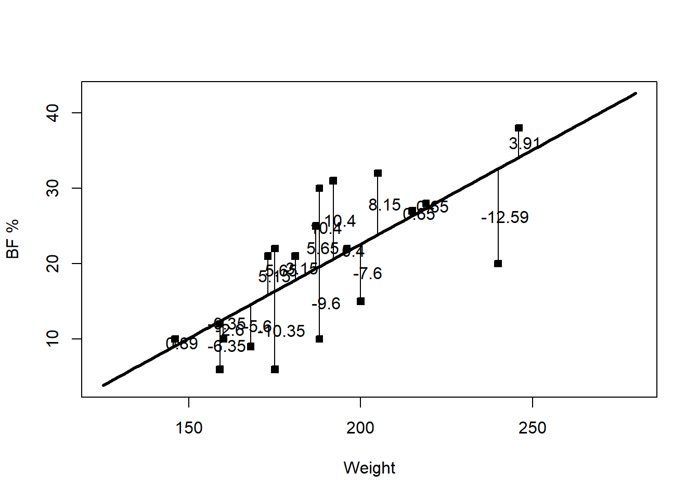
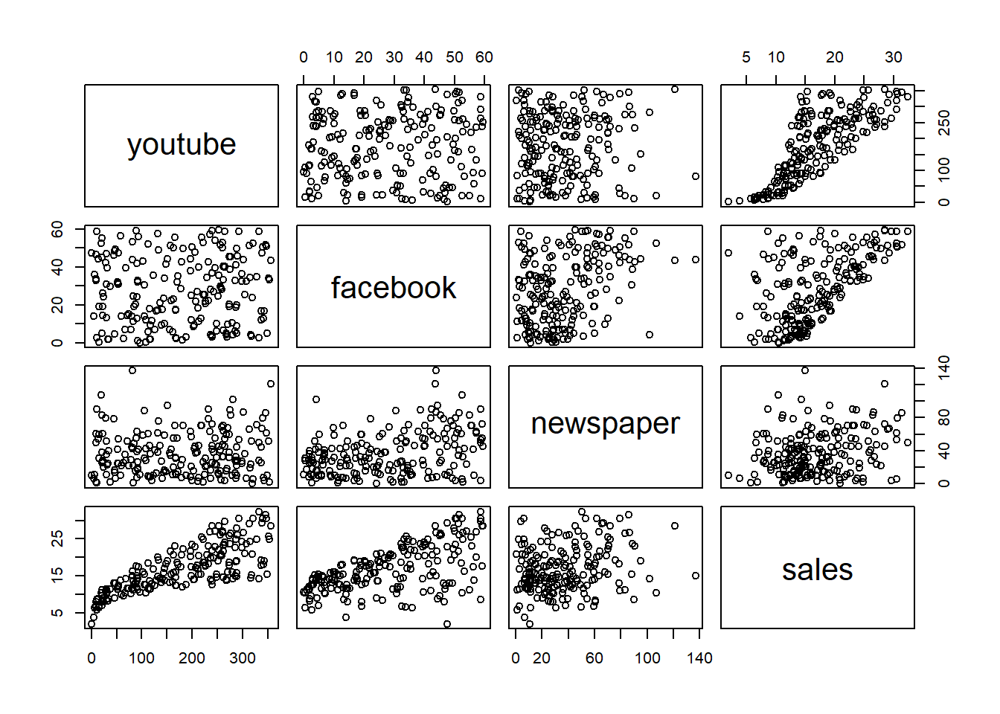

# Least squares inference

We now know how to **estimate** $\beta$: $\hat\beta=(X^\top X)^{-1}X^\top Y$, and we can predict a new response at covariate value $x$ with $\hat y_{new}=x^\top\hat\beta$. But estimation alone doesn't tell us how much to trust that estimate. How good is $\hat y_{new}$ as a prediction, on average? How will new observations scatter around the fitted line? How does $\hat\beta$ vary around $\beta$? Is there real evidence that $Y$ is related to $X$ at all, or could what we observed be explained by sampling variation alone? Answering these requires studying the *variation* in our estimates and our data — this is the subject of this whole section.

## Residuals and fitted values

We call $\hat Y=X\hat\beta$ the **fitted values** — what the model estimates $Y$ to be, given the observed $X$. We call $\hat\epsilon=Y-\hat Y$ the **residual vector**; its $i^{\text{th}}$ entry $\hat\epsilon_i$ is the $i^{\text{th}}$ **residual**, the signed vertical distance from observation $i$ to the fitted line/hyperplane. The **sum of squared errors** (SSE), also called the **sum of squared residuals**, is $\hat\epsilon^\top\hat\epsilon=\sum_{i=1}^n\hat\epsilon_i^2$ — and by construction (since $\hat\beta$ was chosen via least squares), this is the *smallest* possible value of $\epsilon_0^\top\epsilon_0$ over all choices of $\beta_0$.

**Example 3.3** In [Example 3.1](Unit_2_1.qmd), what is the residual of individual 3? How do we interpret it?

```r
residuals = Y - X %*% beta_hat
residuals[3]
```

```
[1] -7.598565
```

Individual 3's body fat is about 7.6 percentage points *lower* than the fitted line predicts for their weight — a negative residual means the observed point sits below the fitted line.

```r
curve(beta_hat[1] + beta_hat[2]*x, 125, 280, lwd = 3, xlab = "Weight", ylab = "BF %")
points(Weight, BodyFat, pch = 22, bg = 1)
# vertical segments from each point down to the line, labeled with its residual
```



::: {.callout-tip title="Intuition: residuals are our only window into $\\epsilon$"}
We never observe the true errors $\epsilon_i=Y_i-(\beta_0+\beta_1X_i)$, since we don't know $\beta_0,\beta_1$. Residuals $\hat\epsilon_i=Y_i-(\hat\beta_0+\hat\beta_1X_i)$ are the closest thing we have — the true error using our *estimated* line instead of the true one. Everything from here on (checking model assumptions, estimating $\sigma^2$, building test statistics) is built out of residuals, precisely because they're the only proxy for the unobservable $\epsilon_i$'s that the data gives us.
:::

## Variation decomposition

The residuals describe one kind of variation in the response. We can also consider the response's *total* variation: the **sum of squares total** (SST) is $$
SST=\sum_{i=1}^n(Y_i-\bar Y)^2=(Y-\bar Y1)^\top(Y-\bar Y1),
$$ i.e. $(n-1)$ times the ordinary sample variance of $Y$. Remarkably, this decomposes as $$
SST=(Y-\bar Y1)^\top(Y-\bar Y1)=\underbrace{(Y-\hat Y)^\top(Y-\hat Y)}_{SSE}+\underbrace{(\hat Y-\bar Y)^\top(\hat Y-\bar Y)}_{SSModel},
$$ so $SST=SSE+SSModel$ (SSModel is also written $SSM$ or $SSRegression$; SSE sometimes $SSwithin$). $SSModel$ measures variation in $Y$ *explained* by $X$ via the fitted model; $SSE$ measures variation *left unexplained*.

::: {.callout-tip title="Intuition: why must $\\hat\\epsilon^\\top\\hat\\epsilon\\leq SST$?"}
The first column of $X$ is $1_n$, so setting $\hat\beta_*=(\bar Y,0,\ldots,0)^\top$ makes $X\hat\beta_*=\bar Y1$ — the "flat line at $\bar Y$" model, whose residuals are exactly $Y-\bar Y1$, with sum of squares $SST$. Since the *actual* least squares $\hat\beta$ was chosen specifically to minimize the sum of squared residuals over *all* choices of coefficients — including $\hat\beta_*$ — the true SSE can never exceed $SST$. In other words: however good or bad our fitted line is, it can never fit the data worse than a flat line at the average, because least squares would never have chosen it if it did.
:::

Each term in the decomposition has associated **degrees of freedom**: $dfT=n-1$, $dfM=(\#\text{ non-zero }\beta)-1$, $dfE=n-(\#\text{ non-zero }\beta)$. Since $SSE$ is the variation *unexplained* by the model, it's tied to the error variance $\sigma^2$; we estimate $\sigma^2$ by $$\hat\sigma^2=MSE=\frac{SSE}{dfE}.$$

The **null model** $Y|X=\beta_0+\epsilon$ (all slopes 0 — $Y$ doesn't depend on $X$) only estimates a mean, so $df=n-1$, and $MSE$ under the null model reduces to $(n-1)^{-1}SST$ — exactly the usual sample variance of $Y$. This is intuitive: with no covariates to explain any of the variation, our best estimate of $\sigma^2$ is just how much $Y$ varies on its own.

All of this is usually summarized in an ANOVA ("analysis of variance") table:

| Source | SS | df | MS |
|---|---|---|---|
| Model | $SSM$ | $dfM$ | $MSModel=SSM/dfM$ |
| Residual | $SSE$ | $dfE$ | $MSE=SSE/dfE$ |
| Total | $SST$ | $dfT$ | |

::: {.callout-note}
Being able to *interpret* these quantities (and follow the derivation) matters far more than memorizing the formulas — software computes them for us in practice.
:::

## Coefficients of determination

A good model explains a large share of the response's variation: $SSModel$ should be close to $SST$ (equivalently, $SSE$ close to 0). The **coefficient of determination** $$R^2=\frac{SSModel}{SST}$$ is the proportion of variation in $Y$ explained by the model, with $0\leq R^2\leq1$ — and unlike the raw sum-of-squares terms, $R^2$ doesn't change if you rescale the data. Larger $R^2$ generally means a better-fitting model, though how large is "good" is subjective and field-dependent.

::: {.callout-warning title="Common mistake: using raw $R^2$ to decide whether to add a covariate"}
Adding *any* covariate to a model — even a useless, unrelated one — can never decrease $R^2$; it can only increase it or leave it unchanged. So raw $R^2$ alone can't tell you whether a new covariate is actually *useful*. The fix is the **adjusted coefficient of determination**, $$\bar R^2=1-(1-R^2)\frac{n-1}{n-p},$$ which explicitly penalizes adding covariates (through the $n-p$ term) — it only increases if a new covariate improves the fit by more than we'd expect from chance alone. Use $\bar R^2$, not $R^2$, when comparing models with different numbers of covariates.
:::

## The overall $F$ test

$R^2$ describes fit, but doesn't formally test whether the covariates explain $Y$ at all, versus what we see being purely due to sampling variation. Write $\beta=(\beta_1,\ldots,\beta_p)^\top$ (using $\beta_1$ for the intercept here) and let $\tilde\beta=(\beta_2,\ldots,\beta_p)^\top$ be the coefficients *excluding* the intercept. We test $$H_0:\tilde\beta=0\qquad\text{vs}\qquad H_1:\tilde\beta\neq0.$$

This test requires the normality assumption $\epsilon_i\sim\mathcal{N}(0,\sigma^2)$ — the **normal MLR** — even though least squares estimation itself does not. Under the normal MLR, one can show $SSM/\sigma^2\sim\chi^2_{dfM}$, $SSE/\sigma^2\sim\chi^2_{dfE}$, and $SSM\perp SSE$. Recalling from [Theorem 2.4](Unit_1_1.qmd) that a ratio of two independent, rescaled $\chi^2$'s follows an $F$ distribution, the observed test statistic $$F_{obs}=\frac{MSModel}{MSE}\sim F_{dfM,dfE}$$ under $H_0$, with p-value $\Pr(W>F_{obs})$ for $W\sim F_{dfM,dfE}$.

::: {.callout-tip title="Intuition: why a ratio of mean squares?"}
$MSModel$ measures how much variation the covariates explain, per degree of freedom spent; $MSE$ measures how much variation is left unexplained, per degree of freedom remaining. If the covariates genuinely explain nothing ($H_0$ true), both quantities are just independent estimates of the same noise level $\sigma^2$, so their ratio should be close to 1. If the covariates really do explain $Y$, $MSModel$ inflates relative to $MSE$, and $F_{obs}$ gets pushed well above 1 — which is exactly what a large $F_{obs}$ (and a small p-value) is evidence of.
:::

The complete ANOVA table adds $F$ and p-value columns to the Model row:

| Source | SS | df | MS | F | p-value |
|---|---|---|---|---|---|
| Model | $SSM$ | $dfM$ | $MSModel$ | $F=MSModel/MSE$ | $\Pr(W>F_{obs})$ |
| Residual | $SSE$ | $dfE$ | $MSE$ | | |
| Total | $SST$ | $dfT$ | | | |

**Example 3.4** In [Example 3.1](Unit_2_1.qmd), compute the coefficients of determination, the ANOVA table, and test whether the model is significant overall.

```r
summary(model)  # F test results are in the last line
```

```
Residual standard error: 7.049 on 18 degrees of freedom
Multiple R-squared:  0.4853,    Adjusted R-squared:  0.4567
F-statistic: 16.97 on 1 and 18 DF,  p-value: 0.0006434
```

```r
null_model = lm(BodyFat ~ 1, data = df)  # intercept-only model
anova(null_model, model)
```

```
Analysis of Variance Table

Model 1: BodyFat ~ 1
Model 2: BodyFat ~ Weight
  Res.Df     RSS Df Sum of Sq      F    Pr(>F)
1     19 1737.75
2     18  894.42  1    843.33 16.972 0.0006434 ***
```

Weight explains about 48.5% of the variation in body fat percentage ($R^2=0.4853$), or 45.7% after adjusting for the number of covariates ($\bar R^2=0.4567$ — here identical in spirit to $R^2$ since there's only one covariate, but they'd diverge more with additional covariates). The $F$ test gives $F_{obs}=16.97$ on $(1,18)$ degrees of freedom with p-value $0.0006$, strong evidence against $H_0:\beta_1=0$ — weight really does help explain body fat percentage, well beyond what sampling variation alone would produce.

::: {.callout-note title="Worked Example: building the ANOVA table by hand"}
```r
n = nrow(df); p = 2
SST = t(Y - mean(Y)) %*% (Y - mean(Y))
Yhat = X %*% beta_hat
SSE = t(Y - Yhat) %*% (Y - Yhat)
SSM = SST - SSE
dfm = p - 1; dfe = n - p
MSM = SSM/dfm; MSE = SSE/dfe
Fv = MSM/MSE
p.val = 1 - pf(Fv, dfm, dfe)
```
```
             SS df        MS        F      p-value
Model  843.3252  1 843.32521 16.97164 0.0006434484
Error  894.4248 18  49.69027       NA           NA
Total 1737.7500 19        NA       NA           NA
```
Matches `anova()` exactly — `lm()` and `anova()` are just automating this same arithmetic.
:::

## Significance of one variable

The overall $F$ test only tells us *whether at least one* covariate matters — not *which* ones. We now test individual coefficients, $H_0:\beta_j=\beta_j^0$ vs. $H_1:\beta_j\neq\beta_j^0$ (most often $\beta_j^0=0$).

Under the normal MLR, $\epsilon\sim\mathcal{N}_n(0,\sigma^2I)$, so $Y|X\sim\mathcal{N}_n(X\beta,\sigma^2I)$. Since $\hat\beta=(X^\top X)^{-1}X^\top Y=AY$ for $A=(X^\top X)^{-1}X^\top$, and linear transformations of multivariate Normals are themselves multivariate Normal ([Unit_1_4](Unit_1_4.qmd)):

**Theorem 3.1** Under the normal linear regression model, $\hat\beta\sim\mathcal{N}_p\left(\beta,(X^\top X)^{-1}\sigma^2\right)$.

Since ${\textrm{Var}}[\hat\beta_j]$ is the $(j,j)$ entry of $(X^\top X)^{-1}\sigma^2$ and $\sigma^2$ is unknown, we estimate it with $\widehat{{\textrm{Var}}}[\hat\beta_j]=(X^\top X)^{-1}_{j,j}MSE$. It can be shown $\hat\beta\perp MSE$, so — exactly analogous to the one-sample $t$ result from [Theorem 2.5](Unit_1_1.qmd) — $$
\frac{\hat\beta_j-\beta_j}{\sqrt{\widehat{{\textrm{Var}}}[\hat\beta_j]}}\sim t_{dfE}.
$$

The test proceeds exactly like any $t$-test: compute $TS=\dfrac{\hat\beta_j-\beta_j^0}{\sqrt{\widehat{{\textrm{Var}}}[\hat\beta_j]}}$, which follows $t_{dfE}$ under $H_0$, and obtain the two-sided p-value $2\Pr(|Z|>|TS|)$ for $Z\sim t_{dfE}$. For one-sided alternatives $H_1:\beta_j>\beta_j^0$, the p-value is $\Pr(Z>TS)$; for $H_1:\beta_j<\beta_j^0$, it's $\Pr(Z<TS)$.

**Example** In [Example 3.1](Unit_2_1.qmd), test $H_0:\beta_1=1/3$ vs. $H_1:\beta_1\neq1/3$ (the weight coefficient), and separately $H_0:\beta_1=0$ vs. $H_1:\beta_1\neq0$.

```r
hvar_beta = solve(t(X) %*% X) * MSE     # estimated cov(beta_hat)
TS = (beta_hat[2] - 1/3) / sqrt(hvar_beta[2,2])
2 * (1 - pt(abs(TS), dfe))              # not-equal-to-1/3 p-value
```
```
[1] 0.1857053
```
```r
TS = beta_hat[2] / sqrt(hvar_beta[2,2])
2 * (1 - pt(abs(TS), dfe))              # not-equal-to-0 p-value
```
```
[1] 0.0006434484
```

The second test matches the `Weight` row of `summary(model)` exactly — the `t value` and `Pr(>|t|)` columns are precisely this $TS$ and p-value for $H_0:\beta_j=0$. We have essentially no evidence that $\beta_1=1/3$ (p-value $0.186$), but very strong evidence that $\beta_1\neq0$ (p-value $0.0006$).

A $(1-\alpha)100\%$ confidence interval for $\beta_j$ follows the same pattern as any $t$-based interval: $$\hat\beta_j\pm t_{dfE,\alpha/2}\sqrt{\widehat{{\textrm{Var}}}[\hat\beta_j]}.$$

**Example 3.5** Compute 95% and 99% confidence intervals for the weight coefficient.

```r
confint(model, level = 0.95)
```
```
                  2.5 %     97.5 %
(Intercept) -51.6365090 -3.1160157
Weight        0.1224448  0.3773035
```
```r
confint(model, level = 0.99)
```
```
                   0.5 %    99.5 %
(Intercept) -60.61484736 5.8623227
Weight        0.07528522 0.4244631
```

The 99% interval is wider than the 95% interval — higher confidence requires casting a wider net, since $t_{dfE,0.005}>t_{dfE,0.025}$.

::: {.callout-warning title="Common mistake: forgetting the interval endpoints are random"}
It's the *interval*, not the parameter, that's random. If we repeated the study many times, each sample would produce a different interval, and $(1-\alpha)100\%$ of *those intervals* would contain the fixed, true $\beta_j$ — not "there's a 95% chance $\beta_j$ is in this particular interval," since $\beta_j$ isn't random at all. Given our one observed interval $(0.12,0.38)$, we say we're "95% confident" $\beta_1$ lies in it — a statement about the *procedure's* long-run reliability, not a probability statement about this specific interval.
:::

## Inference for the mean response and prediction intervals

Given covariates $x$, the theoretical mean response is $x^\top\beta$, estimated by $x^\top\hat\beta$. We have $${\textrm{E}}\left[x^\top\hat\beta\right]=x^\top\beta,\qquad {\textrm{Var}}\left[x^\top\hat\beta\right]=x^\top(X^\top X)^{-1}x\,\sigma^2,$$ estimated by $\widehat{{\textrm{Var}}}[x^\top\hat\beta]=x^\top(X^\top X)^{-1}x\,MSE$.

**Exercise 3.13** Under the normal MLR, show $x^\top\hat\beta$ is Normal with this mean and variance, and that $\dfrac{x^\top\hat\beta-x^\top\beta}{\sqrt{\widehat{{\textrm{Var}}}[x^\top\hat\beta]}}\sim t_{dfE}$.

A $(1-\alpha)100\%$ confidence interval for the **mean response** ${\textrm{E}}[Y|X=x]$ is $$x^\top\hat\beta\pm t_{dfE,\alpha/2}\sqrt{\widehat{{\textrm{Var}}}[x^\top\hat\beta]}.$$ Testing $H_0:{\textrm{E}}[Y|X=x]=\mu_0$ works exactly like the single-coefficient test above, using $TS(x,\mu_0)=\dfrac{x^\top\hat\beta-\mu_0}{\sqrt{\widehat{{\textrm{Var}}}[x^\top\hat\beta]}}\sim t_{dfE}$ under $H_0$.

We might instead want to predict a *new individual's* response $Y_{new}|Z=z=z^\top\beta+\epsilon_{new}$ — a different question from estimating the population *average*. Our prediction is $\tilde Y_{new}=z^\top\hat\beta+\epsilon_{new}$ (modeling the future error too), with variance $${\textrm{Var}}\left[\tilde Y_{new}|Z=z\right]={\textrm{Var}}[z^\top\hat\beta]+{\textrm{Var}}[\epsilon_{new}]=z^\top(X^\top X)^{-1}z\,\sigma^2+\sigma^2,$$ estimated by $z^\top(X^\top X)^{-1}z\,MSE+MSE$.

::: {.callout-tip title="Intuition: why is the prediction interval wider?"}
Estimating the mean response only has to account for our uncertainty about $\beta$ (through $x^\top(X^\top X)^{-1}x\,\sigma^2$). Predicting one new individual's response has to account for *that same* uncertainty about $\beta$, **plus** the individual's own random error $\epsilon_{new}$ (the extra $+\sigma^2$) — an ordinary individual never sits exactly on the population mean line, even if we knew $\beta$ perfectly. That extra source of variability is why the prediction interval always strictly contains the confidence interval for the mean response at the same $x$.
:::

**Exercise 3.14** Under the normal MLR, show $\tilde Y_{new}|Z=z$ is Normal, and derive the $t_{dfE}$ pivot for it.

The $(1-\alpha)100\%$ **prediction interval** for $Y_{new}$ is $$z^\top\hat\beta\pm t_{dfE,\alpha/2}\sqrt{z^\top(X^\top X)^{-1}z\,MSE+MSE}.$$

::: {.callout-warning title="Common mistake: interpreting a prediction interval like a confidence interval"}
A confidence interval for the mean response is a statement about the long-run reliability of the *interval-producing procedure*, applied to the population mean (a fixed constant). A prediction interval $(a,b)$ instead says: $\Pr(Y_{new}\in(a,b))=(1-\alpha)100\%$ — a genuine probability statement about a still-random future observation $Y_{new}$, not about a procedure applied to a fixed parameter. These are conceptually different claims, even though both intervals are built the same algebraic way.
:::

**Example 3.6** For someone weighing 165 lbs, find a 95% confidence interval for mean body fat and a 95% prediction interval for one individual's body fat.

```r
z = data.frame(Weight = 165)
predict(model, newdata = z, interval = 'confidence')
```
```
       fit      lwr      upr
1 13.85297 9.379675 18.32627
```
```r
predict(model, newdata = z, interval = 'prediction')
```
```
       fit       lwr      upr
1 13.85297 -1.617547 29.32349
```

We're 95% confident the *average* body fat percentage among 165-lb people is between 9.38% and 18.33%. There's a 95% probability that *one specific* 165-lb person's body fat falls between $-1.62\%$ and $29.32\%$ — a much wider range, as expected.

## Partial testing: is a subset of covariates useful?

We sometimes want to test whether a whole *subset* of covariates adds anything, beyond the others already in the model: $$H_0:(\beta_1,\ldots,\beta_k)=0\qquad\text{vs}\qquad H_1:(\beta_1,\ldots,\beta_k)\neq0,$$ comparing a **reduced** model (the other covariates only) against the **complete/full** model (everything). This generalizes the overall $F$ test, which is the special case where the reduced model is the null (intercept-only) model.

The key insight: $SST$ never depends on which covariates are in the model — it's a property of $Y$ alone. So the drop in unexplained variation from adding the extra covariates is $$SSdrop=SSE_R-SSE_C,\qquad dfdrop=dfE_R-dfE_C,\qquad MSdrop=SSdrop/dfdrop,$$ where subscripts $R$/$C$ denote the reduced/complete model. The **partial $F$ test** statistic is $$TS=\frac{MSdrop}{MSE_C}\sim F_{dfdrop,\,dfE_C}\quad\text{under }H_0,$$ with p-value $\Pr(F_{dfdrop,dfE_C}\geq TS)$.

::: {.callout-note}
Taking $k=1$ (dropping a single covariate) reduces this exactly to the single-coefficient $t$-test from earlier in this section — the partial $F$ test is a genuine generalization, not a separate idea.
:::

We can also define the **partial coefficient of determination**, $$R^2(X_1,\ldots,X_{k}\mid X_{k+1},\ldots,X_p)=\frac{SSE_R-SSE_C}{SSE_R}=\frac{SSdrop}{SSE_R},$$ the extra proportion of the *remaining* (reduced-model) variation explained by adding $X_1,\ldots,X_k$ to a model that already has $X_{k+1},\ldots,X_p$. Its square root is the **partial correlation coefficient**.

**Example 3.7** A researcher wants to know whether *online* advertising (YouTube, Facebook) adds anything to a model that already includes newspaper advertising, using the `marketing` dataset (`sales` vs. `youtube`, `facebook`, `newspaper`).

```r
data("marketing", package = "datarium")
plot(marketing)
```



```r
full_model = lm(sales ~ youtube + facebook + newspaper, data = marketing)
model_red  = lm(sales ~ newspaper, data = marketing)
anova(model_red, full_model)
```
```
Analysis of Variance Table

Model 1: sales ~ newspaper
Model 2: sales ~ youtube + facebook + newspaper
  Res.Df    RSS Df Sum of Sq      F    Pr(>F)
1    198 7394.1
2    196  801.8  2    6592.3 805.71 < 2.2e-16 ***
```

```r
SSdrop = 7394.119 - 801.8284   # SSE_R - SSE_C
partial_R2 = SSdrop / 7394.119
partial_R2
```
```
[1] 0.8915586
```

Adding YouTube and Facebook spending drops unexplained variation from 7394.1 to 801.8 — an enormous, highly significant improvement ($F=805.71$, p-value $\approx0$). The partial $R^2$ says these two variables explain about 89.2% of whatever variation newspaper advertising alone left unexplained. Online advertising clearly matters, well beyond what newspaper spending alone captures.

::: {.callout-note title="Key takeaways before moving on"}
- $\hat Y=X\hat\beta$ are fitted values; $\hat\epsilon=Y-\hat Y$ are residuals — the only observable proxy for the unobservable true errors $\epsilon$.
- $SST=SSM+SSE$ splits total variation in $Y$ into variation explained by the model and variation left over; $R^2=SSM/SST$ is the proportion explained, and $\bar R^2$ penalizes adding covariates.
- The overall $F$ test ($H_0:$ all slopes are 0) and the single-coefficient $t$-test ($H_0:\beta_j=\beta_j^0$) both require the normal MLR, and both compare estimated variation to $MSE$.
- Confidence intervals for the mean response quantify uncertainty in $x^\top\beta$; prediction intervals are wider because they also account for one new individual's own random error $\epsilon_{new}$.
- The partial $F$ test generalizes the single-coefficient $t$-test to a whole subset of covariates at once, by comparing $SSE$ between a reduced and a complete model; the partial $R^2$ measures the extra variation explained.
:::

## Check Your Understanding

<style>
details.qa-answer { margin: 0 0 1.25em 0; border-left: 3px solid #d6eaf8; padding-left: 0.75em; }
details.qa-answer > summary { cursor: pointer; color: #2e86c1; font-weight: 600; }
details.qa-answer > summary::marker { color: #2e86c1; }
details.qa-answer[open] > summary { margin-bottom: 0.5em; }
details.qa-answer p { margin: 0; }
</style>

Before checking your answers, work through this on your own using the hours-studied/exam-score data from [3.2](Unit_2_2.qmd): compute and interpret $R^2$, $\bar R^2$, and the ANOVA table; perform the overall $F$ test (state hypotheses, test statistic, p-value, and conclusion); and give a 95% confidence interval for the mean exam score of a student who studies 10 hours, plus a 95% prediction interval for one such student.

**Question 1.** What's the difference between a fitted value $\hat Y_i$ and the true (unobserved) mean response ${\textrm{E}}[Y_i|X_i]$?

<details class="qa-answer"><summary>Show answer</summary><p>${\textrm{E}}[Y_i|X_i]=X_i^\top\beta$ uses the true, unknown population coefficients $\beta$; the fitted value $\hat Y_i=X_i^\top\hat\beta$ uses our estimated coefficients $\hat\beta$. $\hat Y_i$ is our best <em>estimate</em> of the (unobservable) true mean response.</p></details>

**Question 2.** Why does adding a covariate to a model never decrease $R^2$, and what does $\bar R^2$ fix about this?

<details class="qa-answer"><summary>Show answer</summary><p>Least squares chooses the fit that minimizes $SSE$ over all available coefficients; adding a covariate only ever gives the optimizer more freedom, so $SSE$ can only go down (or stay the same), which means $SSModel=SST-SSE$ can only go up — hence $R^2$ never decreases, even if the new covariate is pure noise. $\bar R^2$ explicitly penalizes the number of covariates $p$, so it only increases when a new covariate improves fit by more than chance alone would predict.</p></details>

**Question 3.** What null and alternative hypotheses does the overall $F$ test evaluate, and what extra assumption does it require beyond ordinary least squares estimation?

<details class="qa-answer"><summary>Show answer</summary><p>$H_0:\tilde\beta=0$ (all slope coefficients, excluding the intercept, are zero) versus $H_1:\tilde\beta\neq0$ (at least one is nonzero). It requires the normal MLR — errors Normally distributed — even though least squares estimation itself needs no such assumption; normality is only needed to know the sampling distribution of the test statistic.</p></details>

**Question 4.** True or False: a 95% prediction interval for a new observation is always narrower than a 95% confidence interval for the mean response at the same covariate value.

<details class="qa-answer"><summary>Show answer</summary><p>False — it's the opposite. The prediction interval's variance includes both the uncertainty in estimating $\beta$ <em>and</em> the individual's own random error $\sigma^2$, while the confidence interval for the mean only includes the first source. So the prediction interval is always at least as wide, and generally strictly wider.</p></details>

**Question 5.** In the partial $F$ test, what do $SSdrop$ and $dfdrop$ represent, and what happens to this test when $k=1$ (only one covariate is dropped)?

<details class="qa-answer"><summary>Show answer</summary><p>$SSdrop=SSE_R-SSE_C$ is the reduction in unexplained variation gained by adding the extra covariates (equivalently, the explained variation lost by removing them); $dfdrop$ is the number of covariates dropped. When $k=1$, the partial $F$ test reduces exactly to the ordinary single-coefficient $t$-test for that one covariate.</p></details>

**Question 6.** In the marketing example, the partial $R^2$ for adding YouTube and Facebook to a newspaper-only model was about 0.89. What does this number mean, in words?

<details class="qa-answer"><summary>Show answer</summary><p>Of whatever variation in sales was <em>still unexplained</em> by newspaper advertising alone, about 89% of it is explained once YouTube and Facebook spending are added to the model. It is not the proportion of total variation in sales explained by these two variables on their own — it's specifically the extra, incremental proportion explained on top of what newspaper spending already captured.</p></details>
