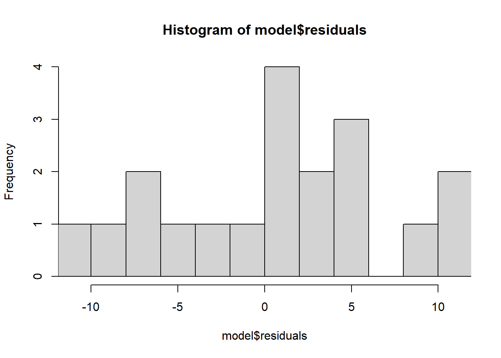
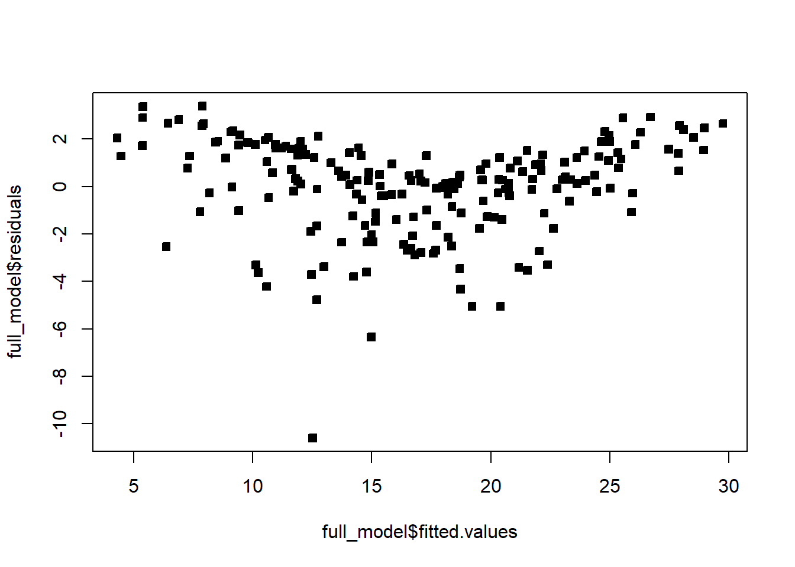
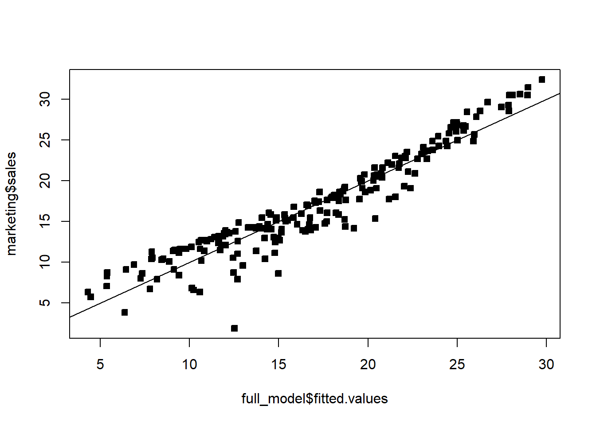

# Checking model assumptions

Every confidence interval, hypothesis test, and prediction interval from [3.3](Unit_2_3.qmd) is only valid to the extent that the model assumptions actually hold: (1) the relationship is linear, $Y|X=X\beta+\epsilon$; (2) $\epsilon_i\sim\mathcal{N}(0,\sigma^2)$ for all $i$ (constant variance and Normality); (3) $\epsilon_i\perp\epsilon_j$ for $i\neq j$. This section briefly introduces how to use the data to check whether these assumptions are reasonable — we'll return to this in much more depth in a later chapter.

## Checking normality

We never observe $\epsilon$, but we do observe the residuals $\hat\epsilon$ — our best available proxy for the true errors. To check whether $\epsilon$ looks Normal, we examine whether $\hat\epsilon$ looks Normal, using histograms and **quantile-quantile (QQ) plots**.

::: {.callout-tip title="Intuition: reading a QQ plot"}
A QQ plot compares the sample's quantiles (y-axis) against the quantiles a *perfect* Normal sample would have (x-axis, "theoretical quantiles"). If the residuals really are Normal, the points fall close to a straight line. Departures have specific shapes worth recognizing: points curving away from the line at both ends (heavy tails) suggest more extreme values than Normal predicts; an S-shape suggests a lighter-tailed, more concentrated distribution than Normal. Some wiggle at the very ends is normal even for genuinely Normal data — the extremes of any finite sample are noisy — so don't over-read a couple of stray points at the tips.
:::

**Example 3.9** Check the normality assumption for the body fat model ([Example 3.1](Unit_2_1.qmd)) and for the marketing model ([Example 3.7](Unit_2_3.qmd)).

```r
model = lm(BodyFat ~ Weight, data = df)
car::qqPlot(model$residuals, pch = 22)
hist(model$residuals, breaks = 10, xlim = c(-11, 11))
```

<div style="display:flex; flex-wrap:wrap; gap:10px; justify-content:center; margin:1em 0;">


</div>

The QQ plot points sit close to the reference line and the histogram is roughly bell-shaped — this looks okay; normality seems like a reasonable assumption here.

```r
full_model = lm(sales ~ youtube + facebook + newspaper, data = marketing)
car::qqPlot(full_model$residuals, pch = 22)
```


This is not great — the residuals curve noticeably away from the reference line, especially at the low end, suggesting the errors are not well-approximated by a Normal distribution here. We'll see below that this ties back to a deeper problem with the marketing model.

## Checking the other assumptions

Constant variance, independence, and (zero-mean) linearity are checked with other diagnostic plots.

### Residuals vs. fitted values

Plotting fitted values $\hat Y$ (x-axis) against residuals $\hat\epsilon$ (y-axis) checks whether the error distribution depends on the fitted value. If the assumptions hold, we expect residuals to form a horizontal band centered at 0, with roughly constant spread, at every level of $\hat Y$ — no trend, no funnel shape, no curve.

```r
plot(model$fitted.values, model$residuals, pch = 22, bg = 1)
```


This looks fine for the body fat model — no obvious pattern.

```r
plot(full_model$fitted.values, full_model$residuals, pch = 22, bg = 1)
```



The marketing model's residuals show a clear pattern — a curved shape rather than a flat band. This typically signals either a nonlinear relationship with a covariate, or an important missing covariate; either way, the "identically distributed errors" assumption looks violated here.

### Residuals vs. individual covariates

Plotting residuals against each covariate (or against time, if time is a covariate) can reveal dependence the fitted-vs-residual plot might hide. Again we want a horizontal band centered at 0; any visible relationship indicates a problem.

```r
plot(marketing$youtube, full_model$residuals, pch = 22, bg = 1)
```


::: {.callout-warning title="Common mistake: misjudging a plot's scale"}
Be careful about your plot's axis limits — they can distort your interpretation. Zooming out too far (or too close) can make a real problem look fine, or vice versa, and a $y$-axis that isn't centered at 0 can visually exaggerate or hide a trend. Compare the plot above to the same data with a fixed `ylim`:

```r
plot(marketing$youtube, full_model$residuals, pch = 22, bg = 1, ylim = c(-10, 10))
```


With a consistent, sensible scale, it becomes clearer that the spread of the residuals is changing with the covariate's value (a funnel shape) — a constant-variance violation that was harder to judge on the auto-scaled version. Always fix your axis limits deliberately when comparing several such plots to each other, rather than trusting each plot's default scaling.
:::

### Fitted values vs. the actual response

Plotting fitted values against the actual response gives a sense of overall fit — points should scatter around the line $y=x$.

```r
plot(full_model$fitted.values, marketing$sales, pch = 22, bg = 1)
abline(0, 1)
```



The points curve slightly above the $y=x$ line at both the high and low ends — at extreme spending levels, actual sales are systematically higher than the (linear) model predicts. This is consistent with what the residual plots already suggested: YouTube and Facebook spending appear to have a *nonlinear* relationship with sales, which a plain linear model can't capture. We'll see how to address this (transformations, polynomial terms, and related fixes) in a later chapter.

::: {.callout-note}
R's `plot()` function, applied directly to a fitted model object (`plot(full_model)`), automatically produces a standard set of four diagnostic plots (residuals vs. fitted, a Normal QQ plot, a scale-location plot, and residuals vs. leverage) — a quick way to run through several of these checks at once, without building each plot by hand.
:::

::: {.callout-note title="Key takeaways before moving on"}
- Every inference method from [3.3](Unit_2_3.qmd) assumes linearity, Normal errors, constant variance, and independent errors — always check these before trusting a $p$-value or interval.
- Residuals $\hat\epsilon$, not the unobservable $\epsilon$, are what we actually check — via histograms/QQ plots for Normality, and scatterplots (against fitted values, against covariates, against time) for constant variance and independence.
- A "good" diagnostic plot looks like a structureless, constant-width horizontal band centered at 0; curves, funnels, or trends all indicate an assumption violation.
- Plot scale matters — a poorly chosen axis range can hide or exaggerate a real pattern, so fix axis limits deliberately when comparing plots.
- In the marketing example, several diagnostics agreed: non-Normal residuals, patterned residuals vs. fitted values, and curvature in fitted-vs-actual — all pointing to a nonlinear relationship the current (linear) model misses.
:::

## Check Your Understanding

<style>
details.qa-answer { margin: 0 0 1.25em 0; border-left: 3px solid #d6eaf8; padding-left: 0.75em; }
details.qa-answer > summary { cursor: pointer; color: #2e86c1; font-weight: 600; }
details.qa-answer > summary::marker { color: #2e86c1; }
details.qa-answer[open] > summary { margin-bottom: 0.5em; }
details.qa-answer p { margin: 0; }
</style>

Before checking your answers, list the assumptions of the normal MLR and, for each one, write down which diagnostic plot(s) from this page you'd use to check it.

**Question 1.** Why do we check the residuals $\hat\epsilon$ for normality, rather than the true errors $\epsilon$?

<details class="qa-answer"><summary>Show answer</summary><p>Because $\epsilon$ is never observed — it depends on the unknown true $\beta$. The residuals $\hat\epsilon=Y-X\hat\beta$ are the closest observable proxy we have, computed using the estimated $\hat\beta$ instead of the unknown true $\beta$.</p></details>

**Question 2.** In a QQ plot, what does it mean if the residual points curve noticeably away from the reference line at both ends?

<details class="qa-answer"><summary>Show answer</summary><p>It suggests the residuals have heavier tails than a Normal distribution — more extreme values occur than a Normal distribution would predict — so the normality assumption looks questionable.</p></details>

**Question 3.** What pattern should a residuals-vs-fitted-values plot show if the model's assumptions hold? What does a funnel or curved shape indicate instead?

<details class="qa-answer"><summary>Show answer</summary><p>It should look like a horizontal band of points centered at 0 with roughly constant spread, at every fitted value — no trend, curvature, or change in spread. A funnel shape indicates non-constant variance (variance changing with the fitted value); a curved shape suggests the true relationship isn't linear, or an important covariate is missing.</p></details>

**Question 4.** Why can changing a plot's axis limits change your conclusion about whether an assumption is violated?

<details class="qa-answer"><summary>Show answer</summary><p>Auto-scaled axes can visually compress or stretch patterns in a way that flatters or exaggerates them — zooming out too far can make a real funnel shape or trend look flat, and an off-center $y$-axis can hide whether residuals are actually centered at 0. Comparing plots fairly requires deliberately fixing consistent axis limits, not relying on each plot's own auto-scaling.</p></details>

**Question 5.** In the marketing example, what did the fitted-vs-actual-sales plot ($y=x$ reference line) suggest was wrong with the linear model?

<details class="qa-answer"><summary>Show answer</summary><p>The points curved above the $y=x$ line at both high and low fitted values, meaning actual sales were systematically higher than predicted at the extremes — a sign that the true relationship between advertising spending and sales is nonlinear, which a straight-line model can't capture.</p></details>

**Question 6.** True or False: if the residuals-vs-fitted plot looks fine, you don't need to check the residuals-vs-individual-covariate plots separately.

<details class="qa-answer"><summary>Show answer</summary><p>False. A problem tied to one specific covariate (e.g. non-constant variance that only shows up against Facebook spending, not against the fitted values overall) can be diluted or hidden once everything is combined into a single fitted-value axis. Checking residuals against each covariate individually can reveal issues the aggregate fitted-vs-residual plot misses.</p></details>
