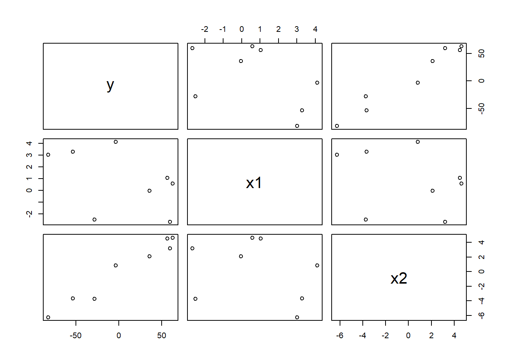
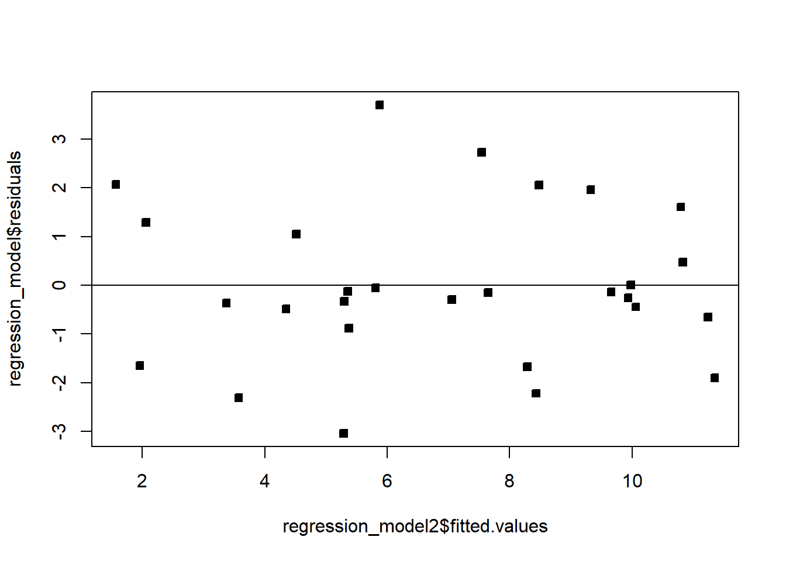

# Additional concepts and examples

This final section of the chapter covers a handful of practical warnings and tools that don't fit neatly into the earlier sections, but matter a great deal once you start fitting real regression models: a caution about reading scatter plots in MLR, one more complete worked example that ties everything together, and a few common problems (extrapolation, multicollinearity) worth knowing to watch for.

## Beware scatter plots in MLR

With multiple covariates, a simple scatter plot of $Y$ against one covariate $X_j$ alone can be *misleading* — it can look like there's no relationship when there actually is one, because the scatter plot ignores the other covariates entirely.

```r
set.seed(445)
n = 8
x1 = rnorm(n, 5, 5)
x2 = rnorm(n, 3, 5)
y = 8 - 5*x1 + 12*x2 + rnorm(n, 0, 2)   # y truly, strongly depends on x1!
df = data.frame(y, x1, x2)
plot(df)
```



Even though `y` was generated with a strong (coefficient $-5$) dependence on `x1`, the `y` vs. `x1` scatter plot alone can look weak or unclear, because `x1` and `x2` happen to be correlated with each other in this small sample, and their effects partially offset each other in the raw plot. (This particular kind of illusion tends to fade with a larger sample size.)

::: {.callout-warning title="Common mistake: judging a covariate's importance from its raw scatter plot alone"}
A weak-looking (or even flat) scatter plot between $Y$ and one covariate $X_j$ does *not* prove $\beta_j\approx0$ — the coefficient interpretation from [3.2](Unit_2_2.qmd) is explicitly "holding the other covariates constant," but a two-dimensional scatter plot can't hold anything constant. The individual coefficient's $t$-test from [3.3](Unit_2_3.qmd) (or a partial-regression/added-variable plot, beyond our scope here) is the correct way to judge a single covariate's contribution in an MLR model — not eyeballing its raw scatter plot against $Y$.
:::

## A complete worked example: NFL team wins

**Example 3.11** Using NFL team statistics (`MPV::table.b1` from the textbook's companion package), model the number of wins (`Wins`) using passing yards (`PassY`), rushing percentage (`PerR`), and opponent rushing yards (`ORY`).

```r
df = MPV::table.b1
names(df) = c("Wins","RushY","PassY","PuntA","FGP","TurnD","PenY","PerR","ORY","OPY")

regression_model = lm(Wins ~ PassY + PerR + ORY, data = df)
summary(regression_model)
```
```
Coefficients:
             Estimate Std. Error t value Pr(>|t|)
(Intercept) -1.808372   7.900859  -0.229 0.820899
PassY        0.003598   0.000695   5.177 2.66e-05 ***
PerR         0.193960   0.088233   2.198 0.037815 *
ORY         -0.004816   0.001277  -3.771 0.000938 ***

Residual standard error: 1.706 on 24 degrees of freedom
Multiple R-squared:  0.7863,    Adjusted R-squared:  0.7596
F-statistic: 29.44 on 3 and 24 DF,  p-value: 3.273e-08
```

All three covariates are significant. For example, holding passing yards and opponent rushing yards constant, a one-percentage-point increase in rushing percentage is associated with, on average, $0.194$ additional wins. The overall $F$ test (comparing against the intercept-only model, `Wins ~ 1`) confirms the model as a whole is highly significant:

```r
anova(lm(Wins ~ 1, data = df), regression_model)
```
```
Model 1: Wins ~ 1
Model 2: Wins ~ PassY + PerR + ORY
  Res.Df    RSS Df Sum of Sq      F    Pr(>F)
1     27 326.96
2     24  69.87  3    257.09 29.437 3.273e-08 ***
```

We can also run a **partial $F$ test** ([3.3](Unit_2_3.qmd)) to check whether `PerR` adds anything beyond `PassY` and `ORY`:

```r
regression_model2 = lm(Wins ~ PassY + ORY, data = df)   # drops PerR
anova(regression_model2, regression_model)
```
```
  Res.Df    RSS Df Sum of Sq      F   Pr(>F)
1     25 83.938
2     24 69.870  1   14.068 4.8318 0.03782 *
```

Dropping `PerR` increases $SSE$ from $69.87$ to $83.94$; the partial $R^2$ is $SSdrop/SSE_R=14.07/83.94\approx0.168$ — `PerR` explains about 16.8% of the variation `PassY` and `ORY` alone leave unexplained, matching the individual $t$-test p-value for `PerR` ($0.038$) exactly (recall from [3.3](Unit_2_3.qmd) that a partial $F$ test dropping one covariate is identical to that covariate's own $t$-test).

Before trusting any of this, we'd check the assumptions as in [3.4](Unit_2_4.qmd):

```r
qqnorm(regression_model2$residuals / summary(regression_model2)$sigma, pch = 22, bg = 1); abline(0,1)
```


```r
plot(regression_model2$fitted.values, regression_model$residuals, pch = 22, bg = 1); abline(h = 0)
```


Both look reasonable — no strong departure from Normality, and no obvious pattern in the residuals against fitted values.

## Extrapolation and the convex hull

Predicting $Y$ at a covariate vector $x$ far outside the range of the *observed* data is called **extrapolation**, and it's risky: a model that fits well within the observed region can behave very differently (and fit poorly) outside it.

::: {.callout-warning title="Common mistake: assuming 'each covariate is in range' means you're not extrapolating"}
With multiple covariates, it's easy to extrapolate *without noticing*, even when each individual covariate's value looks unremarkable on its own. The region actually covered by the observed data — the convex hull of the covariate vectors — can be a strange, hard-to-visualize shape in $p$ dimensions; a genuinely novel *combination* of otherwise-ordinary covariate values can still fall well outside it. Checking each covariate's range one at a time is not enough once $p>1$.
:::

One practical tool: using the **hat matrix** $H=X(X^\top X)^{-1}X^\top$, the observation with the largest diagonal entry $h_{ii}$ (call it $h_{max}$) lies on the boundary of the data's convex hull, in a relatively sparse region of covariate space. For a new point $x$ we want to predict at, checking whether $x^\top(X^\top X)^{-1}x\leq h_{max}$ tells us whether $x$ falls inside that same enclosing region — a rough, practical extrapolation check.

## Multicollinearity

**Multicollinearity** is near-linear dependence among the covariates themselves (the columns of $X$). An *exact* linear dependence would make $X^\top X$ singular, so $\hat\beta=(X^\top X)^{-1}X^\top Y$ wouldn't even exist; near-dependence doesn't break the formula, but it seriously degrades our ability to estimate $\beta$ precisely.

::: {.callout-tip title="Intuition: why does near-dependence hurt estimation?"}
If two covariates are highly correlated with each other, the data can't clearly tell the model how to split credit for explaining $Y$ between them — many different $(\beta_j,\beta_k)$ pairs would fit the data almost equally well, since increasing one coefficient and decreasing the other (in proportion to how correlated the covariates are) barely changes the fitted values. That ambiguity shows up as inflated variance on the individual coefficient estimates — $\hat\beta$ can swing wildly from sample to sample — even though the model's overall predictions ($\hat Y$) might still be perfectly stable and accurate.
:::

We detect multicollinearity with the **variance inflation factor (VIF)**: for covariate $X_j$, $$VIF_j=\frac{1}{1-R_j^2},$$ where $R_j^2$ is the $R^2$ from regressing $X_j$ on *all the other* covariates. If $X_j$ is well explained by the other covariates ($R_j^2$ close to 1), $VIF_j$ blows up — a large VIF (a common rule of thumb is $VIF_j>10$, though some fields use stricter thresholds like $3$) signals that $X_j$ is redundant with the rest of the model, and its coefficient should be interpreted cautiously.

Sometimes a fitted coefficient has an unexpected sign (contradicting subject-matter intuition). Common culprits:

- The observed range of that regressor is too narrow, inflating the variance of $\hat\beta$.
- An important covariate has been omitted from the model.
- Multicollinearity is present.
- A computational error was made somewhere upstream.

## Closing the chapter

Recall the general modeling workflow: **posit** a model and its assumptions; **estimate** the parameters (least squares, [3.2](Unit_2_2.qmd)); **infer** — confidence intervals and hypothesis tests for those parameters ([3.3](Unit_2_3.qmd)); check the **fit** — does the model match the data, do the assumptions hold ([3.4](Unit_2_4.qmd))?; and **predict** new responses, with honest error bars ([3.3](Unit_2_3.qmd)). Having worked through this chapter, you should be able to carry out every one of these steps for a linear regression model, end to end. Later chapters take up what to do when a step in this workflow reveals a problem — nonlinearity, non-constant variance, multicollinearity, and other violations — and how to remedy it.

::: {.callout-note title="Key takeaways before moving on"}
- A weak-looking scatter plot between $Y$ and one covariate does not prove that covariate is unimportant in an MLR model — it ignores the other covariates, which the coefficient's own $t$-test properly accounts for.
- Extrapolating beyond the observed data's convex hull is risky and easy to do accidentally with multiple covariates, even when each covariate looks "in range" individually; the hat matrix gives one practical check.
- Multicollinearity (near-linear dependence among covariates) inflates the variance of individual coefficient estimates, even when overall predictions remain accurate; VIF quantifies how badly.
- Unexpected coefficient signs usually trace back to a narrow covariate range, an omitted variable, multicollinearity, or a computational error.
- The full regression workflow — posit, estimate, infer, check fit, predict — is now something you should be able to execute completely on a new dataset.
:::

## Check Your Understanding

<style>
details.qa-answer { margin: 0 0 1.25em 0; border-left: 3px solid #d6eaf8; padding-left: 0.75em; }
details.qa-answer > summary { cursor: pointer; color: #2e86c1; font-weight: 600; }
details.qa-answer > summary::marker { color: #2e86c1; }
details.qa-answer[open] > summary { margin-bottom: 0.5em; }
details.qa-answer p { margin: 0; }
</style>

Before checking your answers: show that ${\textrm{Var}}[\hat Y|X]=\sigma^2H$ where $H=X(X^\top X)^{-1}X^\top$ (Exercise 3.23), and compute the VIF for each covariate in one of this chapter's multi-covariate examples (Exercise 3.24) — is there evidence of multicollinearity?

**Question 1.** Why can a scatter plot of $Y$ against a single covariate $X_j$ be misleading in a multiple regression setting?

<details class="qa-answer"><summary>Show answer</summary><p>Because the scatter plot only shows the raw, unadjusted relationship between $Y$ and $X_j$, while the regression coefficient $\beta_j$ specifically measures the relationship <em>holding the other covariates constant</em>. If $X_j$ is correlated with another covariate whose effect partially offsets it in the raw data, the two-dimensional plot can hide a real, strong relationship that the model (via its coefficient and $t$-test) correctly detects.</p></details>

**Question 2.** What does it mean to "extrapolate" in a regression context, and why is it riskier with multiple covariates than with one?

<details class="qa-answer"><summary>Show answer</summary><p>Extrapolation means predicting at a covariate vector $x$ outside the region actually covered by the observed data. With one covariate, that's just checking whether $x$ lies outside the observed range — easy to see. With several covariates, the "observed region" is a convex hull in high-dimensional space that's hard to visualize; a covariate combination can be novel (and risky to predict at) even when every individual covariate value looks ordinary on its own.</p></details>

**Question 3.** What does a large VIF for covariate $X_j$ tell you?

<details class="qa-answer"><summary>Show answer</summary><p>It tells you $X_j$ is well explained by (i.e., strongly correlated with some combination of) the other covariates in the model — near-linear dependence, or multicollinearity. This inflates the variance of $\hat\beta_j$, making that coefficient's estimate unstable from sample to sample, even if the model's overall predictions remain accurate.</p></details>

**Question 4.** In the NFL example, dropping `PerR` from the full model increased SSE from 69.87 to 83.94, with a partial-$F$ p-value of about 0.038. Is this the same result you'd get from `PerR`'s individual $t$-test p-value in the full model? Why?

<details class="qa-answer"><summary>Show answer</summary><p>Yes — dropping exactly one covariate via the partial $F$ test is mathematically identical to that covariate's own individual $t$-test, as noted in <a href="Unit_2_3.qmd">3.3</a>. They will always agree exactly (up to rounding) whenever only a single covariate is being dropped.</p></details>

**Question 5.** List two of the four common explanations for a regression coefficient having an unexpected sign.

<details class="qa-answer"><summary>Show answer</summary><p>Any two of: the observed range of that regressor is too narrow (inflating $\hat\beta$'s variance); an important covariate has been left out of the model; multicollinearity is present; or a computational error was made.</p></details>

**Question 6.** True or False: multicollinearity makes it impossible to compute $\hat\beta$ at all.

<details class="qa-answer"><summary>Show answer</summary><p>False. Only <em>exact</em> linear dependence among the covariates makes $X^\top X$ singular and $\hat\beta$ literally undefined. Multicollinearity (near-linear dependence, the much more common real-world situation) still allows $\hat\beta$ to be computed, but inflates its variance, making the individual coefficient estimates unstable and imprecise.</p></details>
