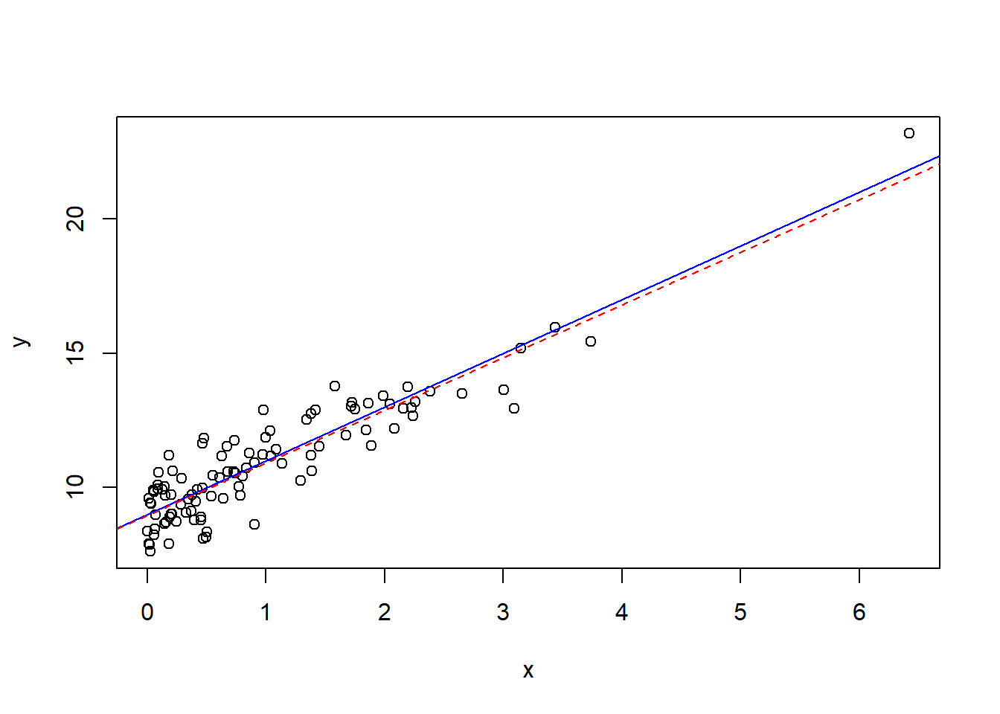
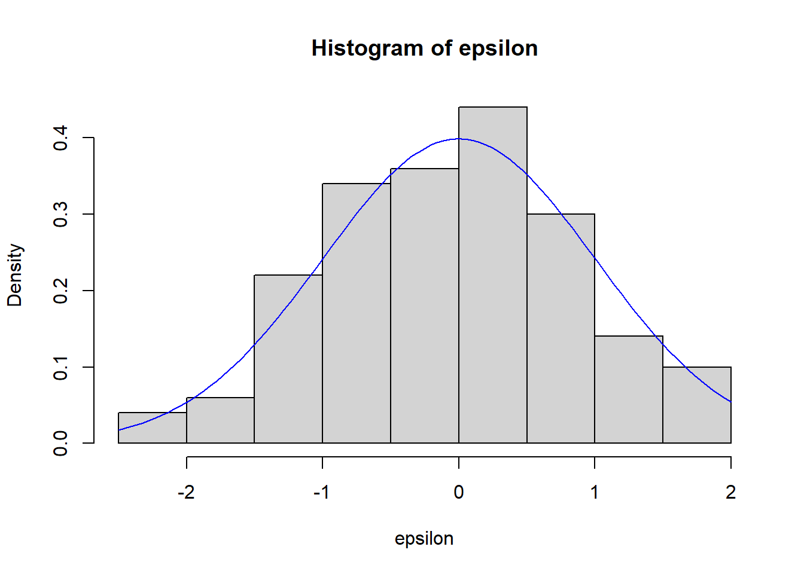
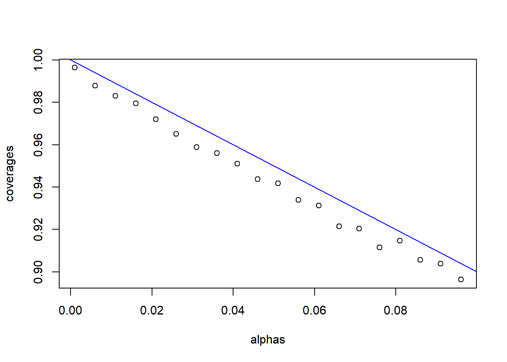

# Appendix - Introduction to R software

1. [Appendices](./Appendix_R.html)
2. [A Introduction to R software](./Appendix_R.html)

# Appendix A — Introduction to R software

## A.1 Some Basics

R is a Statistical Programming language, it consists of 2 types of objects: data and functions.

```r
##Data
x<-2
print(x)
```

```
[1] 2
```

```r
##function
log(2)
```

```
[1] 0.6931472
```

Data is stored in variables and can take many forms. To store a value in a variable use “<-”, above we set the variable x equal to 2. There are many data types in R, we will go through some of them.

```r
#real numbers
num=29.333
num
```

```
[1] 29.333
```

```r
#Some math
#adding and subtraction
2+3-2
```

```
[1] 3
```

```r
#multiplying and dividing
num<-5*(10/25)
num
```

```
[1] 2
```

```r
#Strings
word<-"hello"
word
```

```
[1] "hello"
```

```r
word='hello'
```

## A.2 Booleans

Booleans take on either TRUE or FALSE values, and can be very useful in R. You can set booleans to the result of a comparison of two data types, some of the syntax is below:

- <,>,<=,>= corresponds to less than, greater than, less than or equal, greater than or equal
- ==, != equals, not equals
- && , written like a&&b where a and b are booleans, it is TRUE is *both* a and b are TRUE
- || , written like a||b where a and b are booleans, it is TRUE if at least *one of* a and b are TRUE

```r
#booleans can be initialize in a variety of ways, for example
#must capitalize the true or false
FALSE
```

```
[1] FALSE
```

```r
F
```

```
[1] FALSE
```

```r
T
```

```
[1] TRUE
```

```r
myBoolean<-TRUE
myBoolean
```

```
[1] TRUE
```

```r
myBoolean2<- 3<4
myBoolean2
```

```
[1] TRUE
```

```r
myBoolean3<-"this"=="that"
myBoolean3
```

```
[1] FALSE
```

```r
## && (and) is TRUE if BOTH input booleans are true 
## || (or) is TRUE if AT LEAST one input boolean is true
myBoolean4<-myBoolean2&&myBoolean
myBoolean4
```

```
[1] TRUE
```

## A.3 Vectors

Vectors in R are used frequently, they are “lists” or “arrays” of all the same data type.

```r
##vectors are created with c(data,data,data)
myVector<-c(2,3,4,5,6,7,8,9,10)
myVector
```

```
[1]  2  3  4  5  6  7  8  9 10
```

```r
#a:b is a shortcut for a sequence from a to b adding 1
#you can create vectors of sequences using seq(), for more type ?seq in the console
myVector2<-2:10
myVector2
```

```
[1]  2  3  4  5  6  7  8  9 10
```

```r
as.numeric(2:10)
```

```
[1]  2  3  4  5  6  7  8  9 10
```

```r
as.double(2:10)
```

```
[1]  2  3  4  5  6  7  8  9 10
```

```r
myVector2<-rep(NA,l=20)

#These do not have to be numbers, they can be vectors, Strings, booleans...
myVector<-c(myVector,myVector)
myVector
```

```
 [1]  2  3  4  5  6  7  8  9 10  2  3  4  5  6  7  8  9 10
```

```r
myVector3<-c("this","is","a","vector","of","strings")
myVector3
```

```
[1] "this"    "is"      "a"       "vector"  "of"      "strings"
```

```r
#access elements with square brackets []
myVector[1]
```

```
[1] 2
```

```r
#more advanced accesssing
#access elements 1 to 5
myVector[1:5]
```

```
[1] 2 3 4 5 6
```

```r
#access elements 1, 4 and 6
myVector[c(1,4,6)]
```

```
[1] 2 5 7
```

```r
#access elements that are greater than 2
myVector[myVector>2]
```

```
 [1]  3  4  5  6  7  8  9 10  3  4  5  6  7  8  9 10
```

```r
myVector[-c(1,4,6)]
```

```
 [1]  3  4  6  8  9 10  2  3  4  5  6  7  8  9 10
```

We can perform mathematical operations and comparisons on vectors

```r
x<-1:10
x
```

```
 [1]  1  2  3  4  5  6  7  8  9 10
```

```r
#adds 1 to every element
x+1
```

```
 [1]  2  3  4  5  6  7  8  9 10 11
```

```r
#this works for comparisons
x<4
```

```
 [1]  TRUE  TRUE  TRUE FALSE FALSE FALSE FALSE FALSE FALSE FALSE
```

```r
x[x<4]
```

```
[1] 1 2 3
```

```r
#multiplies element 1 to element 1 of second vectors
x*-(1:10)
```

```
 [1]   -1   -4   -9  -16  -25  -36  -49  -64  -81 -100
```

```r
#beware repetition
x-c(1,2)
```

```
 [1] 0 0 2 2 4 4 6 6 8 8
```

```r
# mathematical operations on the vector apply to each element

#squares each element
x^2
```

```
 [1]   1   4   9  16  25  36  49  64  81 100
```

```r
#log each element
log(x)
```

```
 [1] 0.0000000 0.6931472 1.0986123 1.3862944 1.6094379 1.7917595 1.9459101
 [8] 2.0794415 2.1972246 2.3025851
```

```r
#Example: Dot Product
x<-c(1,2,3)
y<-c(2,5,8)
#sum adds the elements of the vector together
sum(x*y)
```

```
[1] 36
```

## A.4 Matrices

You can also use matrices in R.

```r
#you can create a matrix with matrix(vector of data,nrow=number of rows,ncol=number of columns)
#You can see it will fill in the data down the columns first
myMatrix<-matrix(1:9,nrow=3,ncol=3); myMatrix
```

```
     [,1] [,2] [,3]
[1,]    1    4    7
[2,]    2    5    8
[3,]    3    6    9
```

```r
myMatrix
```

```
     [,1] [,2] [,3]
[1,]    1    4    7
[2,]    2    5    8
[3,]    3    6    9
```

```r
#rbind and cbind add a row or column repectively to the matrix
#you can create matrices with rbind(rowvector1,rowvector2,...), or with cbind(column vector 1, column vector 2,...)

myMatrix<-rbind(c(2,3,4),c(3,4,5),c(1,2,3))
myMatrix
```

```
     [,1] [,2] [,3]
[1,]    2    3    4
[2,]    3    4    5
[3,]    1    2    3
```

```r
myMatrix2<-cbind(c(1,2,3),c(4,5,6),c(7,8,9))
myMatrix2
```

```
     [,1] [,2] [,3]
[1,]    1    4    7
[2,]    2    5    8
[3,]    3    6    9
```

```r
myMatrix3<-cbind(myMatrix2,c(10,11,12))
myMatrix3
```

```
     [,1] [,2] [,3] [,4]
[1,]    1    4    7   10
[2,]    2    5    8   11
[3,]    3    6    9   12
```

```r
myMatrix3<-cbind(c(10,11,12),myMatrix2)
```

We can also do Matrix math:

```r
#again math functions apply to every element
myMatrix^2
```

```
     [,1] [,2] [,3]
[1,]    4    9   16
[2,]    9   16   25
[3,]    1    4    9
```

```r
#multiply with '%*%
myMatrix2%*%myMatrix
```

```
     [,1] [,2] [,3]
[1,]   21   33   45
[2,]   27   42   57
[3,]   33   51   69
```

```r
#we can find the inverse with 'solve()
X<-matrix(c(1,0,1,-2,3,0,1,4,2),nrow=3)
X
```

```
     [,1] [,2] [,3]
[1,]    1   -2    1
[2,]    0    3    4
[3,]    1    0    2
```

```r
solve(X)
```

```
     [,1] [,2] [,3]
[1,] -1.2 -0.8  2.2
[2,] -0.8 -0.2  0.8
[3,]  0.6  0.4 -0.6
```

```r
#check dimension
dim(X)
```

```
[1] 3 3
```

```r
#We can also transpose with t()
t(X)
```

```
     [,1] [,2] [,3]
[1,]    1    0    1
[2,]   -2    3    0
[3,]    1    4    2
```

```r
#Some times to multiply vectors we have to trun them into matrix types
myVector<-c(1,2,3)
newM<-matrix(myVector,ncol=1)
```

## A.5 Functions

Functions are objects that take an input and transform it into some output, just like in mathematics. We have already seen some, such as `log()`.

They are called with this format `output<-functionName(input)`.

- The input is called *parameters*, and there can be many parameters
- parameters are usually described in the documentation
- the output is what the function *returns*
- functions can only return 1 object, but this includes a list… so it could return many objects in the form of a list object

R has many, many functions, to learn more about a function type `?functionName` and the documentation will come up.

```r
#A simple function
#here the function log is called, with the parameter 2, and the output is stored in the variable x
x<-log(2)
x
```

```
[1] 0.6931472
```

```r
#A more complicated function
#What are the parameters? 
#not rep(a,n) gives a vector of size n where all elements are a
s<-sample(x=1:10,size=4,replace=TRUE,prob=rep(1/10,10))
s
```

```
[1]  2  2  8 10
```

We have seen other people’s functions but we can also make our own! Let’s see an example first:

```r
#recall the dot product example...
dotProd=function(a,b){
  value<-sum(a*b)
  return(value)
}
#calling our function
dotProd(x,y)
```

```
[1] 10.39721
```

What exactly does this code say?

- We stored the function in the variable `dotProd`
- to tell the compiler we are creating a function, we use the keyword function
- we specify the parameters in round brackets ()
- we put the names of the parameters in the () only, not what data type we expect them to be
- inside curly brackets, we put the code that the function will run when it is called
- `return()` ends the function, and sends back the variable in the brackets

Back to built in functions… `R` is a statistical software, what does that mean? It already includes many common statistical functions! For most common distributions there are functions for the pdf, cdf, inverse cdf as well as one to get a sample from that distribution. The syntax is in the format: `dDistName(x,parameters)`, `pDistName(x,parameters)`, `qDistName(x,parameters)` and `rDistName(x,parameters)` respectively. This will make more sense in the example below…

```r
#The normal distribution, sd is the standard deviation
#pdf
dnorm(c(2,3,5),mean=0,sd=1)
```

```
[1] 5.399097e-02 4.431848e-03 1.486720e-06
```

```r
#cdf
pnorm(c(2,3,5),mean=0,sd=1)
```

```
[1] 0.9772499 0.9986501 0.9999997
```

```r
#inverse cdf
qnorm(c(0.2,.5,.3),mean=0,sd=1)
```

```
[1] -0.8416212  0.0000000 -0.5244005
```

```r
#random sample of size 10
rnorm(10,mean=0,sd=1)
```

```
 [1] -1.2013438 -1.4656170 -0.6258106  0.1597734  0.5923323  0.9485600
 [7]  0.3178405  0.5712300 -0.7801335 -0.4716476
```

## A.6 Plotting

R is very good for plotting! There are many types of plots in R, here are some useful plotting functions, this list is not exhaustive…

- `plot(x,y,...)` produces a scatter plot.
- `abline(a=intercept,b=slope,...)`
- `curve(expr,...)` evaluates an expression along a grid to create a curve
- `hist(data)` creates a histogram

Plot functions have many parameters, some include `col` which changes the color and add which should be set to `TRUE` if the plot should be added to the existing plot. The best way to learn plots is with examples, I have included a regression example below.

```r
#simulate errors
epsilon<-rnorm(100)
x<-rexp(100)
y<-9+2*x+epsilon

#scatter plot with true line
plot(x,y)
abline(a=9,b=2,col="blue")

#least squares line
lmm<-lm(y~x)
summary(lmm)
```

```

Call:
lm(formula = y ~ x)

Residuals:
     Min       1Q   Median       3Q      Max 
-2.11894 -0.61017  0.03048  0.64430  1.99399 

Coefficients:
            Estimate Std. Error t value Pr(>|t|)    
(Intercept)  8.97768    0.12731   70.52   <2e-16 ***
x            1.95931    0.08924   21.95   <2e-16 ***
---
Signif. codes:  0 '***' 0.001 '**' 0.01 '*' 0.05 '.' 0.1 ' ' 1

Residual standard error: 0.9215 on 98 degrees of freedom
Multiple R-squared:  0.831, Adjusted R-squared:  0.8293 
F-statistic:   482 on 1 and 98 DF,  p-value: < 2.2e-16
```

```r
abline(lmm$coefficients[1],lmm$coefficients[2],col="red",lty=2)
```



```r
#histogram of residuals
hist(epsilon,freq = F)
#x is what you want to evaluate the grid along
curve(dnorm(x),add=T,col="blue")
```



## A.7 If Statements

If statements are essential in programming, and they are a form of ‘Control Structure’. They take the form `if(boolean variable){some task}`.

When the computer runs through the code, it checks if the boolean value is `TRUE`, and if it is, it executes the code in the curly brackets, code in curly brackets is called a *block*. A simple example…

```r
jim<-"nice"

if(jim=="nice"){
  alice="nice"
}
```

Placing an `else{some code}` after the if statement will execute the code in it’s block if the code in the above if statement *was not* executed. The if and else must be in the same block so I have surrounded them in curly brackets.

```r
jim<-"nice"
##same block
{
if(jim=="nice"){
  alice="nice"
}
else{
  alice="not nice"
}
  alice
}
```

```
[1] "nice"
```

```r
jim<-"mean"
##same block
{
if(jim=="nice"){
  alice="nice"
}
else{
  alice="not nice"
}
  alice
}
```

```
[1] "not nice"
```

You may also use `else if(boolean){block}`, which executes it’s block if the above (else) if statement(s) did not execute. See below:

```r
jim<-"okay"
##same block
{
if(jim=="nice"){
  alice="nice"
}
else if(jim=="okay"){
  alice="okay"
}
  #Here if jim is not okay or nice, then we check if he is neutral.
else if(jim=="neutral"){
  alice="neutral"
}
else{
  alice="not nice"
}
  alice
}
```

```
[1] "okay"
```

Lastly you may put if statements inside of other if statements, called ‘nested ifs’.

```r
jim<-"nice"
##same block

if(jim=="nice"){
  alice=sample(c("nice","not nice"),1)
  if(alice=="nice"){
    print(alice)
  }
  else{
    print(alice)
  }
}
```

```
[1] "nice"
```

## A.8 Loops

Loops execute operations within their blocks repeatedly. There are 2 types of loops you will generally use, for loops and while loops. For loops repeat the block a set number of times, while while loops repeat until a condition is satisfied. You can also nest loops, like if statements.

```r
#calculate 2 to the power of ten
x<-1
#this reads for i in 1 to 10, this can be any vector that i loops through, not just a sequential one
for(i in 1:10){
  x<-x*2
}

x
```

```
[1] 1024
```

```r
for(i in 1:10){
  x<-x+i
}

vec=2:5

for(i in vec){
  x<-x+i
}

#calculate power of 2 less that 1000
x<-1
while(2*x<1000){
  x<-x*2
}
x
```

```
[1] 512
```

```r
#nested loop
for(i in c(10,9,8,7,6,5,4,3,2,1)){
  v<-NULL
  for(j in 1:i){
    v<-c(v,"*")
  }
  print(v)
}
```

```
 [1] "*" "*" "*" "*" "*" "*" "*" "*" "*" "*"
[1] "*" "*" "*" "*" "*" "*" "*" "*" "*"
[1] "*" "*" "*" "*" "*" "*" "*" "*"
[1] "*" "*" "*" "*" "*" "*" "*"
[1] "*" "*" "*" "*" "*" "*"
[1] "*" "*" "*" "*" "*"
[1] "*" "*" "*" "*"
[1] "*" "*" "*"
[1] "*" "*"
[1] "*"
```

You can also use the replicate function, which replicates a line of code a specified number of times. This gives a 10 by 5 matrix.

```r
replicate(5,rnorm(10))
```

```
             [,1]         [,2]        [,3]       [,4]        [,5]
 [1,]  2.06699454 -0.009828672 -0.67433569  2.1888134 -0.74455413
 [2,] -0.85500102 -0.437991755  0.05348445  0.1553682 -1.30004446
 [3,] -0.15349690  0.686076523  0.24860287 -0.3930613 -0.69566152
 [4,] -1.52537531  0.546537205  0.12571837  0.0783275 -0.14412976
 [5,] -0.52279187  0.140209586  0.31856157 -0.3534938  1.92246220
 [6,]  0.75110155 -1.182355790 -1.16129210 -2.0801281 -0.32747865
 [7,] -0.01262258  0.322176879 -1.28766921  0.1993873  0.08333592
 [8,] -1.84555431  1.673743932 -0.82636839 -0.3118787  0.49727215
 [9,] -1.65303456 -0.206077453  0.08613246 -0.2819577 -1.52318903
[10,] -0.63366649  0.204773267  0.72510598 -0.7481313  1.22375712
```

Similar functions include `sapply()` and `apply()`. `sapply(X,FUN,...)` applies the function that the parameter `FUN` is set to to individual elements of a vector. `apply(X,MARGIN,FUN,...)` applies `FUN` to the rows or columns depending on what `MARGIN` is set to, 1 for rows and 2 for columns.

## A.9 Coverage Probability Example

Here we generate 10000 samples of size 100 from the exponential distribution, with \(\lambda=2\). We calculate 10000 confidence intervals for \(1/\lambda\) with $=$1%, using the normal approximation: \[\sqrt{n}(\bar{X}-1/\lambda)\sim N(0,1/\lambda^{2})\] and interval: \[(\bar{X}-t_{99}(0.005)*S/\sqrt{n},\bar{X}+t_{99}(0.005)*S/\sqrt{n})\] We then check the proportion of intervals that contain the true value of \(1/\lambda\).

```r
#10000 samples, each of size 100 from the exponential distribution
x<-replicate(10000,rexp(100,rate=2))
#x is 100 by 10000, each column is a sample
dim(x)
```

```
[1]   100 10000
```

```r
#calculate sample variances
S_Vector<-apply(x,2,sd); 

# S_Vector

#get the t value
tval<-qt(1-0.005,99)
#calculate the means

means<-apply(x,2,mean); length(means)
```

```
[1] 10000
```

```r
# lower and upper bounds
lower<-means-S_Vector*tval/10
upper<-means+S_Vector*tval/10
intervals<-rbind(lower,upper)
#example interval
intervals[,1]
```

```
    lower     upper 
0.3760313 0.6057786 
```

```r
#we now check each interval to see if it contains the mean
successes<-0
for(i in 1:ncol(intervals)){
  #if 0.5 is in the interval, add 1
  if((intervals[1,i]<0.5)&&(intervals[2,i]>0.5))
    successes<-successes+1
}
#here is the coverage probability...
coverage.prob<-successes/ncol(intervals)
coverage.prob
```

```
[1] 0.9856
```

Something more advanced…

```r
#Vectorzing the function changes the way the function calculates when it is a passed a vector as a parameter...
#it will run the function once per element if it is vectorized instead of passing the vector as a parameter and running once
getCovProb<-Vectorize(function(alpha){
#10000 samples, each of size 100 from the exponential distribution
  x<-replicate(10000,rexp(100,rate=2))
#x is 100 by 10000, each column is a sample
  dim(x)
#calculate sample variances
  S_Vector<-apply(x,2,sd)
#get the t value
  tval<-qt(1-alpha/2,99)
#calculate the means
  means<-apply(x,2,mean)
# lower and upper bounds
  lower<-means-S_Vector*tval/10
  upper<-means+S_Vector*tval/10
  intervals<-rbind(lower,upper)
#example interval
  intervals[,1]

#we now check each interval to see if it contains the mean
successes<-0
for(i in 1:ncol(intervals)){
  #if 0.5 is in the interval, add 1
  if((intervals[1,i]<0.5)&(intervals[2,i]>0.5))
    successes<-successes+1
}
#here is the coverage probability...
coverage.prob<-successes/ncol(intervals)
return(coverage.prob)
})
#here we find the coverage probability for many alphas
alphas<-seq(from=0.001,to=0.1,by=0.005)
coverages<-getCovProb(alphas)
#adds a scatter plot
plot(alphas,coverages)
#adds a line
abline(a=1,b=-1,col="blue")
```



For more information you can visit [here](https://cran.r-project.org/doc/manuals/r-patched/R-intro.pdf) . It is also very easy to find tutorials on the web (Youtube is good), you could also look at the book by Lafaye, Drouilhet and Liquet (2013).
