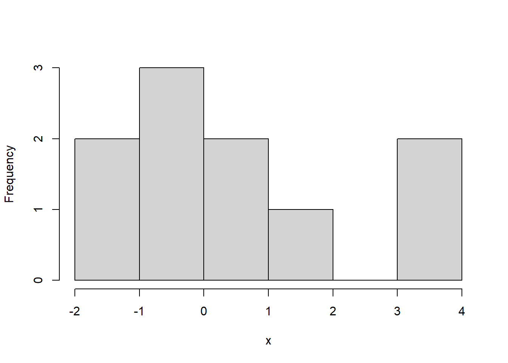
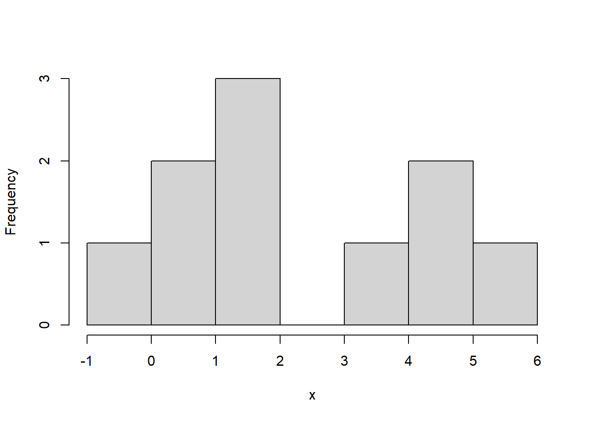

# Unit_0 - Introduction

# 1 Introduction

## 1.1 What is the course about?

### 1.1.1 The main question

The whole course is concerned with the following problem: Suppose that \(X\) and \(Y\) are some attributes of a population. What is the relationship between \(X\) and \(Y\). How can we use \(X\) to predict \(Y\), or how can we use \(X\) to explain \(Y\)?

For example, questions of this form include:

- How is location, square feet, parking available related to the price of an Airbnb?
- How is hours played and age related to win rate in League of Legends?
- How are creatine and protein consumption related to deadlift 1RM?
- How is treatment (A or B) related to pain levels of patients?

All of these can be answered with regression!

**Exercise 1.1** What is \(X\) and what is \(Y\) here?

*Solution 1.1*.

- \(X\): location, square feet, parking available \(Y\): price of an Airbnb
- \(X\): hours played and age \(Y\): win rate in League of Legends
- \(X\): creatine and protein consumption \(Y\): deadlift 1RM
- \(X\): treatment (A or B) \(Y\): pain levels of patients

We suppose at the population level, **on average** that \(Y=f(X).\) By on average, we mean that each person may not have exactly \(Y=f(X),\), but if we we average out \(Y\) for many people, we will have that the average is approximately \(f(X)\). (This will be made more formal later).

For instance, consider the pain level question in the above example. Suppose that \(f(A)=2\) and \(f(B)=5\). Then, if we average the pain level of many patients who take treatment \(B\), it should be close to 5.

Obviously, we cannot observe the whole population, and so we will assume that we have observed \(X\) and \(Y\) for a set of \(n\) individuals. Specifically, we observe some outcome \(Y_1,\ldots, Y_n\), which is a real number and some attributes (categorical or numeric) about the \(n\) individuals, denoted by \(X_1,\ldots, X_n\). Note that here \(X_i\) can be vectors or single numbers.

### 1.1.2 Using our data, how can we determine \(f\)?

Other, related questions:

- What is the form of \(f\)? Is it linear?
- How can we estimate \(f\), say with \(\hat f\)? What is the best \(\hat f\)? What is the error of \(\hat f\) on average?
- How can we tell if our model is good? i.e. how does \(\hat f\) fit the data?
- How can we tell which \(X\) values are important? How can we tell if \(X\) is related to \(Y\) at all?
- What is the effect of correlation of \(X\) values?

These are all questions we will answer in this course.

Statistical modelling starts as follows:

1. Question about a population, e.g., “How are hours played and age related to win rate in League of Legends?”
2. Data: \((Y_1,X_1),\ldots,(Y_n,X_n)\)
3. Explore data with graphs and summary stats
4. Use exploratory data analysis to posit a model for the population.

Note that step 4 is necessary! Letting \(f\) be anything is too general and won’t work well, so we need to use the data to give us a hint at the form of \(f\)! For instance, we might suppose that \(f\) is a linear function! That is, \(f\in \{g(X)=X\beta\colon \beta\in\mathbb{R}^d\}\).

Next, we proceed with the following steps:

1. Estimation: How to get an estimate \(\hat\beta\) of \(\beta\)?
2. Inference: What is the error of \(\hat\beta\)? Is \(f\) degenerate? I.e., is \(\beta=0\)?
3. Fit: Does our fitted line match up with the data? What about the normality assumption? Do the errors appear normal?
4. Prediction: Predict any values if necessary.

### 1.1.3 Comparison with means example

Let’s compare to what we learned in previous statistics courses about two sample testing with the above steps in mind. Below we have different hours of extra sleep for two different treatments. Let’s see if the sleep for groups 1 and 2 differ.

1. Do the counts for A and B differ?

```r
# 2. 
data('sleep')
head(sleep)
```

```
  extra group ID
1   0.7     1  1
2  -1.6     1  2
3  -0.2     1  3
4  -1.2     1  4
5  -0.1     1  5
6   3.4     1  6
```

```r
# 3. 
aggregate(extra ~ group, data = sleep, FUN = function(x){hist(x,main=names(x))})
```





```
Warning in format.data.frame(if (omit) x[seq_len(n0), , drop = FALSE] else x, :
corrupt data frame: columns will be truncated or padded with NAs
```

```
  group                   extra
1     1   -2, -1, 0, 1, 2, 3, 4
2     2 -1, 0, 1, 2, 3, 4, 5, 6
```

```r
summary_stats = aggregate(extra ~ group, data = sleep,  FUN = summary)
print(summary_stats)
```

```
  group extra.Min. extra.1st Qu. extra.Median extra.Mean extra.3rd Qu.
1     1     -1.600        -0.175        0.350      0.750         1.700
2     2     -0.100         0.875        1.750      2.330         4.150
  extra.Max.
1      3.700
2      5.500
```

```r
aggregate(extra ~ group, data = sleep, FUN = length)
```

```
  group extra
1     1    10
2     2    10
```

We will assume that the extra hours are normal from the histograms.

Recall then that the pooled standard deviation is \(\hat\sigma_p=\sqrt{((n_x-1)\hat \sigma_x^2+(n_y-1)\hat \sigma_y^2)\big/ (n_x+n_y-2)}\) and the test statistic is: \[T=\frac{\bar X-\bar Y}{\hat\sigma_p\times\sqrt{1/n_x+1/n_y}}.\] In addition, we have that \(T\sim t_{n_x+n_y-2}\).

```r
# 5 and 6 - here these steps are the same, since we are only doing inference
t.test(sleep$extra[sleep$group==1],sleep$extra[sleep$group==2])
```

```

    Welch Two Sample t-test

data:  sleep$extra[sleep$group == 1] and sleep$extra[sleep$group == 2]
t = -1.8608, df = 17.776, p-value = 0.07939
alternative hypothesis: true difference in means is not equal to 0
95 percent confidence interval:
 -3.3654832  0.2054832
sample estimates:
mean of x mean of y 
     0.75      2.33 
```

```r
# 7 - we checked normality earlier, 8 is not applicable
```

Here, we fail to reject the null hypothesis, and there is not enough evidence to suggest that there is a different between the groups. Notice that the p-value is 0.08, which is moderately low, so there is some evidence of a difference between the groups.

## 1.2 Important course information and preparation tasks

### 1.2.1 Prerequisite review

If you have forgotten, you should review the following concepts:

- Sample vs. population, estimates vs. parameters, hypothesis testing and confidence intervals
- Normal theory, random variables, conditional variance and expectation.
- CLT, LLN
- Linear algebra: Matrix operations, inverse, transpose etc.

### 1.2.2 Software

Download RStudio/R. You can use python, but I’ll use R in class. If you are not familiar with R, please follow this tutorial [here](https://www.youtube.com/watch?v=FY8BISK5DpM).

### 1.2.3 Outline

The course will proceed as follows:

- Review
- Core linear regression concepts
- Special Cases
- Advanced

### 1.2.4 Homework tasks:

- Download and install RStudio and R Software
- Think of a relationship you would want to model, what is \(X\)? what is \(Y\)?
- Review prerequisites as stated above
