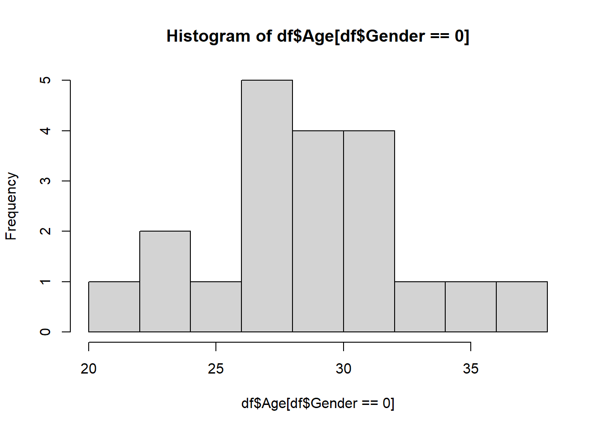
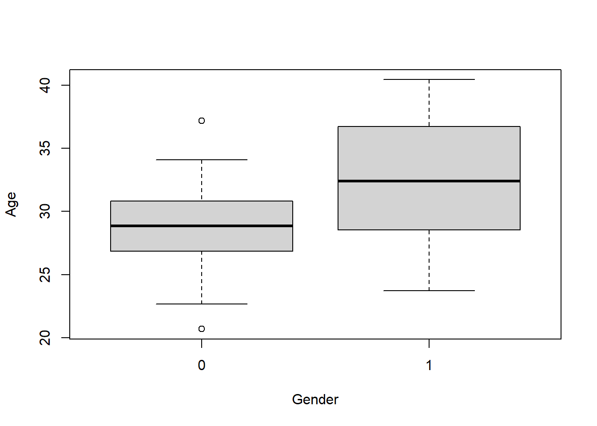

# Unit_1 - Review material

# 2 Review material

## 2.1 Review of random variables

Recall that

**Definition 2.1** A random variable \(X\) is a function which maps outcomes \(\omega\in \Omega\) to the real numbers, i.e., \(X\colon \Omega\rightarrow\mathbb{R}\).

Note
Note that the notation \(f\colon A\rightarrow B\) means that \(f\) is a function whose domain is \(A\) and range is \(B\). That is, \(f\) takes a value from \(A\) and outputs some value in \(B\).

Generally, we will just write \(X\), and ignore the fact that \(X\) is a function.

We can categorize a random variable \(X\) as follows:

- If \(X\colon \Omega\rightarrow S\) where \(S\) is countable, then \(X\) is a *discrete random variable*
- We say \(X\) is a *continuous random variable* if \(\Pr(X=r)=0\) for all \(r\in\mathbb{R}\).
- Otherwise, \(X\) is a *mixed random variable* (which we won’t worry about in this course)

### 2.1.1 Discrete Random Variables

If \(X\colon \Omega\rightarrow S\) where \(S\) is countable, then \(X\) is a discrete random variable. \(S\) can be finite, but can also be any infinite subset of the integers \(\mathbb{Z}\). The distribution of \(X\) is given by its PMF, denoted by \(f(x)\). For any \(x\in S\), \(f(x)=\Pr(X=x)\). (Note that ‘\(\in\)’ means the word “in”.)

We must have that:

- \(\sum_{x\in S}f(x)=1\), (This notation means summing over all the elements in \(S\).)
- \(\forall x\in S\), \(0\leq f(x)\leq 1\). (This notation means for all \(x\) in \(S\), \(0\leq f(x)\leq 1\).)

Examples: Binomial random variables, Poisson random variables and Geometric random variables are all discrete random variables.

**Exercise 2.1** What is the PMF of a Binomial random variable? Can two different random variables have the same PMF? Why or why not?

*Solution 2.1*. First: \(\Pr\left(X=x\right)\binom{n}{x}p^x(1-p)^{n-x}\) Second: Yes. Two random variables can be different random variables, but have the same distribution.

### 2.1.2 Continuous Random Variables

We say \(X\) is a *continuous random variable* if \(\Pr(X=r)=0\) for all \(r\in\mathbb{R}\). If \(X\colon \Omega\rightarrow S\) and \(X\) is a continuous random variable, then \(S\) is typically the real numbers, denoted by \(\mathbb{R}\), but can be any uncountable subset of \(\mathbb{R}\). The distribution of \(X\) is given by the PDF \(f(x)\). For any interval \((a,b)\subset\in S\), \(\Pr(X\in (a,b))=\int_a^b f(x)dx\).

We must have that:

- \(\int_{- \infty}^\infty f(x)dx=1\),
- \(\forall x\in \mathbb{R}\), \(f(x)\geq 0\).

Examples: Normal random variables, Chi-squared random variables, \(t\) random variables, Cauchy random variables, \(F\) random variables are all continuous random variables. Generally, we will focus on continuous random variables.

**Exercise 2.2** What is the PMF of a Normal random variable?

*Solution 2.2*. \(f(x)=\frac{1}{\sqrt{2\pi}\sigma}e^{-(x-\mu)^2/2\sigma^2}\)

### 2.1.3 Properties of Random Variables

Let \(X,X_1,X_2\) be random variables.

Recall the important quantities \(\mathrm{E}({X})\), \(\mathrm{var}({X})\), \(\mathrm{cov}(X_1,X_2)\), \(\mathrm{corr}(X_1,X_2)\). Recall expectation:

**Definition 2.2** The expectation of a random variable \(X\) is \[\mathrm{E}({X})=\sum_{x\in S}x\Pr\left(X=x\right),\] if \(X\) is discrete and is \[\mathrm{E}({X})=\int_{-\infty}^\infty xf(x)dx,\] if \(X\) is continuous.

This is the ``average’’ value of the random variable. Note that it is possible for it to be impossible for \(X=\mathrm{E}({X})\). Try to come up with an example of this!

**Definition 2.3** The variance of a random variable \(X\) is \[{\textrm{Var}}\left[X\right]={\textrm{E}}\left[|X-{\textrm{E}}\left[X\right]|^2\right]=\sum_{x\in S}(x-{\textrm{E}}\left[X\right])^2\Pr\left(X=x\right),\] if \(X\) is discrete and is \[{\textrm{Var}}\left[X\right]={\textrm{E}}\left[|X-{\textrm{E}}\left[X\right]|^2\right]=\int_{-\infty}^\infty (x-{\textrm{E}}\left[X\right])^2f(x)dx,\] if \(X\) is continuous.

The variance describes the variation of \(X\) about its mean. In other words, it describes on ``average’’, how far is \(X\) from its mean.

**Definition 2.4** The covariance between two random variables \(X\) and \(Y\) is \[{\textrm{cov}}\left[X,Y\right]={\textrm{E}}\left[(X-{\textrm{E}}\left[X\right])(Y-{\textrm{E}}\left[Y\right])\right].\]

The covariance describes the unnormalised linear association between \(X\) and \(Y\).

**Definition 2.5** The correlation between two random variables \(X\) and \(Y\) is \[{\textrm{corr}}\left[X,Y\right]={\textrm{cov}}\left[X,Y\right]/\sqrt{{\textrm{Var}}\left[X\right]{\textrm{Var}}\left[Y\right]}.\]

The correlation describes the normalized linear association between \(X\) and \(Y\).

Next, recall that for a random variable \(X\), its cumulative distribution function (CDF) is given by \(F_X(x)=\Pr\left(X\leq x\right)\). The joint CDF of \(X\) and \(Y\) is given by \(F_{XY}(x,y)=\Pr\left(X\leq x, Y\leq y\right)\).

Lastly, for a vector of \(d\) random variables \(\mathbf{X}=(X_1,\ldots,X_d)\), let its CDF by \(F_{\mathbf{X}}(\mathbf{x})=\Pr\left(X_1\leq x_1,\ldots X_d\leq x_d\right)\), where here \(\mathbf{x}\in\mathbb{R}^{d}\) and \(\mathbf{x}=(x_1,\ldots,x_d)\).

We next present the concept of independence of random variables. Let \(F_{XY}(x,y)\) be the joint CDF of \(X\) and \(Y\) and let \(F_X\) and \(F_Y\) be the univariate CDFs of \(X\) and \(Y\), respectively. For two random variables \(X\) and \(Y\), we say that \(X\) and \(Y\) are independent if \(F_{XY}(x,y)=F_X(x)F_Y(y)\). More generally, two vectors of random variables \(\mathbf{X}\) and \(\mathbf{Y}\) are independent if \(F_{(\mathbf{X},\mathbf{Y})}(\mathbf{x},\mathbf{y})=F_{\mathbf{X}}(\mathbf{x})F_{\mathbf{Y}}(\mathbf{y})\), where \(F_{(\mathbf{X},\mathbf{Y})}\) is the CDF of the vector \((\mathbf{X},\mathbf{Y})\). A set of random variables \(\{X_i\}_{i=1}^n\) are mutually independent if for any two mutually exclusive subsets of \(\{X_i\}_{i=1}^n\) are also independent. Note that we write \(X \perp Y\) if \(X\) is independent of \(Y\).

We have that:

**Theorem 2.1** The following holds:

- \(X_1\perp X_2 \implies {\textrm{E}}\left[X_1 X_2\right]={\textrm{E}}\left[X_1\right]{\textrm{E}}\left[X_2\right]\)
- \(X_1\perp X_2 \implies {\textrm{corr}}\left[X_1,X_2\right]=0\)
- \({\textrm{corr}}\left[X_1,X_2\right]=0\) does not imply \(X_1\perp X_2\)

**Exercise 2.3** Prove [Theorem 2.1](#thm-1) .

Let \(X,X_1,X_2,\ldots X_n\) be random variables. Recall the linearity of expectation property:

**Theorem 2.2** For \(a,b\in\mathbb{R}\), it holds that \(\mathrm{E}({aX+b})=a\mathrm{E}({X})+b\).

**Exercise 2.4** Prove [Theorem 2.2](#thm-2) .

As a corollary of [Theorem 2.2](#thm-2) , we have that

- \({\textrm{E}}\left[\sum_{i=1}^n a_i X_i\right]=\sum_{i=1}^n a_i{\textrm{E}}\left[ X_i\right]\)
- \({\textrm{Var}}\left[\sum_{i=1}^n a_i X_i\right]=\sum_{i=1}^n a_i^2{\textrm{Var}}\left[ X_i\right]+\sum_{i\neq j}a_ia_j{\textrm{cov}}\left[X_i,X_j\right]\)
- \({\textrm{Var}}\left[aX_1+bX_2+c\right]=a^2{\textrm{Var}}\left[X_1\right]+b^2{\textrm{Var}}\left[X_2\right]+2ab\ {\textrm{cov}}\left[X_1,X_2\right]\)

**Exercise 2.5** What happens to \({\textrm{Var}}\left[aX_1+bX_2+c\right]\) when \(\{X_i\}_{i=1}^n\) are mutually independent?

**Exercise 2.6** Let \(X_1,X_2,\ldots X_n\) be i.i.d. (independent and identically distributed) random variables with expectation (also known as mean) \(\mu\) and variance \(\sigma^2\). What is the expectation and variance of \[\bar X=\sum_{i=1}^n X_i/n?.\]

### 2.1.4 Useful properties of normal and related random variables

Let

- \(\mathcal{N}(\mu,\sigma^2)\) represent the normal distribution with mean \(\mu\) and variance \(\sigma^2\).
- \(\chi^2_k\) be the Chi-squared distribution with \(k\) degrees of freedom
- \(t_n\) be the student-\(t\) distribution with \(n\) degrees of freedom
- \(F_{m,n}\) be the \(F\) distribution with \(m\) numerator degrees of freedom and \(n\) denominator degrees of freedom

We have the following results:

**Theorem 2.3** Suppose that \(X\sim \mathcal{N}(\mu,\sigma^2)\), then

- \(Z=\frac{X- \mu}{\sigma}\sim \mathcal{N}(0,1)\)
- \(Z^2\sim \chi^2_1\).

Let \([n]=\{1,\ldots,n\}\). We also have that

**Theorem 2.4**

- If for \(i\in [n]\) \(Y_i\sim \chi^2_{k_i}\) and \(Y_i \perp Y_j\) for \(i\neq j\) then \(\sum_{i=1}^n Y_i \sim \chi^2_{k_1+\ldots +k_n}\).
- If \(Y\sim \chi^2_k\) and \(Y\perp Z\), then \(Z/\sqrt{Y/k}\sim t_k\).
- If \(Y_1\sim \chi^2_{k_1}\), \(Y_2\sim \chi^2_{k_2}\) and \(Y_1 \perp Y_2\) then \(\frac{Y_1/k_1}{Y_2/k_2}\sim F_{k_1,k_2}\).

Define \[\hat\sigma^2=\frac{1}{n- 1}\sum_{i=1}^n (X_i- \bar X)^2.\]

**Theorem 2.5** Suppose that \(X_1,X_2,\ldots X_n\sim \mathcal{N}(\mu,\sigma^2)\) and are independent, then \(\frac{\bar X- \mu}{\sigma/\sqrt{n}}\sim \mathcal{N}(0,1)\), \(\bar X\perp \hat\sigma^2\), \((n- 1)\hat\sigma^2/\sigma^2\sim \chi^2_{n- 1}\) and \(\frac{\bar X- \mu}{\hat\sigma/\sqrt{n}}\sim t_{n- 1}\).

### 2.1.5 Central Limit Theorem

If \(X_1,X_2,\ldots X_n\) are i.i.d. with mean \(\mu\) and variance \(\sigma^2<\infty\), then \(\frac{\bar X- \mu}{\sigma/\sqrt{n}}\stackrel{\text{d}}{\rightarrow}\mathcal{N}(0,1)\) as \(n\rightarrow\infty\).

We have that in general, for large \(n\), regardless of the distribution of the random variables, the sample mean is approximately normally distributed.

### 2.1.6 Homework stop 1

Review your material and complete the above exercises before continuing to the next section.

## 2.2 Review of introductory statistics

The followings are some concepts that you have learned from prerequisites, and/or we have reviewed in the last two lectures.

- Sample vs. Population
- Observation vs. Random variable
- Statistic vs. Parameter
- Estimate vs. Estimator
- Estimator is a random variable and estimate is a number calculated from data
- Mean and variance of random variable
- Relationships between Normal, \(t\) , \(\chi^2\), \(F\) etc.

### 2.2.1 Basic premise of statistics

The whole purpose of statistics is to learn something about a population using only a sample of units from that population. A **sample** is a smaller, typically randomly selected, subset of a population. A **population** is a collection of units which we would like to know something about. For example, we may collect a sample of hamburgers from McDonald’s if we want to learn something about the population of McDonald’s hamburgers.

In general, at least for this course, we assume that we have access to a sample of units from a given population. Furthermore, we assume that that sample is a **random sample**. Specifically, we assume that these units in the sample are realizations of random variables. In addition, we also assume that these random variables are mutually independent. For example, we could assume that our sample \(X_1,\ldots,X_n\) is Normally distributed with some fixed mean \(\mu\) and fixed variance \(\sigma^2\). In this case, \(\mu\) and \(\sigma^2\) are unknown **parameters** of the population. A parameter of a population is some quantity that is a function of the distribution of our given sample. For instance, \({\textrm{E}}\left[X_i\right]=\mu\). Generally, we are concerned with unknown population parameters, which are parts of the distribution that are unknown, and can only ever be estimated. For example, we may know our data is normal, but not know the mean parameter. In that case, we need to use an **estimate** of the parameter. We use a function of the data, typically called the estimator, say \(T\), which produces the estimate, given by \(T\) computed at the sample we observed: \(T(X_1,\ldots,X_n)\).

For example, to estimate \(\mu\), we typically use the sample mean. Here, the estimate is given by \(\bar X=\sum_{i=1}^nX_i/n\). To be specific, the estimate is the value of \(\bar X\) and the estimator \(T\) is the function that maps \(n\) real numbers to their mean. In general, estimates are used to give our `best guess’ at population parameters.

### 2.2.2 Confidence intervals

Recall from the previous section that our estimate of a parameter is only that, an estimate. In other words, it is not exactly equal to the population parameter. For instance, if we drew a different sample our estimate would change. A confidence interval is used to acknowledge this phenomenon in the reporting of our statistics. Its used to give a range of estimates that we might have obtained from any “regular” sample we might observe. It is ultimately used to quantify the error (sometimes called uncertainty) in our estimate.

Confidence intervals consist of a level, usually denoted by \((1-\alpha)100\%\) and two end points. For example, you have learned confidence intervals for the population mean. When we say \((-1,1)\) is \(95\%\) confidence interval for the population mean, what does this mean? Colloquially, it means that we expect the sample mean to be somewhere within \((-1,1)\) with high confidence. Note that confidence intervals are computed from the data, which means also that for each new sample, we would get a different confidence interval. However, the population parameter never changes. Therefore, the interval is what is varying from sample to sample. This impacts the interpretation of a confidence interval.

Continuing our example, we have that the interval \((-1,1)\) can be interpreted as: “if we drew many more samples, 95% of the **intervals** will contain the population parameter.” We **do not** say that the parameter has a 95% chance of falling in (-1,1), since the parameter is not random, the interval end points are.

For example, we have the formula for a confidence interval for the population mean is given by: \(\bar X\pm 1.96\hat\sigma\). Notice that it is based only on the data. Therefore, it will change if we drew a new sample.

To summarize this section, a confidence interval is used to quantify the uncertainty in our reported estimates. By uncertainty, we specifically mean the uncertainty resulting from the fact that we have only a sample of the population, and our estimate varies depending on the sample.

### 2.2.3 Hypothesis tests

Hypothesis tests are used to determine whether an effect is spurious or a real property of the population. A spurious effect is one that is specific to the sample we observed, and is not a real property of the population. For example, if the heights of males and female students are measured, and we observe that the sample mean of both male and females are equal, then this would be a spurious effect. We know that the population heights of males and females are substantially different. If we drew a new sample, we would likely observe something that mirrors the population reality (provided it is large enough).

Formally, a hypothesis test compares two competing beliefs about a population parameter, called the null and alternative hypothesis. For instance, we may wish to test whether the population heights of men is greater than women, vs. the heights being less than or equal to that of men.

We write this as follows: \(H_0\colon \mu_{men}\leq \mu_{women}\) vs. \(H_a\colon \mu_{men}> \mu_{women}\).

The null hypothesis is usually chosen to be one such that if we make a mistake, the error is most serious. However, it is usually clear from the context.

In general, we compute a test statistic and its distribution **under the null hypothesis.** Then we compute how likely it was to see the observed test statistic we saw, if the null hypothesis was true. This likelihood is given by the **p-value**. If it was sufficiently unlikely (in other words, the p-value is less than the threshold \(\alpha\)), then we reject the null hypothesis. Otherwise, we fail to reject the null hypothesis. If we fail to reject the null hypothesis then either the null hypothesis is true, it is not true, but there was not enough data collected to show the effect.

There are two types of errors we can make in a hypothesis test: Type 1 and Type 2 error. Type one error occurs when we reject the null hypothesis when it is true. Type two error occurs when we fail to reject the null hypothesis when the alternative is true.

Let’s do an example.

**Exercise 2.7** In a study about online dating, you are interested in determining the average age of individuals who use online dating platforms. You want to know whether the average age of online daters is significantly different from 30. You have a dataset of 40 ages of people using online dating platforms.

How would you answer this question?

\[H_0\colon \mu=30\qquad vs. \qquad H_1\colon \mu\neq 30.\]

First, we can explore the data:

```r
getwd()
```

```
[1] "C:/Users/12RAM/OneDrive - York University/Teaching/Courses/Math 3330 Regression/Math 3330 Notes"
```

```r
ages=read.csv('C:\\Users\\12RAM\\OneDrive - York University\\Teaching\\Courses\\Math 3330 Regression\\Lecture Codes\\Data\\dating_ages.csv')[,2]

hist(ages,freq=F)
```


Now, assume that \(X_1,\ldots, X_{40}\sim \mathcal{N}(\mu,\sigma^2)\), and independent. (We can justify normality with the histogram, or we could also invoke the CLT to get normality of the sample mean (not the data itself).) Therefore, we can do a one sample \(t\)-test. Recall that, under the null hypothesis, we have \(\frac{\bar X-30}{\hat\sigma/\sqrt{n}}\sim t_{n-1}\). This means that if \(\left|\frac{\bar X-30}{\hat\sigma/\sqrt{n}}\right|\geq t_{n-1,1-\alpha/2}\), then we reject the null hypothesis! Here, \(t_{n-1,1-p}\) is the \((1-p)\)th quantile of the \(t_{n-1}\) distribution. For large \(n\) and \(p=0.025\), this is roughly equal to 2.

Now, recall that \[ H_0\colon \mu=30\qquad vs. \qquad H_1\colon \mu\neq 30 .\]

```r
# Calculate the mean of the 'ages' data and assign it to xbar
xbar = mean(ages)
xbar  # Print the mean
```

```
[1] 28.16378
```

```r
# Calculate the variance of the 'ages' data and assign it to ssq
ssq = var(ages)
ssq  # Print the variance
```

```
[1] 1.277377
```

```r
# Calculate the length (number of observations) of the 'ages' data and assign it to n
n = length(ages)
n  # Print the number of observations
```

```
[1] 40
```

```r
# Set the significance level 
alpha = 0.05

# print test statistic
ts=(xbar -30)/(sqrt(ssq/n))
print(ts)
```

```
[1] -10.27532
```

```r
# compute p-value
pval=pt(ts,n-1)*2
pval
```

```
[1] 1.179149e-12
```

```r
# Perform a two-sided t-test to check if the mean of 'ages' is significantly different from 30
# t.test() is the function for performing t-tests in R
test = t.test(ages, mu = 30, alternative = 'two.sided')
test  # Print the test result
```

```

    One Sample t-test

data:  ages
t = -10.275, df = 39, p-value = 1.179e-12
alternative hypothesis: true mean is not equal to 30
95 percent confidence interval:
 27.80232 28.52524
sample estimates:
mean of x 
 28.16378 
```

We have that \(\left|\frac{\bar X-30}{\hat\sigma/\sqrt{n}}\right|=10.28\). Using R, we get that the p-value is \(1.179\times 10^{-12}\).

Here the p-value measures how much evidence there is against the null hypothesis. If the p-value is very small, then this constitutes strong evidence against the null hypothesis. If the p-value is small, but closer to 0.05, then there is evidence against the null. If it is larger, but still small, say 0.1, then this is weak evidence against the null hypothesis. It is not helpful to throw it away if it is above 0.05, therefore we should not just take \(\alpha=0.05\). Choosing \(\alpha\) depends on how serious a type 1 error is. If it is not that serious, we can take \(\alpha\) larger. If it is very serious, we can take \(\alpha\) smaller.

In this example, there is very strong evidence against the null hypothesis.

Note
Note also that we can use the confidence interval method with \[ \bar X\pm t_{n-1,1-\alpha/2}\sqrt{\hat\sigma^2/n}.\]

```r
# Alternative method to calculate the confidence interval
# ci will store the confidence interval values
ci = xbar + c(-1, 1) * qt(1 - alpha / 2, n - 1) * sqrt(ssq / n)
ci  # Print the confidence interval
```

```
[1] 27.80232 28.52524
```

Note
Moving beyond the one-sample testing problem, we might be interested in other population parameters, say \(\theta\in \Theta\). Think Lecture 1: \({\textrm{E}}\left[Y|X\right]=\beta_0+X\beta_1\), we might want to estimate \({\textrm{E}}\left[Y|X\right]\), which amounts to \(\beta_0,\beta_1\in \mathbb{R}\)! In general, we may estimate \(\theta\) by \(\hat\theta\). Then we may compute the variance and distribution of \(\hat\theta\). From there, we can make confidence intervals and conduct hypothesis tests etc.

Let’s do another example:

**Exercise 2.8** In a study about online dating, you are interested in determining if the average age of those who identify as men who use online dating platforms differs from those who identify as women. You have a dataset of 20 ages of each group using online dating platforms.

What is the population parameter of interest here? It is \(\Delta=\mu_{1}-\mu_2\), the difference in means between the two populations. Now, suppose that \(X_1,\ldots, X_{20}\sim \mathcal{N}(\mu_1,\sigma^2)\) and \(Y_1,\ldots, Y_{20}\sim \mathcal{N}(\mu_2,\sigma^2)\), and are mutually independent. (We could also invoke the CLT instead of assuming normality.) We can estimate those parameters with **estimates.** For instance, \(\bar X,\ \bar Y\), \[\hat\sigma^2=\frac{(n_1-1)\hat\sigma_1^2+(n_2-1)\hat\sigma_2^2}{n_1+n_2-2}.\]

**Exercise 2.9** Suppose that \(X_1,\ldots, X_{20}\sim \mathcal{N}(\mu_1,\sigma^2)\) and \(Y_1,\ldots, Y_{20}\sim \mathcal{N}(\mu_2,\sigma^2)\), and are mutually independent. Compute \({\textrm{Var}}\left[\bar X-\bar Y\right]\).

*Solution 2.3*. Using independence of \(\bar X\) and \(\bar Y\) and the result of the [Exercise 2.6](#exr-6) , we have that \[{\textrm{Var}}\left[\bar X-\bar Y\right]={\textrm{Var}}\left[\bar X\right]+{\textrm{Var}}\left[\bar Y\right]=\sigma_1^2/n_1+\sigma_1^2/n_2.\]

First, we write down the null and alternative hypothesis: \[H_0\colon \Delta=0\qquad vs.. \qquad H_1\colon \Delta\neq 0.\] Here, we can do a two sample \(t\)-test.

Recall that the pooled variance is given by: \[\hat\sigma_p^2=\frac{(n_1-1)\hat\sigma_1^2+(n_2-1)\hat\sigma_2}{(n_1+n_2-2)}\] We previously said that a multiple of a one sample standard deviation follows a Chi-squared distribution. It follows that \((n_1-1)\hat\sigma_1^2/\sigma^2\sim \chi^2_{n_1-1}\) and \((n_2-1)\hat\sigma_2^2/\sigma^2\sim \chi^2_{n_2-1}\). Using the theory from [here](#Useful-properties-of%20normal-and-related-random-variables), specifically, \((n_1-1)\hat\sigma_1^2/\sigma^2+(n_2-1)\hat\sigma_2^2/\sigma^2\) is a sum of independent Chi-squared random variables, and so we have \((n_1-1)\hat\sigma_1^2/\sigma^2+(n_2-1)\hat\sigma_2^2/\sigma^2\sim \chi^2_{n_1+n_2-2}\).

Again, using the theory from [here](#Useful-properties-of%20normal-and-related-random-variables), under the null hypothesis, we have that \[\frac{\bar X-\bar Y}{\hat\sigma_p\sqrt{1/n_1+1/n_2}}=\frac{(\bar X-\bar Y)/\sigma\sqrt{1/n_1+1/n_2}}{\hat\sigma_p/\sigma}\sim t_{n_1+n_2-2}.\]

This follows from 3 facts, first, letting \(Z=(\bar X-\bar Y)/\sqrt{{\textrm{Var}}\left[\bar X-\bar Y\right]}\), note that \(Z\sim \mathcal{N}(0,1)\). We have that \[Z=(\bar X-\bar Y)/\sqrt{{\textrm{Var}}\left[\bar X-\bar Y\right]}=(\bar X-\bar Y)/\sigma\sqrt{1/n_1+1/n_2}.\]

Next, we said earlier that \(\bar X\) is independent of \(\hat\sigma_1\) and \(\bar Y\) is independent of \(\hat\sigma_2\). Now, recall that if two random variables are independent, then any function of them is also independent. In other words, if \(X\) and \(Y\) are independent, then for real functions \(f\) and \(g\), we have that \(g(X)\) is independent of \(f(Y)\). It follows that \(\bar X\) is independent of \(\hat\sigma_2\) and \(\bar Y\) is independent of \(\hat\sigma_1\). It follows that \(\bar X-\bar Y\) is independent of \(\hat\sigma_p\). Then, \[\frac{(\bar X-\bar Y)/\sigma\sqrt{1/n_1+1/n_2}}{\hat\sigma_p/\sigma}\] is a ratio of a standard normal random variable and the square root of a Chi-squared random variable, divided by its degrees of freedom. Further, the numerator and denominator are independent. Therefore, the above quantity follows a \(t\) distribution with \(n_1+n_2-2\) degrees of freedom.

This means that if \(\left|\frac{\bar X-\bar Y}{\hat\sigma_p\sqrt{1/n_1+1/n_2}}\right|\geq t_{n_1+n_2-2,1-\alpha/2}\), then we reject the null hypothesis.

Let’s execute the test in R:

```r
# Normally, I will give you a dataset. Here I generate the data
set.seed(440) 
female_ages=rnorm(20,28,4)
male_ages=rnorm(20,32,4)

# Check for equal variance
var(female_ages)
```

```
[1] 15.72805
```

```r
var(male_ages)
```

```
[1] 26.22371
```

```r
## Putting the data in a dataframe
cbind("Age"=c(female_ages,male_ages),"Gender"=rep(c(0,1),each=20))
```

```
           Age Gender
 [1,] 37.19809      0
 [2,] 20.69693      0
 [3,] 27.80284      0
 [4,] 27.69463      0
 [5,] 29.53143      0
 [6,] 29.46190      0
 [7,] 30.41164      0
 [8,] 33.27790      0
 [9,] 22.65974      0
[10,] 30.73540      0
[11,] 34.08564      0
[12,] 27.58077      0
[13,] 23.26108      0
[14,] 30.94523      0
[15,] 31.52404      0
[16,] 29.13246      0
[17,] 26.95470      0
[18,] 24.80749      0
[19,] 28.60051      0
[20,] 26.76294      0
[21,] 25.94775      1
[22,] 40.16080      1
[23,] 25.58905      1
[24,] 32.16780      1
[25,] 29.87934      1
[26,] 35.46593      1
[27,] 35.71651      1
[28,] 37.76510      1
[29,] 27.23068      1
[30,] 33.41994      1
[31,] 40.43822      1
[32,] 31.04841      1
[33,] 32.66165      1
[34,] 38.28678      1
[35,] 34.72411      1
[36,] 39.57994      1
[37,] 26.85585      1
[38,] 31.87533      1
[39,] 23.71793      1
[40,] 30.54803      1
```

```r
df=data.frame(cbind("Age"=c(female_ages,male_ages),"Gender"=rep(c(0,1),each=20)))

#exploring the data
#hist(x) creates a histogram of the vector x

hist(df$Age[df$Gender==0])
```



```r
hist(df$Age[df$Gender==1])
```


```r
#boxplot creates boxplots of Age against gender
boxplot(Age~Gender, df)
```



```r
test=t.test(Age~Gender,data=df,var.equal=TRUE)
test
```

```

    Two Sample t-test

data:  Age by Gender
t = -2.7603, df = 38, p-value = 0.008841
alternative hypothesis: true difference in means between group 0 and group 1 is not equal to 0
95 percent confidence interval:
 -6.929630 -1.065749
sample estimates:
mean in group 0 mean in group 1 
       28.65627        32.65396 
```

```r
#Interpret the P value, and CI, what are we going to say to a stakeholder?

#e.g.
test$estimate
```

```
mean in group 0 mean in group 1 
       28.65627        32.65396 
```

Note
Note also that we can use the confidence interval method, meaning that if if 0 is in the interval: \[ \hat\Delta\pm t_{n_1+n_2-2,1-\alpha/2}\hat\sigma_p\sqrt{1/n_1+1/n_2},\] then we fail to reject the null hypothesis.

### 2.2.4 Homework stop 2

**Exercise 2.10** IBM Human Resources (HR) department is evaluating job applicants from York University.

They are interested to know if the 2020 ITEC graduating class has an average GPA higher than 6 (i.e. average GPA higher than ``B’’). They collected the GPA of 25 ITEC students graduated in 2020.

| 4.92 | 4.79 | 6.76 | 5.64 | 6.12 | 7.37 | 6.45 | 6.31 | 6.68 |
| --- | --- | --- | --- | --- | --- | --- | --- | --- |
| 6.30 | 4.91 | 6.95 | 5.87 | 6.18 | 6.60 | 6.71 | 6.69 | 5.62 |
| 6.40 | 5.51 | 6.44 | 6.13 | 8.55 | 7.94 | 4.78 | - | - |

Tip
Use chatGPT to convert the above table to an R vector, so you don’t have to waste time!

- For the one sample testing problem, i.e., you have a sample of \(n\) normal random variables, with unknown mean and variance and you want to test whether \(H_0\colon \mu=0\) vs. \(H_0\colon \mu\neq 0\), show that \(\frac{\bar X}{\hat\sigma/\sqrt{n}}\sim t_{n-1}\) under the null hypothesis, assuming the observations are normally distributed.
- What is the distribution of each of the following: \(\bar X,\hat\sigma^2\) (sample mean and sample variance) under the assumption of normal data with unknown mean and variance?

Compare and contrast the following concepts. That is, define them and explain the difference between them.

- Sample vs. Population
- Observation vs. Random variable
- Statistic vs. Parameter
- Estimate vs. Estimator

## 2.3 Review of matrices and linear algebra

Recall that

**Definition 2.6** An \((n \times m)\) matrix \(A\) takes the form \[\begin{eqnarray*}
A & = & \left( \begin{array}{cccc}
a_{11} & a_{12} & \cdots & a_{1m} \\
a_{21} & a_{22} & \cdots & a_{2m} \\
\vdots & \vdots & \vdots & \vdots \\
a_{n1} & a_{n2} & \cdots & a_{nm} \\
\end{array} \right) \\
&=& (( \ a_{ij} \ )) \hspace{0.5in} i=1, \ldots, n, \ \ j=1, \ldots, m
\end{eqnarray*}\] and \(a_{ij}\) is the element in the \(i^{th}\) row and \(j^{th}\) column of the matrix \(A\)

We also define the following:

- 
    An \((n \times 1)\) matrix is also known as a \(n\) dimensional column vector. Note: in this course, a vector means a column vector.

- 
    A \((1 \times m)\) matrix is also known as a \(m\) dimensional row vector

- 
    The \(n\) dimensional one vector, \(1_n\), (sometimes the subscript \(n\) is suppressed when the dimension is obvious), is an \(n\) dimensional column vector with all entries being \(1\).

- 
    The \((n \times n)\) identity matrix, \(I_n\), is the \((n \times n)\) matrix with diagonal entries set equal to 1 and the off diagonal entries set equal to 0

Throughout this section, we will use the following matrices to demonstrate the numerical calculations: \[
U = \left( \begin{array}{ccc} 1 & 2 & 3 \\ -1 & 4 & -2 \end{array} \right), \
V = \left( \begin{array}{cc} 2 & 4 \\ 1 & -2 \\ -1 & 0 \end{array} \right), \ k = 4
\]

### 2.3.1 Matrix properties

First, we define the transpose of a matrix:

**Definition 2.7** Let \(A = (( \ a_{ij} \ ))\) for \(i=1, \ldots, n\) and \(j=1, \ldots, m\), is an \((n \times m)\) matrix. Then \(A^\top = A\) transpose \(=  (( \ a_{ji} \ ))\) for \(j=1, \ldots, m\) and \(i=1, \ldots, n\), and \(A^\top\) is an \((m \times n)\) matrix.

When we transpose a matrix \(A\), the rows of \(A\) becomes the columns of \(A^\top\) and the columns of \(A\) becomes the rows of \(A^\top\).

**Example 2.1** Using our example matrices, we have that \[
U^\top = \left( \begin{array}{cc} 1 & -1 \\ 2 & 4 \\ 3 & -2 \end{array} \right), \
V^\top = \left( \begin{array}{ccc} 2 & 1 & -1 \\ 4 & -2 & 0 \end{array} \right)
\]

**Definition 2.8** Let \(A = (( \ a_{ij} \ ))\) and \(B = (( \ b_{ij} \ ))\) be two \((n \times m)\) matrices. Then \[
A \pm B = (( \ a_{ij} \pm \ b_{ij} \ )).
\]

Addition and subtraction of matrices required the matrices to have the same dimension.

**Example 2.2** Using our example matrices, we have that: \(U + V\) is undefined because they are not of the same dimension, and \[
U + V^\top = \left( \begin{array}{ccc} 1+2 & 2+1 & 3+(-1) \\ (-1)+4 & 4 + (-2) & (-2)+0
\end{array} \right) =
\left( \begin{array}{ccc} 3 & 3 & 3 \\ 3 & 2 & -2 \end{array} \right)\]

**Definition 2.9** Let \(A = (( \ a_{ij} \ ))\) for \(i=1, \ldots, n\) and \(j=1, \ldots, m\), is an \((n \times m)\) matrix and \(k\) is a constant. Then \[
kA = (( \ k a_{ij} \ )) = Ak,
\] i.e. each element of the matrix \(A\) is multiplied by \(k\).

**Example 2.3** Using our example matrices, we have that: \[
kU^\top = 4 \left( \begin{array}{cc} 1 & -1 \\ 2 & 4 \\ 3 & -2 \end{array} \right)
= \left( \begin{array}{cc} 4(1) &4(-1) \\ 4(2) & 4(4) \\ 4(3) & 4(-2) \end{array} \right)
= \left( \begin{array}{cc} 4 & -4 \\ 8 & 8 \\ 12 & -2 \end{array} \right)
\]

**Definition 2.10** Let \(A\) and \(B\) be two matrices. Then \(A\) multiplied by \(B\), \(AB\), is defined only if (number of columns of \(A\)) \(=\) (number of rows of \(B\)).

The product is a \(\left( \right.\) (number of rows of \(A\)) \(\times\) (number of columns of \(B\)) \(\left. \right)\) matrix.

More precisely, let \(A = (( \ a_{ij} \ ))\) be an \((n \times m)\) matrix and \(B = (( \ b_{ij} \ ))\) be an \((m \times p)\) matrix. Then \(C = AB = (( \ c_{ij} \ ))\) is an \((n \times p)\) matrix with \[
c_{ij} = a_{i1}b_{1j} + a_{i2}b_{2j} + \cdots + a_{im}b_{mj}
\]

Note
In matrix algebra, \(AB\) is not necessarily equal to \(BA\).

**Example 2.4** Using our example matrices, we have that: \[\begin{eqnarray*}
U V & = & \left( \begin{array}{ccc} 1 & 2 & 3 \\ -1 & 4 & -2 \end{array} \right)
\left( \begin{array}{cc} 2 & 4 \\ 1 & -2 \\ -1 & 0 \end{array} \right) \\
& = & \left( \begin{array}{cc}
1(2) + 2(1) + 3(-1) & 1(4) + 2(-2) + 3(0) \\
(-1)(2) + 4(1) + (-2)(-1) & (-1)(4) + 4(-2) + (-2)(0)
\end{array} \right) \\
& = & \left( \begin{array}{cc} 1 & 0 \\ 4 & -12 \end{array} \right)
\end{eqnarray*}\]

Assume all the matrix multiplication works. Let \(I_n\) be an \((n \times n)\) identity matrix. Then \[
AI_n = A, \ \ \ and \ \ \ I_nB = B.
\]

**Definition 2.11** Let \(A\) be an \((n \times n)\) matrix. The inverse of \(A\), \(A^{-1}\), if exists satisfies \[
A A^{-1} = A^{-1} A = I_n
\] and if \(A^{-1}\) does not exist, then \(A\) is a singular matrix.

Important
From your linear algebra course, a prerequisite, you have learned the condition(s) for the existence of an inverse, [The Invertible Matrix Theorem](https://mathworld.wolfram.com/InvertibleMatrixTheorem.html) and you have learned how to obtain an inverse. You should review them.

Specifically, you should know how to obtain inverse of any diagonal matrix and any \((2 \times 2)\) non-singular matrix, i.e., \[
\left( \begin{array}{cc} a & b \\ c & d \end{array} \right)^{-1} =
\frac{1}{ad - bc} \left( \begin{array}{cc} d & -b \\ -c & a \end{array} \right).
\]

**Example 2.5** Using our example matrices, let \[
W = UV = \left( \begin{array}{cc} 1 & 0 \\ 4 & -12 \end{array} \right)
\] Then \[
W^{-1} = \frac{1}{1(-12) - 0(4)}
\left( \begin{array}{cc} -12 & 0 \\ -4 & 1 \end{array} \right) =
\left( \begin{array}{cc} 1 & 0 \\ 1/3 & -1/12 \end{array} \right)
.\]

You can verify that \(W W^{-1} = W^{-1} W = I_2\).

### 2.3.2 Important identities

Lastly, we introduce some important identities:

\[
X = \left( \begin{array}{cc} 1 & x_1 \\ \vdots & \vdots \\ 1 & x_n \end{array} \right), \ \ \
and \ \ \
y = \left( \begin{array}{c} y_1 \\ \vdots \\ y_n \end{array} \right)
\] Then \[
X^\top X = \left( \begin{array}{cc} n & \sum_{i=1}^n x_i \\
\sum_{i=1}^n x_i & \sum_{i=1}^n x_i^2 \end{array} \right), \ \ \ {\textrm{and}} \ \ \
X^\top y = \left( \begin{array}{c} \sum_{i=1}^n y_i \\ \sum_{i=1}^n x_i y_i
\end{array} \right).
\] Also \(\bar{y} = \frac{1}{n} 1^\top y\) and \(\sum_{i=1}^n y_i = n \bar{y}\) and, finally \(\sum_{i=1}^n (y_i - \bar{y})^2 = \sum_{i=1}^n y_i^2 - n \bar{y}^2\). These are useful identities that we will use throughout this course.

**Exercise 2.11** Prove the previously introduced identities.

Lastly, we recall an important application of matrices. An application of matrices: Suppose that we want to solve for \(x_1, x_2, x_3\) where they satisfy the following set of linear equations:

\[\begin{eqnarray*}
2 x_1 + 3 x_2 - 4 x_3 & = & 0 \\
-x_1 + 4 x_2 & = & -1 \\
5 x_1 + x_2 - 2 x_3 & = & 4
\end{eqnarray*}\]

We can set it up in matrix form as follows: \[
\left( \begin{array}{rrr} 2 & 3 & -4 \\ -1 & 4 & 0 \\ 5 & 1 & -2 \end{array} \right)
\left( \begin{array}{c} x_1 \\ x_2 \\ x_3 \end{array} \right) =
\left( \begin{array}{c} 0 \\ -1 \\ 4  \end{array} \right)
\] Or it can be presented as \(A x = b\). If \(A\) is not a singular matrix, then \(x= A^{-1} b\). Since \(det(A) = 62\), it is not a singular matrix. Solving the above equation this using \(x= A^{-1} b\) yields that \(x = (1, 0, 0.5)^\top\). Keep this in mind, we will see it return in the next chapter.

Lastly - I will remind you of two definitions:

**Definition 2.12** A set of vectors \(v_1,\ldots,v_d\) is linearly independent if the only \(d\)-dimensional set of scalars \(a_1,\ldots,a_d\in\mathbb{R}\) such that \(\sum_{i=1}^d a_i v_i=0\) implies is the \(d\)-dimensional 0 vector.

**Definition 2.13** A \(d\times d\) symmetric matrix \(A\) is positive-definite if for all \(x\in\mathbb{R}^d \backslash \{0\}\) it holds that \(x^\top A x>0\).

### 2.3.3 Homework stop 3

**Exercise 2.12** Let \[
W =  \left( \begin{array}{cc} 3 & 2 \\ -4 & 6 \end{array} \right)
\] and \(x=(2,1)^\top\). Compute \(W^{-1}\), \(xx^\top\) and \(x^\top W\). Verify that \(W W^{-1} = W^{-1} W = I_2\).

- Prove each of the [important identities](Important-identities).
- Verify \(X^\top A=(A^\top X)^\top\).
- What is the rank of a matrix? Is a matrix’s rank related to whether or not a matrix is invertible? Why?
- Define a positive definite matrix. When is \(X^\top X\) positive definite?

## 2.4 Review Random Vectors

### 2.4.1 Definition of random vectors

**Definition 2.14** Let \(Y_1, \cdots, Y_n\) be random variables. Then \[
Y = \left( \begin{array}{c} Y_1 \\ \vdots \\ Y_n \end{array} \right)
\] is an \(n\)-dimensional random vector.

Similar to a random variable, a random vector also comes with a probability mass function (if all the \(Y_i\) are discrete) or a probability density function (if all the \(Y_i\) are continuous), or a ``mixture’’ distribution (if some \(Y_i\) are discrete and others are continuous). In general, a random vector is drawn from a multivariate distribution, defined by the PMF or PDF. Just as before, the PMF and PDF range is non-negative, the PMF sums to 1 over all outcomes, and the PDF integrates to 1 over \(\mathbb{R}^n\). One discrete multivariate distribution you have learned in 1131 is the Multinomial distribution. We will learn about the multivariate normal distribution soon.

### 2.4.2 Expected Value and Covariance

**Definition 2.15** Let \(Y\) be an \(n\)-dimensional random vector, then the mean (expected value) of \(Y\) is defined as \[
{\textrm{E}}(Y) = \left( \begin{array}{c} {\textrm{E}}(Y_1) \\ \vdots \\ {\textrm{E}}(Y_n) \end{array} \right) =
\mu
\] and the covariance matrix of \(Y\) is defined as \[
{\textrm{cov}}\left[Y\right] = {\textrm{E}}[ (Y - \mu) (Y - \mu)^\top ] =
(( {\textrm{cov}}\left[Y_i, Y_j\right] \ )) = \Sigma.
\]

Sometimes \({\textrm{cov}}\left[Y\right]\) is written as \({\textrm{Var}}\left[Y\right]\).

The following are some facts about \(\Sigma\):

\(\Sigma\) is an \(n \times n\) matrix with the diagonal elements being the variances, \({\textrm{Var}}\left[Y_i\right]\) for \(i=1, \ldots, n\), and the off-diagonal elements being the covariances, \({\textrm{cov}}\left[Y_i, Y_j\right]\) for \(i, j = 1, \ldots, n\) and \(i \ne j\). \(\Sigma\) is a symmetric, non-negative definite matrix. In this course, we further restrict it to be a positive definite matrix. \(\Sigma\) is referred to as the **covariance matrix**.

### 2.4.3 Properties of expected value and covariance

Let \(X,Y\in \mathbb{R}^{d}\) be random vectors with \(A\in \mathbb{R}^d\) and \(B\in \mathbb{R}^{n\times d}\) be matrices. It holds that

- \({\textrm{E}}(X+ Y) = {\textrm{E}}(X)+{\textrm{E}}(Y)\)
- \({\textrm{E}}(A + B Y) = A + B {\textrm{E}}(Y)\)
- \({\textrm{cov}}\left[A + B Y\right] = B {\textrm{cov}}\left[Y\right] B^\top\).

**Exercise 2.13** Let \(Y = (Y_1, \ldots, Y_n)^\top\) be a random vector, where \(Y_i\) are i.i.d. random variables with mean \(\mu\) and variance \(\sigma^2\). What are the mean and covariance of \(Y\)? Use properties of random vectors to compute the mean and variance of the sample mean.

*Solution 2.4*. First, \({\textrm{E}}(Y) = \mu 1\) and \({\textrm{cov}}\left[Y\right] = \sigma^2 I\). Note that \(\bar{Y} = (Y_1 + \cdots + Y_n)/n = \frac{1}{n}1^\top Y\). Now, we have \[
{\textrm{E}}(\bar{Y}) = {\textrm{E}}\left( \frac{1}{n}1^\top Y \right) =
\frac{1}{n} \left( 1^\top {\textrm{E}}(Y) \right) = \frac{1}{n} (n \mu) = \mu
\] and,

\[\begin{align*}
{\textrm{cov}}\left[\bar{Y}\right] &={\textrm{cov}}\left[ \frac{1}{n}1^\top Y\right]\\
&=
\left( \frac{1}{n} \right)^2
\left( 1^\top {\textrm{cov}}\left[Y\right]  1 \right) \\
&=
\left( \frac{1}{n} \right)^2 (n \sigma^2) = \frac{\sigma^2}{n}.
\end{align*}\]

### 2.4.4 Multivariate normal distribution

We say that a random vector \(X\sim \mathcal{N}_d(\mu,\Sigma)\) follows a multivariate normal distribution if \(X\) has PDF: \[
\phi(\mathbf{x})=\left(\frac{1}{2 \pi}\right)^{d / 2}|\Sigma|^{-1 / 2} \exp \left\{-\frac{1}{2}(\mathbf{x}-\mu)^{\prime} \Sigma^{-1}(\mathbf{x}-\mu)\right\}.
\]

If \(X\sim \mathcal{N}_d(\mu,\Sigma)\) and \(c\in \mathbb{R}^d\), \(A\in \mathbb{R}^{m\times d}\) then:

- \(AX\sim \mathcal{N}(A\mu,A\Sigma A^\top)\).
- \(c^\top X\sim \mathcal{N}(c^\top\mu,c^\top\Sigma c)\).
- Any conditional distribution for a subset of the variables conditional on another subset of variables is a multivariate distribution.

Using random vectors is a simple way of deriving lots of equations for this course. Working with vectors also allows those who are “geometrically gifted” to view the whole regression concepts geometrically! If not, not to worry!

### 2.4.5 Homework stop 4

**Exercise 2.14** For a (full-rank) non-random matrix \(X\in \mathbb{R}^{n\times p}\) with \(n>p\), and random vector \(Y\in \mathbb{R}^{n\times 1}\) with mean \(\mu\) and covariance \(\Sigma\), compute the following:

- Expected value and covariance matrix of \((X^\top X)^{-1}X^\top Y\)
- Expected value of \(Y^\top Y\)
- Expected value and covariance matrix of \(Z^\top Z\) where \(Z\) is a fixed, nonrandom vector of \(d\) dimensions
