# Unit_2 - Linear Regression

# 3 Linear Regression

## 3.1 Basics of linear regression

By the end of this section, you should be able to say what the linear and normal linear regression models are. As well as what it means to assume either of these models.

### 3.1.1 The linear regression model

Consider the following example.

**Example 3.1** It is difficult to accurately determine a person’s body fat percentage without immersing them in water. However, we can easily obtain the weight of a person. A researcher would like to know if weight and body fat percentage are related? If so, for a given weight, can the person’s body fat percentage be predicted? If so, how accurate is the prediction? This researcher collected the following data:

| Individual | 1 | 2 | 3 | 4 | 5 | 6 | 7 | 8 | 9 | 10 |
| --- | --- | --- | --- | --- | --- | --- | --- | --- | --- | --- |
| Weight (lb) | 175 | 181 | 200 | 159 | 196 | 192 | 205 | 173 | 187 | 188 |
| Body Fat (%) | 6 | 21 | 15 | 6 | 22 | 31 | 32 | 21 | 25 | 30 |

| Individual | 11 | 12 | 13 | 14 | 15 | 16 | 17 | 18 | 19 | 20 |
| --- | --- | --- | --- | --- | --- | --- | --- | --- | --- | --- |
| Weight (lb) | 188 | 240 | 175 | 168 | 246 | 160 | 215 | 159 | 146 | 219 |
| Body Fat (%) | 10 | 20 | 22 | 9 | 38 | 10 | 27 | 12 | 10 | 28 |

How can we (as statisticians / data scientists) answer the questions raised by the researcher?

The first thing we might do is explore the data:

```r
##################### Exploratory analysis

# Make the data frame
Weight=c(175 , 181 , 200 , 159 , 196 , 192 , 205 , 173 , 187 , 188 , 
         188 , 240 , 175 , 168 , 246 , 160 , 215 , 159 , 146 , 219 )
BodyFat =c(6 , 21 , 15 , 6 , 22 , 31 , 32 ,21 , 25 , 30 , 
           10 , 20 , 22 , 9 , 38 , 10 , 27 , 12 , 10 , 28 )

df=data.frame(cbind(Weight=Weight,BodyFat=BodyFat))

# make some histograms
hist(df$Weight,freq=F)
```

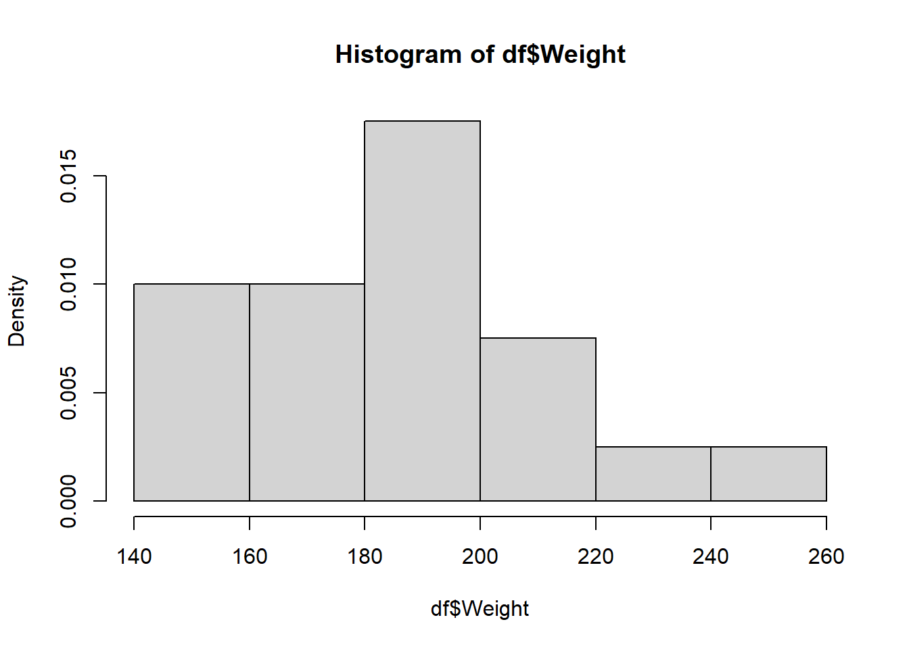

```r
hist(df$BodyFat,freq=F)
```


```r
# print summary statistics
summary(df)
```

```
     Weight         BodyFat     
 Min.   :146.0   Min.   : 6.00  
 1st Qu.:171.8   1st Qu.:10.00  
 Median :187.5   Median :21.00  
 Mean   :188.6   Mean   :19.75  
 3rd Qu.:201.2   3rd Qu.:27.25  
 Max.   :246.0   Max.   :38.00  
```

```r
# There seems to be some relationship here
plot(df)
```


```r
# Here is the correlation matrix, notice it is high!
cor(df)
```

```
           Weight   BodyFat
Weight  1.0000000 0.6966328
BodyFat 0.6966328 1.0000000
```

We have observed that there is a relatively strong linear relationship between these two variables. What next? We might ask, what is this relationship precisely?

In particular, note that we have observed a sample of vectors \((Y_1,X_1),\ldots,(Y_1,X_n)\). Now, we want to say something about the relationship between \(X\) and \(Y\) in general. One way to do that is to suppose at the **population** level that \[{\textrm{E}}\left[Y|X\right]=f(X).\] That is, on average, \(Y\) is equal to \(f(X)\). One way to do that is to assume that \(Y|X=f(X)+\epsilon,\) where \(\epsilon\) is a random variable that satisfies \({\textrm{E}}\left[\epsilon\right]=0\). This assumption means that, for each \(Y_i\), given \(X_i\), we have that \(Y_i=f(X_i)+\epsilon_i\). Note that we do not observe \(\epsilon_i\), but we can assume it exists. We can read this as \(Y_i\) is equal to \(f(X_i)\), plus some random, individual error \(\epsilon_i\). The next step is to use the data to determine \(f\).

Using the data analysis steps from the [Introduction](Introduction) we can write out the first few steps:

- Question about a population: ``How can we use weight to determine body fat percentage?’’
- Data: \((Y_1,X_1),\ldots,(Y_{20},X_{20})\), \((Y_{i},X_{i})\) are the body fat percentage and weight of individual \(i\in [20]\).

We have explored the data with graphs and summary statistics. Now, we have posited the model \(Y|X=f(X)+\epsilon\). Letting \(f\) be any function is too general. In fact, we can use the data to learn more about what \(f\) might be. Recall that earlier, we saw the scatter plot, where it looked like there was a linear relationship, (with some error), between \(Y\) and \(X\). (We can draw a straight line through the middle of the data.)

Let’s make some assumptions that make the statistical analysis easier:

1. 
    Assume that \(\forall i\in[20]\), it holds that \[Y_i|X_i=\beta_0+\beta_1 X_i+\epsilon_i.\] This means that we assume that \(f\) is a line.

2. 
    Next, we assume \(\forall i\in[20]\), \({\textrm{E}}\left[\epsilon_i\right]=0\) and \({\textrm{Var}}\left[\epsilon_i\right]=\sigma^2\). That is, the random error have the same mean and variance for each individual. In addition, the random errors average to 0.

3. 
    We also assume that the individuals’ Body fat percentage, weights and random errors are independent, that is, \(\epsilon_i\perp \epsilon_j\) for \(i\neq j,\ i,j\in [20]\).

This is the **simple linear regression model**. That is, the simple linear regression model is the set of assumptions 1-3 given above.

It is often also assumed:

1. \(\epsilon_i\sim\mathcal{N}(0,\sigma^2)\),

but not always. Including the normality assumption is known as the **simple normal linear regression model.**

In general, a model is a set of assumptions about a population. The particular set of assumptions 1-3 is the simple linear regression model.

The following is some terminology used in regression analysis:

- Here, \(Y_i\) is the **response variable**, also known as the dependent variable, or the outcome variable.
- Here, \(X_i\) is the **covariate**, also known as the explanatory variable, or the independent variable.

Given a “question about a population” which involves regression, you should immediately identify the response variable and the covariates.

Now, how can we interpret this model? That is, what does it mean to assume this model?

First, observe that we assume that \({\textrm{E}}\left[Y|X\right]\) is a line. This means there is a linear relationship between the average body fat percentage and weight.

Next, observe that for any individual, their actual body fat percentage is given by \(Y={\textrm{E}}\left[Y|X\right]+\epsilon_i=\beta_0+\beta_1 X_i+\epsilon_i\). Therefore, their body fat percentage will not fall exactly on the line \(\beta_0+\beta_1 X_i\). Rather, it will fall above or below the line, depending on \(\epsilon_i\). Furthermore, if we assume that \(\epsilon_i\sim \mathcal{N}(0,\sigma^2)\), then we know from the properties of the Normal distribution that this random error will not exceed \(2\sigma\) with high probability. Therefore, most of the time, an individual’s body fat percentage will fall within \(2\sigma\) of the line.

Third, notice that this quantity, \(2\sigma\), does not depend on \(X\). That is, for any weight, we still expect an individual’s body fat percentage to be within \(2\sigma\) of the line, regardless of the value of weight.

Fourth, if we knew \(\beta_0,\beta_1\), then given someone’s weight, we could try to predict their body fat percentage given their weight. That is, we could calculate the expected body fat \({\textrm{E}}\left[Y|X\right]\). There would still be their individual random error \(\epsilon\), so we would not be able to predict it exactly. However, if \(\sigma^2\) isn’t too big, then we could produce an accurate prediction.

Therefore, if the model assumptions are correct, we assume there exists some line, around which the body fat percentages are scattered uniformly.

Next, we will simulate data from the normal simple linear regression model to gain a better understanding of this model. Suppose that \(\beta_0=-15\), \(\beta_1=.2\) and \(\sigma=5\). Then we would observe the following.

```r
############################ Simulation
set.seed(3252)

# Suppose that beta_0=-15 and beta_1=0.2 and sigma=5, 
# then we would have that the mean function E(Y|X) is given by the following line:
curve(-15+.2*x,125,280,lwd=3,xlab="Weight",ylab="Expected BF % (E(Y|X))")
```

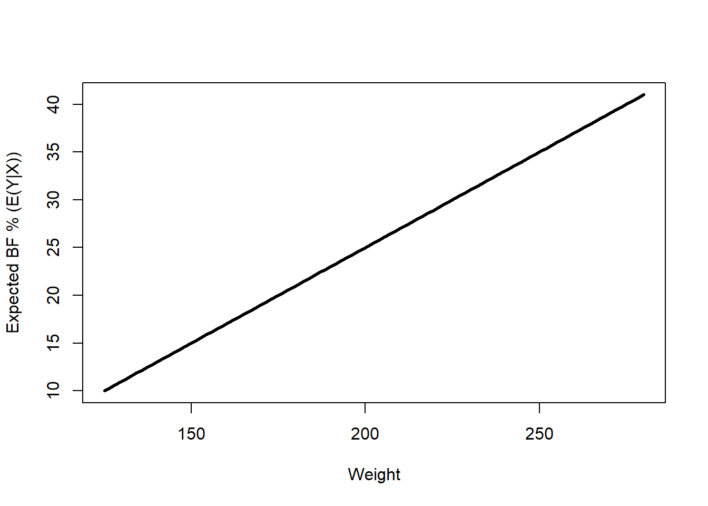

```r
# Next, let's simulate some body weights from the uniform distribution
Weight2=runif(20,135,250)

# Then, we can simulate the population body fat percentages according to the model as follows:

# Simulating 20 values of the random error, 
epsilons=rnorm(n=20,mean=0,sd=5)

# Computing the simulated Body fat percentages: 
Bfs=-15+.2*Weight2+epsilons

# Plot the simulated values, and the mean function
curve(-15+.2*x,125,280,lwd=3,xlab="Weight",ylab="BF %")
points(Weight2,Bfs,pch=22,bg=2)
```

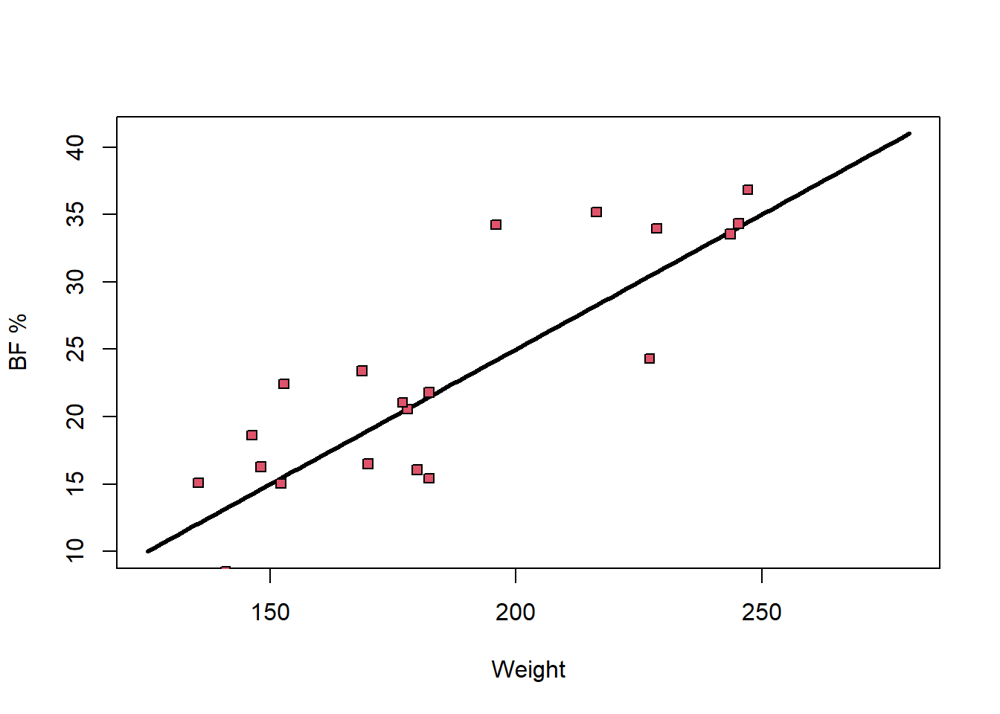

Notice how the data are scatted around the line uniformly? This is what data from a simple linear regression model looks like. Try changing the value in `set.seed()` and re-running the code. Notice how the data changes, but it is always scatted around the line uniformly? This is what we expect to see if the data follow a simple linear regression model.

Notice how the data simulated from our model appears similar to the body fat percentage and weights data we observed? That means this model (set of assumptions) is a good fit for our data.

Caution
In this model, and in regression in general, the response \(Y\) is not exactly equal to some function of \(X\) given by \(f(X)\). The model assumes that **on average** \(Y=f(X)\). Therefore, knowing someones “\(X\)” value will not exactly give us their \(Y\) value, but it would give us a good guess at it. The error \(\epsilon\) is used to model the fact that someones “\(X\)” value will not exactly give us their \(Y\) value. Notice above how the actual points are scatted around the line, and not exactly equal to it! This is due to the errors \(\epsilon\).

### 3.1.2 The multiple linear regression model

But what about matrices? Why did we study matrices then? We can write the regression model in terms of matrices and vectors, to make it more compact.

Now, recall the the linear regression model is \[Y_i|X_i=\beta_0+\beta_1 X_i+\epsilon_i,\] with with \({\textrm{E}}\left[(\right]\epsilon_i)=0\ , {\textrm{Var}}\left[(\right]\epsilon_i)=\sigma^2)\), and all \(\epsilon_j\perp\epsilon_j\).

It is more convenient mathematically to let \(\mathbf{Y}=(Y_1,\ldots,Y_n)^\top\), \[\mathbf{X}=\begin{bmatrix}
        1 & X_1\\
        \vdots & \vdots\\
        1 & X_n\\
    \end{bmatrix}=\left[ 1_n\ |\  (X_1,\ldots,X_n)^\top\right],\] \(\beta=(\beta_0,\beta_1)^\top\) and \(\mathbf{\epsilon}=(\epsilon_1,\ldots,\epsilon_n)^\top\). Then we can write \[\mathbf{Y}|\mathbf{X}=\mathbf{X}\beta+\mathbf{\epsilon}.\] Often, we overload the notation \(Y\), and use \(Y\) instead of \(\mathbf{Y}\), and \(X\) instead of \(\mathbf{X}\).

This form allows us to go beyond one explanatory variable very easily! Just add one column to \(X\) and one entry to \(\beta\) for each new variable. Observe the following model: \[Y_i|(X_{i1},\ldots,X_{ik})=\beta_0+\beta_1 X_{i1}+\ldots+\beta_k X_{ik}+\epsilon_i,\] with \({\textrm{E}}\left[(\right]\epsilon_i)=0\ , {\textrm{Var}}\left[(\right]\epsilon_i)=\sigma^2)\) and \(\epsilon_i\perp \epsilon_j\) for \(i\neq j,\ i,j\in [n]\). This is known as the **multiple linear regression model** (MLR), or just the linear regression model for short. We can write this model in the same for as above: Let \[\mathbf{X}=\begin{bmatrix}
        1 & X_{11}&X_{1k}\\
        \vdots & \vdots &\vdots\\
        1 & X_{n1}\ldots &X_{nk}\\
    \end{bmatrix},\] and \(\beta=(\beta_0,\ldots,\beta_k)^\top\). Then we can write the MLR as \[\mathbf{Y}|\mathbf{X}=\mathbf{X}\beta+\mathbf{\epsilon},\] where \({\textrm{E}}\left[(\right]\epsilon)=0\), \(\epsilon_i\perp \epsilon_j\) for all \(i\neq j\in [n]\) and \({\textrm{Var}}\left[\epsilon\right]=\sigma^2 I\). Notice how compact this is! As in the simple case, there is also the **normal MLR**, which further assumes that \(\epsilon\sim\mathcal{N}(0,\sigma^2 I)\).

We can then study the mathematical properties of \[Y|X=X\beta+\epsilon\] for general but fixed \(k\), under either the normal MLR or just the MLR, which will cover many models.

### 3.1.3 Homework stop 1

**Exercise 3.1** Try adjusting the parameters \(\beta_0,\beta_1,\sigma\) in the simulation, what happens to the data? What happens to the line?

**Exercise 3.2** Is \(\beta\) an estimate or a population parameter? Why?

**Exercise 3.3** Come up with another possible form of \(f\) that is not linear. Adjust the simulation to include this form of \(f\).

**Exercise 3.4** Write down the assumptions of the MLR and the normal MLR. What is the difference between the two models?

## 3.2 Least Squares

Now that we have settled on a model for the population, the next step is to use the data to estimate the model parameters. In particular, we need to estimate \(\beta\). That will allow us to estimated \({\textrm{E}}\left[Y|X\right]\) for any value of \(X\).

Recall that we want to study the **population** model: \[Y|X=X\beta+\epsilon.\]

### 3.2.1 Notation

For the model \(Y|X=X\beta+\epsilon\), we have

- \(Y\in \mathbb{R}^n\) is the response variable (a continuous random variable).
- \(X\in \mathbb{R}^{n\times p}\) is the covariate matrix (Note that the first column is often \(1_n\)).
- \(X_i\in \mathbb{R}^p\) is the \(i^{th}\) observed explanatory variable \((i=1, \ldots, n)\) (not a random variable, in the sense that we condition on it).
- \(\beta\in \mathbb{R}^{p\times 1}\) is the coefficient vector .
- \(\epsilon\in\mathbb{R}^n\) is the random error (continuous random variable) .

We may also refer to the actual observed values (versus the abstract mathematical concept of a random variable) as follows:

- \(y=(y_1,\ldots,y_n)^\top\in \mathbb{R}^n\) is the observed response variable (fixed/observed)
- \(x_{ij}\) is the \(i^{th}\) observation of the \(j^{th}\) explanatory variable (fixed/observed) Data:

| Observation | Observed data point |
| --- | --- |
| 1 | \((y_1, x_{11}, x_{12}, \ldots x_{1p})\) |
| 2 | \((y_2, x_{21}, x_{22}, \ldots x_{2p})\) |
| \(\vdots\) | \(\vdots\) |
| n | \((y_n, x_{n1}, x_{n2}, \ldots x_{np})\) |

We posit that \[Y|X=X\beta+\epsilon,\]

where we assume that

- \(\forall i\in[n]\), \({\textrm{E}}\left[\epsilon_i\right]=0\).
- \(\forall i\in[n]\), \({\textrm{Var}}\left[\epsilon_i\right]=\sigma^2\) (constant variance and is also known as homogeneity.)
- We also would assume that \(\epsilon_i\perp \epsilon_j\) for \(i\neq j,\ i,j\in [n]\).
- \(\beta\in \mathbb{R}^{p\times 1}\) is the unknown, population coefficient vector.
- \(X\in \mathbb{R}^{n\times p}\) is a covariate matrix.

Let’s talk about \(\beta\). How do we interpret \(\beta\)? Suppose we know \(\beta\). Then:

Note that \[{\textrm{E}}\left[Y_i|X_{i}\right]={\textrm{E}}\left[\beta^\top X_i+\epsilon\right]=\beta^\top X_i=\beta_1X_{1,1}+\ldots+\beta_pX_{i,p}\]

What does each \(\beta_j\) mean? Suppose that \(X_j\) is a continuous covariate.

We can interpret (\(\beta_j\)) as follows:

Holding \(X_{i,1},\ldots,X_{i,j-1},X_{i,j+1},\ldots, X_{i,p}\) constant, a one unit increase in \(X_{i,j}\) causes, on average, a \(\beta_j\) unit increase in \(Y_i\).

From another angle, we have that \(\partial {\textrm{E}}\left[Y\right]/\partial X=\beta\), therefore, the rate of change with respect to the \(j^{th}\) covariate is \(\beta_j\).

Caution
The “on average” and “holding other covariates constant” are very important components of the interpretation. First, the on average acknowledges the random error \(\epsilon\). In other words, a one unit increase in \(X_{i,j}\) will not certainly increase \(Y_i\), but it will on average. Next, the “holding other covariates constant” is used to mention how correlations between covariates are handled by the model. Some of the covariates in the model may be correlated, so increases in a given covariate may often be associated with changes in another covariate. This is not accounted for in the coefficient vectors \(\beta\). That is why we must specify “holding other covariates constant”.

For instance, if a model includes a terms for years of education attained and income, we know that as the number of years of education increase we expect to see a rise in income levels. As a result, to interpret the effect of coefficient on income, we must “hold years of education constant”, comparing what is expected with income changes but education does not.

Caution
For now, we can assume that all of the covariates \(X_j\) are continuous variables. Later in the course, there may be categorical covariates. In this case, the \(\beta_j\) corresponding to the categorical covariates have a different interpretation. We will return to this later.

Recall [Example 3.1](#exm-3-1-1). We assume \(\forall i\in[20]\), it holds that \[Y_i|X_i=\beta^\top X_i+\epsilon_i,\] with \(\epsilon_i\sim\mathcal{N}(0,\sigma^2)\), \(\epsilon_i\perp \epsilon_j\) for \(i\neq j,\ i,j\in [20]\). A one unit increase in weight causes, on average, a \(\beta_2\) unit increase in body fat percentage. Since \(\beta_1\) is the intercept, it has a special interpretation. \(\beta_1\) is the average value of \(Y_i\) given \(X_i=0\). It is also helpful to note that \({\textrm{cov}}(Y)=\sigma^2 I\).

### 3.2.2 Least squares estimation

Okay, but we don’t know \(\beta\)! Just like we estimate the population mean with the sample mean, we need to estimate \(\beta\). We would like an estimate \(\hat\beta\), so that we can predict body fat percentage from weight. What is our best guess at \(\beta\), given the data? One way to answer this, is through the method of **least squares**.

Returning to our example, recall that:

```r
plot(df)
```


For example, suppose we want to determine if \(\beta\) is more likely to be \((-35,0.3)^\top\) or \((-22,0.2)^\top\) . How can we say which line is a better to our data? One way is to graph them on top of the data and determine which one looks better. Let’s plot these lines.

```r
plot(df)
# plot Y=-35+0.3X
abline(-35,0.3,lwd=2)
# plot Y=-25+0.2X
abline(-22,0.2,col='red',lwd=2)
```


Its not clear which one fits the data better. Even if it was clear, obviously, we cannot plot all possible lines. So how can we determine which line fits the data the “best”?

To do this, we have to define what “best” means quantitatively. For instance, one might ask which line minimizes the sum of the squared distances of the observed data points to the line? This line is then said to be the “best” line. Mathematically, given a proposed value of \(\beta\), say \(\beta_0\in \mathbb{R}^p\), the signed distance to the hyperplane \(X\beta_0\) is \(\epsilon_0=Y-X\beta_0\). The squared distances to the hyperplane \(X\beta_0\) is then \(\epsilon_0^\top\epsilon_0 =(Y-X\beta_0)^\top (Y-X\beta_0)\). We can then formulate this as a math problem: Which \(\beta_0\in \mathbb{R}^p\) minimizes \(\epsilon_0^\top\epsilon_0\)? i.e., \(\hat\beta =\mathop{\mathrm{argmin}}_{\beta_0\in\mathbb{R}^p}\epsilon_0^\top\epsilon_0.\) It is more convenient to just write \[\hat\beta =\mathop{\mathrm{argmin}}_{\beta\in\mathbb{R}^p}(Y-X\beta)^\top (Y-X\beta).\]

In this framework, the “best” estimate is given by \[\hat\beta =\mathop{\mathrm{argmin}}_{\beta\in\mathbb{R}^p}(Y-X\beta)^\top (Y-X\beta).\] Note best is in the sense of minimizing the average squared distance to the hyperplane/line. We could also define best in terms of some other metric, such as average absolute distance to the hyperplane/line. For now, we will stick with this metric.

The next step is to solve: \[\hat\beta =\mathop{\mathrm{argmin}}_{\beta\in\mathbb{R}^p}(Y-X\beta)^\top (Y-X\beta).\]

How do we minimize a function???

RECALL in calculus, to find the minimum of a function we:

1. Obtain the first two derivatives of the function.
2. Set the first derivative to zero and solve for the critical value.
3. Use the second derivative to verify the critical value minimized the function.

Goal: Compute \(\hat\beta\) – Minimize \(g(\beta)=(Y-X\beta)^\top (Y-X\beta)\). (It may be useful to review taking derivatives with respect to vectors [here](https://www.math.uwaterloo.ca/~hwolkowi/matrixcookbook.pdf).

Step 1a: {

\[\begin{align*}
\frac{\partial g}{\partial\beta} &= \frac{\partial }{\partial\beta}(Y-X\beta)^\top (Y-X\beta)\\
&= \frac{\partial }{\partial\beta}\left[Y^\top Y-2(X\beta)^\top Y+(X\beta)^\top X\beta\right]
   \quad \text{(Transpose and distribute)}\\
&= -2\frac{\partial }{\partial\beta}\beta^\top X^\top Y+\frac{\partial }{\partial\beta}\beta^\top X^\top X\beta
   \quad \text{($(AB)^\top=B^\top A^\top$)}\\
&= -2 X^\top Y+2X^\top X\beta
   \quad \text{($\tfrac{\partial}{\partial x}x^\top Ax=2Ax$ if $A$ sym., $\tfrac{\partial}{\partial x}x^\top a=a$)}\\
&= -2X^\top (Y-X\beta ).
\end{align*}\] }

\begin{align*}
\frac{\partial g}{\partial\beta}&= \frac{\partial }{\partial\beta}(Y-X\beta)^\top (Y-X\beta)\\
&= \frac{\partial }{\partial\beta}\left[Y^\top Y-2(X\beta)^\top Y+(X\beta)^\top X\beta\right] \tag{Transpose and distribute}\\
&= -2\frac{\partial }{\partial\beta}\beta^\top X^\top Y+\frac{\partial }{\partial\beta}\beta^\top X^\top X\beta \tag{$(AB)^\top=B^\top A^\top$}\\
&= -2 X^\top Y+2X^\top X\beta \tag{$\frac{\partial }{\partial x}x^\top Ax=2 Ax$ if $A$ symmetric, $\frac{\partial }{\partial x}x^\top a=a$ }\\
&= -2X^\top (Y-X\beta ).
\end{align*}
Step 1b: (Do this for homework, use eq. (98) in the matrix cookbook.) \[\frac{\partial^2 g}{\partial\beta\partial\beta^\top}=2X^\top X.\]

Step 2: We now need \(X^\top X\) to be invertible, so we will assume that \(X\) is full rank and \(n\geq p\). \[\begin{align*}
    -2X^\top (Y-X\beta )=0\\
    &\implies X^\top Y=X^\top X\beta\\
    &\implies \beta=(X^\top X)^{-1}X^\top Y.
\end{align*}\]

Step 3:

Recall that **if the Hessian matrix is positive definite at a critical point, then that critical point is a local minimum.** Since we have assumed \(X\) is full rank, this implies that \(X^\top X\) is positive definite.

To summarize, the steps have proceeded as follows:

- Step 1a: \(\frac{\partial g}{\partial\beta}=-2X^\top (Y-X\beta )\)
- Step 1b: \(\frac{\partial^2 g}{\partial\beta\partial\beta^\top}=2X^\top X\) (Do this for homework)
- Step 2: \(-2X^\top (Y-X\beta )=0\implies X^\top Y=X^\top X\beta\) \(\implies \beta=(X^\top X)^{-1}X^\top Y\)
- Step 3: \(2X^\top X\) is positive definite, and so \[\hat\beta=(X^\top X)^{-1}X^\top Y.\]

The estimate \(\hat\beta\) is known as the **least squares estimate** of the regression coefficients.

**Definition 3.1** The **least squares estimate** of the regression coefficients is \[\hat\beta=(X^\top X)^{-1}X^\top Y.\]

### 3.2.3 Example

**Example 3.2** In the body weight example [Example 3.1](#exm-3-1-1), write down \(X\), \(y\) and compute \(\hat\beta\). Interpret \(\hat\beta\).

First, we have that \[y=\left( 6   , 21  , 15  , 6   , 22  , 31  , 32  , 21  , 25  , 30  , 10  , 20  , 22  , 9   , 38  , 10  , 27  , 12  , 10  , 28  \right)^\top\] \[X=\left[1_{20}\ | \left( 175 , 181 , 200 , 159 , 196 , 192 , 205 , 173 , 187 , 188 ,
188 , 240 , 175 , 168 , 246 , 160 , 215 , 159 , 146 , 219  \right)^\top\right]\]

Note
For matrices \(A,B\) which have the same number of rows, \(C=[A | B]\) is horizontal concatenation of \(A\) and \(B\). This notation indicates that the matrix \(C\) is formed by placing \(A\) an \(B\) side by side, joining them horizontally. Therefore, \(X\) is the matrix whose first column is made up of ones, and second column is made up of the body weights.

Let’s use R to compute \(\hat\beta\).

```r
#Define X and Y
X=cbind(rep(1,nrow(df)), df$Weight)
Y=df$BodyFat

# cast to column vec
Y=matrix(Y,ncol=1)

#X'X 
X_p_X=t(X)%*%X

#X'X inverse
X_p_X_inverse=solve(X_p_X)

#LS
beta_hat= X_p_X_inverse%*%t(X)%*%Y
beta_hat
```

```
            [,1]
[1,] -27.3762623
[2,]   0.2498741
```

```r
# We can also use Rs lm() function to do this: 
# This code is essential for the course. 
# The first argument is the formula 
model=lm(BodyFat ~ Weight, data=df)

#The summary function prints the model output. 

summary(model)
```

```

Call:
lm(formula = BodyFat ~ Weight, data = df)

Residuals:
     Min       1Q   Median       3Q      Max 
-12.5935  -5.7904   0.6536   5.2731  10.4004 

Coefficients:
             Estimate Std. Error t value Pr(>|t|)    
(Intercept) -27.37626   11.54743  -2.371 0.029119 *  
Weight        0.24987    0.06065   4.120 0.000643 ***
---
Signif. codes:  0 '***' 0.001 '**' 0.01 '*' 0.05 '.' 0.1 ' ' 1

Residual standard error: 7.049 on 18 degrees of freedom
Multiple R-squared:  0.4853,    Adjusted R-squared:  0.4567 
F-statistic: 16.97 on 1 and 18 DF,  p-value: 0.0006434
```

```r
# The least squares estimates are given in the Estimate column of the summary. 
```

The `lm()` function is used to fit multiple linear regression models in R. The basic usage involves specifying a formula and a data frame. The syntax is given by `lm(formula, data, ...)`.

The data argument should be the dataframe which contains your data. The formula argument is used to specify the model to be fitted. It provides a symbolic description of the model, indicating the response variable and the predictors/covariates, as well as the relationships between them. The left-hand side should be the name of your response variable, as it is named in your dataframe. To see the names of your variables use the `names()` function, e.g., `names(df)`. The right-hand side contains the covariates you want to include in your model. For instance, above, the formula is given by `BodyFat ~ Weight` . Note that `BodyFat` is the response and `Weight` is the covariate.

We now list some important properties of the least squares estimator.

**Exercise 3.5** Compute \({\textrm{E}}\left[\hat\beta\right]\) and \({\textrm{cov}}(\hat\beta)\).

*Solution 3.1*. It holds that \({\textrm{E}}\left[\hat\beta\right]=\beta\) and \({\textrm{cov}}(\hat\beta)=\sigma^2 (X^\top X)^{-1}\).

Recall that an estimator is **unbiased** if its expectation equals the population parameter it is trying to estimate. After completing [Exercise 3.5](#exr-3-1-1) you will see that \(\hat\beta\) is unbiased for the parameter \(\beta\).

The least squares estimator is also the “best linear unbiased estimator”, or the BLUE. This is known as the [Gauss–Markov](https://en.wikipedia.org/wiki/Gauss%E2%80%93Markov_theorem) theorem. This means that under the assumptions of the linear regression model, over any unbiased estimator of \(\beta\) we can construct, which is a linear combination of \(Y_1,\ldots,Y_n\), the estimator \(\hat\beta\) has the smallest variance (and therefore, the smallest mean squared error. Recall that for an estimator \(\hat\alpha\), the mean squared error is given by \({\textrm{E}}\left[||\beta-\hat\alpha||^2\right]\).)

The Gauss–Markov theorem does not require the random error to be normally distributed. If we are willing to assume that \(\epsilon\sim \mathcal{N}(0,\sigma^2 I)\), then \(\hat\beta\) is also the [maximum likelihood estimator](https://en.wikipedia.org/wiki/Maximum_likelihood_estimation) and the “uniformly minimum-variance unbiased estimator”, or [UMVUE](https://en.wikipedia.org/wiki/Minimum-variance_unbiased_estimator#:~:text=In%20statistics%20a%20minimum%2Dvariance,possible%20values%20of%20the%20parameter). This means that \(\hat\beta\) has lower variance than any other unbiased estimator, no matter what the true value of \(\beta\) is.

One might ask, how can we use \(\hat\beta\) to predict body fat percentage given weight? The estimate \(\hat\beta\) gives us a best guess at the coefficients. Therefore, our best guess at someones body fat is given by \[Best\ Guess=-27.3762623+ 0.2498741 \times Weight.\] For instance, for someone who is 170 pounds, we would guess that their body fat percentage is \(-27.3762623+ 0.2498741 \times 170=\) 15.1023347.

### 3.2.4 Homework stop 2

**Exercise 3.6** Why do we need \(\hat\beta\), why not use \(\beta\)?.

**Exercise 3.7** Is \(\hat\beta\) an estimate or a population parameter? What about \(\beta\)?

**Exercise 3.8** Compute, \(X\), \(Y\) and \(\hat\beta\) in the following real data example:

It is challenging to assess a student’s understanding of a subject without administering an exam. However, we can easily record the number of hours a student studies. A researcher would like to know if the number of hours studied and exam scores are related. This researcher collected the following data:

| Student | Hours Studied | Exam Score (%) |
| --- | --- | --- |
| 1 | 5 | 55 |
| 2 | 8 | 65 |
| 3 | 12 | 78 |
| 4 | 6 | 58 |
| 5 | 10 | 72 |
| 6 | 9 | 68 |
| 7 | 15 | 85 |
| 8 | 7 | 60 |
| 9 | 11 | 74 |
| 10 | 13 | 80 |
| 11 | 14 | 82 |
| 12 | 20 | 90 |
| 13 | 5 | 55 |
| 14 | 6 | 59 |
| 15 | 18 | 88 |
| 16 | 7 | 62 |
| 17 | 16 | 86 |
| 18 | 4 | 50 |
| 19 | 3 | 45 |
| 20 | 19 | 89 |

To help you, here is some R code the dataset:

```r
# Data
study_data <- data.frame(
  Student = 1:20,
  Hours_Studied = c(5, 8, 12, 6, 10, 9, 15, 7, 11, 13, 14, 20, 5, 6, 18, 7, 16, 4, 3, 19),
  Exam_Score = c(55, 65, 78, 58, 72, 68, 85, 60, 74, 80, 82, 90, 55, 59, 88, 62, 86, 50, 45, 89)
)
```

## 3.3 Least squares inference

Recall we **estimate** the parameter \(\beta\) using least squares:

Recall that \(\hat\beta=(X^\top X)^{-1}X^\top Y\). We can predict a new weight \(Y_{new}|X=x\) with \(\hat y_{new}=x^\top \hat\beta\). We may be interested in the following questions: How good is \(\hat y_{new}\) as a prediction, on average? How will new observations vary about the line? For example, given a specific weight, how will does body fat percentage vary around the regression line? How does \(\hat\beta\) vary around \(\beta\)? Is there strong evidence that \(Y\) has a relationship with \(X\)? Is \(X\) adding information about \(Y\) at all?

To answer these questions, we need to look at the variation of our estimates and our data.

### 3.3.1 Important quantities: Residuals and fitted values

We now introduce some very important quantities: We call the estimated values given our observed \(X\) the fitted values: \(\hat Y=X\hat\beta\). The fitted values are what our model would estimate the vector \(Y\) to be. We call \(\hat \epsilon=Y-\hat Y\) is the **residual vector**. The \(i\)th entry of \(\hat \epsilon\), say \(\hat \epsilon_i\), is the \(i\)th **residual**. The residuals are the signed distances from the response variable to the estimated regression hyperplane. The **sum of squared error** or **sum of squared residuals** (SSE) is given by \(\hat \epsilon^\top \hat \epsilon=\sum_{i=1}^n\hat \epsilon_i^2\). Note that since we estimated \(\beta\) using the least squares method, \(\hat \epsilon^\top \hat \epsilon\) is minimized (with respect to varying \(\beta\)).

**Example 3.3** Recall [Example 3.1](#exm-3-1-1). What is the residual of individual 3? How can we interpret this value?

```r
residuals=Y-X%*%beta_hat; residuals
```

```
             [,1]
 [1,] -10.3517117
 [2,]   3.1490434
 [3,]  -7.5985652
 [4,]  -6.3537255
 [5,]   0.4009314
 [6,]  10.4004279
 [7,]   8.1520641
 [8,]   5.1480365
 [9,]   5.6497986
[10,]  10.3999245
[11,]  -9.6000755
[12,] -12.5935307
[13,]   5.6482883
[14,]  -5.6025928
[15,]   3.9072245
[16,]  -2.6035997
[17,]   0.6533228
[18,]  -0.3537255
[19,]   0.8946383
[20,]   0.6538262
```

```r
# This means that individual 3's body fat is 7.5 percentage points lower than the fitted line

residuals[3]
```

```
[1] -7.598565
```

```r
# We can go further and and plot all of the residuals
curve(beta_hat[1]+beta_hat[2]*x,125,280,lwd=3,xlab="Weight",ylab="BF %")
points(Weight,BodyFat,pch=22,bg=1)
Yvals=cbind(BodyFat,model$fitted.values)
Xvals=cbind(Weight,Weight)
for(i in 1:nrow(Yvals)){
  lines(Xvals[i,],Yvals[i,])
  text(Xvals[i,1]+2,mean(Yvals[i,]),round(residuals[i],2))
}
```


```r
# Then, the population body fat percentages, given weights will look like this: 
# 
# Bfs=-15+.2*Weight+rnorm(20,0,sd=5)
```

### 3.3.2 Variation decomposition

Variance decomposition is a fundamental concept that explains how the total variation in the response variable can be partitioned into different sources. This decomposition is crucial for evaluating the performance of the regression model and understanding the contributions of various factors.

The residuals describe one type of variation of the response values. We can also consider the total variation of the response. The total variation of the response, or the **sum of squares total**/**total sum of squares** (\(SST\)) is given by \(SST=(n-1)\hat\sigma_y=\sum_{i=1}^n(Y_i-\bar Y)^2=(Y-\bar Y 1)^\top (Y-\bar Y 1)\). It can be shown that the \(SST\) can be decomposed as follows: \[SST=(Y-\bar Y 1)^\top (Y-\bar Y 1)=(Y-\hat Y)^\top (Y-\hat Y)+(\hat Y-\bar Y)^\top (\hat Y-\bar Y)=\hat\epsilon^\top \hat\epsilon+(\hat Y-\bar Y)^\top (\hat Y-\bar Y).\] That is, \(SST=SSE+SSModel\) where

- \(SSModel\), OR \(SSM\) measures the total variations of the response explained by the covariates \(X\) via the model based on \(\hat\beta\).
- \(SSE\) measures the total variations of the response unexplained by the covariates \(X\) via the model based on \(\hat\beta\).
- Note there are sometimes other names for \(SSE\) and \(SSModel\), such as \(SSRegression\), \(SSwithin\) and \(SSbetween\), etc.

So, we have that the total variation in the response can be broken down into that which is explained by the \(X\) values, and that which is unexplained.

An interesting observation is given as follows: The first column of the \(X\) matrix is given by \(1_n\), which implies that \[\bar Y 1=X\begin{bmatrix}
\bar Y\\
0
\end{bmatrix}.\] This means that if we let \(\hat\beta_*=(\bar Y,0,\ldots,0)^\top\), then \((Y-\bar Y 1)\) would be the signed distances to (or the residuals of) the regression hyperplane corresponding to \(\hat\beta_*\). Since \(\hat\beta\) minimizes the sum of squared residuals, we must have that the hyperplane corresponding to \(\hat\beta\) has a smaller sum of squared residuals than the regression hyperplane corresponding to \(\hat\beta_*\). Therefore, we must have that \(\hat \epsilon^\top \hat \epsilon\leq (Y-\bar Y 1)^\top (Y-\bar Y 1)\).

Each of these terms in the decomposition is associated with a certain number of **degrees of freedom**.

- Total: \(dfT=n-1\).
- Model: \(dfM=\#\ \textbf{non-zero }\beta-1\).
- Error: \(dfE=n-\#\ \textbf{non-zero }\beta\).

Intuitively, since the \(SSE\) is the variance unexplained by the model/covariates, the \(SSE\) is related to the error variance \(\sigma^2\). In fact, to estimate \(\sigma^2\), we use \[\hat\sigma^2=MSE=\frac{SSE}{dfE}.\]

The null model is defined as \(Y|X=\beta_0+\epsilon\). This is the model where the last \(p-1\) terms in the true vector \(\beta\) are \(0\). This model says that \(Y\) does not depend on \(X\). In the null model, we only need to estimate the mean, so \(df=n-1\). Therefore, under the null model, \[\begin{align*}
        \hat\sigma^2=(n-1)^{-1}SST&=\hat\sigma_Y^2\\
        &=(n-1)^{-1}\sum_{i=1}^n(Y_i-\bar Y)^2=(n-1)^{-1}(Y-\bar Y 1)^\top (Y-\bar Y 1).
    \end{align*}\] Therefore, in the null model, the estimate of \(\sigma^2\) via the \(MSE\) is just the usual estimate of the variance of the response. This is intuitive!

The following table can be used to summarize the variation in the response:

| **Source** | **SS** | **df** | **MS** |
| --- | --- | --- | --- |
| Model | \(SSM\) | \(dfM\) | \(MSModel = SSM/dfM\) |
| Residual | \(SSE\) | \(dfE\) | \(MSE = SSE/dfE\) |
| Total | \(SST\) | \(dfT\) |  |

Note
It is very important to be able to interpret these terms! The derivation is also important. However, we can use a machine to compute anything for us, so memorizing the formula is not helpful.

### 3.3.3 Coefficients of determination

A model is a good model if it can explain a fair amount of the variation in the response. (You can think that the model explains “changes” in the response.) In other words, \(SSModel\) should be as close to \(SSTotal\) as possible; or equivalently, \(SSError\) should be as close to 0 as possible. Now, “close” is a relative term, and so we need another value to reference to. This is where the **\(R^2\)** comes in: \[R^2=\frac{SSModel}{SST},\] and is the proportion of variation explained by the model. It is clear that \(0 \leq  R^2 \leq 1\), and so rescaling the data will not affect \(R^2\) (like it would affect the sum of squares terms \(SST,SSE,SSM\)). If \(R^2\) is close to 1, it is large – “close to 1” is a subjective/area dependent. Generally, the larger the \(R^2\), the better the model!

To compare different models, we could potentially add different covariates and see if \(R^2\) improves. However, every time you add any variable, \(R^2\) will always increase. Therefore, it is common to use the adjusted coefficient of determination: \[\bar R^2=1-(1-R^2)\frac{n-1}{n-p}.\] Thus, the (adjusted) coefficient of determination can be used as a measure of how well the regression model fits the data (how much variance is explained). It could also be used to compare models.

### 3.3.4 The \(F\) test

The coefficients of determination are summary statistics which give an idea of the fit of the model. We would also like a significance test that tells us whether the covariates explain \(Y\), or what we observed was simply due to sampling variation.

If \(\beta=(\beta_1,\ldots,\beta_p)^\top\) then let \(\tilde\beta=(\beta_2,\ldots,\beta_p)^\top\). That is \(\tilde\beta\) is the regression coefficients without the intercept term. Similarly, let \(\tilde{\hat\beta}=(\hat\beta_2,\ldots,\hat\beta_p)^\top\). Now, we want to avoid the situation where \(\tilde\beta=0\) but \(\tilde{\hat\beta}\neq 0\) due to sampling variation.

To do this, we perform a significance test: \[H_0:\tilde\beta=0\qquad vs\qquad H_1:\tilde\beta\neq 0.\]

First, we need the normality assumption to perform significance test: Assume \(\epsilon_i\sim\mathcal{N}(0,\sigma^2)\). With this assumption, the model is then known as the **Normal Multiple Linear Regression Model**. It is important to note that the least squares method does not require this assumption, and this assumption is required only for the significance test to be valid. To test the hypothesis stated above, we use the overall \(F\) test and the observed test statistic is \(F_{obs} = MSModel/MSE.\) Why?

With the extra normality assumption, we have the following holds:

- \(Y|X\) is normally distributed.
- We have that \(SSM/\sigma^2\sim \chi^2_{dfM}\) and \(SSE/\sigma^2\sim \chi^2_{dfE}\).
- Furthermore, \(SSM\perp SSE\).

Recall that the ratio of two independent \(\chi^2\) distributions divided by their respective degrees of freedom follows an \(F\) distribution. Therefore, we have that \(F_{obs}\sim F_{dfM,dfE}\). The corresponding p-value is \(\Pr(W > F_{obs})\) where \(W\sim F_{dfM;dfE}\). We can alternatively reject the null hypothesis if \(F_{obs}>F_{dfM;dfE,1-\alpha}\), where \(F_{obs}>F_{dfM;dfE,1-\alpha}\) is the \(1-\alpha\) quantile of the \(F_{dfM,dfE}\) distribution.

We can now present the complete ANOVA table

| **Source** | **SS** | **df** | **MS** | **F** | **p-value** |
| --- | --- | --- | --- | --- | --- |
| Model | \(SSM\) | \(dfM\) | \(MSModel = \frac{SSR}{dfM}\) | \(F = \frac{MSModel}{MSE}\) | \(\Pr(W > F_{obs})\) |
| Residual | \(SSE\) | \(dfE\) | \(MSE = \frac{SSE}{dfE}\) |  |  |
| Total | \(SST\) | \(dfT\) |  |  |  |

**Example 3.4** In [Example 3.1](#exm-3-1-1), compute and interpret the coefficients of determination. Compute and interpret the ANOVA table. Test whether the regression model is significant. (This means perform the \(F\) test.)

```r
# recall
head(df)
```

```
  Weight BodyFat
1    175       6
2    181      21
3    200      15
4    159       6
5    196      22
6    192      31
```

```r
# The F test results are given in the summary
summary(model)
```

```

Call:
lm(formula = BodyFat ~ Weight, data = df)

Residuals:
     Min       1Q   Median       3Q      Max 
-12.5935  -5.7904   0.6536   5.2731  10.4004 

Coefficients:
             Estimate Std. Error t value Pr(>|t|)    
(Intercept) -27.37626   11.54743  -2.371 0.029119 *  
Weight        0.24987    0.06065   4.120 0.000643 ***
---
Signif. codes:  0 '***' 0.001 '**' 0.01 '*' 0.05 '.' 0.1 ' ' 1

Residual standard error: 7.049 on 18 degrees of freedom
Multiple R-squared:  0.4853,    Adjusted R-squared:  0.4567 
F-statistic: 16.97 on 1 and 18 DF,  p-value: 0.0006434
```

```r
# The ANOVA table is given below

# First define the null model object using lm()
# This line fits a model with only the intercept term
null_model=lm(BodyFat~1,data=df)

# This line gets the ANOVA table
anova(null_model,model)
```

```
Analysis of Variance Table

Model 1: BodyFat ~ 1
Model 2: BodyFat ~ Weight
  Res.Df     RSS Df Sum of Sq      F    Pr(>F)    
1     19 1737.75                                  
2     18  894.42  1    843.33 16.972 0.0006434 ***
---
Signif. codes:  0 '***' 0.001 '**' 0.01 '*' 0.05 '.' 0.1 ' ' 1
```

```r
# We can also do this by hand: 

# Store sample size
n=nrow(df)
p=2

# Compute sum of squares
SST=t(Y-mean(Y)*rep(1,n))%*%(Y-mean(Y)*rep(1,n))
Yhat=X%*%beta_hat
res=Y-Yhat
SSE=t(res)%*%res
SSM=SST-SSE

dfe=n-p
dfm=p-1
MSM=SSM/dfm

MSE=SSE/dfe

Fv=MSM/MSE

p.val=1-pf(Fv,dfm,dfe)

# ANOVA Table:
ANOVA_Table=rbind(c(SSM,dfm,MSM,Fv,p.val),c(SSE,dfe,MSE,NA,NA),c(SST,n-1,NA,NA,NA))
rownames(ANOVA_Table)=c("Model","Error","Total")
colnames(ANOVA_Table)=c("SS","df","MS","F","p-value")
ANOVA_Table
```

```
             SS df        MS        F      p-value
Model  843.3252  1 843.32521 16.97164 0.0006434484
Error  894.4248 18  49.69027       NA           NA
Total 1737.7500 19        NA       NA           NA
```

### 3.3.5 Homework stop 3

**Exercise 3.9** In the following real data example: **Compute and interpret** the coefficient of determination, the adjusted coefficient of determination and perform the \(F\) test for model significance. Including printing the ANOVA table, the null and alternative hypothesis, an interpretation of the p-value and the conclusion of the test.

It is challenging to assess a student’s understanding of a subject without administering an exam. However, we can easily record the number of hours a student studies. A researcher would like to know if the number of hours studied and exam scores are related. This researcher collected the following data:

| Student | Hours Studied | Exam Score (%) |
| --- | --- | --- |
| 1 | 5 | 55 |
| 2 | 8 | 65 |
| 3 | 12 | 78 |
| 4 | 6 | 58 |
| 5 | 10 | 72 |
| 6 | 9 | 68 |
| 7 | 15 | 85 |
| 8 | 7 | 60 |
| 9 | 11 | 74 |
| 10 | 13 | 80 |
| 11 | 14 | 82 |
| 12 | 20 | 90 |
| 13 | 5 | 55 |
| 14 | 6 | 59 |
| 15 | 18 | 88 |
| 16 | 7 | 62 |
| 17 | 16 | 86 |
| 18 | 4 | 50 |
| 19 | 3 | 45 |
| 20 | 19 | 89 |

To help you, here is some R code the dataset:

```r
# Data
study_data <- data.frame(
  Student = 1:20,
  Hours_Studied = c(5, 8, 12, 6, 10, 9, 15, 7, 11, 13, 14, 20, 5, 6, 18, 7, 16, 4, 3, 19),
  Exam_Score = c(55, 65, 78, 58, 72, 68, 85, 60, 74, 80, 82, 90, 55, 59, 88, 62, 86, 50, 45, 89)
)
```

**Exercise 3.10** Write down the interpretations of: \(SSE,\ MSE,\ R^2,\ \bar R^2,\ SSM\).

**Exercise 3.11** What is the interpretation of the p-value in the ANOVA table?

**Exercise 3.12** What extra assumption is needed to perform the \(F\)-test?

### 3.3.6 Significance of one variable

So far, we have learned that the least squares method yields the following estimate of \(\hat\beta = (X^\top X)^{-1} X^\top Y\) with \({\textrm{E}}\left[\hat\beta\right] = \beta\) and \({\textrm{cov}}(\hat\beta) = (X^\top X)^{-1} \sigma^2\). Moreover, we use \(MSE\) to estimate \(\sigma^2\). Next, we learned that we can summarize the \(SS,\ df\), and \(MS\) in an ANOVA table. We used the \(F\) test and the coefficient of determination to evaluate the quality of the model, i.e., to see the amount of information \(X\) provides about \(Y\).

When the model is a significant model, then, at least one of the individual explanatory variables is useful in explaining the response. We may be interested in whether a specific covariate, or set of covariates is useful in explaining the response variable. We now learn how we can test for the significance of each individual explanatory variable separately and how we can test for the significance of a subset of explanatory variables. Note that these tests also require that the random error is normally distributed.

To test for significance and compute confidence intervals of a single variate, we have to compute the distribution of \(\hat\beta_j\). We first compute the mean and variance of \(\hat\beta_j\). First, given that \({\textrm{E}}(\hat\beta) = \beta\), we have \({\textrm{E}}(\hat\beta_j) = \beta_j\). Next, \({\textrm{Var}}\left[\hat\beta_j\right]\) is the \((j, j)^{th}\) entry of \({\textrm{cov}}(\hat\beta)\). In addition, we have derived that \({\textrm{cov}}(\hat\beta) = (X^\top X)^{-1} \sigma^2\).

Now, recall that if \(Z\) is multivariate normal, i.e., \(Z\sim\mathcal{N}(\mu,\Sigma)\), then \(b+AZ\sim\mathcal{N}(b+A\mu,A\Sigma A^\top)\), i.e., \(b+AZ\) is also multivariate normal. Therefore, since we have assumed that \(\epsilon\sim \mathcal{N}_n(0,\sigma^2 I)\) and that \(Y|X=X\beta+\epsilon\), it follows that \(Y|X\sim \mathcal{N}_n(X\beta,\sigma^2 I)\). Next, we may recall that \(\hat\beta=(X^\top X)^{-1} X^\top Y\). Let \(A=(X^\top X)^{-1} X^\top\). Then \(\hat\beta=AY\). It follows that \(\hat\beta\) is also multivariate normal! Putting everything together, we have that \(\hat\beta\sim \mathcal{N}_p(\beta,(X^\top X)^{-1} \sigma^2)\).

**Theorem 3.1** Under the assumptions of the **normal linear regression model** it holds that \(\hat\beta\sim \mathcal{N}_p(\beta,(X^\top X)^{-1} \sigma^2)\).

Now that we have the distribution of \(\hat\beta\), we can use it to compute the confidence intervals for \(\beta_j\)s.

Recall from introductory statistics (MATH 1131) that you learned that if we want to compute a confidence interval for the sample mean and the sample variance was unknown, we had to estimate the variance. Similarly, here, the variance of \(\hat\beta_j\) contains \(\sigma\), an unknown parameter. Recall that, we estimate \(\sigma^2\) by \(MSE\), and so we can estimate the variance of \(\hat\beta_j\) by \(\hat{\textrm{Var}}\left[\hat\beta_j\right] = (X^\top X)_{j,j}^{-1} MSE\).

It can be shown that \(\hat\beta\perp MSE\). Therefore, we have that \[\frac{\hat\beta_j - \beta_j}{\sqrt{\widehat{var}(\hat\beta_j)}}\sim t_{dfE}.\]

Now that we know the distribution of \(\hat\beta_j\), we can perform significance testing and compute confidence intervals.

If we want to test \[H_0\colon \beta_j=\beta_j^0\qquad vs \qquad \beta_j\neq\beta_j^0\] we can do the following.

The observed test statistic is \(TS=\frac{\hat\beta_j - \beta_j^0}{\sqrt{\widehat{var}(\hat\beta_j)}}\). Note that, under the null hypothesis, we have that \(\frac{\hat\beta_j - \beta_j^0}{\sqrt{\widehat{var}(\hat\beta_j)}}\sim t_{dfE}\). Thus, the corresponding \(p\)-value is obtained based on the \(t_{dfE}\) distribution. Specifically, we can compute the p-value \(\Pr\left(-|TS|<Z\right)+\Pr\left(|TS|>Z\right)=2*\Pr\left(|TS|>Z\right)\), where \(Z\sim t_{dfE}\).

The test proceeds as follows:

1. State the hypotheses \[H_0\colon \beta_j=\beta_j^0\qquad vs \qquad H_1:\ \beta_j\neq\beta_j^0.\]
2. Compute the test statistic \(\frac{\hat\beta_j - \beta_j^0}{\sqrt{\widehat{var}(\hat\beta_j)}}\) and the p-value.
3. Interpret the p-value, and use it to decide whether you reject the null hypothesis.

Often, one may choose a threshold \(\alpha\), and reject the null hypothesis if the p-value falls below that threshold. Other times, we use the p-value as a description of evidence against the null. If it is larger than 0.05, but still small, then that still constitutes some evidence against the null hypothesis.

Let’s now discuss one-sided hypotheses. First, consider: \[H_0\colon \beta_j\leq  \beta_j^0\qquad vs \qquad H_1:\ \beta_j> \beta_j^0\] Then, if the alternative hypothesis is true, we expect \(TS\) to be positive. The p-value is given by \(\Pr\left(TS>Z\right)\), where \(Z\sim t_{dfE}\). Notice that the p-value is measuring how extremely positive \(TS\) is. Using the threshold method, we can also check if \(TS> t_{dfE,1-\alpha}\). Next, if we want to test \[H_0\colon \beta_j\geq  \beta_j^0\qquad vs \qquad H_1:\ \beta_j< \beta_j^0,\] then if the alternative hypothesis is true, we expect \(TS\) to be negative. The p-value is given by \(\Pr\left(TS<Z\right)\), where \(Z\sim t_{dfE}\). Notice that the p-value is measuring how extremely negative \(TS\) is. Using the threshold method, we can also check if \(TS< t_{dfE,\alpha}\).

Note
We use \(t_{k, p}\) to denote the \(p\)th quantile of the \(t\) distribution with \(k\) degrees of freedom. For \(p=0.025\) and large \(k\), this is approximately equal to 2.

In [Example 3.1](#exm-3-1-1), test if the coefficient for weight is equal to 1/3 vs. not equal to 1/3. Next, test if the coefficient for weight is less than or equal to 1/3 vs. greater than 1/3. Lastly, test if the coefficient for weight is non-zero.

First, we have that \[H_0\colon \beta_1= 1/3\qquad vs \qquad H_1:\ \beta_1\neq 1/3.\] \[H_0\colon \beta_1\leq  1/3\qquad vs \qquad H_1:\ \beta_1> 1/3.\] \[H_0\colon \beta_1= 0\qquad vs \qquad H_1:\ \beta_1\neq 0.\] Now, let’s execute the tests:

```r
#changing matrix to scalar
MSE=c(MSE)
hvar_beta=solve(t(X)%*%X)*MSE

print(beta_hat)
```

```
            [,1]
[1,] -27.3762623
[2,]   0.2498741
```

```r
TS=(beta_hat[2]-1/3)/sqrt(hvar_beta[2,2])

# not equal
# pt(x,df) is the CDF of a t distributed RV with df degrees of freedom at x. 
p_val=2*(1-pt(abs(TS),dfe))
p_val
```

```
[1] 0.1857053
```

```r
# greater than
# pt(x,df) is the CDF of a t distributed RV with df degrees of freedom at x. 
p_val=1-pt(TS,dfe)
p_val
```

```
[1] 0.9071474
```

```r
## testing equal to 0
TS=beta_hat[2]/sqrt(hvar_beta[2,2])

# not equal
# pt(x,df) is the CDF of a t distributed RV with df degrees of freedom at x. 
p_val=2*(1-pt(abs(TS),dfe))
p_val
```

```
[1] 0.0006434484
```

```r
# We can also use the model object to test if it is not equal to 0: 
# The test statistic and the pvalue are given in the t value and Pr(>|t|)  columns, respectively. 
summary(model)
```

```

Call:
lm(formula = BodyFat ~ Weight, data = df)

Residuals:
     Min       1Q   Median       3Q      Max 
-12.5935  -5.7904   0.6536   5.2731  10.4004 

Coefficients:
             Estimate Std. Error t value Pr(>|t|)    
(Intercept) -27.37626   11.54743  -2.371 0.029119 *  
Weight        0.24987    0.06065   4.120 0.000643 ***
---
Signif. codes:  0 '***' 0.001 '**' 0.01 '*' 0.05 '.' 0.1 ' ' 1

Residual standard error: 7.049 on 18 degrees of freedom
Multiple R-squared:  0.4853,    Adjusted R-squared:  0.4567 
F-statistic: 16.97 on 1 and 18 DF,  p-value: 0.0006434
```

Based on the concepts that you have learned in 1131, and what we have reviewed in previous lectures, it also follows from the above analysis that a \((1-\alpha)100%\) confidence interval for \(\beta_j\) is

\[
\hat\beta_j \pm t_{dfE, \alpha/2} \sqrt{\widehat{var}(\hat\beta_j)}.
\]

**Example 3.5** In [Example 3.1](#exm-3-1-1), compute a 99% and a 95% confidence interval for the coefficient for weight. Which one is longer? Why? Interpret these intervals.

```r
# By hand
beta_hat[2]+c(-1,1)*qt(0.975,dfe)*sqrt(hvar_beta[2,2])
```

```
[1] 0.1224448 0.3773035
```

```r
beta_hat[2]+c(-1,1)*qt(0.995,dfe)*sqrt(hvar_beta[2,2])
```

```
[1] 0.07528522 0.42446306
```

```r
# Auto software/using lm:
confint(model,level=0.95)
```

```
                  2.5 %     97.5 %
(Intercept) -51.6365090 -3.1160157
Weight        0.1224448  0.3773035
```

```r
confint(model,level=0.99)
```

```
                   0.5 %    99.5 %
(Intercept) -60.61484736 5.8623227
Weight        0.07528522 0.4244631
```

If we took many samples of size 20 and computed a 95% (99%) confidence interval for each sample, then 95% (99%) of then would contain the true coefficient for the weight variable. We can conclude that with 95% (99%) confidence, the true coefficient for weight likely falls within (0.12, 0.38) ((0.08,0.42)).

Caution
The key to understanding a confidence interval is to realize that the end points of the interval depend on the sample, and are therefore, random. On the other hand, the population parameter is not random, it is fixed. Therefore, if we drew a different sample, the interval would move, and there is a \((1-\alpha )100\)% chance that that interval catches the population parameter. Most of the time it will contain the parameter, but not always.

Recall that the point of computing a confidence interval is to report the uncertainty in our estimate that resulted from drawing a sample. We expect the true parameter to be somewhere in that range, and our best guess at the parameter is given by the center of the interval.

### 3.3.7 Inference for the mean response and prediction intervals

We may wish to estimate the average response at a specific set of the covariates \(x\). Given \(x\), the theoretical mean response is \(x^\top \beta\). Given \(x\), we can estimate the mean response as \(x^\top \hat\beta\). For instance, what is the average body fat percentage at 160 pounds? How accurate is our estimate? We can use a confidence interval to answer this question.

Note that the expectation and variance of the estimate of the mean response are given by \({\textrm{E}}\left[x^\top \hat\beta\right]=x^\top \beta\) and \({\textrm{Var}}\left[x^\top \hat\beta\right]=x^\top(X^\top X)^{-1}x\sigma^2\). Again, we must estimate \(\sigma\) and we can write \(\hat{\textrm{Var}}\left[x^\top \hat\beta\right]=x^\top(X^\top X)^{-1}x MSE\).

**Exercise 3.13** Under the assumptions of the normal linear regression model, show that for a fixed covariate vector \(x\in\mathbb{R}^p\), \(x^\top \hat\beta\) has a multivariate normal distribution and find it’s mean and variance. Argue that \(\frac{x^\top\hat\beta - x^\top \beta}{\sqrt{\hat{\textrm{Var}}\left[x^\top \hat\beta\right]}}\sim t_{dfE}\).

It can be shown that a (\(1-\alpha)100\)% confidence interval for the mean response \({\textrm{E}}\left[Y|X=x\right]\) is \[x^\top\hat\beta\pm t_{dfE,\alpha/2}\sqrt{\hat{\textrm{Var}}\left[x^\top \hat\beta\right]}.\]

Similarly, if we want to test \[H_0\colon {\textrm{E}}\left[Y|X=x\right]=\mu_0\qquad vs \qquad {\textrm{E}}\left[Y|X=x\right]\neq \mu_0\] we can do the following:

The observed test statistic is \(TS(x,\mu_0)=\frac{x^\top\hat\beta - \mu_0}{\sqrt{\hat{\textrm{Var}}\left[x^\top \hat\beta\right]}}\). Observe that under the null hypothesis, we have that \(TS(x,\mu_0)\sim t_{dfE}\). Therefore, the p-value is given by \(2*\Pr\left(|TS(x,\mu_0)|>Z\right)\).

Similar to the previous section, we can also perform one-sided tests:

- Right-sided test \((H_1\colon x^\top \beta>\mu_0\ )\): p-value \(\Pr\left(TS(x,\mu_0)>Z\right)\).
- Left-sided test \((H_1\colon x^\top \beta<\mu_0\ )\): p-value \(\Pr\left(TS(x,\mu_0)<Z\right)\).

We may also wish to predict what the response will be, given a new set of covariates. On top of that, we may again wish to quantify how much error there is in our prediction. For instance, what is the predicted body fat percentage of someone who is 160 pounds? Note that this differs from the previous section. In the previous section, we were interested in the average body fat percentage of someone who is 160 pounds. Here, we are interested in predicting the body fat percentage of a single, specific person, and not the average of the whole population.

Specifically, suppose that we have a subject whose covariates are given by \(z\), but we do not know the value of the subjects response, which we can denote by \(Y_{new}\). Then the true response is \((Y_{new}|Z=z)\ =z^\top\beta+\epsilon_{new}\).

Suppose we want to predict \(Y_{new}\) and give an idea of how much error is in our prediction. We want to predict the response, \({\textrm{E}}\left[Y_{new}|Z=z\right]=z^\top\beta\). Of course, we don’t know \(\beta\), so our predicted response will be \(\widehat{{\textrm{E}}\left[Y_{new}|Z=z\right]}=z^\top\hat\beta\). We then model the new variable as \(\tilde Y_{new}=z^\top\hat\beta+\epsilon_{new}\). The variance of this prediction is : \({\textrm{Var}}\left[\tilde Y_{new}|Z=z\right]={\textrm{Var}}\left[z\hat\beta\right]+{\textrm{Var}}\left[\epsilon_{new}\right]=z^\top(X^\top X)^{-1}z\sigma^2+\sigma^2\). Therefore, the variation in a new response is the variation in our estimate of \(\beta\) plus the inherent population variation, \(\sigma^2\). We have that this can be estimated with: \(\hat{\textrm{Var}}\left[\tilde Y_{new}|Z=z\right]=z^\top(X^\top X)^{-1}zMSE+MSE\).

**Exercise 3.14** Under the assumptions of the normal linear regression model, show that for a fixed covariate vector \(z\in\mathbb{R}^p\), \(\widetilde Y_{new}|Z=z\) has a multivariate normal distribution and find it’s mean and variance. Argue that given \(Z=z\), \[\frac{\widetilde Y_{new}-z^\top\beta}{\sqrt{\hat{\textrm{Var}}\left[\tilde Y_{new}\right]}} \sim t_{dfE}.\]

Therefore, the (\(1-\alpha)100\)% prediction interval for \(Y_{new}\) is given by: \[z\hat\beta\pm t_{dfE,\alpha/2}\sqrt{z^\top(X^\top X)^{-1}zMSE+MSE}.\]

Note that the prediction interval is wider than that of the mean response interval for the same covariate vector \(z\). That is because it is more difficult to predict the response for a specific person than it is to estimate a mean of a population. Furthermore, the interpretation of a prediction interval is different. A (\(1-\alpha)100\)% prediction interval can be interpreted it as follows. Given a (\(1-\alpha)100\)% prediction interval for \(Y_{new}|Z=z\), say \((a,b)\), we say that the probability \(Y_{new}\) is in \((a,b)\) is (\(1-\alpha)100\)%. Note that this differs substantially from a confidence interval!

**Example 3.6** In [Example 3.1](#exm-3-1-1), execute the following: What is a 95% confidence interval for the mean of someone who weighs 165 pounds? What is a 95% prediction interval for the BF% of someone who weighs 165 pounds? Interpret these intervals.

```r
# Intervals are given as follows:

z <- data.frame(Weight=165)
predict(model, newdata = z, interval = 'confidence')
```

```
       fit      lwr      upr
1 13.85297 9.379675 18.32627
```

```r
predict(model, newdata = z, interval = 'prediction')
```

```
       fit       lwr      upr
1 13.85297 -1.617547 29.32349
```

We are 95% confident the mean body fat of a person who weighs 165 pounds is in 13.8529704, 9.3796749, 18.3262658. There is a 95% probability that the body fat of a person who weights 165 pounds is in 13.8529704, -1.6175473, 29.323488 . Note that the prediction interval is wider!

### 3.3.8 Homework stop 4

**Exercise 3.15** What is the difference between a prediction interval and an interval for the mean response ?

**Exercise 3.16** Code the confidence intervals for the mean response and prediction interval without using the predict function.

**Exercise 3.17** Complete the chapter 3 practice problems from the problem list.

### 3.3.9 Partial testing

We may be interested in executing the following hypothesis test: \[H_0\colon (\beta_1,\ldots,\beta_k)=0\qquad vs \qquad (\beta_1,\ldots,\beta_k)\neq 0.\] This amounts to testing whether the subset of variables \((\beta_1,\ldots,\beta_k)\) adds anything to the model beyond \((\beta_{k+1},\ldots,\beta_p)\). For example, you may be interested in whether location related covariates affect the price of Airbnb. The overall idea is to compare the reduced (null) model with \(p-k\) covariates to the complete (saturated, full) model (which contains all covariates).

Let’s first review the \(F\)-test. We learned about the \(F\) test, which compares the following models: \[Y|X=\beta^\top X+\epsilon \qquad vs \qquad  Y|X=\beta_1+\epsilon.\] Here, the complete model is given by \(Y|X=\beta^\top X+\epsilon\) and the reduced model is given by \(Y|X=\beta_1+\epsilon\). Recall that the test statistic is given by \[\frac{SSM/dfM}{SSE/dfE}=\frac{( SST-SSE)/(dfT-dfE)}{SSE/dfE},\] where the degrees of freedom are in terms of the full model (not the null model). We could then rewrite this test statistic as \[\frac{SSM_C/dfM_C}{SSE_C/dfE_C}=\frac{( SST_C-SSE_C)/(dfT_C-dfE_C)}{SSE_C/dfE_C},\] where \(C\) stands for the complete model. (All that has changed is the notation, we added a \(C\) subscript.)

Now, note that \(SST=\sum_{i=1}^n(Y_i-\bar Y)^2\) has nothing to do with what covariates are in the model. In other words, \(SST\) is always the same, not matter what covariates are in the model. Therefore, \(SST_C=SST_R=SST\), where \(SST_R\) stands for the “sum of squares total” in the reduced model. In our example of the \(F\) test, the least squares estimate of \(\beta_1\) in the reduced model is \(\hat\beta_1=\bar Y\) and the associated residual vector is given by \(\hat\epsilon=Y-\bar Y 1_n\). But wait, observe that in this case, we have that \(\hat\epsilon^\top \hat\epsilon=SST!\) Therefore, putting everything together, in this example, we have that \(SSM_C=SST_C-SSE_C=SSE_R-SSE_C\). That is, the model sum of squares for the complete model is the difference between the sum-squared error in the reduced model and the sum-squared error in the complete model. We can then rewrite the test statistic as \[\frac{( SSE_R-SSE_C)/(dfT_C-dfE_C)}{SSE_C/dfE_C}.\] The difference \(SSE_R-SSE_C\) can be interpreted as the extra information gained from adding the covariates into the model OR total explained variations lost by going from the full model to the reduced model.

This idea can be generalized to develop a general method for testing hypotheses of the type: \[H_0\colon (\beta_2,\ldots,\beta_k)=0\qquad vs \qquad (\beta_2,\ldots,\beta_k)\neq 0.\] We complete the test as follows. Given a full model (which contains \(\beta_1,\ldots,\beta_p\)) and reduced model (which contains \(\{\beta_1,\beta_{k+1},\ldots,\beta_p\}\)), define:

- \(SSE_R-SSE_C=SSdrop\)
- \(dfE_R-dfE_C=dfdrop\)
- \(MSdrop=SSdrop/dfdrop\)

Then the test statistic and p-value are given by: \(TS=MSdrop/MSE_C\) and \(\Pr\left(F_{dfdrop,dfE_C}\geq TS\right)\), respectively.

We can interpret \(SSE_R-SSE_C\) as the extra info gained from adding the extra covariates into the model OR total explained variations lost by going from the full model to the reduced model. In addition, \(dfE_R-dfE_C=k-1\), or the number of covariates dropped from the full model to obtain the reduced model.

Note
If you take \(k=1\), then this is equivalent to the \(t\)-test!

### 3.3.10 Partial coefficient of determination

We can define the **partial coefficient of determination** as follows:

\[\begin{align*}
    R^2(X_1,\ldots,X_{k-1}|X_{k},\ldots,X_p)&=(SSE_R-SSE_C)/SSE_R\\
    &=SSdrop/SSE_R.
\end{align*}\] You might also see the partial correlation coefficient: \[R(X_1,\ldots,X_{k-1}|X_{k},\ldots,X_p)=\sqrt{ R^2(X_1,\ldots,X_{k-1}|X_{k},\ldots,X_p)}.\]

This quantity is the extra proportion of variation explained from adding the covariates \(X_1,\ldots,X_{k-1}\) to the model which already contains \(X_{k},\ldots,X_p\).

**Example 3.7** A researcher ran an experiment to see if YouTube, Facebook and newspaper ads would improve sales. Run the partial \(F\) test to see how online advertising affects sales. Compute and interpret the following quantities:

- \(SSE_R - SSE_C = SSdrop\)
- \(dfE_R - dfE_C = dfdrop\)
- \(MSdrop = SSdrop/dfdrop\)
- Test stat: \(TS = MSdrop/MSE_C\)
- p-value: \(\Pr (F_{dfdrop,dfE_C} \geq TS)\)
- Partial coefficient of determination

```r
# install.packages('datarium')                         
data("marketing", package = "datarium")
#printing out first few rows
head(marketing, 4)
```

```
  youtube facebook newspaper sales
1  276.12    45.36     83.04 26.52
2   53.40    47.16     54.12 12.48
3   20.64    55.08     83.16 11.16
4  181.80    49.56     70.20 22.20
```

```r
plot(marketing)
```


```r
#setting n to be a variable (sample size)
n=nrow(marketing)

# Estimation: How to get an estimate $\hat\beta$ of $\beta$?
# lm( sales~   , data= marketing)
full_model<- lm(sales ~ youtube+facebook+newspaper, data = marketing)
summary(full_model)
```

```

Call:
lm(formula = sales ~ youtube + facebook + newspaper, data = marketing)

Residuals:
     Min       1Q   Median       3Q      Max 
-10.5932  -1.0690   0.2902   1.4272   3.3951 

Coefficients:
             Estimate Std. Error t value Pr(>|t|)    
(Intercept)  3.526667   0.374290   9.422   <2e-16 ***
youtube      0.045765   0.001395  32.809   <2e-16 ***
facebook     0.188530   0.008611  21.893   <2e-16 ***
newspaper   -0.001037   0.005871  -0.177     0.86    
---
Signif. codes:  0 '***' 0.001 '**' 0.01 '*' 0.05 '.' 0.1 ' ' 1

Residual standard error: 2.023 on 196 degrees of freedom
Multiple R-squared:  0.8972,    Adjusted R-squared:  0.8956 
F-statistic: 570.3 on 3 and 196 DF,  p-value: < 2.2e-16
```

```r
summ=summary(full_model)

full_model$coefficients
```

```
 (Intercept)      youtube     facebook    newspaper 
 3.526667243  0.045764645  0.188530017 -0.001037493 
```

```r
MSE=summ$sigma^2

SSE_C=sum(summ$residuals^2)

# Inference: What is the error of $\hat\beta$? Is $f$ degenerate? I.e., is $\beta=0$? 

#regular ANOVA
summary(full_model)
```

```

Call:
lm(formula = sales ~ youtube + facebook + newspaper, data = marketing)

Residuals:
     Min       1Q   Median       3Q      Max 
-10.5932  -1.0690   0.2902   1.4272   3.3951 

Coefficients:
             Estimate Std. Error t value Pr(>|t|)    
(Intercept)  3.526667   0.374290   9.422   <2e-16 ***
youtube      0.045765   0.001395  32.809   <2e-16 ***
facebook     0.188530   0.008611  21.893   <2e-16 ***
newspaper   -0.001037   0.005871  -0.177     0.86    
---
Signif. codes:  0 '***' 0.001 '**' 0.01 '*' 0.05 '.' 0.1 ' ' 1

Residual standard error: 2.023 on 196 degrees of freedom
Multiple R-squared:  0.8972,    Adjusted R-squared:  0.8956 
F-statistic: 570.3 on 3 and 196 DF,  p-value: < 2.2e-16
```

```r
#confidence intervals for beta coefficients
# confint.lm(full_model)

#Partial F Test
model_red=lm(sales ~ newspaper, data = marketing)
sum_reduced=summary(model_red)
MSER=sum_reduced$sigma^2
SSE_R=sum(sum_reduced$residuals^2)

SSdrop=SSE_R-SSE_C

MSEdrop=SSdrop/2
Fstat=MSEdrop/MSE

1-pf(Fstat,2,196)
```

```
[1] 0
```

```r
part_test=anova(model_red,full_model); part_test
```

```
Analysis of Variance Table

Model 1: sales ~ newspaper
Model 2: sales ~ youtube + facebook + newspaper
  Res.Df    RSS Df Sum of Sq      F    Pr(>F)    
1    198 7394.1                                  
2    196  801.8  2    6592.3 805.71 < 2.2e-16 ***
---
Signif. codes:  0 '***' 0.001 '**' 0.01 '*' 0.05 '.' 0.1 ' ' 1
```

```r
partial_c_det=SSdrop/SSE_R

SSER=sum(model_red$residuals*model_red$residuals); SSER
```

```
[1] 7394.119
```

```r
dfer=model_red$df.residual; dfer
```

```
[1] 198
```

```r
SSEC=sum(full_model$residuals*full_model$residuals); SSEC
```

```
[1] 801.8284
```

```r
dfeC=full_model$df.residual; dfeC
```

```
[1] 196
```

```r
SSdrop=SSER-SSEC; SSdrop
```

```
[1] 6592.29
```

```r
dfdrop=dfer-dfeC

MSdrop=SSdrop/dfdrop; MSdrop
```

```
[1] 3296.145
```

```r
R_online=SSdrop/SSER; R_online
```

```
[1] 0.8915586
```

```r
part_test$F
```

```
[1]       NA 805.7141
```

```r
part_test$`Pr(>F)`
```

```
[1]           NA 2.812622e-95
```

```r
# Prediction: Predict any values if necessary. 
# What if we have a 300$ budget and we only can pick one advertising method?
new_data=marketing[1:3,1:3]
new_data[1:3,]=diag(300,3)
predict(full_model,new_data)
```

```
        1         2         3 
17.256061 60.085672  3.215419 
```

```r
# It's best to put our money in FB... meta?

# What about intervals?

predict(full_model,new_data, interval = 'confidence')
```

```
        fit         lwr       upr
1 17.256061 16.56191879 17.950203
2 60.085672 55.25061022 64.920734
3  3.215419 -0.09445737  6.525296
```

### 3.3.11 Another example

It’s a good time to stop and do another example to review the topics covered so far.

**Example 3.8** In the dataset `mtcars` we have the following variables:

- mpg: Miles/(US) gallon
- cyl: Number of cylinders
- disp: Displacement (cu.in.)
- hp: Gross horsepower
- drat: Rear axle ratio
- wt: Weight (1000 lbs)
- qsec: 1/4 mile time
- vs: V/S
- am: Transmission (0 = automatic, 1 = manual)
- gear: Number of forward gears
- carb: Number of carburetors

The data was extracted from the 1974 Motor Trend US magazine, and comprises fuel consumption and 10 aspects of automobile design and performance for 32 automobiles (1973–74 models). Overall, we would like to investigate the relationship between `mpg` and the following variables: `cyl, disp, hp, drat, wt, qsec, gear, carb.` Let’s investigate the following questions:

1. Assume the normal MLR model. Store the covariate matrix and response in a variable. Fit a normal MLR model to the data. – That is use `lm()` to fit the model.
2. What are the least squares estimates? What is the \(MSE\)?
3. Generate the ANOVA table. Is the model significant?
4. Test if `drat` contributes anything to the model, adjusting for the other covariates. Test if `drat` is related to `mpg`, without adjusting for the other covariates.
5. Test if the subset of variables `gear, carb` contribute to the model jointly, adjusting for the remaining covariates. What is the partial coefficient of determination? Interpret the partial coefficient of determination. Test if the subset of variables `gear, carb` contribute to the model jointly, without adjusting for the remaining covariates.
6. Compute a confidence interval for the mean `mpg` of cars with the following set of covariate values 6.6, 176, 121, 4.29, 2.882, 18.106, 0, 1.1, 4.4, 4.4. Compute a prediction interval for the `mpg` of a car with the above set of covariate values.
7. Compute a confidence interval for the coefficient for `disp`.
8. Compute and interpret the coefficient of determination.

```r
data("mtcars")
head(mtcars)
```

```
                   mpg cyl disp  hp drat    wt  qsec vs am gear carb
Mazda RX4         21.0   6  160 110 3.90 2.620 16.46  0  1    4    4
Mazda RX4 Wag     21.0   6  160 110 3.90 2.875 17.02  0  1    4    4
Datsun 710        22.8   4  108  93 3.85 2.320 18.61  1  1    4    1
Hornet 4 Drive    21.4   6  258 110 3.08 3.215 19.44  1  0    3    1
Hornet Sportabout 18.7   8  360 175 3.15 3.440 17.02  0  0    3    2
Valiant           18.1   6  225 105 2.76 3.460 20.22  1  0    3    1
```

```r
dim(mtcars)
```

```
[1] 32 11
```

```r
# 1. 
# response~all variables minus the two variables we will not include
model=lm(mpg~.-vs-am,data=mtcars)
summ=summary(model)
summ
```

```

Call:
lm(formula = mpg ~ . - vs - am, data = mtcars)

Residuals:
    Min      1Q  Median      3Q     Max 
-3.0230 -1.6874 -0.4109  0.9640  5.4400 

Coefficients:
            Estimate Std. Error t value Pr(>|t|)  
(Intercept) 17.88964   17.81996   1.004   0.3259  
cyl         -0.41460    0.95765  -0.433   0.6691  
disp         0.01293    0.01758   0.736   0.4694  
hp          -0.02085    0.02072  -1.006   0.3248  
drat         1.10110    1.59806   0.689   0.4977  
wt          -3.92065    1.86174  -2.106   0.0463 *
qsec         0.54146    0.62122   0.872   0.3924  
gear         1.23321    1.40238   0.879   0.3883  
carb        -0.25510    0.81563  -0.313   0.7573  
---
Signif. codes:  0 '***' 0.001 '**' 0.01 '*' 0.05 '.' 0.1 ' ' 1

Residual standard error: 2.622 on 23 degrees of freedom
Multiple R-squared:  0.8596,    Adjusted R-squared:  0.8107 
F-statistic:  17.6 on 8 and 23 DF,  p-value: 4.226e-08
```

```r
X=model.matrix(model)
Y=mtcars$mpg
X[1:5,]
```

```
                  (Intercept) cyl disp  hp drat    wt  qsec gear carb
Mazda RX4                   1   6  160 110 3.90 2.620 16.46    4    4
Mazda RX4 Wag               1   6  160 110 3.90 2.875 17.02    4    4
Datsun 710                  1   4  108  93 3.85 2.320 18.61    4    1
Hornet 4 Drive              1   6  258 110 3.08 3.215 19.44    3    1
Hornet Sportabout           1   8  360 175 3.15 3.440 17.02    3    2
```

```r
Y
```

```
 [1] 21.0 21.0 22.8 21.4 18.7 18.1 14.3 24.4 22.8 19.2 17.8 16.4 17.3 15.2 10.4
[16] 10.4 14.7 32.4 30.4 33.9 21.5 15.5 15.2 13.3 19.2 27.3 26.0 30.4 15.8 19.7
[31] 15.0 21.4
```

```r
# 2. 
LSE=coef(model)
LSE
```

```
(Intercept)         cyl        disp          hp        drat          wt 
17.88963741 -0.41459575  0.01293240 -0.02084886  1.10109551 -3.92064847 
       qsec        gear        carb 
 0.54145693  1.23321026 -0.25509911 
```

```r
MSE=summ$sigma^2
MSE
```

```
[1] 6.874941
```

```r
# 3. 
null_model=lm(mpg~1,data=mtcars)
anova(null_model,model)
```

```
Analysis of Variance Table

Model 1: mpg ~ 1
Model 2: mpg ~ (cyl + disp + hp + drat + wt + qsec + vs + am + gear + 
    carb) - vs - am
  Res.Df     RSS Df Sum of Sq      F    Pr(>F)    
1     31 1126.05                                  
2     23  158.12  8    967.92 17.599 4.226e-08 ***
---
Signif. codes:  0 '***' 0.001 '**' 0.01 '*' 0.05 '.' 0.1 ' ' 1
```

```r
# 4. 
# Notice the p value is 0.5 , not sign. 
summ$coefficients['drat',]
```

```
  Estimate Std. Error    t value   Pr(>|t|) 
 1.1010955  1.5980601  0.6890201  0.4977032 
```

```r
drat=lm(mpg~drat,,data=mtcars)
# Notice the p value is 1.78e-05 , sig! explain this difference!
summary(drat)
```

```

Call:
lm(formula = mpg ~ drat, data = mtcars)

Residuals:
    Min      1Q  Median      3Q     Max 
-9.0775 -2.6803 -0.2095  2.2976  9.0225 

Coefficients:
            Estimate Std. Error t value Pr(>|t|)    
(Intercept)   -7.525      5.477  -1.374     0.18    
drat           7.678      1.507   5.096 1.78e-05 ***
---
Signif. codes:  0 '***' 0.001 '**' 0.01 '*' 0.05 '.' 0.1 ' ' 1

Residual standard error: 4.485 on 30 degrees of freedom
Multiple R-squared:  0.464, Adjusted R-squared:  0.4461 
F-statistic: 25.97 on 1 and 30 DF,  p-value: 1.776e-05
```

```r
# 5. 
red_model=lm(mpg~.-vs-am-gear-carb,data=mtcars)
anova(red_model,model)
```

```
Analysis of Variance Table

Model 1: mpg ~ (cyl + disp + hp + drat + wt + qsec + vs + am + gear + 
    carb) - vs - am - gear - carb
Model 2: mpg ~ (cyl + disp + hp + drat + wt + qsec + vs + am + gear + 
    carb) - vs - am
  Res.Df    RSS Df Sum of Sq      F Pr(>F)
1     25 163.48                           
2     23 158.12  2    5.3532 0.3893 0.6819
```

```r
ob=anova(red_model,model)
ob$`Sum of Sq`[2]/ob$RSS[1]
```

```
[1] 0.0327457
```

```r
# 3.7% of the variation in mpg is explained from adding the covariate gear and carb to the model which contains cyl, disp, hp, drat, wt, qsec. 

# 6. 
new_ob=c(6.6,176,121,4.29,2.882,18.106,0,1.1,4.4,4.4)
new_ob=matrix(new_ob,nrow=1,ncol=length(new_ob))
colnames(new_ob)=names(mtcars[1,-1])
new_ob=data.frame(new_ob)
predict(model,new_ob, interval = 'confidence')
```

```
       fit      lwr      upr
1 22.43839 18.49468 26.38211
```

```r
predict(model,new_ob, interval = 'prediction')
```

```
       fit     lwr      upr
1 22.43839 15.7322 29.14459
```

```r
# 7. 
confint(model)
```

```
                   2.5 %      97.5 %
(Intercept) -18.97375462 54.75302945
cyl          -2.39565252  1.56646102
disp         -0.02343129  0.04929609
hp           -0.06371601  0.02201829
drat         -2.20474377  4.40693480
wt           -7.77195651 -0.06934042
qsec         -0.74362628  1.82654014
gear         -1.66782660  4.13424711
carb         -1.94235037  1.43215215
```

```r
#8. 
summ$r.squared
```

```
[1] 0.8595764
```

```r
# 85% of the variation in mpg is explained by cyl, disp, hp, drat, wt, qsec, gear and carb
```

**Exercise 3.18** Interpret all of the above quantites.

## 3.4 Checking model assumptions

We learned how to test significance of one or multiple variables, compute confidence intervals for the estimated coefficients, mean response, and predicted response. All the methods rely on the assumptions! Recall that we assume 1. The relationship is linear \(Y|X=X\beta+\epsilon,\) 2. \(\forall i\in[n]\), \(\epsilon_i\sim \mathcal{N}(0,\sigma^2)\) 3. \(\epsilon_i\perp \epsilon_j\) for \(i\neq j,\ i,j\in [n]\).

We now briefly discuss how to use the data to check if these assumptions are appropriate. We will cover this in more detail in the next chapter.

### 3.4.1 Checking normality

We do not know \(\epsilon\), however, we do know \(\hat\epsilon\), which is our best proxy for the true random error vector \(\epsilon\). To check if the true random error vector is normally distributed we can use histograms and quantile-quantile plots. More specifically, if the histogram of the residuals looks more or less bell-shaped, with tails similar to the normal PDF, then the assumption of normality is valid.

Recall that a qq-plot compares the quantiles of the sample to the quantiles of the theoretical normal distribution. The x-axis represents the theoretical quantiles. The y-axis represents the sample quantiles. If the sample follows a normal distribution, the points in the qq-plot will approximately lie on a line.

Interpretation:

- Straight Line: If the points lie on or near the straight line, the sample appears normal.
- Heavy Tails: Points deviating upwards or downwards at the ends suggest the sample has heavier or lighter tails than the normal distribution.
- S-Shape: Points forming an S-shape indicate the sample has lighter tails and a heavier center than the normal distribution.

See below for an example:  Note that you will always have some deviation at the ends of the line in the qq-plot.

**Example 3.9** In examples [Example 3.1](#exm-3-1-1) and [Example 3.7](#exm-3-4-5), check that the normality assumption is valid.

```r
# Make the data frame
Weight=c(175 , 181 , 200 , 159 , 196 , 192 , 205 , 173 , 187 , 188 , 
         188 , 240 , 175 , 168 , 246 , 160 , 215 , 159 , 146 , 219 )
BodyFat =c(6 , 21 , 15 , 6 , 22 , 31 , 32 ,21 , 25 , 30 , 
           10 , 20 , 22 , 9 , 38 , 10 , 27 , 12 , 10 , 28 )

df=data.frame(cbind(Weight=Weight,BodyFat=BodyFat))
model= lm(BodyFat ~Weight, data = df)
summary(model)
```

```

Call:
lm(formula = BodyFat ~ Weight, data = df)

Residuals:
     Min       1Q   Median       3Q      Max 
-12.5935  -5.7904   0.6536   5.2731  10.4004 

Coefficients:
             Estimate Std. Error t value Pr(>|t|)    
(Intercept) -27.37626   11.54743  -2.371 0.029119 *  
Weight        0.24987    0.06065   4.120 0.000643 ***
---
Signif. codes:  0 '***' 0.001 '**' 0.01 '*' 0.05 '.' 0.1 ' ' 1

Residual standard error: 7.049 on 18 degrees of freedom
Multiple R-squared:  0.4853,    Adjusted R-squared:  0.4567 
F-statistic: 16.97 on 1 and 18 DF,  p-value: 0.0006434
```

```r
car::qqPlot(model$residuals,pch=22)
```

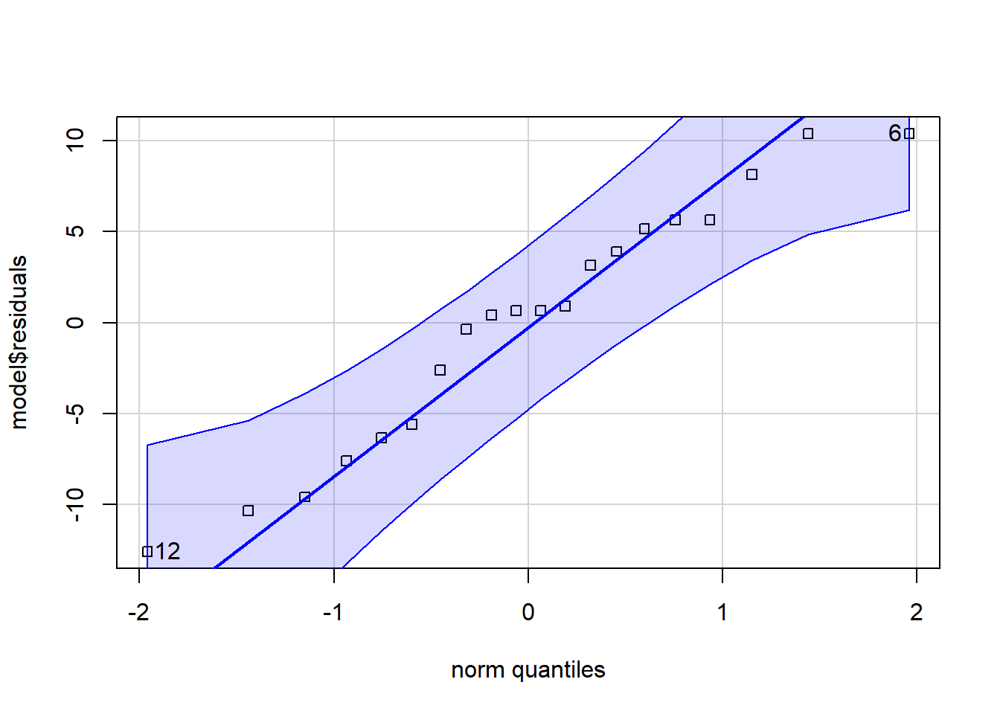

```
[1] 12  6
```

```r
hist(model$residuals,breaks=10,xlim=c(-11,11))
```


```r
# This appears okay!

# Let's do the next example 
# install.packages('datarium')                         
data("marketing", package = "datarium")

# lm( sales~   , data= marketing)
full_model<- lm(sales ~ youtube+facebook+newspaper, data = marketing)
summary(full_model)
```

```

Call:
lm(formula = sales ~ youtube + facebook + newspaper, data = marketing)

Residuals:
     Min       1Q   Median       3Q      Max 
-10.5932  -1.0690   0.2902   1.4272   3.3951 

Coefficients:
             Estimate Std. Error t value Pr(>|t|)    
(Intercept)  3.526667   0.374290   9.422   <2e-16 ***
youtube      0.045765   0.001395  32.809   <2e-16 ***
facebook     0.188530   0.008611  21.893   <2e-16 ***
newspaper   -0.001037   0.005871  -0.177     0.86    
---
Signif. codes:  0 '***' 0.001 '**' 0.01 '*' 0.05 '.' 0.1 ' ' 1

Residual standard error: 2.023 on 196 degrees of freedom
Multiple R-squared:  0.8972,    Adjusted R-squared:  0.8956 
F-statistic: 570.3 on 3 and 196 DF,  p-value: < 2.2e-16
```

```r
# Not great. 
car::qqPlot(full_model$residuals,pch=22)
```

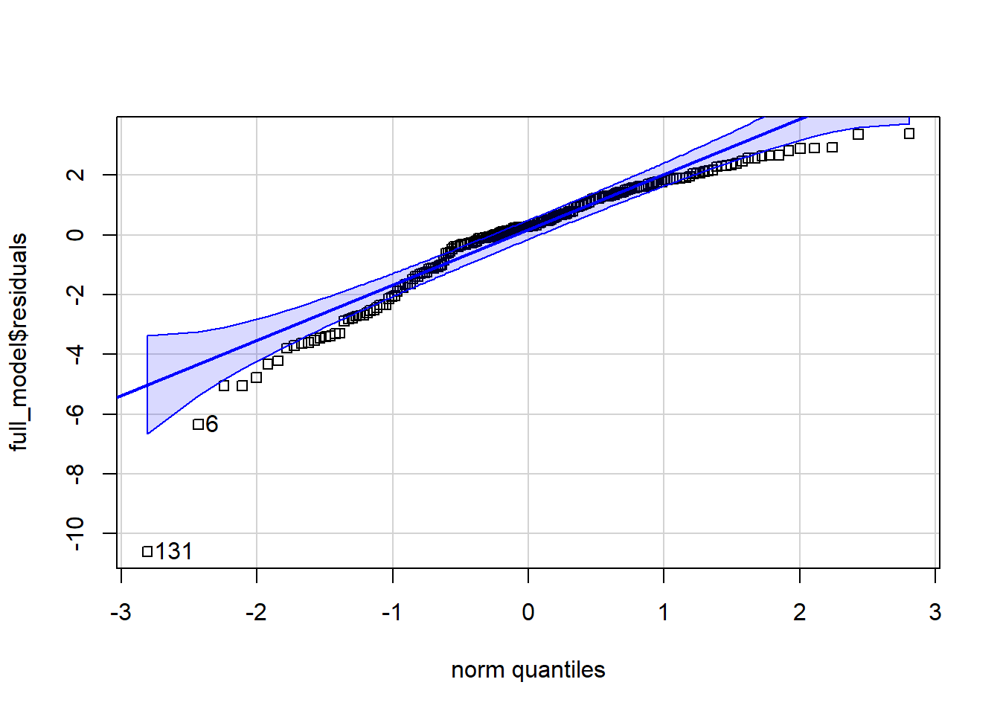

```
[1] 131   6
```

```r
hist(full_model$residuals,breaks=10,xlim=c(-11,11))
```

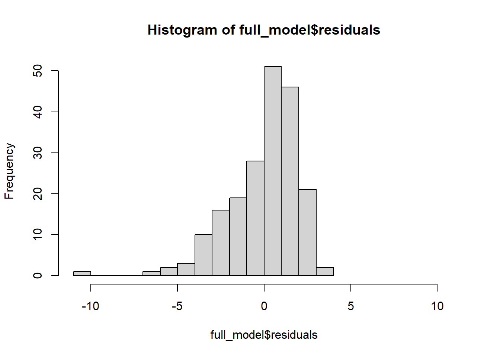

### 3.4.2 Checking the other assumptions

To check the remaining assumptions (constant variance, independence of residuals, zero mean and linear relationship), we can use some other diagnostic plots.

One plot is that of the fitted values \(\hat Y\) (\(x\)-axis) against the residuals \(\hat\epsilon\) (\(y\)-axis). If the error depends on \(\hat y\), then the identically distributed assumption on the errors is probably not valid. If the assumptions are valid, we should observe on the plots that at all levels of the response, the mean of the residuals is 0 and the variance remains the same. Thus, we should see a horizontal band centered at 0 containing the observations.

This appears to be the case in the body fat example:

```r
plot(model$fitted.values,model$residuals,pch=22,bg=1)
```

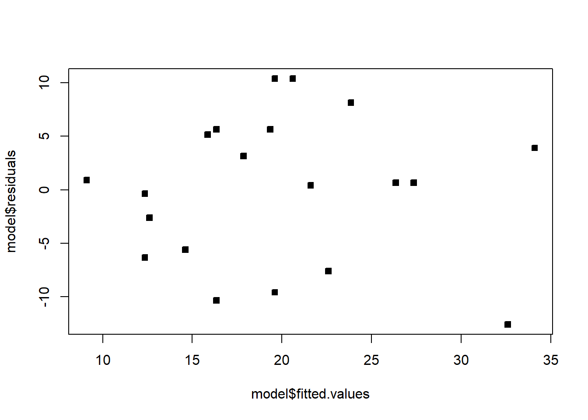

Observe that in the marketing example, the residuals admit a pattern. This usually indicates either a non-linear relationship with the covariates, or an important covariate is missing. In this case, we would say the assumption of identically distributed errors is violated.

```r
plot(full_model$fitted.values,full_model$residuals,pch=22,bg=1)
```


Plotting the residuals against the covariates can reveal dependence between the errors. For instance, if time is a covariate, you can plot the residuals over time to see if they have any relationship with time. If there appears to be dependence among the residuals, then the assumptions of the model are violated. That is, in these plots we should also see a horizontal band centered at 0 containing the observations. If not, then the residuals have a relationship with the given covariate.

Be VERY careful about the scale of your plot, as it can affect your interpretation. Zooming out or in too much can make everything look fine. In addition, the \(y\)-axis not being centered at 0 can cause you to misinterpret the plot.

```r
plot(marketing$youtube,full_model$residuals,pch=22,bg=1)
```

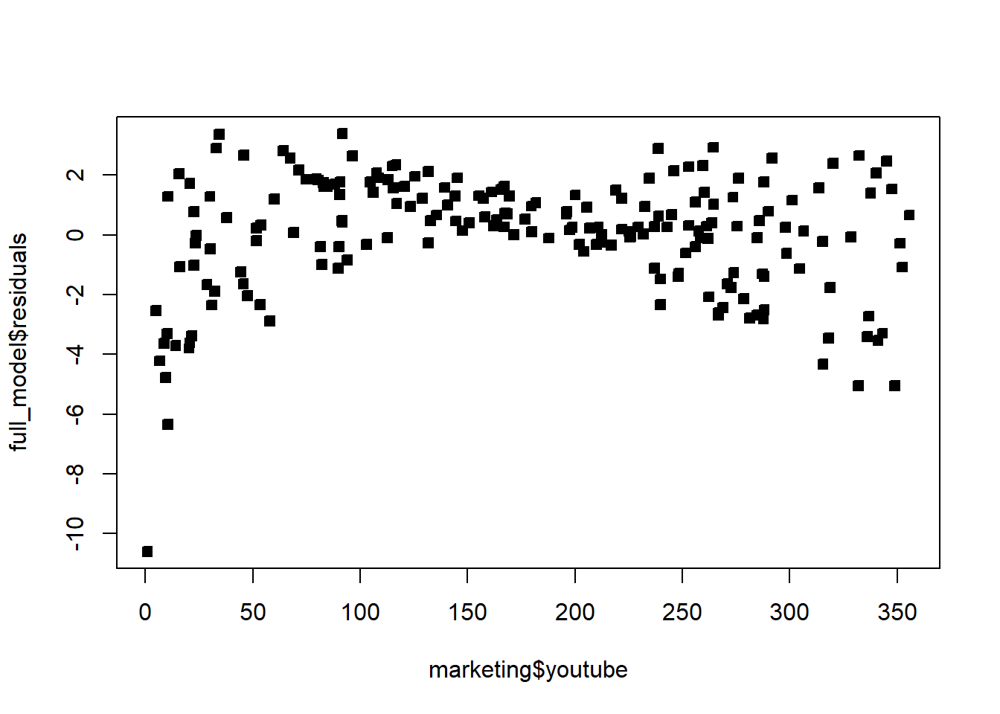

```r
plot(marketing$facebook,full_model$residuals,pch=22,bg=1)
```

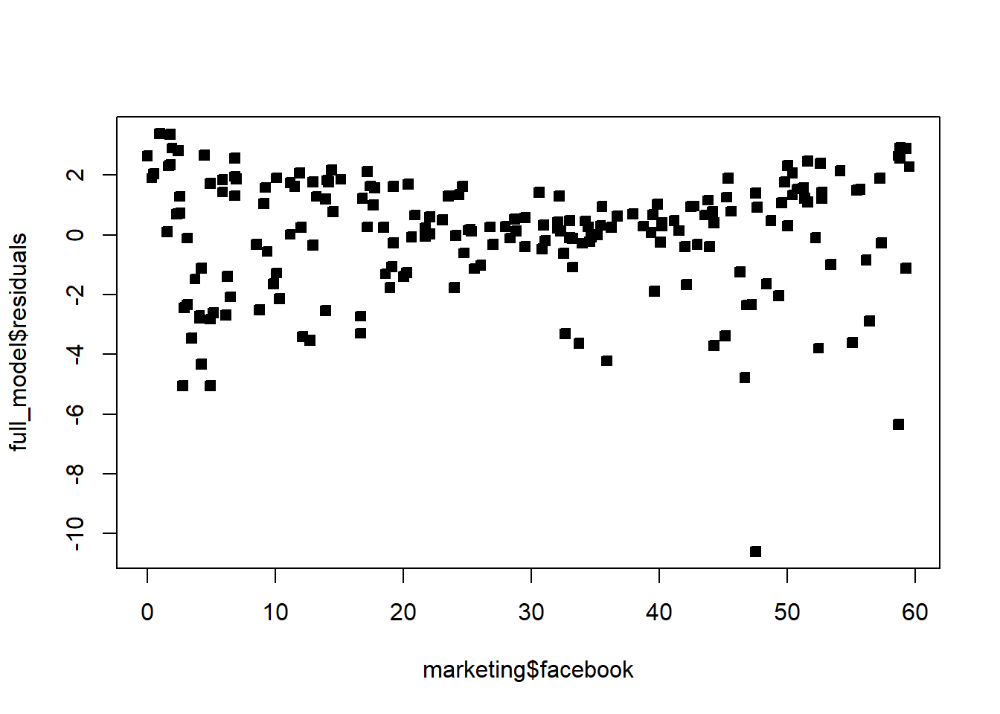

```r
plot(marketing$newspaper,full_model$residuals,pch=22,bg=1)
```

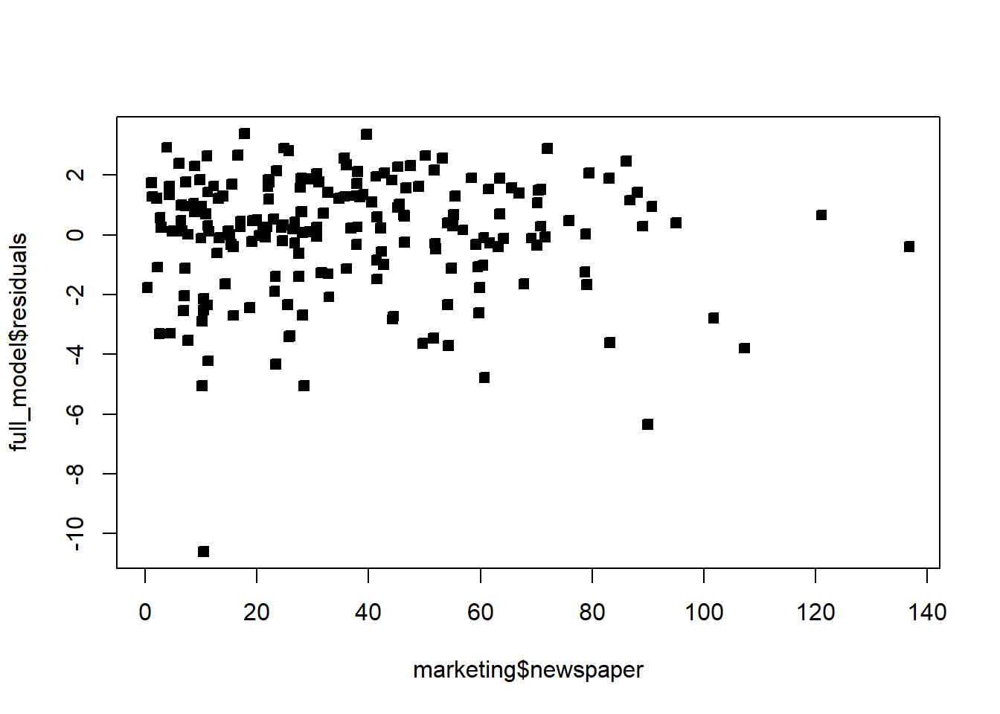

```r
plot(marketing$youtube,full_model$residuals,pch=22,bg=1,ylim=c(-10,10))
```

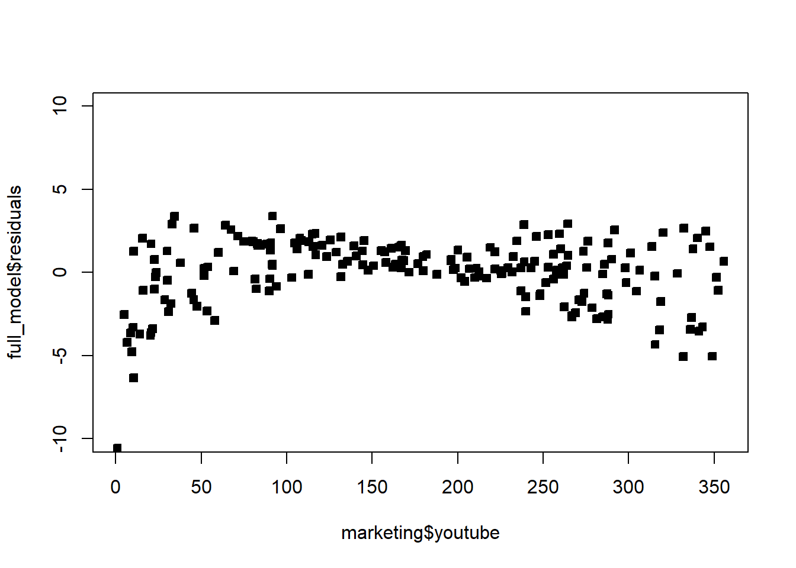

```r
plot(marketing$facebook,full_model$residuals,pch=22,bg=1,ylim=c(-10,10))
```

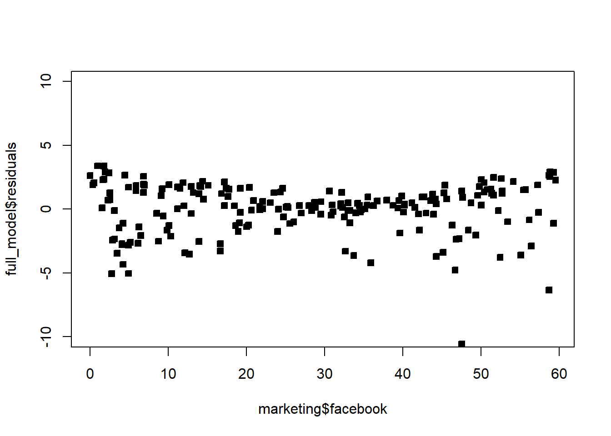

```r
plot(marketing$newspaper,full_model$residuals,pch=22,bg=1,ylim=c(-10,10))
```

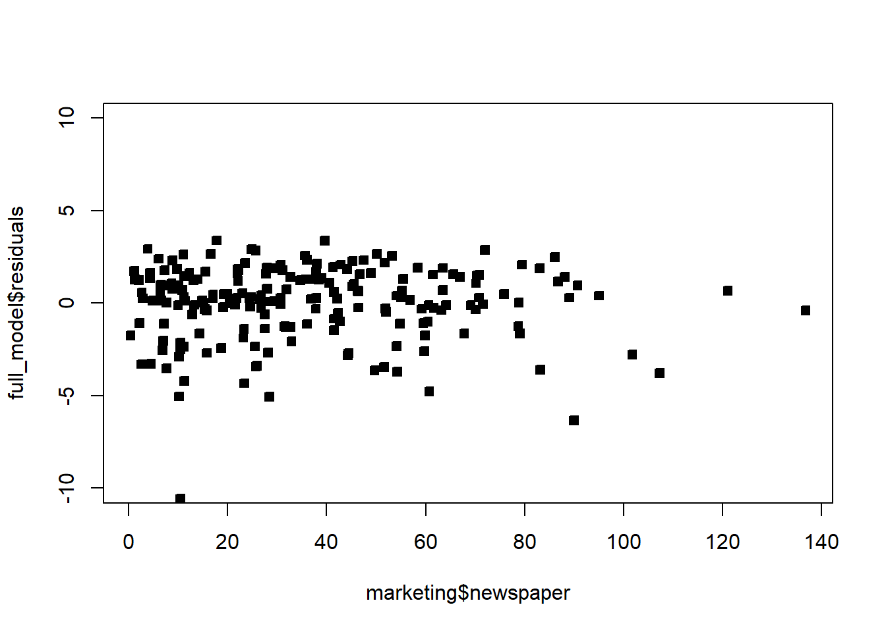

Notice how the newspaper plot changes with the new axis limits. It appears that the variance of the error is changing with the value of the Facebook and Youtube budgets.

Another plot is that of the fitted values against the response. This gives an idea of the overall fit of the model. We should observe the points scatters around the line \(y=x\).

```r
plot(full_model$fitted.values,marketing$sales,pch=22,bg=1)
abline(0,1)
```


Notice that the line is slightly curved above the line at the ends. This means that at high and low values, the actual sales are empirically greater than as predicted by the model. Let’s plot the actual data.

```r
plot(marketing,pch=22,bg=1)
```

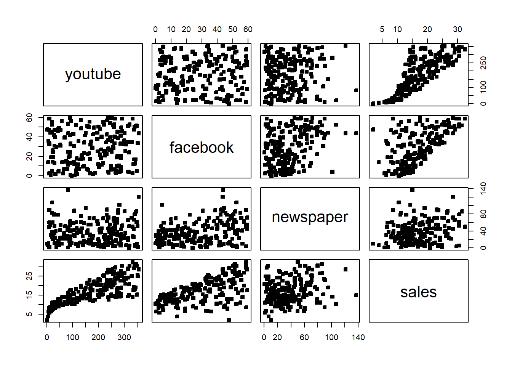

In this case, Youtube and Facebook spending seems to have a nonlinear relationship with sales. We will see how to remedy this in later chapters.

As a final note, observe that we can put the `model` object in the `plot()` function to obtain the diagnostic plots.

```r
plot(full_model)
```

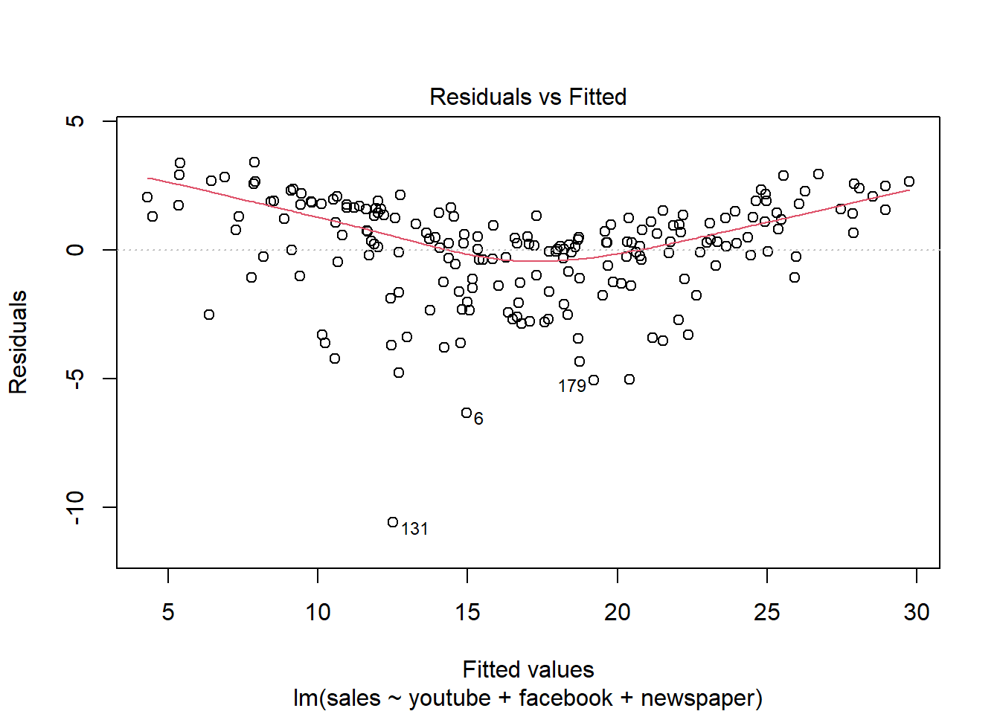

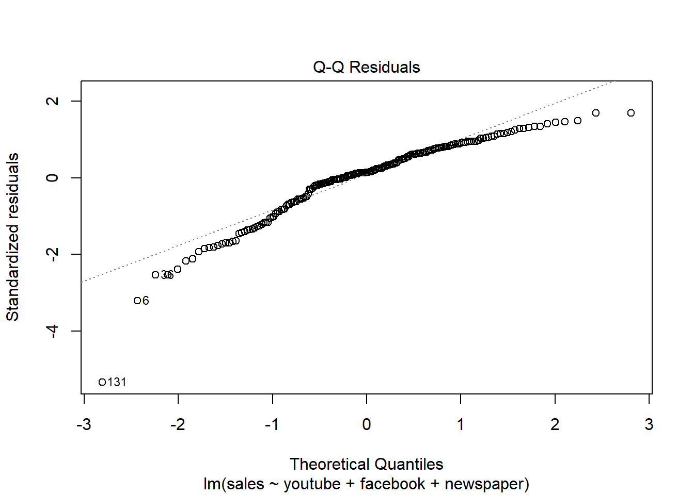

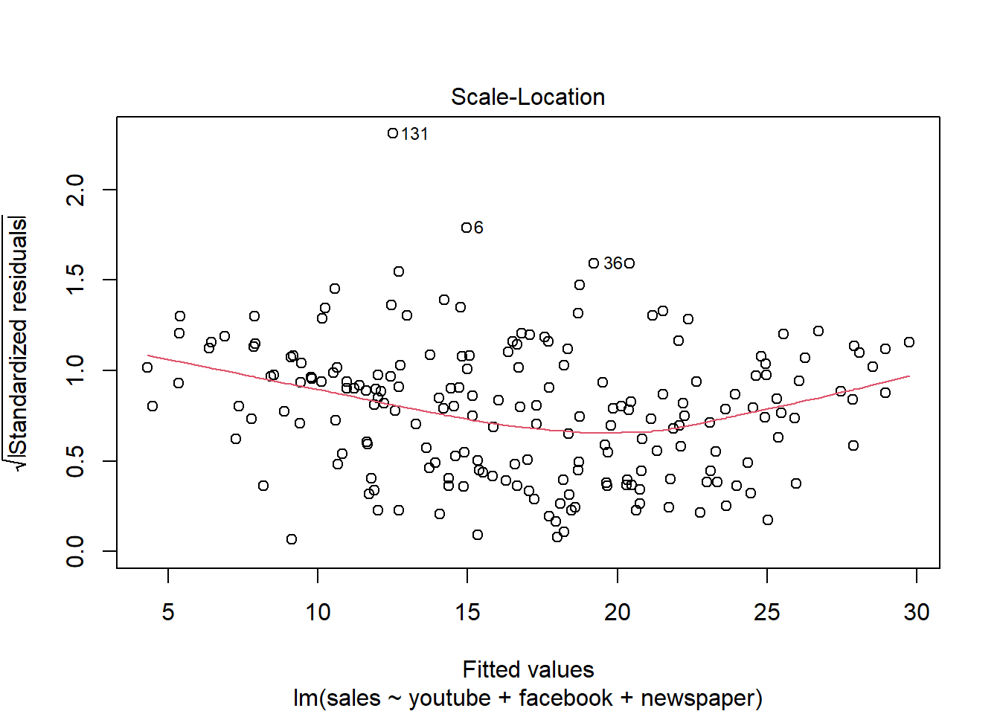

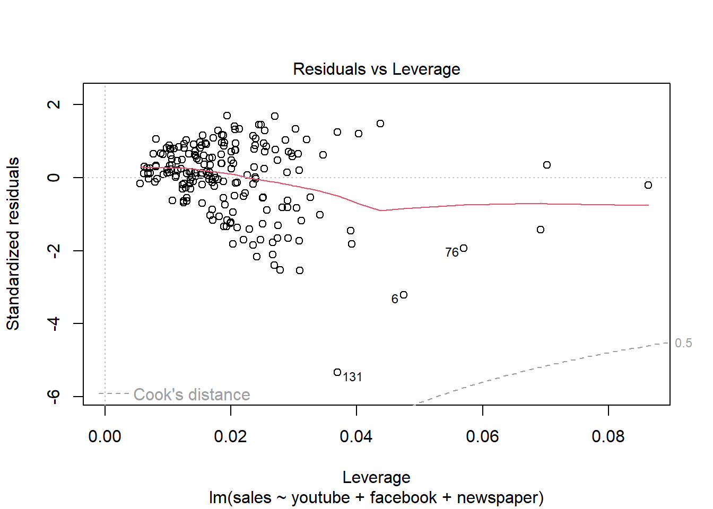

We will learn in later chapters how to check the assumptions more thoroughly and how to remedy violations of the assumptions.

### 3.4.3 Homework stop 5

Complete the assigned textbook problems for Chapter 4.

**Exercise 3.19** List the assumptions for the normal MLR model and the MLR model. Write down how you would check each assumption.

## 3.5 Simple linear regression

A special case of the multiple linear regression is **simple linear regression**. A simple linear regression model is a regression model with **one explanatory variable**: \(Y_i = \beta_0 + \beta_1 X_i + \epsilon_i\). \[
y = \left( \begin{array}{c} y_1 \\ \vdots \\ y_n \end{array} \right),
X = \left( \begin{array}{cc} 1 & x_1 \\ \vdots & \vdots \\ 1 & x_n \end{array} \right),
\beta = \left( \begin{array}{c} \beta_0 \\ \beta_1 \end{array} \right),
\epsilon =  \left( \begin{array}{c} \epsilon_1 \\ \vdots \\ \epsilon_n
\end{array} \right).
\]

### 3.5.1 Estimated Coefficients

In this case, following some matrix manipulations (verify this for homework), we have \[
X^\top X = \left( \begin{array}{cc} n & \sum_{i=1}^nx_i \\ \sum_{i=1}^nx_i & \sum_{i=1}^nx_i^2 \end{array} \right),\
X^\top y = \left( \begin{array}{cc} \sum_{i=1}^ny_i \\ \sum_{i=1}^nx_i y_i \end{array} \right).
\] Now, recall if \[ A = \begin{bmatrix}
a & b \\
c & d
\end{bmatrix} \] then \[ A^{-1} = \frac{1}{ad - bc} \begin{bmatrix}
d & -b \\
-c & a
\end{bmatrix}. \]

From MATH 1131 (or simple algebraic manipulation), we know \[\begin{equation*}
    \sum_{i=1}^n(x_i - \bar{x})(y_i - \bar{y})  =  \sum_{i=1}^nx_i y_i - n\bar{x}\bar{y} =
\sum_{i=1}^nx_i y_i - n^{-1}\left( \sum_{i=1}^nx_i \right) \left( \sum_{i=1}^ny_i \right)
\end{equation*}\] \[\begin{equation*}
\sum_{i=1}^n(x_i - \bar{x})^2  =  \sum_{i=1}^nx_i^2 - n\bar{x}^2 =
\sum_{i=1}^nx_i^2 - n^{-1}\left( \sum_{i=1}^nx_i \right)^2.
\end{equation*}\] Therefore \[\begin{eqnarray*}
(X^\top X)^{-1} & = & \frac{1}{n \sum_{i=1}^nx_i^2 - (\sum_{i=1}^nx_i)^2}
\left( \begin{array}{cc} \sum_{i=1}^nx_i^2 & - \sum_{i=1}^nx_i \\ - \sum_{i=1}^nx_i & n \end{array} \right) \\
& = & \frac{1}{n \sum_{i=1}^n(x_i - \bar{x})^2}
\left( \begin{array}{cc} \sum_{i=1}^nx_i^2 & - \sum_{i=1}^nx_i \\ - \sum_{i=1}^nx_i & n \end{array} \right).
\end{eqnarray*}\]

To summarize: \[\begin{align*}
X^\top X &=  \begin{bmatrix} n & \sum_{i=1}^nx_i \\ \sum_{i=1}^nx_i & \sum_{i=1}^nx_i^2 \end{bmatrix}\\
X^\top y&= \begin{bmatrix}\sum_{i=1}^ny_i \\ \sum_{i=1}^nx_i y_i \end{bmatrix}\\
(X^\top X)^{-1} & =  \frac{1}{n \sum_{i=1}^n(x_i - \bar{x})^2}
\begin{bmatrix} \sum_{i=1}^nx_i^2 & - \sum_{i=1}^nx_i \\ - \sum_{i=1}^nx_i & n\end{bmatrix}
\end{align*}\] Now, we have that \[\begin{eqnarray*}
\hat\beta & = & \left( \begin{array}{c} \hat\beta_0 \\ \hat\beta_1 \end{array} \right) =
(X^\top X)^{-1} X^\top y \\
& = & \frac{1}{n \sum_{i=1}^n(x_i - \bar{x})^2}
\left( \begin{array}{c} \sum_{i=1}^nx_i^2 \ \sum_{i=1}^ny_i - \sum_{i=1}^nx_i \ \sum_{i=1}^nx_i y_i \\
- \sum_{i=1}^nx_i \ \sum_{i=1}^ny_i + n \sum_{i=1}^nx_i y_i \end{array} \right).
\end{eqnarray*}\]

Now, \[\hat\beta_1=\frac{1}{n \sum_{i=1}^n(x_i - \bar{x})^2}
\left(- \sum_{i=1}^nx_i \ \sum_{i=1}^ny_i + n \sum_{i=1}^nx_i y_i\right).\]

**Exercise 3.20** Let’s show that \[
\hat\beta_1 = \frac{n \sum_{i=1}^nx_i y _i - \sum_{i=1}^nx_i \ \sum_{i=1}^ny_i}{n \sum_{i=1}^n(x_i - \bar{x})^2}
= \frac{\sum_{i=1}^n(x_i - \bar{x})(y_i - \bar{y})}{\sum_{i=1}^n(x_i - \bar{x})^2}.
\]

Does this look familiar? We see that, \[
\hat\beta_1 = \hat{{\textrm{cov}}}(X,Y)\frac{\hat\sigma_y}{\hat\sigma_x},
\] where \(\hat{{\textrm{cov}}}(X,Y)\) is the estimated correlation between \(X\) and \(Y\). Let’s interpret this:

1. If \(\hat{{\textrm{cov}}}(X,Y)\approx 0\) then \(\hat\beta_1\approx 0\) - low correlation implies an estimated slope close to 0.
2. The estimated coefficient \(\hat\beta_1\) is the product of the estimated correlation between \(X\) and \(Y\) and the ratio of the estimated standard deviation of \(Y\) to that of \(X\).

Now, looking at the intercept term, we have \[\hat\beta_0=\frac{1}{n \sum_{i=1}^n(x_i - \bar{x})^2}
\left(\sum_{i=1}^nx_i^2 \ \sum_{i=1}^ny_i - \sum_{i=1}^nx_i \ \sum_{i=1}^nx_i y_i\right).\]

**Exercise 3.21** Show that \[\hat\beta_0=\bar y - \hat\beta_1\bar x.
\]

Observe that the intercept is the mean of \(Y\) minus the mean of \(X\) times the estimated slope. In essence, it tells us that the intercept \((\hat{\beta}_0)\) represents the value of \((X)\) when \((X)\) is at its mean value (\((\bar{X})\)) and that \((\bar{X})\) is adjusted by subtracting the contribution of \((\hat{\beta}_1 \bar{X})\).

This adjustment ensures that the regression line passes through the point \(((\bar{X}, \bar{X}))\), which is the point of averages for the data.

### 3.5.2 Inference in SLR

We can also simplify the values used for inference in the SLR model. Recall that \({\textrm{Var}}\left[\hat\beta\right] = (X^\top X)^{-1} \sigma^2\), and so we have \[\begin{eqnarray*}
{\textrm{Var}}\left[\hat\beta_0\right] & = & \frac{\sum_{i=1}^nx_i^2}{n \sum_{i=1}^n(x_i - \bar{x})^2} \sigma^2
= \frac{\sum_{i=1}^nx_i^2 - n \bar{x}^2 + n \bar{x}^2}{n \sum_{i=1}^n(x_i - \bar{x})^2} \sigma^2  \\
& = & \left[ \frac{1}{n} + \frac{\bar{x}^2}{\sum_{i=1}^n(x_i - \bar{x})^2} \right] \sigma^2  \\
{\textrm{Var}}\left[\hat\beta_1\right] & = & \frac{1}{\sum_{i=1}^n(x_i - \bar{x})^2} \sigma^2  \\
{\textrm{cov}}({\hat\beta_0, \hat\beta_1}) & = & - \frac{\bar{x}}{\sum_{i=1}^n(x_i - \bar{x})^2} \sigma^2.
\end{eqnarray*}\]

We know from previous sections that a \((1 - \alpha)100%\) confidence interval of \(\beta_i\), where \(i = 0, 1\), is \[
\hat\beta_i \pm t_{df_E, \alpha/2} \sqrt{\widehat{var}(\hat\beta_i)}.
\] Similarly, let \(\beta_i^0\) be a hypothesized value of \(\beta_i\), for \(i=0, 1\). If we want to test whether \(\beta_i=\beta_i^0\), then the observed test statistic is given by \[
\frac{\hat\beta_i - \beta_i^0}{\sqrt{\widehat{var}(\hat\beta_i)}},
\] and the corresponding \(p\)-value is obtained via the \(t_{dfE}\) distribution as usual.

Note
Similarly, inference for the mean response and predictions can be obtained. We can also simplify the \(ANOVA\) table, \(R^2\), etc. For instance, the \(R^2\) is the square of the sample correlation coefficient between \(X\) and \(Y\).

### 3.5.3 Inference for the correlation coefficient

If we are interested in doing a hypothesis test, or constructing confidence intervals for the correlation between two variables, say \(X\) and \(Y\), we can use the simple linear regression model.

We have already derived the relationship between the estimated correlation coefficient and the estimated slope of the simple linear regression model. More specifically, if the estimated correlation coefficient is 0, then the estimated slope of the simple linear regression is 0. One can show that the same relationship holds at the population level: \(\beta_1=\rho \sigma_y/\sigma_x\), where \(\rho={\textrm{corr}}\left[X,Y\right]\).

Now, suppose that we want to test if \(H_0: \rho =0\) versus \(H_a: \rho \neq 0\). Using the fact that \(\beta_1=\rho \sigma_y/\sigma_x\), the above test is equivalent to the statement \(H_0: \beta_1 = 0\) versus \(H_a: \beta_1 \neq 0\). Therefore, we can just test if the slope parameter in the model \(Y|X=\beta_0+\beta_1 X+\epsilon\) is 0.

Letting \(\hat\rho=\hat{{\textrm{corr}}}(X,Y)\) The observed test statistic is then: \[
\frac{\hat\beta_1}{\sqrt{\widehat{var}(\hat\beta_1)}} = \frac{\hat\rho \sqrt{n-2}}{\sqrt{1 - \hat\rho^2}},
\] and the corresponding \(p\)-value is obtained based on the \(t_{dfE}\) distribution.

However, when the hypothesized value for \(\rho\) is non-zero, the problem becomes very complicated. The exact distribution of \(\hat\rho\) is extremely difficult to obtain under the null hypothesis. The following procedure gives an approximation of the distribution of a function of \(\hat\rho\) under the null hypothesis. In particular, Fisher suggested the transformation for \(\rho \in (0, 1)\), \[
\theta = \frac{1}{2} \log \frac{1 + \rho}{1 - \rho}.
\] Then \[
\hat\theta = \frac{1}{2} \log \frac{1 + \hat\rho}{1 - \hat\rho},
\] is an estimate of \(\theta\), where \(\hat\theta\) is approximately distributed as normal with mean \(\theta\) and variance \(\frac{1}{n-3}\). Hence, an approximate \((1 - \alpha)100%\) confidence interval of \(\theta\) is \[
\hat\theta \pm z_{\alpha/2} \sqrt{\frac{1}{n-3}},
\] and the corresponding confidence interval of \(\rho\) can be obtained by the inverse transformation. Similarly, if the hypothesized value of \(\rho\) is \(\rho_0\), then the hypothesized value of \(\theta\) is \(\theta_0 = \frac{1}{2} \log \frac{1 + \rho_0}{1-\rho_0}\). The observed test statistic can be obtained and the corresponding \(p\)-value can be obtained based on the standard normal distribution.

**Example 3.10** In [Example 3.1](#exm-3-1-1) test if the correlation between body fat and weight is 0. Next, test if the correlation is greater than 1/2. Construct a 95% CI for \(\rho.\)

```r
############################ Exploratory
Weight=c(175 , 181 , 200 , 159 , 196 , 192 , 205 , 
         173 , 187 , 188 , 188 , 240 , 175 , 168 , 
         246 , 160 , 215 , 159 , 146 , 219 )
BodyFat =c(6 , 21 , 15 , 6 , 22 , 31 , 32 ,21 , 25 , 
           30 , 10 , 20 , 22 , 9 , 38 , 10 , 27 , 12 , 10 , 28 )

df=data.frame(cbind(Weight=Weight,BodyFat=BodyFat))

cor(df)
```

```
           Weight   BodyFat
Weight  1.0000000 0.6966328
BodyFat 0.6966328 1.0000000
```

```r
hist(df$Weight,freq=F)
```


```r
hist(df$BodyFat,freq=F)
```

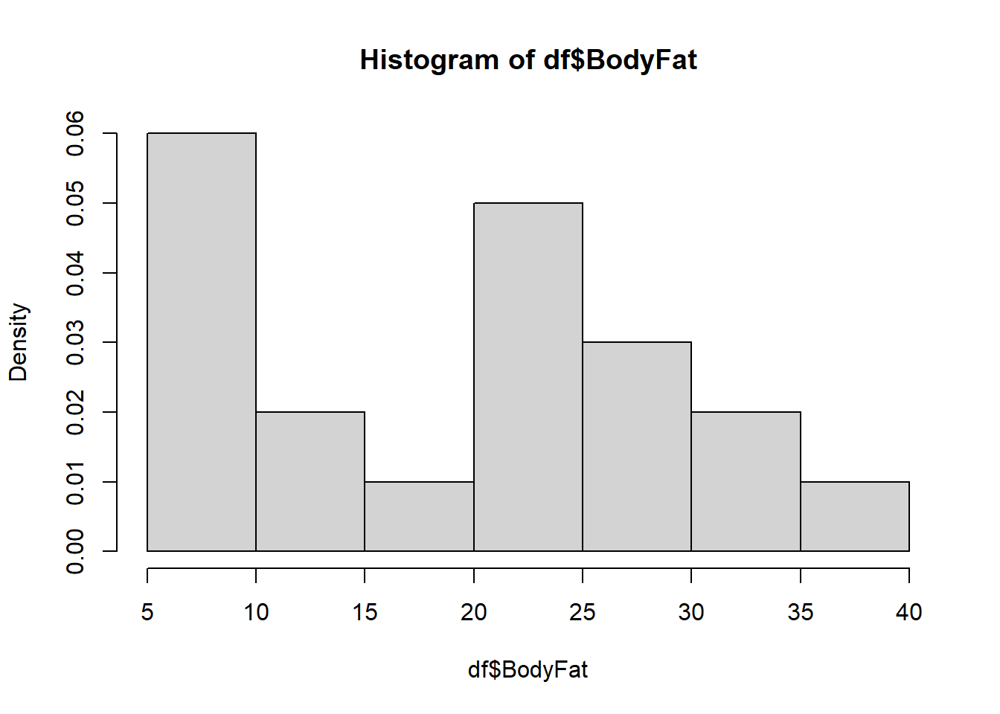

```r
summary(df)
```

```
     Weight         BodyFat     
 Min.   :146.0   Min.   : 6.00  
 1st Qu.:171.8   1st Qu.:10.00  
 Median :187.5   Median :21.00  
 Mean   :188.6   Mean   :19.75  
 3rd Qu.:201.2   3rd Qu.:27.25  
 Max.   :246.0   Max.   :38.00  
```

```r
cor(df)[1,2]
```

```
[1] 0.6966328
```

```r
X=cbind(rep(1,nrow(df)), df$Weight)
Y=df$BodyFat

beta_hat= solve(t(X)%*%X)%*%t(X)%*%Y
beta_hat
```

```
            [,1]
[1,] -27.3762623
[2,]   0.2498741
```

```r
model=lm(BodyFat~ Weight,df)
model
```

```

Call:
lm(formula = BodyFat ~ Weight, data = df)

Coefficients:
(Intercept)       Weight  
   -27.3763       0.2499  
```

```r
summary(model)
```

```

Call:
lm(formula = BodyFat ~ Weight, data = df)

Residuals:
     Min       1Q   Median       3Q      Max 
-12.5935  -5.7904   0.6536   5.2731  10.4004 

Coefficients:
             Estimate Std. Error t value Pr(>|t|)    
(Intercept) -27.37626   11.54743  -2.371 0.029119 *  
Weight        0.24987    0.06065   4.120 0.000643 ***
---
Signif. codes:  0 '***' 0.001 '**' 0.01 '*' 0.05 '.' 0.1 ' ' 1

Residual standard error: 7.049 on 18 degrees of freedom
Multiple R-squared:  0.4853,    Adjusted R-squared:  0.4567 
F-statistic: 16.97 on 1 and 18 DF,  p-value: 0.0006434
```

```r
cor(df)[1,2]^2
```

```
[1] 0.4852972
```

```r
cor(df)[1,2]
```

```
[1] 0.6966328
```

```r
a=function(x){
  (exp(2*x)-1)/(exp(2*x)+1)
}
a(1.36)
```

```
[1] 0.8763931
```

### 3.5.4 Homework stop 6

- Complete the Chapter 2 questions in the textbook.

**Exercise 3.22** For \[Y_i = \beta_0 + \beta_1 X_i + \epsilon_i\] \[
y = \left( \begin{array}{c} y_1 \\ \vdots \\ y_n \end{array} \right),
X = \left( \begin{array}{cc} 1 & x_1 \\ \vdots & \vdots \\ 1 & x_n \end{array} \right),
\beta = \left( \begin{array}{c} \beta_0 \\ \beta_1 \end{array} \right),
\epsilon =  \left( \begin{array}{c} \epsilon_1 \\ \vdots \\ \epsilon_n
\end{array} \right)
\]

- Compute \(\hat\beta\), \({\textrm{Var}}\left[\hat\beta_1\right]\), \({\textrm{Var}}\left[\hat\beta_0\right]\), \({\textrm{cov}}\left[(\right]\hat\beta_0,\hat\beta_1)\)
- Show \(\hat\beta_1=r\frac{\hat\sigma_y}{\hat\sigma_x}\)

## 3.6 Additional concepts & examples

Here we touch on a few important examples and notes about the MLR.

### 3.6.1 Beware scatter plots in MLR

Sometimes, scatter plots are misleading for determining the relationship between \(Y\) and a collection of \(p\) covariates. In the following example, it appears that \(X1\) and \(Y\) do not have a relationship, when in fact they do. Generally, this phenomena goes away with higher sample sizes.

```r
# Scatter diagram beware?
# x1=c(2,3,4,1,5,6,7,8)
# x2=c(2,3,4,1,5,6,7,8)
# x=c(2,3,4,1,5,6,7,8)

# x1=1:8
# x2=c(2,1:6,4)
# y=8-5*x1+12*x2+rnorm(8,0,2)

set.seed(445)

n=8
x1=rnorm(n,5,5)
x2=rnorm(n,3,5)
y=8-5*x1+12*x2+rnorm(n,0,2)

df=data.frame(cbind(y,x1,x2))

plot(df)
```


Next, we do an example from the textbook, which uses the NFL data. Specifically, we try to evaluate the relationship between number of wins and several explanatory variables.

**Example 3.11** Using the following NFL data, complete 3.1-3.4, 4.1 and 4.2 in the textbook.

```r
################## NFL example #################
# This gives you the data sets used in the textbook
# install.packages('MPV')
df=MPV::table.b1
# Note for more information, run ?MPV::table.b1

head(df)
```

```
   y   x1   x2   x3   x4 x5  x6   x7   x8   x9
1 10 2113 1985 38.9 64.7  4 868 59.7 2205 1917
2 11 2003 2855 38.8 61.3  3 615 55.0 2096 1575
3 11 2957 1737 40.1 60.0 14 914 65.6 1847 2175
4 13 2285 2905 41.6 45.3 -4 957 61.4 1903 2476
5 10 2971 1666 39.2 53.8 15 836 66.1 1457 1866
6 11 2309 2927 39.7 74.1  8 786 61.0 1848 2339
```

```r
# names too long
names(df)
```

```
 [1] "y"  "x1" "x2" "x3" "x4" "x5" "x6" "x7" "x8" "x9"
```

```r
# rename to make it easier
names(df)=c("Wins","RushY","PassY","PuntA","FGP","TurnD","PenY","PerR","ORY","OPY")
names(df)
```

```
 [1] "Wins"  "RushY" "PassY" "PuntA" "FGP"   "TurnD" "PenY"  "PerR"  "ORY"  
[10] "OPY"  
```

```r
# Wins~ beta_1+beta_2Passing yrds+beta_3per_rush+beta_4ORY+epsilon
# summary(df)
# plot(df)
# run the model 
regression_model=lm(  Wins ~ PassY+PerR+ORY  ,data= df )
summary(regression_model)
```

```

Call:
lm(formula = Wins ~ PassY + PerR + ORY, data = df)

Residuals:
    Min      1Q  Median      3Q     Max 
-3.0370 -0.7129 -0.2043  1.1101  3.7049 

Coefficients:
             Estimate Std. Error t value Pr(>|t|)    
(Intercept) -1.808372   7.900859  -0.229 0.820899    
PassY        0.003598   0.000695   5.177 2.66e-05 ***
PerR         0.193960   0.088233   2.198 0.037815 *  
ORY         -0.004816   0.001277  -3.771 0.000938 ***
---
Signif. codes:  0 '***' 0.001 '**' 0.01 '*' 0.05 '.' 0.1 ' ' 1

Residual standard error: 1.706 on 24 degrees of freedom
Multiple R-squared:  0.7863,    Adjusted R-squared:  0.7596 
F-statistic: 29.44 on 3 and 24 DF,  p-value: 3.273e-08
```

```r
# model=lm(Wins~PassY+PerR+ORY,data=df)
# get the confidence intervals. 
confint(regression_model)
```

```
                    2.5 %       97.5 %
(Intercept) -18.114944410 14.498200293
PassY         0.002163664  0.005032477
PerR          0.011855322  0.376065098
ORY          -0.007451027 -0.002179961
```

What conclusions can you make from this output? - All variables seem important! For isntance, we sdee that for every 1% increase in percentage rushing, there is a 0.193960 increase in number of wins, on average, holding passing yards and opponent rushing yards constant.

```r
#### CI
# mean response of z'\beta , z=(2000,60,1900)'
new_data=data.frame(  matrix(c(2000,60,1900),ncol=3) )
names(new_data)
```

```
[1] "X1" "X2" "X3"
```

```r
names(new_data)=c( 'PassY','PerR','ORY' )

predict(regression_model, new_data  ,   interval = 'confidence')
```

```
       fit      lwr      upr
1 7.875942 7.072672 8.679213
```

```r
predict(regression_model, new_data  ,   interval = 'predict')
```

```
       fit      lwr     upr
1 7.875942 4.263986 11.4879
```

```r
## ANOVA 

regression_model_reduced=lm(  Wins ~ 1  ,data= df )
summary(regression_model_reduced)
```

```

Call:
lm(formula = Wins ~ 1, data = df)

Residuals:
    Min      1Q  Median      3Q     Max 
-6.9643 -2.9643 -0.4643  3.0357  6.0357 

Coefficients:
            Estimate Std. Error t value Pr(>|t|)    
(Intercept)   6.9643     0.6576   10.59 4.09e-11 ***
---
Signif. codes:  0 '***' 0.001 '**' 0.01 '*' 0.05 '.' 0.1 ' ' 1

Residual standard error: 3.48 on 27 degrees of freedom
```

```r
anova(regression_model_reduced,regression_model)
```

```
Analysis of Variance Table

Model 1: Wins ~ 1
Model 2: Wins ~ PassY + PerR + ORY
  Res.Df    RSS Df Sum of Sq      F    Pr(>F)    
1     27 326.96                                  
2     24  69.87  3    257.09 29.437 3.273e-08 ***
---
Signif. codes:  0 '***' 0.001 '**' 0.01 '*' 0.05 '.' 0.1 ' ' 1
```

```r
# subset test

regression_model_reduced=lm(  Wins ~ PassY ,data= df )
anova(regression_model_reduced,regression_model)
```

```
Analysis of Variance Table

Model 1: Wins ~ PassY
Model 2: Wins ~ PassY + PerR + ORY
  Res.Df    RSS Df Sum of Sq      F    Pr(>F)    
1     26 250.77                                  
2     24  69.87  2     180.9 31.069 2.189e-07 ***
---
Signif. codes:  0 '***' 0.001 '**' 0.01 '*' 0.05 '.' 0.1 ' ' 1
```

```r
# summary(df)

summary(regression_model)
```

```

Call:
lm(formula = Wins ~ PassY + PerR + ORY, data = df)

Residuals:
    Min      1Q  Median      3Q     Max 
-3.0370 -0.7129 -0.2043  1.1101  3.7049 

Coefficients:
             Estimate Std. Error t value Pr(>|t|)    
(Intercept) -1.808372   7.900859  -0.229 0.820899    
PassY        0.003598   0.000695   5.177 2.66e-05 ***
PerR         0.193960   0.088233   2.198 0.037815 *  
ORY         -0.004816   0.001277  -3.771 0.000938 ***
---
Signif. codes:  0 '***' 0.001 '**' 0.01 '*' 0.05 '.' 0.1 ' ' 1

Residual standard error: 1.706 on 24 degrees of freedom
Multiple R-squared:  0.7863,    Adjusted R-squared:  0.7596 
F-statistic: 29.44 on 3 and 24 DF,  p-value: 3.273e-08
```

```r
# anova(regression_model)
summ=summary(regression_model)
summ$r.squared
```

```
[1] 0.7863069
```

```r
summ$adj.r.squared
```

```
[1] 0.7595953
```

```r
regression_model2=lm(Wins~PassY+ORY,data=df)

SSER=sum(regression_model2$residuals*regression_model2$residuals); SSER
```

```
[1] 83.9382
```

```r
dfer=regression_model2$df.residual; dfer
```

```
[1] 25
```

```r
SSEC=sum(regression_model$residuals*regression_model$residuals); SSEC
```

```
[1] 69.87
```

```r
dfeC=regression_model$df.residual; dfeC
```

```
[1] 24
```

```r
SSdrop=SSER-SSEC; SSdrop
```

```
[1] 14.06819
```

```r
dfdrop=dfer-dfeC

MSdrop=SSdrop/dfdrop; MSdrop
```

```
[1] 14.06819
```

```r
R_prp=SSdrop/SSER; R_prp
```

```
[1] 0.1676018
```

```r
MSdrop
```

```
[1] 14.06819
```

```r
1-pf(MSdrop,dfdrop,dfeC)
```

```
[1] 0.000986662
```

```r
cor(regression_model$fitted.values , df$Wins)^2
```

```
[1] 0.7863069
```

```r
confint(regression_model2)
```

```
                   2.5 %       97.5 %
(Intercept)  9.321778092 20.103571885
PassY        0.001654121  0.004568143
ORY         -0.008797465 -0.004819085
```

```r
new_data=df[1,c(3,8,9)]
new_data[1,]=c(2300 , 56 , 2100)
predict(regression_model2,new_data,interval = 'confidence')
```

```
     fit      lwr      upr
1 7.5709 6.814662 8.327138
```

```r
#########  check the fit #######
MSE=summ$sigma^2
qqnorm(regression_model2$residuals/summ$sigma,pch=22,bg=1)
abline(0,1)
```

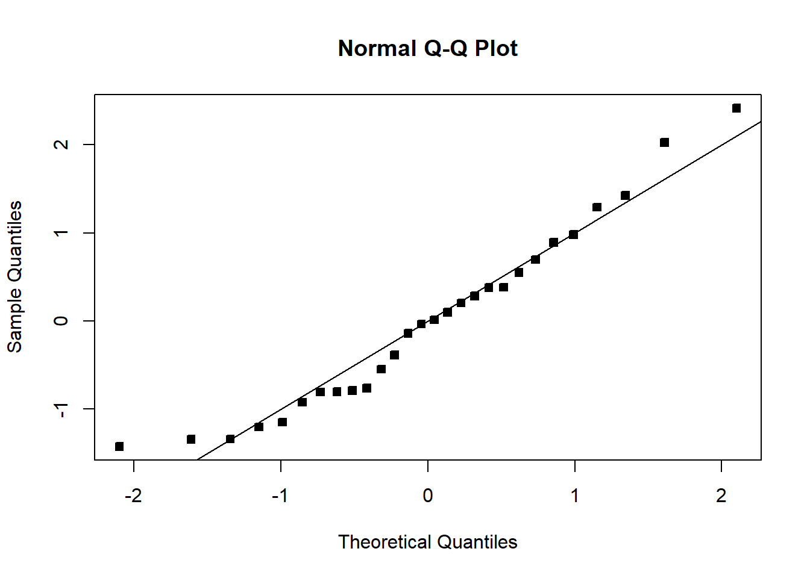

```r
hist(regression_model2$residuals,breaks=6)
```

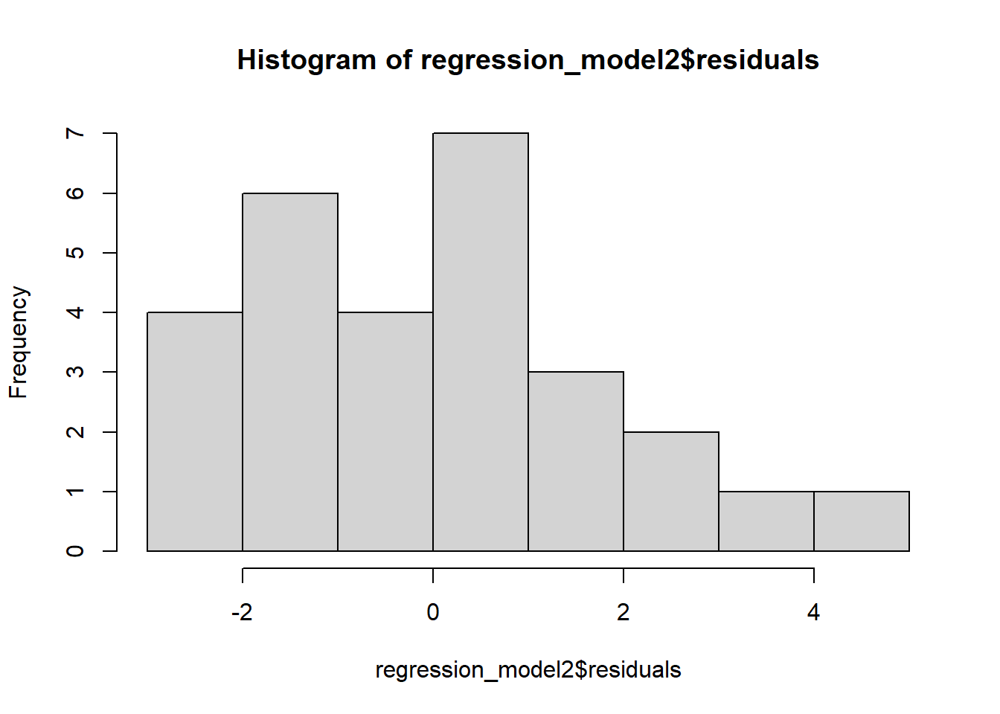

```r
plot(regression_model2$fitted.values,regression_model$residuals,pch=22,bg=1)
abline(h=0)
```


```r
n=nrow(df)
plot(1:n,regression_model2$residuals,pch=22,bg=1)
abline(h=0)

time=(1:n)
res=lm(regression_model2$residuals~time)
summary(res)
```

```

Call:
lm(formula = regression_model2$residuals ~ time)

Residuals:
     Min       1Q   Median       3Q      Max 
-2.36425 -1.04520 -0.07845  1.16457  2.40353 

Coefficients:
            Estimate Std. Error t value Pr(>|t|)    
(Intercept)   1.8479     0.5610   3.294 0.002852 ** 
time         -0.1274     0.0338  -3.771 0.000848 ***
---
Signif. codes:  0 '***' 0.001 '**' 0.01 '*' 0.05 '.' 0.1 ' ' 1

Residual standard error: 1.445 on 26 degrees of freedom
Multiple R-squared:  0.3535,    Adjusted R-squared:  0.3286 
F-statistic: 14.22 on 1 and 26 DF,  p-value: 0.0008481
```

```r
lines(time,res$fitted.values)
```

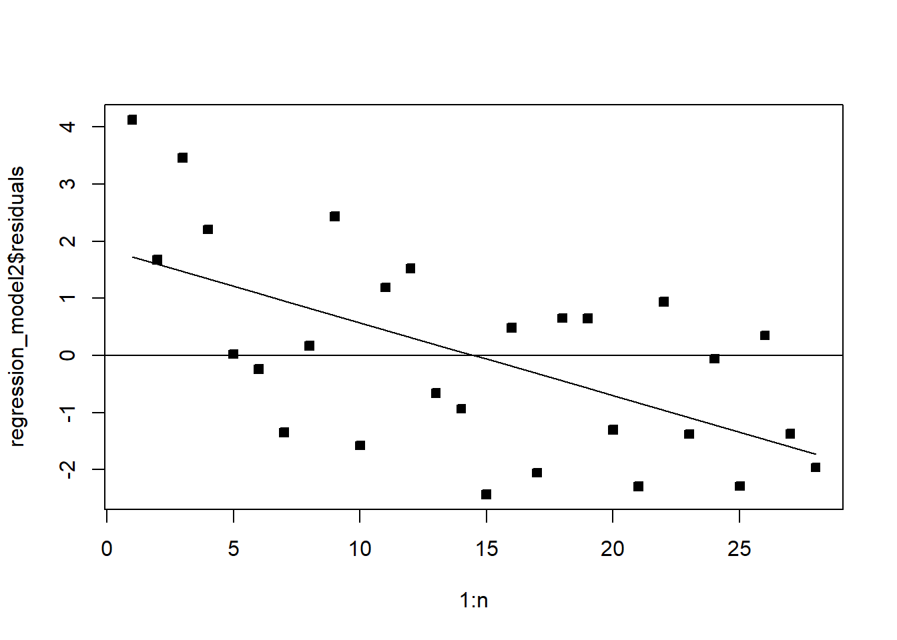

```r
regression_model3=lm(Wins~PerR+ORY,data=df)
summ3=summary(regression_model3)
summ3
```

```

Call:
lm(formula = Wins ~ PerR + ORY, data = df)

Residuals:
    Min      1Q  Median      3Q     Max 
-3.7985 -1.5166 -0.5792  1.9927  4.5248 

Coefficients:
             Estimate Std. Error t value Pr(>|t|)   
(Intercept) 17.944319   9.862484   1.819  0.08084 . 
PerR         0.048371   0.119219   0.406  0.68839   
ORY         -0.006537   0.001758  -3.719  0.00102 **
---
Signif. codes:  0 '***' 0.001 '**' 0.01 '*' 0.05 '.' 0.1 ' ' 1

Residual standard error: 2.432 on 25 degrees of freedom
Multiple R-squared:  0.5477,    Adjusted R-squared:  0.5115 
F-statistic: 15.13 on 2 and 25 DF,  p-value: 4.935e-05
```

```r
summ3$r.squared
```

```
[1] 0.5476628
```

```r
summ3$adj.r.squared
```

```
[1] 0.5114759
```

```r
confint(regression_model)
```

```
                    2.5 %       97.5 %
(Intercept) -18.114944410 14.498200293
PassY         0.002163664  0.005032477
PerR          0.011855322  0.376065098
ORY          -0.007451027 -0.002179961
```

```r
confint(regression_model3)
```

```
                  2.5 %       97.5 %
(Intercept) -2.36784828 38.256485319
PerR        -0.19716429  0.293906022
ORY         -0.01015637 -0.002916818
```

```r
new_data3=df[1,c(8,9)]
new_data3[1,]=c(56 , 2100)
predict(regression_model3,new_data3,interval = 'confidence')
```

```
       fit      lwr      upr
1 6.926243 5.828643 8.023842
```

```r
predict(regression_model2,new_data,interval = 'confidence')
```

```
     fit      lwr      upr
1 7.5709 6.814662 8.327138
```

Be careful about extrapolating beyond the region containing the original observations. It is very possible that a model that fits well in the region of the original data will perform poorly outside that region. It is easy to inadvertently extrapolate, since the levels of the regressors jointly define a region containing the data which is impossible to visualize in its entirety beyond 2 dimensions. Ideally, we want to make inferences which lie inside the convex hull of the regressors.

We can use the diagonal of the hat matrix \(H=X(X^\top X)^{-1}X^\top\). In general, the point that has the largest value of \(h_{ii}\), say \(h_{max}\), will lie on the boundary of the [convex hull](https://en.wikipedia.org/wiki/Convex_hull) in a region of the \(x\)-space where the density of the observations is relatively low. Points that lie in the set \(\{x^\top (X^\top X)^{-1} x\leq h_{max}\}\) enclose the convex hull. Thus, for a value we are interested in predicting, say \(y\), we can check if we are extrapolating with \(y^\top (X^\top X)^{-1} y\leq h_{max}\).

A serious problem that may dramatically impact the usefulness of a regression model is multicollinearity, or near - linear dependence among the regression variables. Multicollinearity implies near - linear dependence among the regressors. The regressors are the columns of the \(X\) matrix, so clearly an exact linear dependence would result in a singular \(X^\top X\). This will impact our ability to estimate \(\beta\).

We can check for this dependence with the **variance inflation factor** (VIF). The variance inflation factor can be written as \((1-R^2_j)^{-1}\), where \(R^2_j\) is the coefficient of determination obtained from regressing \(X_j\) on the other regressor variables. If VIF is large, say \(>3\), then you will likely need to make some changes to your regression model.

Sometimes, you may observe that regression coefficients have the a sign that is unexpected, or contradicts nature. This is likely due to one of the following:

- The range of some of the regressors is too small – if the range of some of the regressors is too small, then the variance of \(\hat\beta\) is high.
- Important regressors have not been included in the model.
- Multicollinearity is present.
- Computational errors have been made.

We close this Chapter with the following statement. Recall the modelling overview from Chapter 1:

- Posit the model: What is the linear regression model – what are all the assumptions of the linear regression model?
- Estimation: How can we estimate parameters of the linear regression model?
- Inference: How can we compute confidence intervals and run hypothesis tests associated with the linear regression model?
- Fit: Does our fitted line match up with the data? What about the normality assumption? Do the errors appear normal? Do the errors seem independent? Is the variance constant? How much variability is explained by our model?
- Prediction: How can we predict a new \(Y\)? What is the error of this prediction

If you have learned the concepts of this chapter, you should be able to complete all of these steps! In the following chapters, we will discuss different problems that can arise in regression modelling and how to remedy them.

### 3.6.2 Homework questions

**Exercise 3.23** Show \({\textrm{Var}}\left[\hat Y|X\right]=\sigma^2 H\).

**Exercise 3.24** Check for multicolinearity in our past examples.

**Exercise 3.25** Complete the problem sets from Chapter’s 2, 3 and 4!
