# Unit_3 - Residual analysis

# 4 Residual analysis

Recall that we want to study the normal MLR: \[Y|X=X\beta+\epsilon,\] where

- \(\forall i\in[n]\), \(\epsilon_i\sim \mathcal{N}(0,\sigma^2)\) and \(\epsilon_i\perp \epsilon_j\) for \(i\neq j,\ i,j\in [n]\).
- \(\beta\in \mathbb{R}^{p\times 1}\) is the unknown, population coefficient vector
- \(X\in \mathbb{R}^{n\times p}\) is a covariate matrix

We assume that: - The relationship is linear \(Y|X=X\beta+\epsilon,\) - \(\forall i\in[n]\), \(\epsilon_i\sim \mathcal{N}(0,\sigma^2)\). - \(\epsilon_i\perp \epsilon_j\) for \(i\neq j,\ i,j\in [n]\).

We have seen some methods for checking if these are appropriate, we will dive deeper now.

Recall that the residuals are defined as: \[\hat\epsilon=Y-\hat Y=Y-X\hat \beta.\]

Given that a residual may be viewed as the deviation between the data and the fit, it is also a measure of the variability in the response variable not explained by the regression model. It is also convenient to think of the residuals as the realized or observed values of the model errors. Thus, it’s reasonable to conclude that departures from the assumptions on the errors should show up in the residuals. Analysis of the residuals is an effective way to discover several types of model inadequacies.

## 4.1 Properties of residuals

The following are some properties of the residual vector. First, the sample mean of the residuals is zero: \(\sum_{i=1}^n\hat\epsilon_i/n=\hat\epsilon 1_n \cdot 1/n=0\). We also have that \({\textrm{E}}\left[\hat\epsilon\right]=0\). Next, the sample variance of the residual vector is approximately the MSE: \(\frac{1}{n-1}\sum_{i=1}^n\hat\epsilon_i^2=\frac{n-p}{n-1}MSE\). Lastly, unlike the random error \(\epsilon_i\), the residuals **are not** independent. Sometimes we say that they are “approximately independent” if \(p<<n\), which we will touch on later.

## 4.2 Types of residuals

We will refer to \(\hat\epsilon_i\) as simply the residuals, or ordinary residuals when we need to be extra clear.

The standardized residual is given by \[d_i=\hat\epsilon_i/\sqrt{MSE}.\] This is an approximate \(Z\)-score for the residuals, since the residuals have 0 mean, the \(MSE\) is approximately the variance of the random error and the residuals approximate the random error. We will generally prefer to use a different type of residual, which we now present.

We now introduce the hat matrix: \(H=X(X^\top X)^{-1}X^\top\). Note that \(H\) is symmetric and [idempotent](https://en.wikipedia.org/wiki/Idempotent_matrix). The hat matrix appears often in regression analysis, and you should remember this quantity. It is called the hat matrix because \(\hat Y=H Y\).

Note that the eigenvalues of \(H\), and any idempotent matrix \(A\) are either \(0\) or 1: \[ \lambda x=A x=A^2 x=A\lambda x=\lambda^2 x,\] which implies that \(\lambda\in\{0,1\}\).

**Exercise 4.1** Verify that \(H\) is symmetric and idempotent and that \(\hat Y=H Y\), where one recalls that a matrix \(A\) is idempotent if \(AA=A\).

Now, note that: \[\hat\epsilon=(I-H)Y=(I-H)\epsilon.\]

**Exercise 4.2** Verify that \(\hat\epsilon=(I-H)Y=(I-H)\epsilon.\).

Using this identity, we have that \({\textrm{Var}}\left[\hat\epsilon\right]=(I-H)\epsilon(I-H)^\top=(I-H)\sigma^2.\)

The fact that \(H\) is symmetric and idempotent implies that its diagonal elements are between 0 and 1. It follows that the elements on the diagonal of \((I-H)\) are also between 0 and 1. Therefore, the \(MSE\) overestimates the variance of the residuals: the variance of residual \(i\) is given by \((1-h_{ii})\sigma^2<\sigma^2\approx MSE\). Here, \(h_{ii}\) denotes the \(i\)th diagonal element of the matrix \(H\).

It can be shown that \(h_{ii}\) is a measure of how outlying \(x_i\) is, relative to the other observed covariate vectors. Therefore, \({\textrm{Var}}\left[\hat\epsilon_i\right]\) depends on how outlying \(x_i\) is. Covariate vectors that are central, relative to the other observed covariate vectors, have larger variance than residuals at more remote locations. What do you think about this?

Now, intuitively, some remote points in our data may differ from the population and severely impact our model. However, the variance of the ordinary residuals is lower at these points. Therefore, these impacts may be hard to detect from solely the ordinary residuals because the ordinary residuals of remote points will usually be smaller.

Therefore, we will call points that are outlying in the \(x\)-space **leverage points**. We will refer to **influence points** are not only remote in terms of the specific values for the regressors, but the observed response is not consistent with the values that would be predicted based on only the other data points.

In the example below, observe that the right-most point is both a leverage and influential point.

```r
########## 
# Simulate some data
set.seed(330)
x=c(rnorm(6),2.5)
y=x*2+3
y[7]=y[7]+7

# Plot the data and fitted lines
plot(x,y,pch=22,bg=1)
a=lm(y~x)
curve(a$coefficients[1]+x*a$coefficients[2],add=T,lwd=3)
curve(x*2+3,add=T,col=2,lwd=3)
```

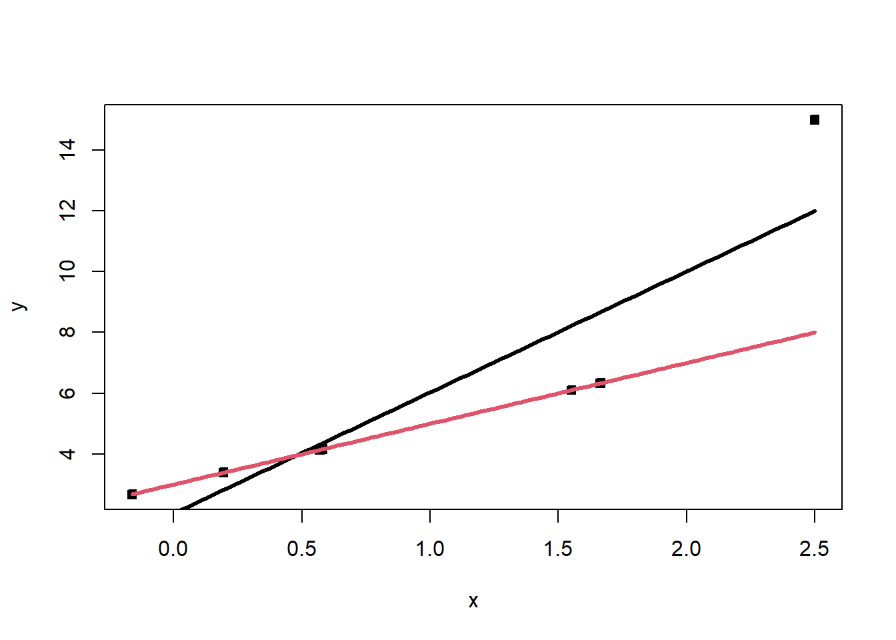

```r
a$coefficients
```

```
(Intercept)           x 
   2.048937    3.979977 
```

We now demonstrate mathematically why leverage points can be dangerous. Let \(\hat y^*_n\) be the estimate of \(Y_n\) based on the other data and let \(\delta_n=y_n-\hat y^*_n\). Note that one can show that \(\hat y_n=\hat Y^*_n+h_{nn}\delta_n\). Next, we know that if \(x_n\) is outlying, i.e., \(||x_n||\) is large, then \(h_{nn}\approx 1\). This implies that \(\hat y_n\approx y_n\), which means that the regression line is dragged to pass through \((x_n,y_n)\).

To detect these types of outlying points, it makes sense to then define the **studentized residuals**: \[r_i=\frac{\hat\epsilon_i}{\sqrt{MSE(1-h_{ii})}}.\]

The studentized residuals in the simple linear regression model reduce to \[
r_i=\frac{\hat\epsilon_i}{\sqrt{MSE}\left[1-\left(\frac{1}{n}+\frac{\left(X_i-\bar{X}\right)^2}{\sum (X-\bar X)^2}\right)\right]}.
\] Observe that as \(X_i\) grows large, we have that \(\frac{\left(X_i-\bar{X}\right)^2}{\sum (X-\bar X)^2}\to 1\), which implies that \(\left[1-\left(\frac{1}{n}+\frac{\left(X_i-\bar{X}\right)^2}{\sum (X-\bar X)^2}\right)\right]\to 0\) and \(r_i\to \infty\). On the other hand, as \(\hat\epsilon_i\) grows large, we have that \(r_i\) grows large. Therefore, the studentized residual will be large for observations with large ordinary residuals, and for leverage observations.

Since the studentized residuals are on the standard normal scale, \(|r_i|>2\) for small samples \(n<100\) or \(|r_i|>3\) for larger samples may signal an outlier.

Earlier, we presented \(\delta_i\), the difference between the response of the \(i\)th observation and the predicted response based on the observations with the \(i\)th points removed. These are known as the **PRESS residuals**. This seems hard computationally, but one can show that

\[
\delta_i=\frac{\hat\epsilon_i}{1-h_{ii}} .
\] Note that when \(h_{ii}\) is large, this indicates a highly influential point. Observe that a large PRESS residual \(\delta_i\), but small ordinary residual \(\hat\epsilon_i\), indicates that the model fit without \((X_i,Y_i)\) predicts \(Y_i\) poorly.

**Exercise 4.3** Show that standardizing the PRESS residual, that is, dividing the PRESS residual by its standard deviation, results in \(\hat\epsilon_i/\sqrt{\sigma^2(1-h_{ii})}\). Compare this to the studentized residual.

Lastly, if we believe that \((X_i,Y_i)\) is outlying, then we can also leave \((X_i,Y_i)\) out in the MSE calculation. This results in the **R-studentized residuals**: \[
\tilde r_i=\frac{\hat\epsilon_i}{\sqrt{\widetilde{MSE}_i(1-h_{ii})}},
\] where \(\widetilde{MSE}_i\) is the mean squared error computed from the regression model with \((X_i,Y_i)\) excluded: \[\widetilde{MSE}_{i}=\frac{(n-p+1) MSE-\hat \epsilon_i^2 /\left(1-h_{i i}\right)}{n-p}.\]

## 4.3 Revisiting checking model assumptions

Recall from [Checking model assumptions](Checking-model-assumptions) that we plot the residuals to check various assumptions. In this case, we can now use our upgraded residuals to make these plots. In general, any of the residuals that incorporate the values \(h_{ii}\) are acceptable. We will generally use the studentized residuals.

Recall that we may want to plot:

- QQplot of the studentized residuals
- Histogram of the studentized residuals
- Plot of studentized residuals against the fitted values
- Studentized residuals against the covariates
- Studentized residuals against covariates that are not currently in the model
- Studentized residuals against time in some contexts

### 4.3.1 Example

**Example 4.1** Here, this data contains delivery times, the number of products in the delivery and the distance of the delivery. Perform a residual analysis on the model which regresses delivery times against the number of products in the delivery and the distance of the delivery. Compute all the different types of residuals.

```r
########## Delivery Time

# Load and inspect the data 
data(delivery, package="robustbase")
df=delivery
n=nrow(df)
head(df)
```

```
  n.prod distance delTime
1      7      560   16.68
2      3      220   11.50
3      3      340   12.03
4      4       80   14.88
5      6      150   13.75
6      7      330   18.11
```

```r
# Fit the model 
model=lm(delTime~.,data=df)
s=summary(model); s
```

```

Call:
lm(formula = delTime ~ ., data = df)

Residuals:
    Min      1Q  Median      3Q     Max 
-5.7880 -0.6629  0.4364  1.1566  7.4197 

Coefficients:
            Estimate Std. Error t value Pr(>|t|)    
(Intercept) 2.341231   1.096730   2.135 0.044170 *  
n.prod      1.615907   0.170735   9.464 3.25e-09 ***
distance    0.014385   0.003613   3.981 0.000631 ***
---
Signif. codes:  0 '***' 0.001 '**' 0.01 '*' 0.05 '.' 0.1 ' ' 1

Residual standard error: 3.259 on 22 degrees of freedom
Multiple R-squared:  0.9596,    Adjusted R-squared:  0.9559 
F-statistic: 261.2 on 2 and 22 DF,  p-value: 4.687e-16
```

```r
# X matrix
X=model.matrix(model)

# Hat matrix
hat=X%*%solve(t(X)%*%X)%*%t(X)

# Compute h_ii
hii=diag(hat)
hii
```

```
         1          2          3          4          5          6          7 
0.10180178 0.07070164 0.09873476 0.08537479 0.07501050 0.04286693 0.08179867 
         8          9         10         11         12         13         14 
0.06372559 0.49829216 0.19629595 0.08613260 0.11365570 0.06112463 0.07824332 
        15         16         17         18         19         20         21 
0.04111077 0.16594043 0.05943202 0.09626046 0.09644857 0.10168486 0.16527689 
        22         23         24         25 
0.39157522 0.04126005 0.12060826 0.06664345 
```

```r
max(hii)
```

```
[1] 0.4982922
```

```r
# Notice 9 is large

###### ordinary residuals
regular_residuals=model$residuals
# or 

# standardized residuals
stand_res=model$residuals/s$sigma

# studentized residuals
student_res=rstudent(model)

#PRESS residuals
press=model$residuals/(1-hii)

# Get the MSE_is
MSE_i=((n-2)*(s$sigma)^2-regular_residuals^2/(1-hii))/(n-3)

#r studentized residuals
Rstudent_res=model$residuals/sqrt(MSE_i)

# Plot them all and compare
par(mfrow=c(2,3))
plot(regular_residuals,main="ordinary")
plot(stand_res,main="Standardized")
plot(student_res,main="Studentized")
plot(press,main="PRESS")
plot(Rstudent_res,main="student")

# Notice 9 is much more outlying in the last 3 graphs. 

# Reset plotting
par(mfrow=c(1,1))
```

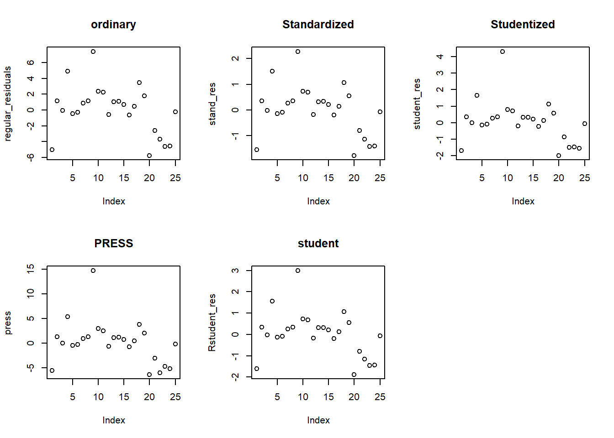

```r
# 9 is largest
which.max(student_res)
```

```
9 
9 
```

```r
# Notice the standardized is half as large as the studentized. 
student_res[9]
```

```
      9 
4.31078 
```

```r
stand_res[9]
```

```
       9 
2.276351 
```

```r
par(mfrow=c(2,2))

# Notice the difference !!!
qqnorm(regular_residuals,pch=22,bg=1,main="Ordinary")

qqnorm(student_res,pch=22,bg=1,main="Studentized")
abline(0,1)

# Compare all 

par(mfrow=c(2,2))
```

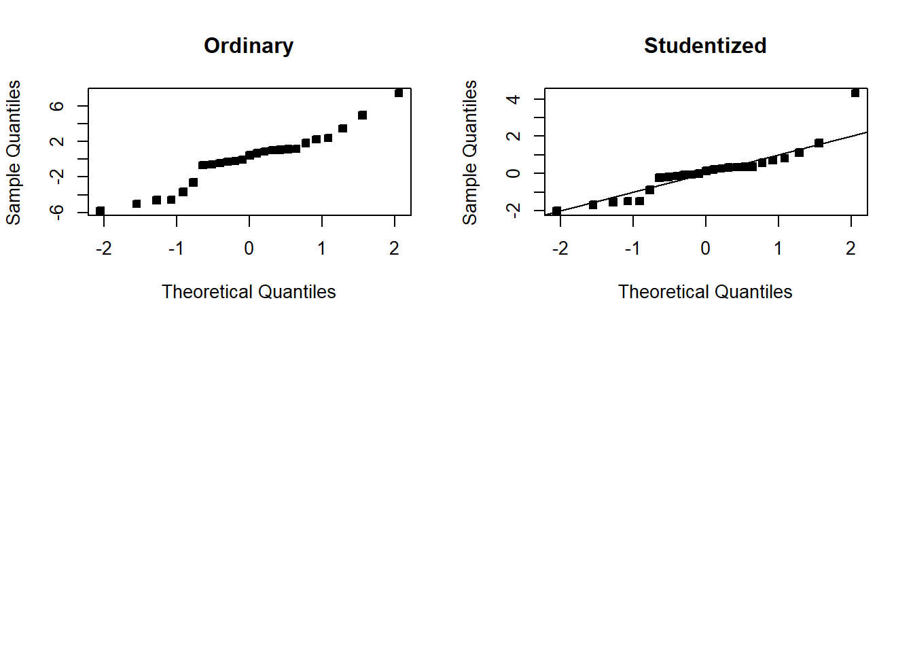

```r
qqnorm(student_res,pch=22,bg=1,ylim=c(-5,5),main="Studentized")
abline(0,1)
# hist(student_res)

qqnorm(Rstudent_res,pch=22,bg=1,ylim=c(-3,3),main="R Studentized")
qqline(Rstudent_res,pch=22,bg=1,ylim=c(-10,10))
# abline(0,1)

qqnorm(stand_res,pch=22,bg=1,ylim=c(-3,3),main="Standardized")
abline(0,1)

qqnorm(press,pch=22,bg=1,ylim=c(-10,10),main="PRESS")
qqline(press,pch=22,bg=1,ylim=c(-10,10))
#careful of the scale!

par(mfrow=c(3,2))
qqline(model$residuals,pch=22,bg=1,main="Ordinary")
```

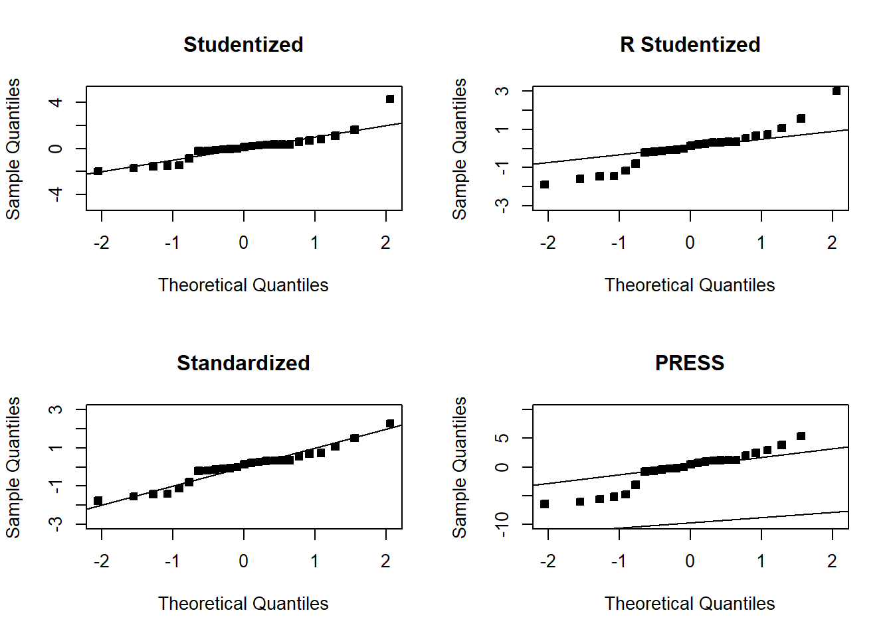

```r
par(mfrow=c(2,2))
qqnorm(student_res,pch=22,bg=1,main="Studentized")
abline(0,1)
qqnorm(Rstudent_res,pch=22,bg=1,main="R Studentized")
abline(0,1)
qqnorm(stand_res,pch=22,bg=1,main="Standardized")
abline(0,1)
qqnorm(press,pch=22,bg=1,main="PRESS")
abline(0,1)
```

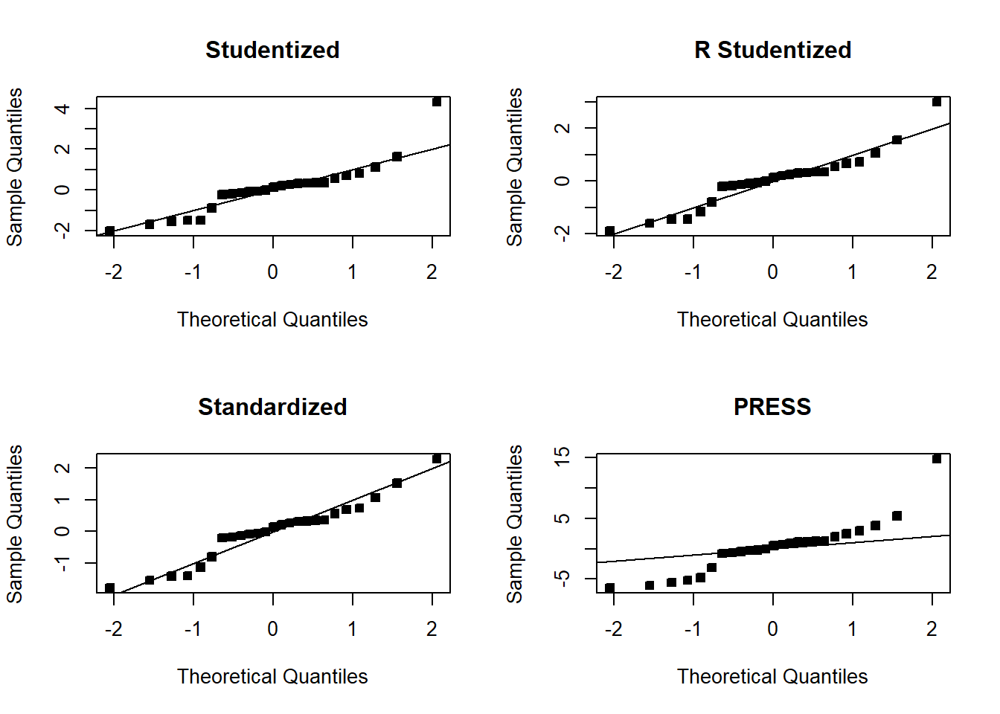

```r
# Now we plot the fitted values against the R studentized residuals
par(mfrow=c(1,1),pch=22)
plot(model$fitted.values,Rstudent_res,bg=1)
abline(h=0)
```

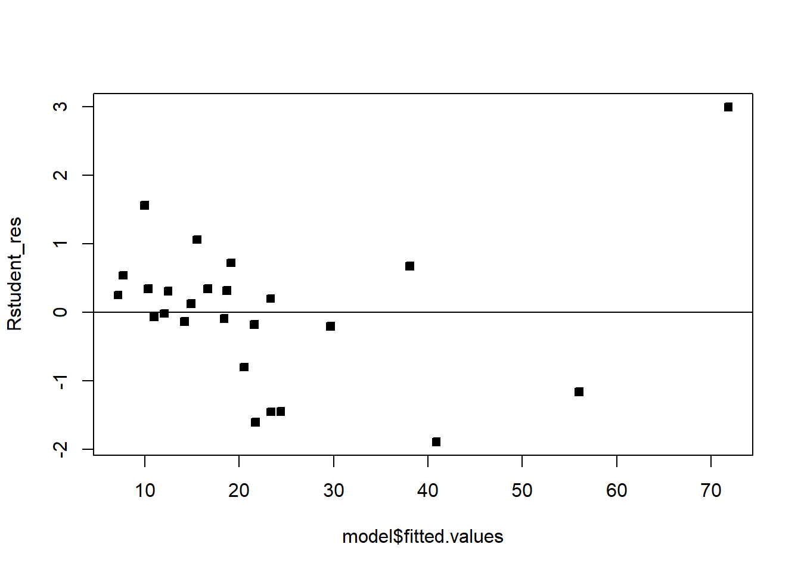

```r
# Now we plot the number of products against the R studentized residuals
# There is one moderately large delivery!
plot(df$n.prod,Rstudent_res,bg=1)
abline(h=0)
```

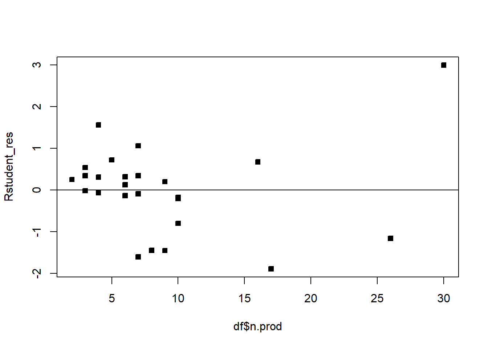

```r
# Care for the scale
plot(df$n.prod,Rstudent_res,bg=1,xlim=c(0,12))
abline(h=0)
```

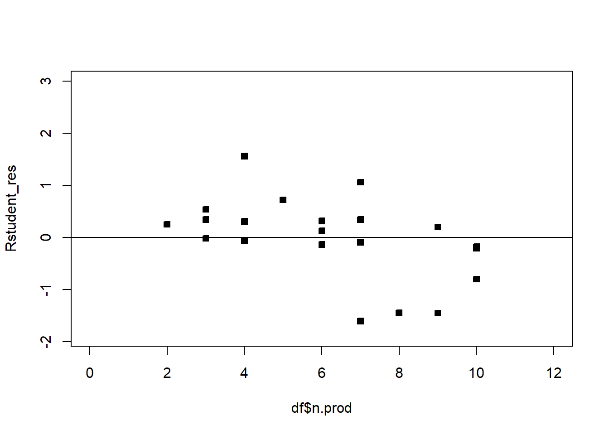

```r
# There is one very far delivery!
plot(df$distance,Rstudent_res,bg=1)
abline(h=0)
```

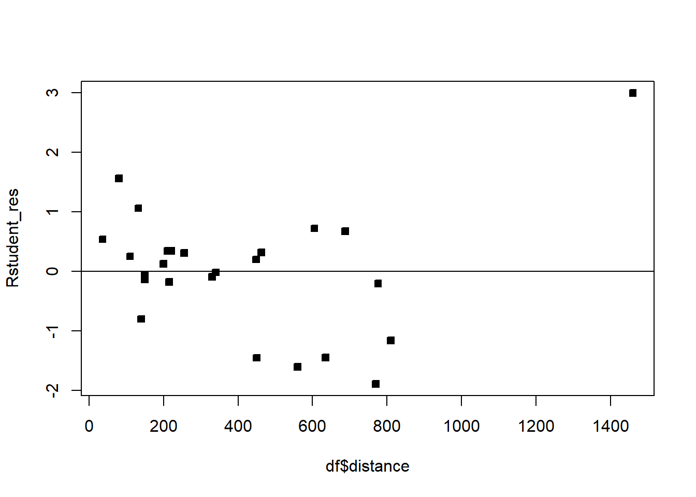

```r
# Care for the scale
plot(df$distance,Rstudent_res,bg=1,xlim=c(0,850))
abline(h=0)
```

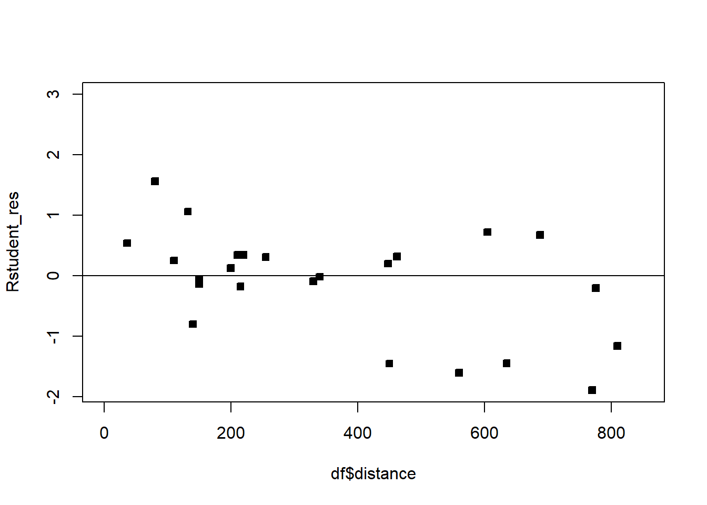

```r
# What happens to the model when we remove this outlying observation (the far distance delivery)
df2=df[-which.max(df$distance),]

# refit the model
model=lm(delTime~.,data=df2)
s=summary(model); s
```

```

Call:
lm(formula = delTime ~ ., data = df2)

Residuals:
    Min      1Q  Median      3Q     Max 
-4.0325 -1.2331  0.0199  1.4730  4.8167 

Coefficients:
            Estimate Std. Error t value Pr(>|t|)    
(Intercept) 4.447238   0.952469   4.669 0.000131 ***
n.prod      1.497691   0.130207  11.502 1.58e-10 ***
distance    0.010324   0.002854   3.618 0.001614 ** 
---
Signif. codes:  0 '***' 0.001 '**' 0.01 '*' 0.05 '.' 0.1 ' ' 1

Residual standard error: 2.43 on 21 degrees of freedom
Multiple R-squared:  0.9487,    Adjusted R-squared:  0.9438 
F-statistic: 194.2 on 2 and 21 DF,  p-value: 2.859e-14
```

```r
# X matrix
X=model.matrix(model)

# Hat matrix
hat=X%*%solve(t(X)%*%X)%*%t(X)

# Compute h_ii
hii=diag(hat)
hii
```

```
         1          2          3          4          5          6          7 
0.11083391 0.07741039 0.09998709 0.10097319 0.08066357 0.04290146 0.10024969 
         8         10         11         12         13         14         15 
0.06537738 0.20438000 0.14675966 0.11367920 0.06437975 0.08033747 0.04661503 
        16         17         18         19         20         21         22 
0.21115081 0.06254612 0.10128434 0.11992977 0.18537865 0.16642759 0.55671434 
        23         24         25 
0.04687996 0.13894064 0.07620000 
```

```r
max(hii)
```

```
[1] 0.5567143
```

```r
###### ordinary residuals
regular_residuals=model$residuals
# or 

# standardized residuals
stand_res=model$residuals/s$sigma

# studentized residuals
student_res=rstudent(model)

#PRESS residuals
press=model$residuals/(1-hii)

# Get the MSE_is
MSE_i=((n-2)*(s$sigma)^2-regular_residuals^2/(1-hii))/(n-3)

#r studentized residuals
Rstudent_res=model$residuals/sqrt(MSE_i)

# Plot them all and compare - much better
par(mfrow=c(2,3))
plot(regular_residuals,main="ordinary")
plot(stand_res,main="Standardized")
plot(student_res,main="Studentized")
plot(press,main="PRESS")
plot(Rstudent_res,main="student")

# Notice that these graphs are fine now... 
par(mfrow=c(1,1))
```

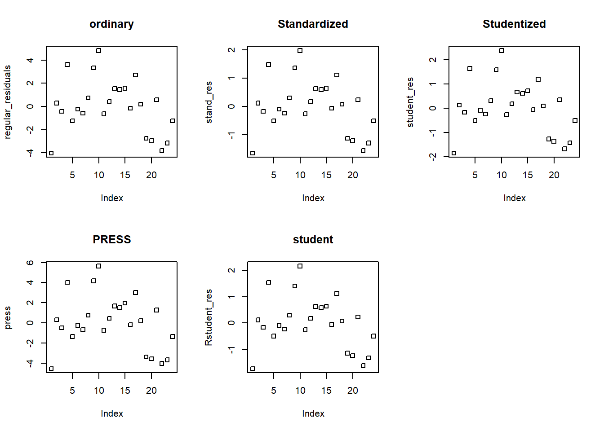

```r
qqnorm(student_res,pch=22,bg=1,main="Studentized")
abline(0,1)
```

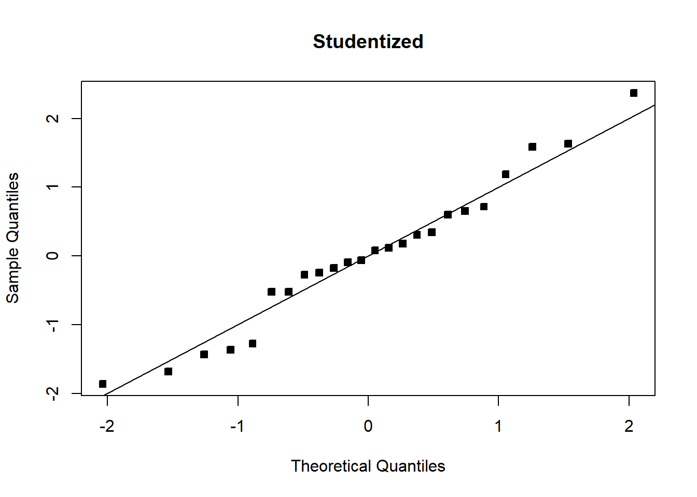

```r
# Now we plot the fitted values against the R studentized residuals
par(mfrow=c(1,1),pch=22)
plot(model$fitted.values,Rstudent_res,bg=1)
abline(h=0)
```

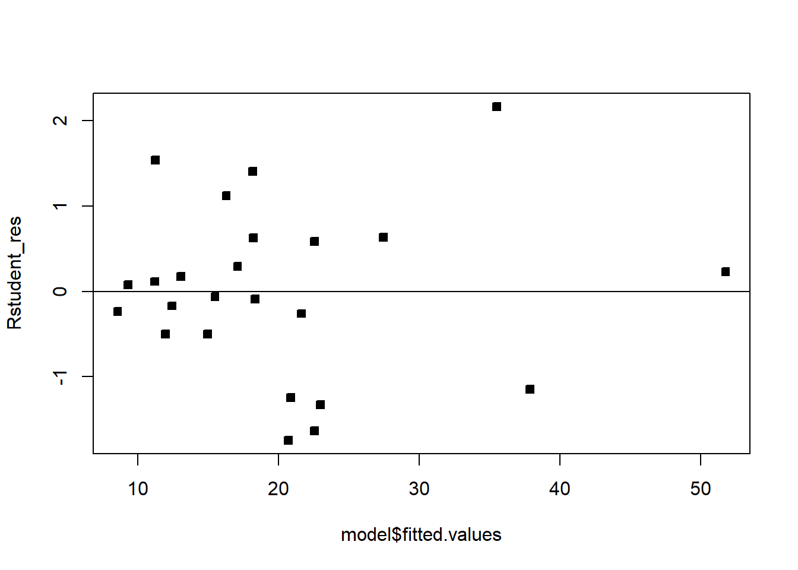

```r
# Now we plot the number of products against the R studentized residuals
plot(df2$n.prod,Rstudent_res,bg=1)
abline(h=0)
```

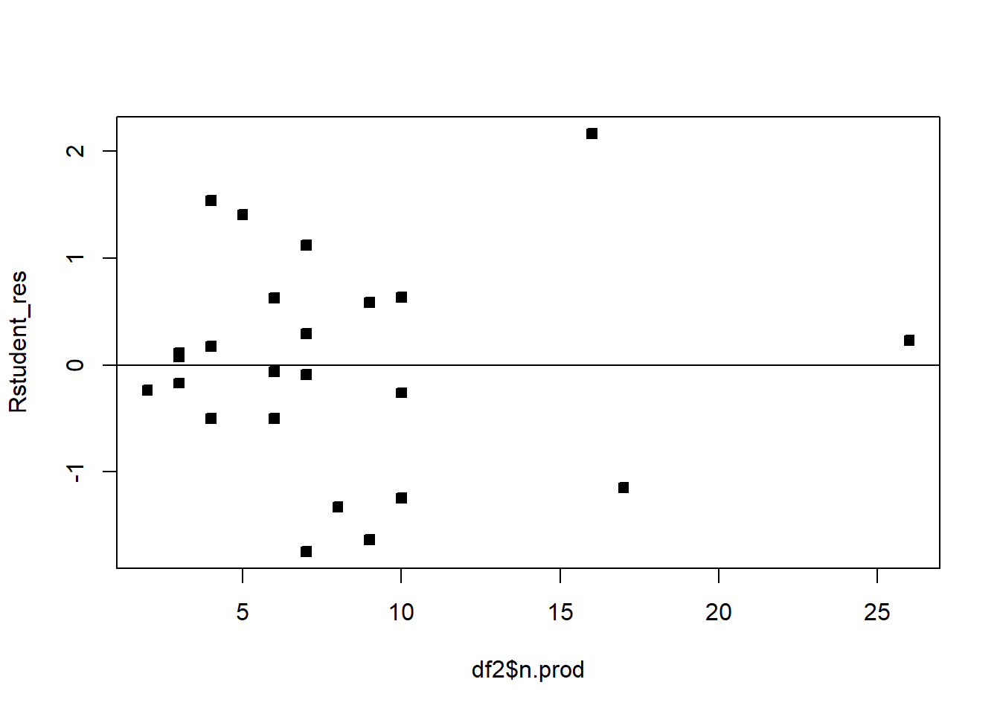

```r
# Care for the scale
plot(df2$n.prod,Rstudent_res,bg=1,xlim=c(0,12))
abline(h=0)
```

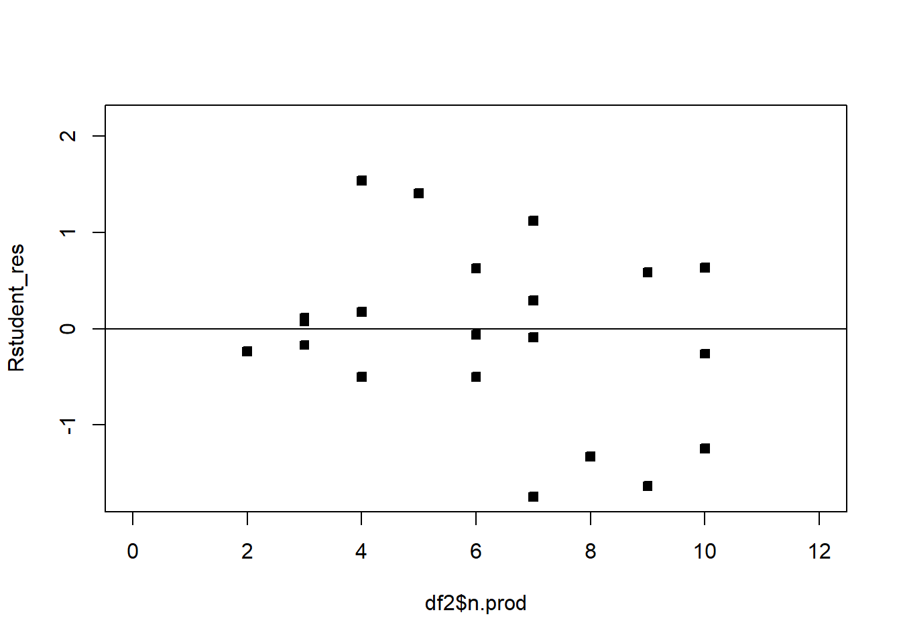

```r
plot(df2$distance,Rstudent_res,bg=1)
abline(h=0)
```

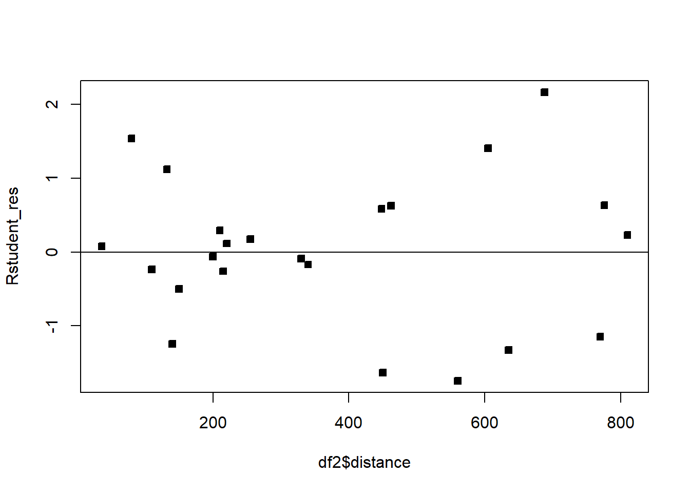

```r
# Care for the scale
plot(df2$distance,Rstudent_res,bg=1,xlim=c(0,850))
abline(h=0)
```

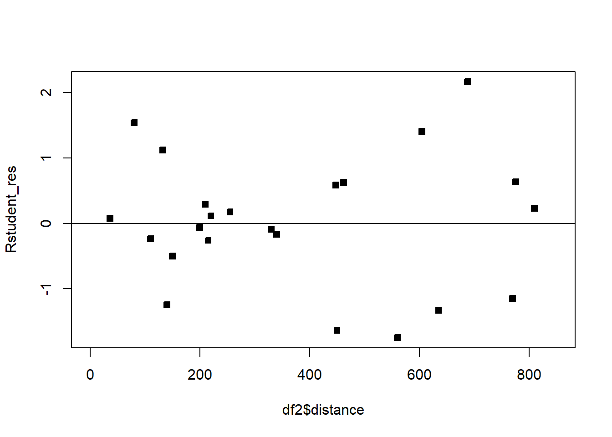

Now, we have introduced different types of residuals and the appropriate graphs to examine when checking for violations of the assumptions. When we observe violations of the assumptions - what do we do? That will be the topic of the next section.

Some of these remedies include: - Transformations of the response - Transformations of certain regressors - Robust methods/outlier removal - Inclusion of new regressors

## 4.4 Homework stop

Do the Chapter 4 questions from the textbook.

**Exercise 4.4** In the context of a regression model, do you think a point whose covariates are outlying is more problematic than a point whose response, given the covariates, is outlying?

**Exercise 4.5** Make a table describing the differences between each type of residual.

**Exercise 4.6** Perform a residual analysis on the marketing data from Example [Example 3.7](Unit_2.html#exm-3-4-5).

**Exercise 4.7** Perform a residual analysis on the data from Example [Example 3.8](Unit_2.html#exm-3-4-4).
