# Unit_4 - Transformations

# 5 Transformations

## 5.1 Variance-stabilizing transformations

Recall that we assume that \(\forall i\in[n]\), \(\epsilon_i\sim \mathcal{N}(0,\sigma^2)\). A common reason for a violation of this assumption is for \(Y\) to have a distribution in which the variance is related to its mean. For example, if the response \(Y\) is a Poisson random variable, i.e., \[Y|X\sim Pois(X\beta),\] then we have that \({\textrm{E}}\left[Y\right]=X\beta\), then \({\textrm{E}}\left[Y\right]={\textrm{Var}}\left[Y\right]=X\beta\). In this case, the simple linear regression assumptions are violated. In particular, the variance is not the same for each observation. Here, it happens that taking the response to be roughly \(\sqrt{Y}\) [fixes the problem](https://en.wikipedia.org/wiki/Anscombe_transform). That is, performing the regression analysis with \(\sqrt{Y}\) as the response variable instead of \(Y\), ensures that the regression assumptions are (approximately) satisfied. This example gives rise to the idea of **transformations**. If our data do not satisfy the assumptions for the MLR or the normal MLR, we might ask if there is some transformation of either the response, some of the covariates, or both that make the data suitable for a MLR analysis. Note that the assumptions are important. For instance, if the variance is not homogeneous, the OLS estimator will still be unbiased, but they will no longer have BLUE property. That means that some other estimator will work better for such data!

Which transformation should we choose? Sometimes, we can use prior experience or theoretical considerations to guide us in selecting an appropriate transformation. Other times, we must choose it empirically, i.e., based on the data. Often, the square root and the logarithm are popular choices. If you response is between 0 and 1, and the data appear to be “football shaped”, then you may like to take the \(\arcsin(\sqrt{Y})\).

| Relationship between $\sigma$ \& $\E{Y|X}$       | Transformation            |
|--------------------------------------------------|---------------------------|
| $\sigma^2\propto \E{Y|X}$                        | $f(Y)=\sqrt{Y}$           |
| $\sigma^2\propto \E{Y|X}(1-\E{Y|X}),\ y\in(0,1)$ | $f(Y)=\arcsin(\sqrt{Y})$  |
| $\sigma^2\propto \E{Y|X}^2$                      | $f(Y)=log(Y)$             |
We now demonstrate what one of these relationships looks like in simple linear regression. We now simulate a dataset where \(\sigma^2\propto {\textrm{E}}\left[Y|X\right]\), and plot \(X\) against \(Y\). We use the Poisson example discussed previously.

```r
set.seed(2352)
n=1000
X=runif(n,5,10)*2
Y=20*rpois(n,X)+2
plot(X,Y)
```

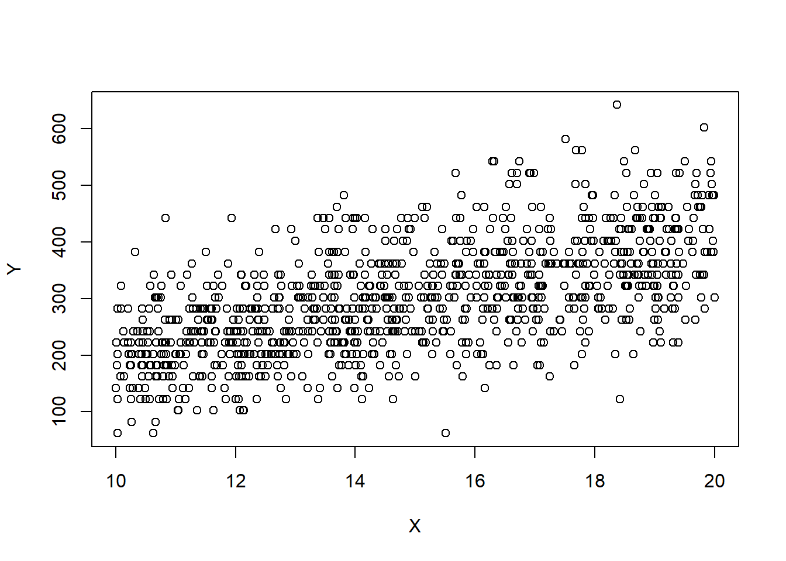

```r
# Performing a regression analysis yields: 
model=lm(Y~X)
# Notice the intercept is poorly estimated! 
summary(model)
```

```

Call:
lm(formula = Y ~ X)

Residuals:
     Min       1Q   Median       3Q      Max 
-250.289  -53.392   -2.127   48.795  270.716 

Coefficients:
            Estimate Std. Error t value Pr(>|t|)    
(Intercept)  -9.5199    13.0735  -0.728    0.467    
X            20.7241     0.8599  24.101   <2e-16 ***
---
Signif. codes:  0 '***' 0.001 '**' 0.01 '*' 0.05 '.' 0.1 ' ' 1

Residual standard error: 77.61 on 998 degrees of freedom
Multiple R-squared:  0.3679,    Adjusted R-squared:  0.3673 
F-statistic: 580.9 on 1 and 998 DF,  p-value: < 2.2e-16
```

```r
# Notice the fan shape in the residuals against the fitted values?
plot(model$fitted.values,model$residuals)
```

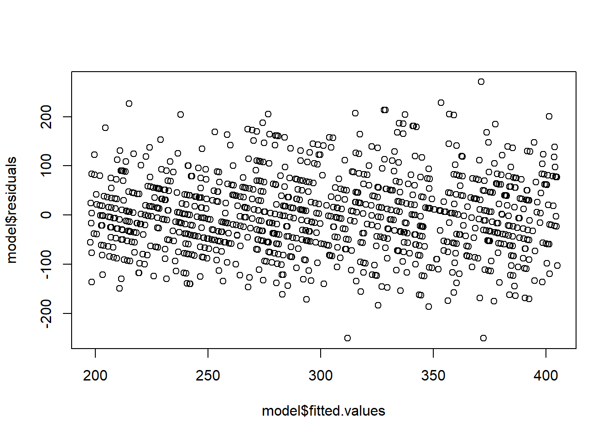

```r
# Let's perform the transformations

model2=lm(sqrt(Y)~X)

plot(model2$fitted.values,model2$residuals)
```

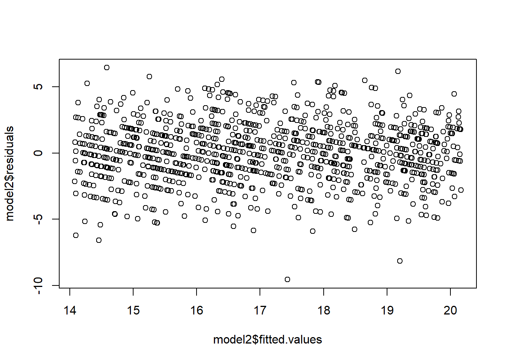

```r
model2=lm(log(Y)~X)

plot(model2$fitted.values,model2$residuals)
```

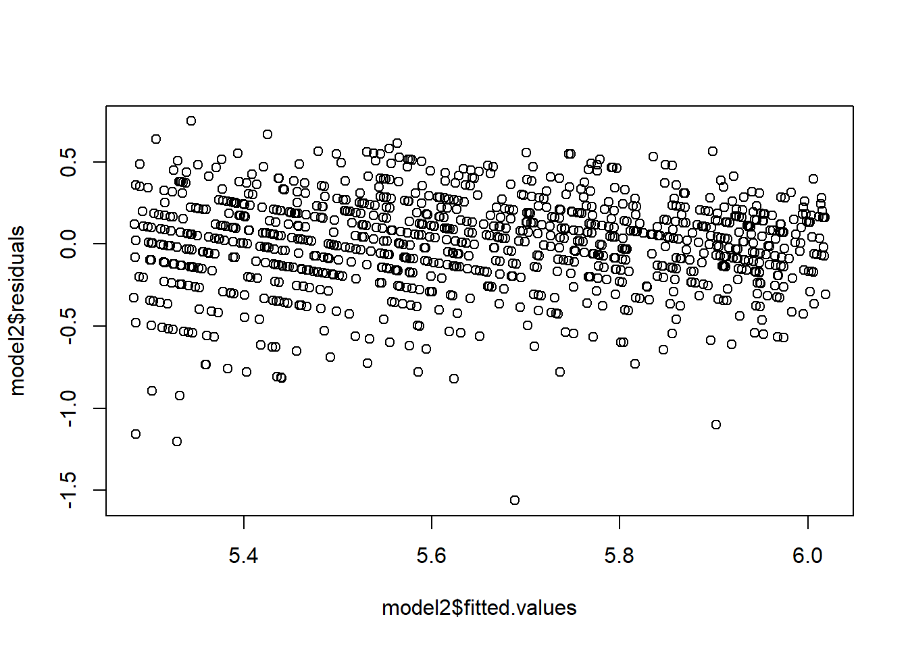

However, these transformations do not always work. Suppose we have that \(Y\sim\mathcal{N}(X,4*X^2).\) We then have that \(\sigma=2*X=2*{\textrm{E}}\left[Y|X\right]\). Notice how the spread of the points is increasing with \(X\)? This is a symptom of non-homogeneous variance. However, the proposed transformations do not work.

```r
set.seed(2352)
# \sigma^2\propto \E{Y}
Y=20*rnorm(n,X,X*2)+2

plot(X,Y)
```

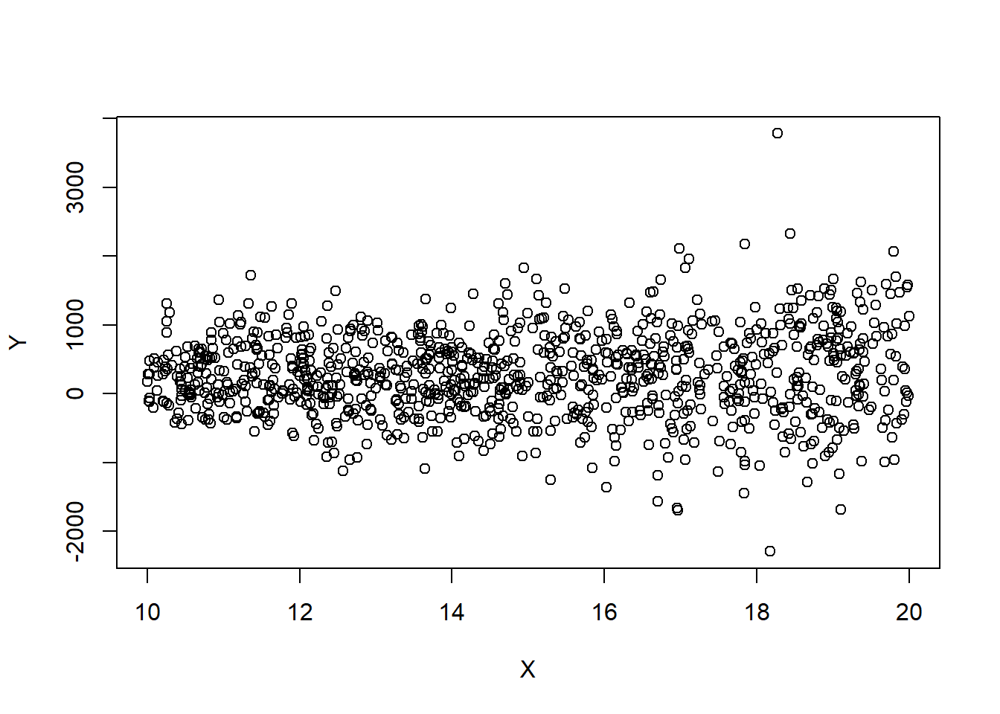

```r
# Performing a regression analysis yields: 
model=lm(Y~X)

# notice the intercept is poorly estimated. 
summary(model)
```

```

Call:
lm(formula = Y ~ X)

Residuals:
    Min      1Q  Median      3Q     Max 
-2610.8  -375.3    -3.5   384.8  3460.5 

Coefficients:
            Estimate Std. Error t value Pr(>|t|)  
(Intercept)   76.844    103.345   0.744   0.4573  
X             13.367      6.797   1.966   0.0495 *
---
Signif. codes:  0 '***' 0.001 '**' 0.01 '*' 0.05 '.' 0.1 ' ' 1

Residual standard error: 613.5 on 998 degrees of freedom
Multiple R-squared:  0.00386,   Adjusted R-squared:  0.002861 
F-statistic: 3.867 on 1 and 998 DF,  p-value: 0.04953
```

```r
# Notice the fan shape in the residuals against the fitted values?
plot(model$fitted.values,model$residuals)
```

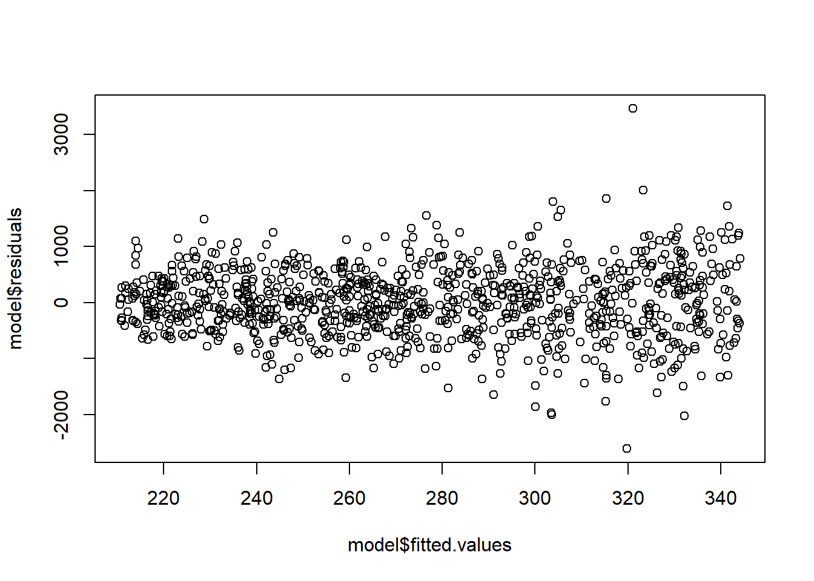

```r
# Let's perform the transformation

# Performing a regression analysis yields: 
model2=lm(sqrt(Y)~X)
```

```
Warning in sqrt(Y): NaNs produced
```

```r
# Notice the fan shape in the residuals against the fitted values?
plot(model2$fitted.values,model2$residuals)
```

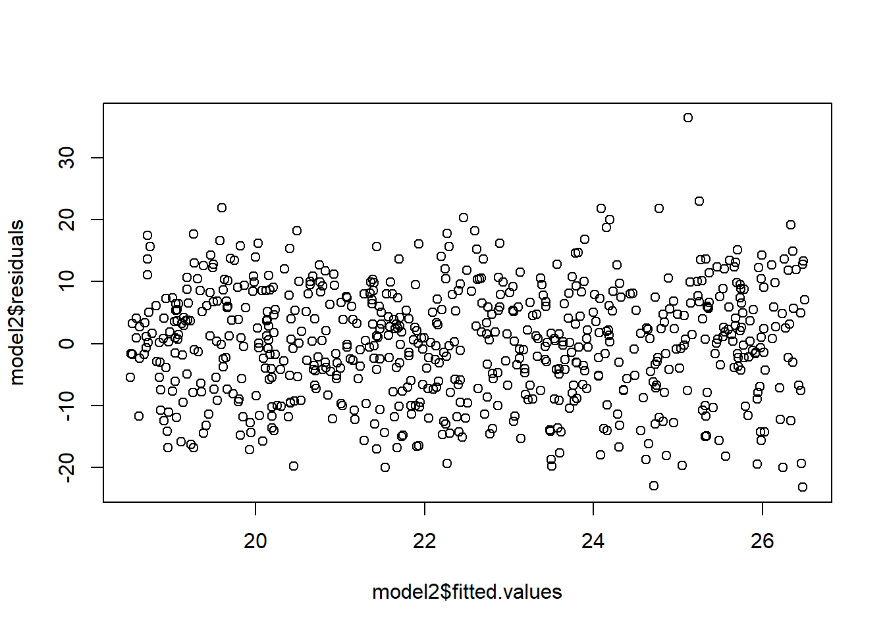

```r
# Performing a regression analysis yields: 
model2=lm(log(Y+3000)~X)

# Notice the fan shape in the residuals against the fitted values?
plot(model2$fitted.values,model2$residuals,ylim=c(-3,3))
```

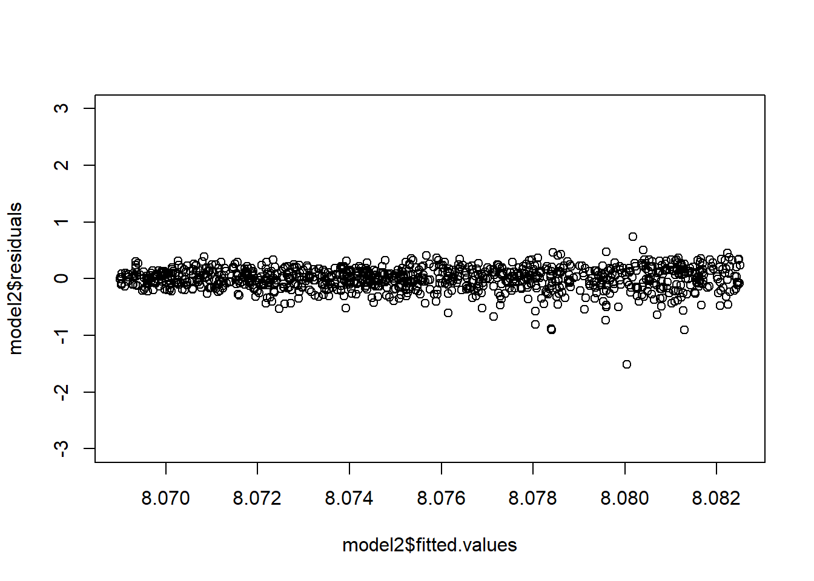

In general, a good transformation to correct violated assumptions can improve estimates and test accuracy.

Caution
It is often necessary to convert any predicted values back to the original units. Applying the inverse transformation to predicted values gives an estimate of the median of the distribution of the (untransformed) response – instead of the mean. This implies that predictions are generally biased. Prediction and confidence intervals do not suffer this illness. They can be converted back to the original units via the inverse transformation and the interpretation will remain the same.

### 5.1.1 Inverse transformations

Let’s expand on this. It is a good time to recall that in general, for a real function \(f\), we have that \({\textrm{E}}\left[f(X)\right]\neq f({\textrm{E}}\left[X\right])\). For instance, for many random variables \(Z\), we would have that \({\textrm{E}}\left[Z^2\right]\neq {\textrm{E}}\left[Z\right]^2\), \({\textrm{E}}\left[\log Z\right]\neq \log {\textrm{E}}\left[Z\right]\) etc. .

In a transformed regression model, we fit the following model: \[f(Y)=X\beta+\epsilon.\] If we are interested in predicting the value of \(Y\) given \(z\), then it seems natural to take the predictions for \(f(Y)\) given \(z\), which are given by \(\beta^\top z\) and apply the inverse transformation \(f^{-1}\). For instance, to predict \(Y|Z=z\), we may compute: \(f^{-1}(\beta^\top z)\). It turns out, this prediction is biased, and we should use a different method instead.

To see why it’s biased, observe that the predictions from the model \(f(Y)=X\beta+\epsilon\) for a new set of covariates \(z\) are given by \(\hat f(Y)=\hat\beta^\top z\approx{\textrm{E}}\left[f(Y)|Z=z\right]\). Now, we have that \[f^{-1}(\hat\beta^\top z)\approx f^{-1}({\textrm{E}}\left[f(Y)|Z=z\right])\neq {\textrm{E}}\left[f^{-1}(f(Y))|Z=z\right]= {\textrm{E}}\left[\hat f(Y)|Z=z\right].\]

The solution to this problem is to adjust for the bias. For the log transform, we can multiply the resulting inverse transformed predictions by \(\exp(\hat\sigma^2/2)\). For the square root transformation, we add \(\hat\sigma^2\) to the resulting inverse transformed predictions. See ([Miller 1984](references.html#ref-Miller1984)) for more information.

One can also use confidence and prediction intervals to predict the value of \(Y\) given \(z\). Confidence or prediction intervals may be directly converted from one metric to another – such interval estimates are percentiles of a distribution which are unaffected by the transformation. They can be converted back to the original units via the inverse transformation and the interpretation will remain the same. Optimal intervals are intervals with the shortest average interval length for a given confidence level, under a given set of assumptions. However, it may be that the resulting intervals may not be “optimal”. One way to get a prediction in the original units, is to apply the inverse transformation to the prediction interval computed from the transformed model and take the midpoint of that interval. This does not always work well - and should be checked against the original data.

**Example 5.1** Let’s simulate what happens when, given the day \(t\in [100]\), we try to estimate the mean stock price \(P_t\) for some stock (maybe ?Gamestop?) in a model which regresses the logged rate of return against the day. Note that the logged returns at time \(t\) are given by: \(L=\log\left(\frac{P_t}{P_{t-1}}\right)\).

```r
set.seed(2352)
# Simulate the stock prices
n=100
day=seq(1:n)
log_return=rnorm(n,0.000001+0.000005*day,0.01)
# log_return=rnorm(n,0.000001+0.000005*day,0.0005)
stock_prices=c(50,50*exp(cumsum(log_return)))
# exp(log_return)[1:10]

plot(c(0,day), stock_prices,type='l')
```

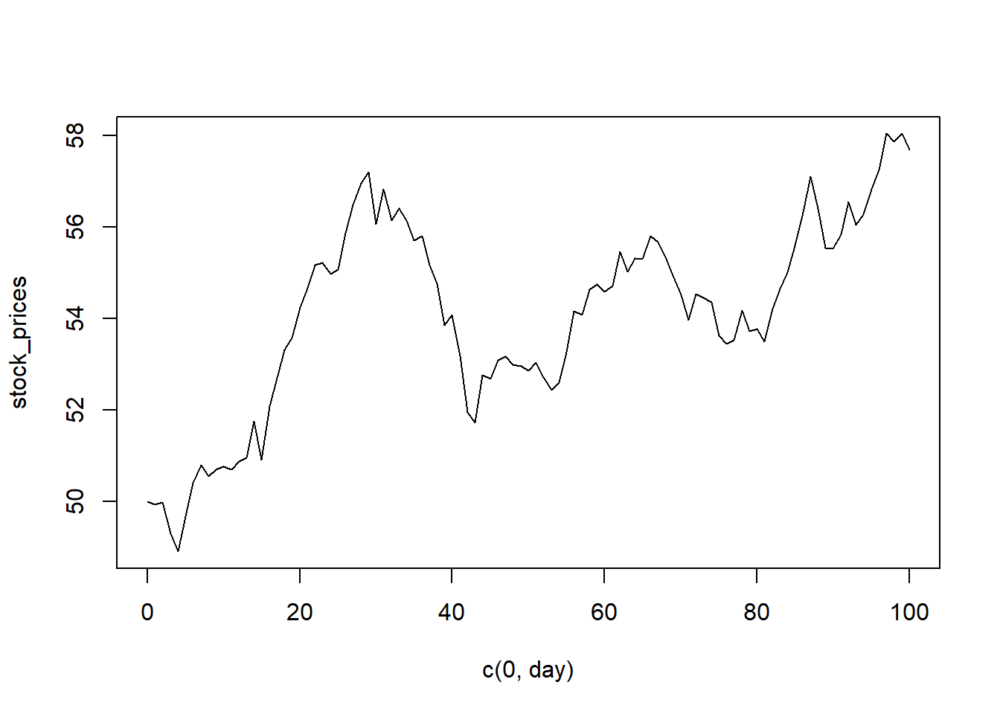

```r
df=data.frame(cbind("day"=c(0,day),"sp"=stock_prices))

# Now, suppose this is our starting dataset
head(df)
```

```
  day       sp
1   0 50.00000
2   1 49.93624
3   2 49.97369
4   3 49.29229
5   4 48.90210
6   5 49.66743
```

```r
# Notice that the pattern is not great... but we can regress on the transformed response
plot(df)
```

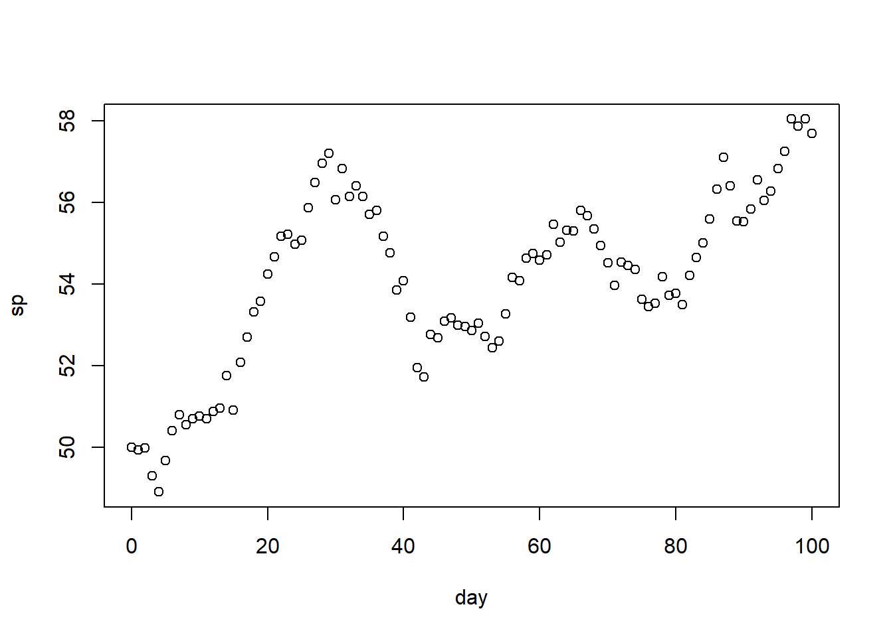

```r
# Fitting the model 

# Compute the log returns
df$lr=NA
df$lr[2:(n+1)]=log(df$sp[-1]/df$sp[-(n+1)])

# Sanity Check
# log_return[1:5]
# df$lr[2:6]

model=lm(lr~day,df)
summary(model)
```

```

Call:
lm(formula = lr ~ day, data = df)

Residuals:
       Min         1Q     Median         3Q        Max 
-0.0249054 -0.0064851  0.0000518  0.0075839  0.0208044 

Coefficients:
              Estimate Std. Error t value Pr(>|t|)
(Intercept)  1.824e-03  1.926e-03   0.947    0.346
day         -7.771e-06  3.312e-05  -0.235    0.815

Residual standard error: 0.00956 on 98 degrees of freedom
  (1 observation deleted due to missingness)
Multiple R-squared:  0.0005615, Adjusted R-squared:  -0.009637 
F-statistic: 0.05506 on 1 and 98 DF,  p-value: 0.815
```

```r
plot(c(0,day), stock_prices,type='l',lwd=2)
lines(50*exp(cumsum(fitted.values(model))),col='red',lty=2,lwd=2)

# Intervals for the mean at each time point 
intervals=predict(model,interval ='prediction')[,2:3]
```

```
Warning in predict.lm(model, interval = "prediction"): predictions on current data refer to _future_ responses
```

```r
midpoint=ret=rep(0,n)
for(i in 1:n){
  if(i==1){
    midpoint[i]=50*exp(intervals[i,1])/2+50*exp(intervals[i,2])/2
  }
  else
    midpoint[i]=midpoint[i-1]*(exp(intervals[i,1])+exp(intervals[i,2]))/2
}
lines(midpoint,col="green",lty=3,lwd=2)

legend("topleft",legend=c("obs. rolling avg","inverse predictions","Pred int 95%","Bias Correct"), lty=c(1,2,3),col=c('black','red','green'),lwd=2)
```

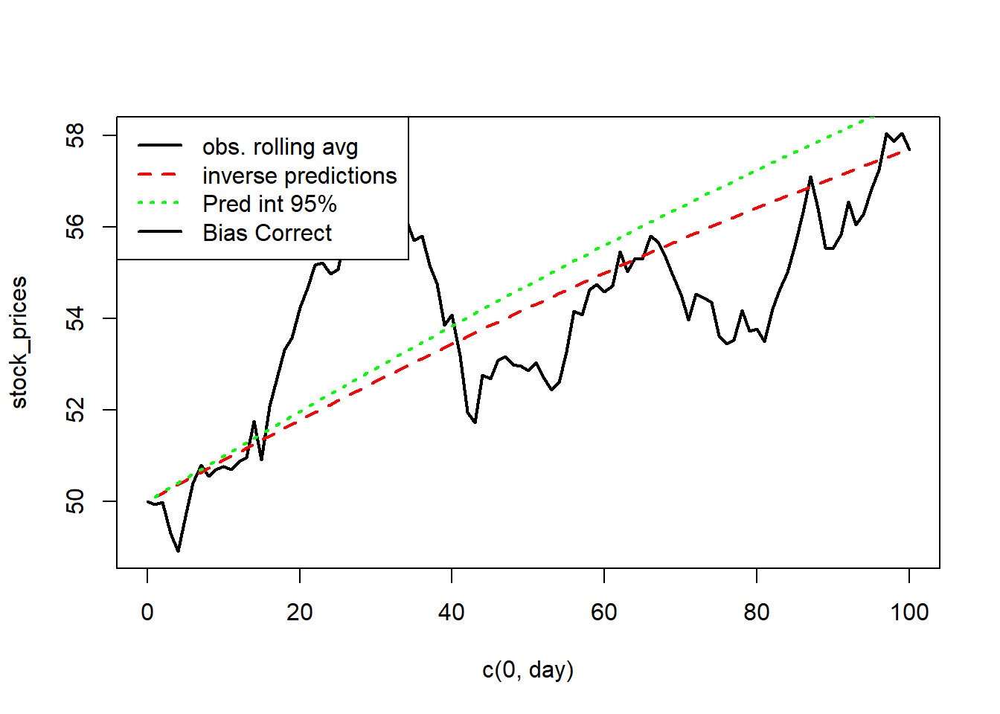

A second example…

```r
set.seed(2352)
# Simulate data
n=100
X=runif(n,5,10)
logs=rnorm(n,1+0.2*X,0.5)
Y=exp(logs)
plot(X,Y)
```

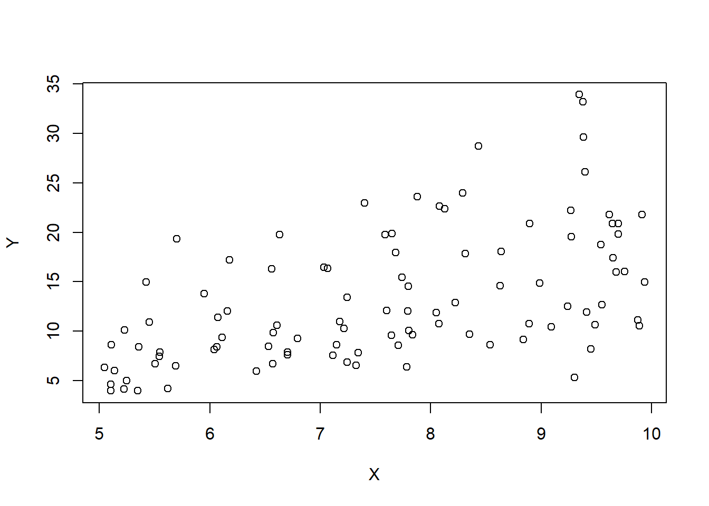

```r
df=data.frame(cbind("X"=X,"Y"=Y))
df=df[order(X),]

# Fitting the model
model=lm(log(Y)~X,data=df)
summary(model)
```

```

Call:
lm(formula = log(Y) ~ X, data = df)

Residuals:
     Min       1Q   Median       3Q      Max 
-1.13484 -0.31721 -0.02877  0.29765  0.85929 

Coefficients:
            Estimate Std. Error t value Pr(>|t|)    
(Intercept)  1.00060    0.21048   4.754 6.85e-06 ***
X            0.19333    0.02721   7.106 1.94e-10 ***
---
Signif. codes:  0 '***' 0.001 '**' 0.01 '*' 0.05 '.' 0.1 ' ' 1

Residual standard error: 0.4113 on 98 degrees of freedom
Multiple R-squared:  0.3401,    Adjusted R-squared:  0.3333 
F-statistic:  50.5 on 1 and 98 DF,  p-value: 1.937e-10
```

```r
s=summary(model)$sigma
# Rolling average

zb=zoo::zoo(x=df$Y,df$X)
rm=zoo::rollmean(zb,25)

plot(attributes(rm)$index,rm,lty=1,lwd=3,type='l')
# plot(X,Y)

zb=zoo::zoo(x=exp(fitted.values(model)),df$X)
rm=zoo::rollmean(zb,25)
lines(attributes(rm)$index,rm,col=2,lty=2,lwd=3)

lines(attributes(rm)$index,rm*exp(s^2/2),col=6,lty=2,lwd=3)

# Intervals for the mean at each time point 
nd=data.frame("X"=df$X)
ivs=predict(model, newdata = nd,interval = 'prediction')[,2:3]
intervals=rowMeans(exp(ivs))
zb=zoo::zoo(x=intervals,df$X)
rm=zoo::rollmean(zb,25)
lines(attributes(rm)$index,rm,col=3,lty=3,lwd=4)

# Intervals for the mean at each time point - notice when we lower the level the performance increases... 
nd=data.frame("X"=df$X)
ivs=predict(model, newdata = nd,interval = 'prediction', level = 0.8)[,2:3]
intervals=rowMeans(exp(ivs))
zb=zoo::zoo(x=intervals,df$X)
rm=zoo::rollmean(zb,25)
lines(attributes(rm)$index,rm,col=7,lty=3,lwd=4)

# Intervals for the mean at each time point using confidence intervals
# ivs=predict(model, newdata = nd,interval = 'confidence', level = 0.8)[,2:3]
# intervals=rowMeans(exp(ivs))
# zb=zoo::zoo(x=intervals,df$X)
# rm=zoo::rollmean(zb,25)
# lines(attributes(rm)$index,rm,col=6,lty=3,lwd=3)

legend("topleft",legend=c("obs. rolling avg","inverse predictions","Pred int 95%","Pred int 80%","Bias cor."), lty=c(1,2,3,3,2),col=c(1,2,3,7,6),lwd=2)
```

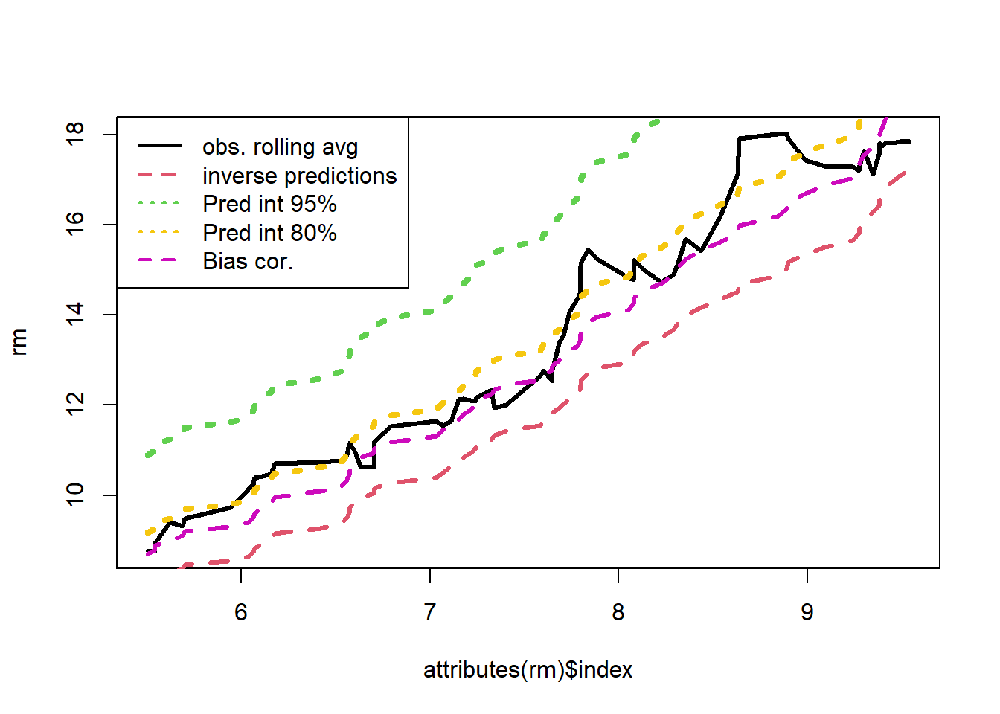

```r
set.seed(2352)

# Simulate data

n=1000
X=runif(n,2,15)
sq=rnorm(n,10+2*X,7)
Y=sq^2
plot(X,Y)
```

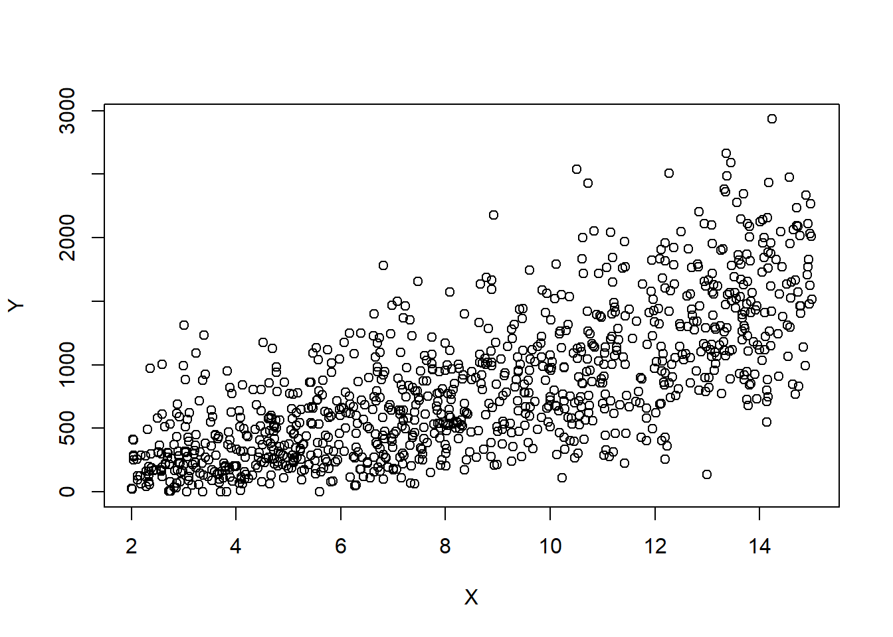

```r
df=data.frame(cbind("X"=X,"Y"=Y))
df=df[order(X),]

# Fitting the model
model=lm(sqrt(Y)~X,data=df)
summary(model)
```

```

Call:
lm(formula = sqrt(Y) ~ X, data = df)

Residuals:
     Min       1Q   Median       3Q      Max 
-24.2975  -4.5612  -0.0315   4.7083  20.2670 

Coefficients:
            Estimate Std. Error t value Pr(>|t|)    
(Intercept)  9.94439    0.54223   18.34   <2e-16 ***
X            1.99810    0.05897   33.88   <2e-16 ***
---
Signif. codes:  0 '***' 0.001 '**' 0.01 '*' 0.05 '.' 0.1 ' ' 1

Residual standard error: 6.919 on 998 degrees of freedom
Multiple R-squared:  0.535, Adjusted R-squared:  0.5345 
F-statistic:  1148 on 1 and 998 DF,  p-value: < 2.2e-16
```

```r
s=summary(model)$sigma
# plot(X,Y)
# Rolling average

zb=zoo::zoo(x=df$Y,df$X)
rm=zoo::rollmean(zb,50)

plot(attributes(rm)$index,rm,col=1,lty=3,lwd=3,type='l')
zb=zoo::zoo(fitted.values(model)^2,df$X)
rm=zoo::rollmean(zb,25)
lines(attributes(rm)$index,rm,col=2,lty=2,lwd=3)
lines(attributes(rm)$index,rm+s^2,col=6,lty=2,lwd=3)

# Intervals for the mean at each time point 
intervals=rowMeans(predict.lm(model,interval = 'prediction')[,2:3]^2)
```

```
Warning in predict.lm(model, interval = "prediction"): predictions on current data refer to _future_ responses
```

```r
zb=zoo::zoo(intervals,df$X)
rm=zoo::rollmean(zb,25)
lines(attributes(rm)$index,rm,col=3,lty=3,lwd=3)
legend("topleft",legend=c("obs. rolling avg","inverse predictions","Pred int 95%","Bias Core."), lty=c(1,2,3,2),col=c(1,2,3,6),lwd=rep(3,4))
```

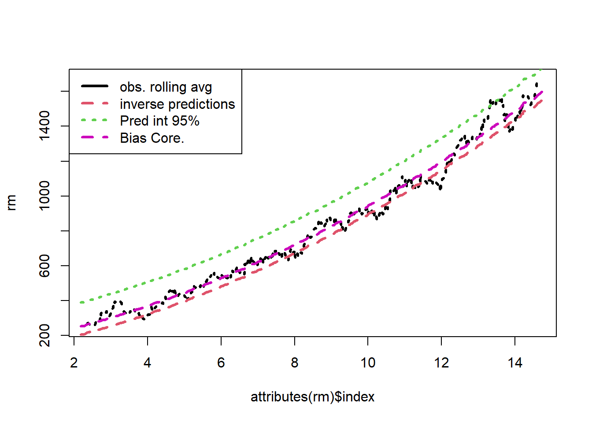

We see that the bias correction is the best performing method. However, this involves working out the bias for each transformation. For a complicated transformation, this may be quite difficult. For common transformations, this has already been completed for us.

```{r}
set.seed(2352)
# Simulate data
n=1000
X=runif(n,0,pi)
as=rnorm(n,0.01+0.1*X,0.01)
Y=cos(as)
plot(X,Y)
df=data.frame(cbind("X"=X,"Y"=Y))
df=df[order(X),]
# Fitting the model
model=lm(acos(Y)~X,data=df)
summary(model)
# plot(X,Y)
# Rolling average
zb=zoo::zoo(x=df$Y,df$X)
rm=zoo::rollmean(zb,25)
plot(attributes(rm)$index,rm,col=1,lty=3,lwd=3,type='l')
zb=zoo::zoo(acos(fitted.values(model)),df$X)
rm=zoo::rollmean(zb,25)
lines(attributes(rm)$index,rm,col=2,lty=2,lwd=3)
# Intervals for the mean at each time point
pi=predict(model,interval = 'prediction',level=0.95)[,2:3]
max(pi)
intervals=rowMeans(acos(pi))
zb=zoo::zoo(intervals,df$X)
rm=zoo::rollmean(zb,25)
lines(attributes(rm)$index,rm,col=3,lty=3,lwd=3)
```
Let’s do an example with some real data. The following example is taken from the textbook:

**Example 5.2** An electric utility is interested in developing a model relating peak - hour demand \(Y\) to total energy usage during the month \(X\). This is an important planning problem because while most customers pay directly for energy usage (in kilowatt - hours), the generation system must be large enough to meet the maximum demand imposed. Data for 53 residential customers for the month of August is given below.

```r
# Electric Utility Data

df<- data.frame(
    Customer = c(1:53),
    x_kWh = c(679, 292, 1012, 493, 582, 1156, 997, 2189, 1097, 2078, 1818, 1700, 747, 2030, 1643, 414, 354, 1276, 745, 435, 540, 874, 1543, 1029, 710, 1434, 837, 1748, 1381, 1428, 1255, 1777, 370, 2316, 1130, 463, 770, 724, 808, 790, 783, 406, 1242, 658, 1746, 468, 1114, 413, 1787, 3560, 1495, 2221, 1526),
    y_kW = c(0.79, 0.44, 0.56, 0.79, 2.70, 3.64, 4.73, 9.50, 5.34, 6.85, 5.84, 5.21, 3.25, 4.43, 3.16, 0.50, 0.17, 1.88, 0.77, 1.39, 0.56, 1.56, 5.28, 0.64, 4.00, 0.31, 4.20, 4.88, 3.48, 7.58, 2.63, 4.99, 0.59, 8.19, 4.79, 0.51, 1.74, 4.10, 3.94, 0.96, 3.29, 0.44, 3.24, 2.14, 5.71, 0.64, 1.90, 0.51, 8.33, 14.94, 5.11, 3.85, 3.93)
  )

df
```

```
   Customer x_kWh  y_kW
1         1   679  0.79
2         2   292  0.44
3         3  1012  0.56
4         4   493  0.79
5         5   582  2.70
6         6  1156  3.64
7         7   997  4.73
8         8  2189  9.50
9         9  1097  5.34
10       10  2078  6.85
11       11  1818  5.84
12       12  1700  5.21
13       13   747  3.25
14       14  2030  4.43
15       15  1643  3.16
16       16   414  0.50
17       17   354  0.17
18       18  1276  1.88
19       19   745  0.77
20       20   435  1.39
21       21   540  0.56
22       22   874  1.56
23       23  1543  5.28
24       24  1029  0.64
25       25   710  4.00
26       26  1434  0.31
27       27   837  4.20
28       28  1748  4.88
29       29  1381  3.48
30       30  1428  7.58
31       31  1255  2.63
32       32  1777  4.99
33       33   370  0.59
34       34  2316  8.19
35       35  1130  4.79
36       36   463  0.51
37       37   770  1.74
38       38   724  4.10
39       39   808  3.94
40       40   790  0.96
41       41   783  3.29
42       42   406  0.44
43       43  1242  3.24
44       44   658  2.14
45       45  1746  5.71
46       46   468  0.64
47       47  1114  1.90
48       48   413  0.51
49       49  1787  8.33
50       50  3560 14.94
51       51  1495  5.11
52       52  2221  3.85
53       53  1526  3.93
```

```r
#  changing the plot aesthetics
par(pch=22,lwd=2)

# Explore

plot(df[,2:3])
```

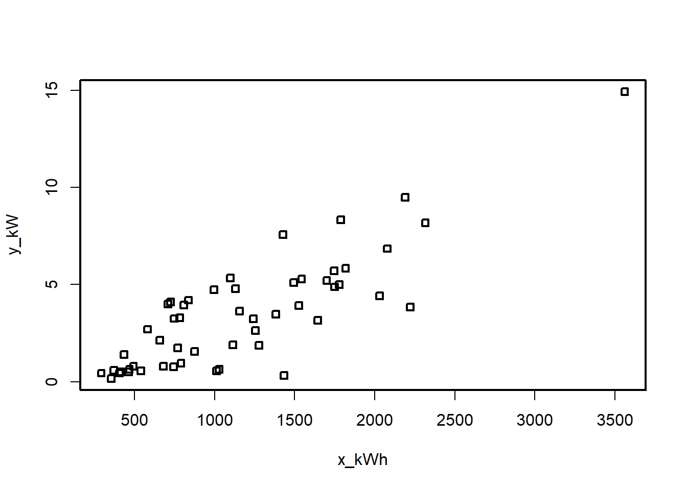

```r
summary(df)
```

```
    Customer      x_kWh           y_kW       
 Min.   : 1   Min.   : 292   Min.   : 0.170  
 1st Qu.:14   1st Qu.: 679   1st Qu.: 0.790  
 Median :27   Median :1029   Median : 3.250  
 Mean   :27   Mean   :1153   Mean   : 3.413  
 3rd Qu.:40   3rd Qu.:1543   3rd Qu.: 4.880  
 Max.   :53   Max.   :3560   Max.   :14.940  
```

```r
plot(df)
```

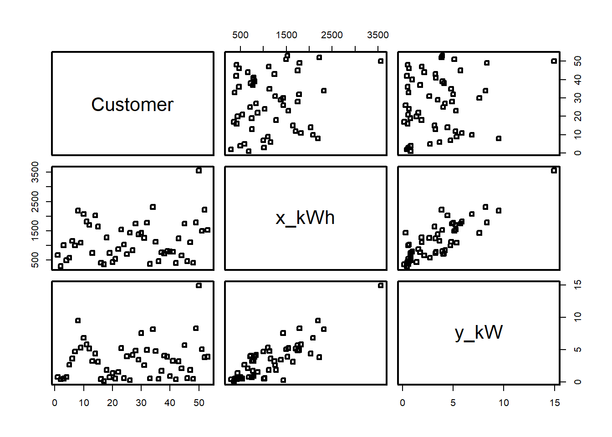

```r
# Model 

model=lm(y_kW~x_kWh, df); model
```

```

Call:
lm(formula = y_kW ~ x_kWh, data = df)

Coefficients:
(Intercept)        x_kWh  
  -0.831304     0.003683  
```

```r
summ=summary(model); summ
```

```

Call:
lm(formula = y_kW ~ x_kWh, data = df)

Residuals:
    Min      1Q  Median      3Q     Max 
-4.1399 -0.8275 -0.1934  1.2376  3.1522 

Coefficients:
              Estimate Std. Error t value Pr(>|t|)    
(Intercept) -0.8313037  0.4416121  -1.882   0.0655 .  
x_kWh        0.0036828  0.0003339  11.030 4.11e-15 ***
---
Signif. codes:  0 '***' 0.001 '**' 0.01 '*' 0.05 '.' 0.1 ' ' 1

Residual standard error: 1.577 on 51 degrees of freedom
Multiple R-squared:  0.7046,    Adjusted R-squared:  0.6988 
F-statistic: 121.7 on 1 and 51 DF,  p-value: 4.106e-15
```

```r
# Now do the residual analysis
# Studentized residuals
student_res=rstudent(model)
MSE=summ$sigma^2

qqnorm(student_res,pch=22,bg=1)
abline(0,1)
```

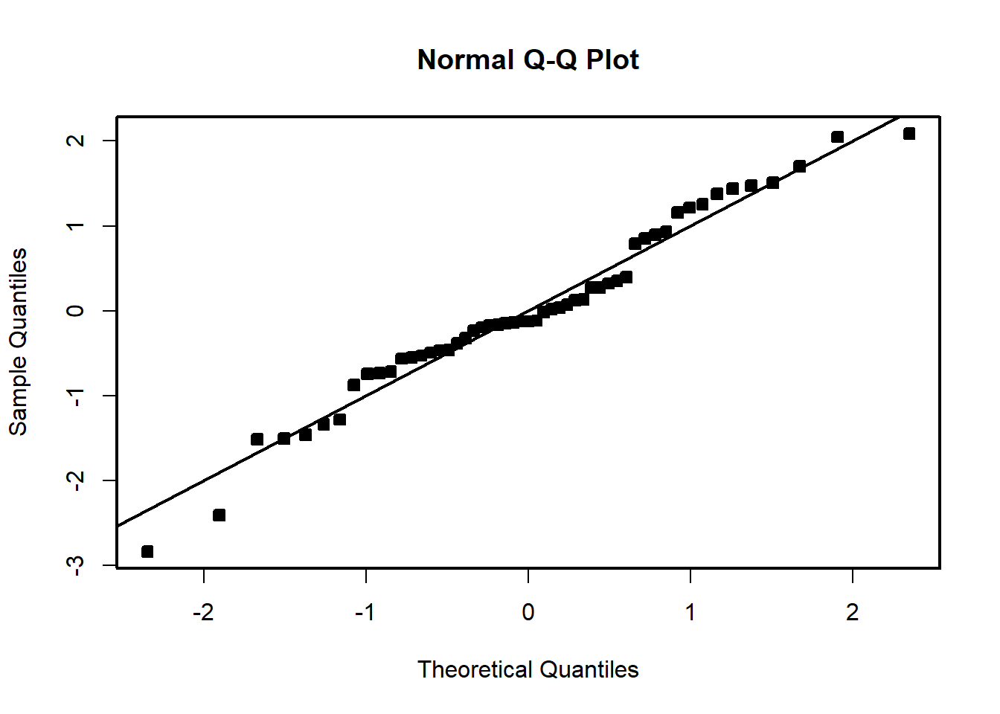

```r
hist(student_res,breaks=6)
```

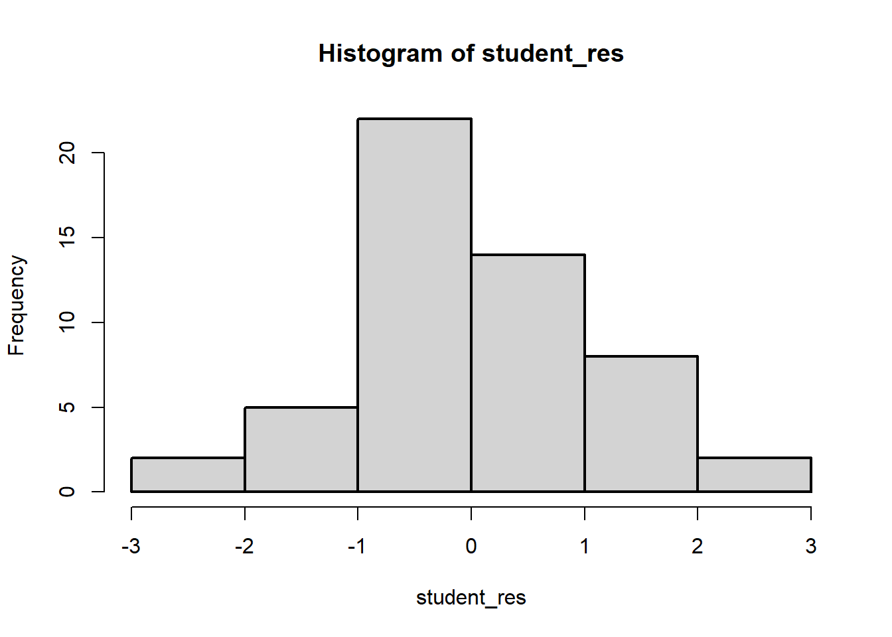

```r
plot(model$fitted.values,student_res,pch=22,bg=1)
abline(h=0)
```

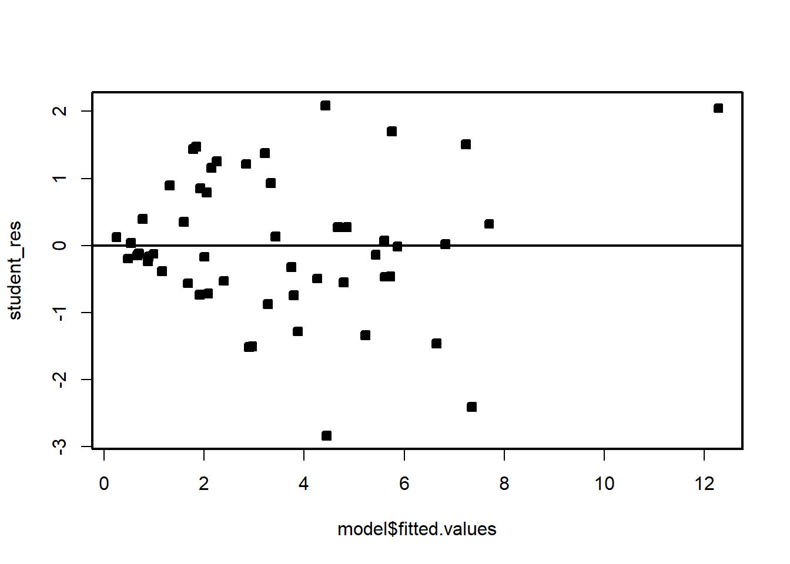

We see that the residual variance increases with the mean of \(Y\). This is easily seen by the fan shape of the residuals in the plot of the residuals against the fitted values.

```r
######## Let's try the sqrt transformation

model2=lm(sqrt(y_kW)~x_kWh, df)
model2
```

```

Call:
lm(formula = sqrt(y_kW) ~ x_kWh, data = df)

Coefficients:
(Intercept)        x_kWh  
  0.5822259    0.0009529  
```

```r
summ2=summary(model2); summ2
```

```

Call:
lm(formula = sqrt(y_kW) ~ x_kWh, data = df)

Residuals:
     Min       1Q   Median       3Q      Max 
-1.39185 -0.30576 -0.03875  0.25378  0.81027 

Coefficients:
             Estimate Std. Error t value Pr(>|t|)    
(Intercept) 5.822e-01  1.299e-01   4.481 4.22e-05 ***
x_kWh       9.529e-04  9.824e-05   9.699 3.61e-13 ***
---
Signif. codes:  0 '***' 0.001 '**' 0.01 '*' 0.05 '.' 0.1 ' ' 1

Residual standard error: 0.464 on 51 degrees of freedom
Multiple R-squared:  0.6485,    Adjusted R-squared:  0.6416 
F-statistic: 94.08 on 1 and 51 DF,  p-value: 3.614e-13
```

```r
student_res2=rstudent(model2)
MSE2=summ2$sigma^2
qqnorm(student_res2,pch=22,bg=1)
abline(0,1)
```

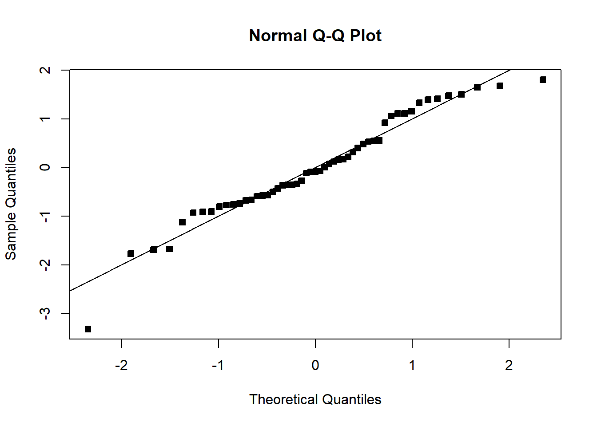

```r
hist(student_res2,breaks=10,xlim=c(-4,4))
```

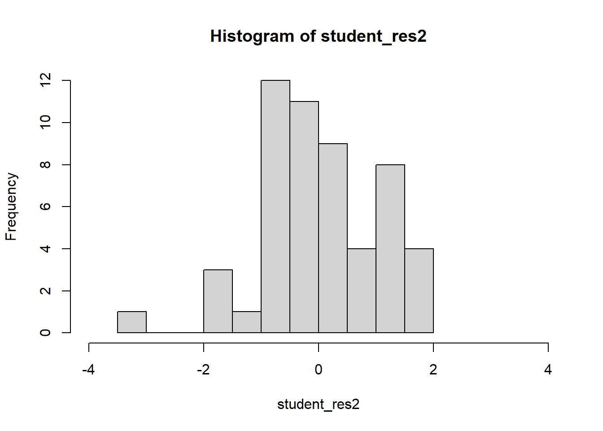

```r
hist(student_res2[-which.max(abs(student_res2))],breaks=10,xlim=c(-2,2))
```

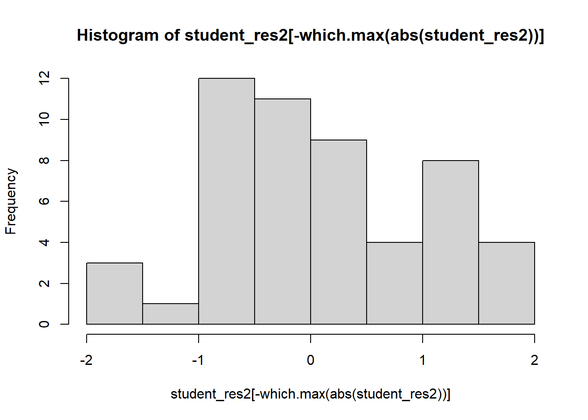

```r
plot(model2$fitted.values,student_res2,pch=22,bg=1)
abline(h=0)
```

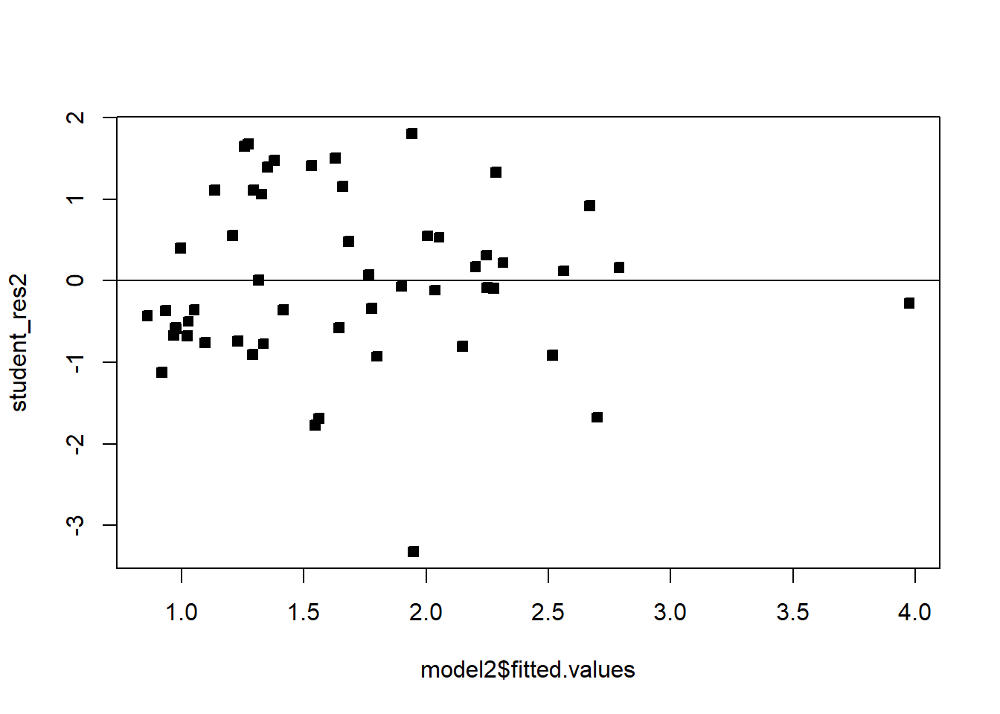

```r
# There is one large outlier skewing the previous plot. Let's rescale and remove. 
plot(model2$fitted.values,student_res2,pch=22,bg=1,ylim=c(-3,3))
abline(h=0)
```

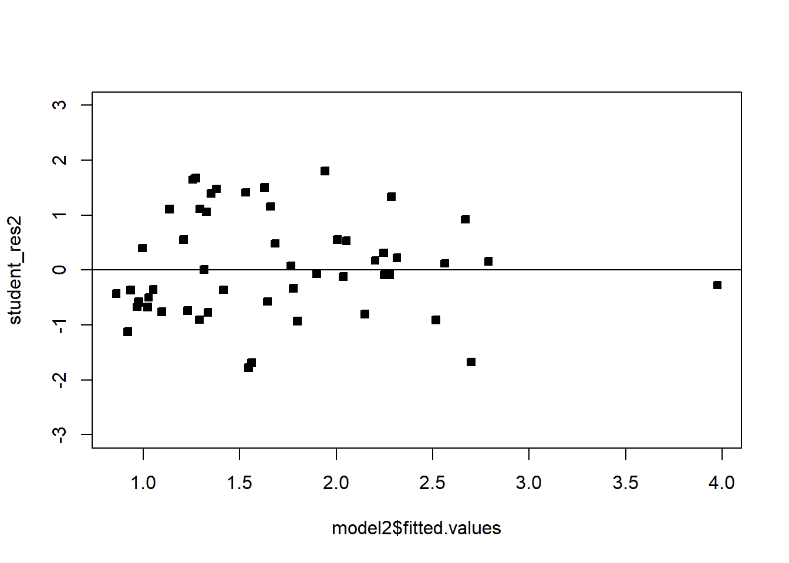

```r
# Compare!
par(mfrow=c(1,2))
plot(model$fitted.values,student_res,pch=22,bg=1,ylim=c(-3,3))
abline(h=0)
plot(model2$fitted.values,student_res2,pch=22,bg=1,ylim=c(-3,3))
abline(h=0)
```

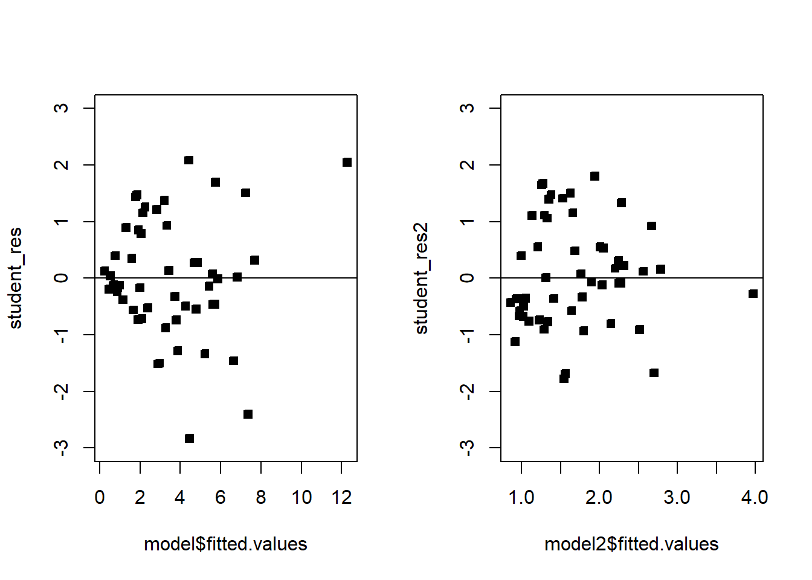

We see that the transformation has solved the problem. Note that sometimes, even though the square-root transformation may be more suitable, the analyst may opt for the logarithm transform. This is because the log transformation gives a nicer interpretation to the coefficients. In this case, that is not working well, see below:

```r
######## Let's try the log transformation
par(mfrow=c(1,1))

model3=lm(log(y_kW)~x_kWh, df)
model3
```

```

Call:
lm(formula = log(y_kW) ~ x_kWh, data = df)

Coefficients:
(Intercept)        x_kWh  
  -0.558713     0.001172  
```

```r
summ3=summary(model3); summ3
```

```

Call:
lm(formula = log(y_kW) ~ x_kWh, data = df)

Residuals:
     Min       1Q   Median       3Q      Max 
-2.29261 -0.47256  0.08414  0.49628  1.12143 

Coefficients:
              Estimate Std. Error t value Pr(>|t|)    
(Intercept) -0.5587131  0.2057201  -2.716    0.009 ** 
x_kWh        0.0011716  0.0001555   7.533 7.86e-10 ***
---
Signif. codes:  0 '***' 0.001 '**' 0.01 '*' 0.05 '.' 0.1 ' ' 1

Residual standard error: 0.7347 on 51 degrees of freedom
Multiple R-squared:  0.5266,    Adjusted R-squared:  0.5174 
F-statistic: 56.74 on 1 and 51 DF,  p-value: 7.862e-10
```

```r
student_res3=rstudent(model3)
MSE3=summ3$sigma^2
qqnorm(student_res3,pch=22,bg=1)
abline(0,1)
```

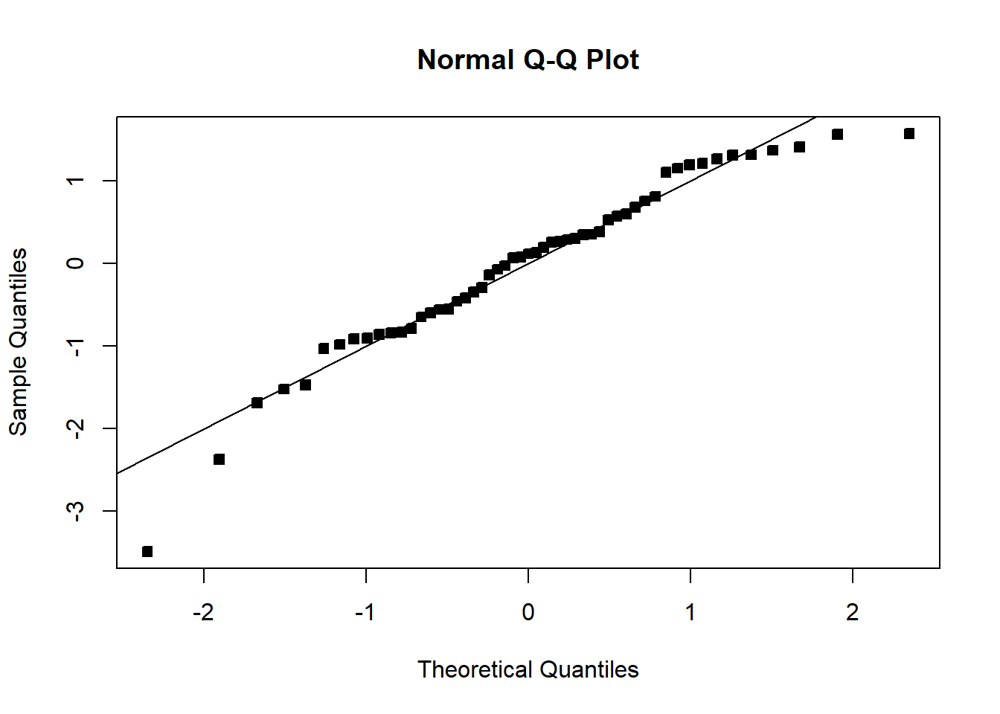

```r
hist(student_res3,breaks=10,xlim=c(-4,4))
```

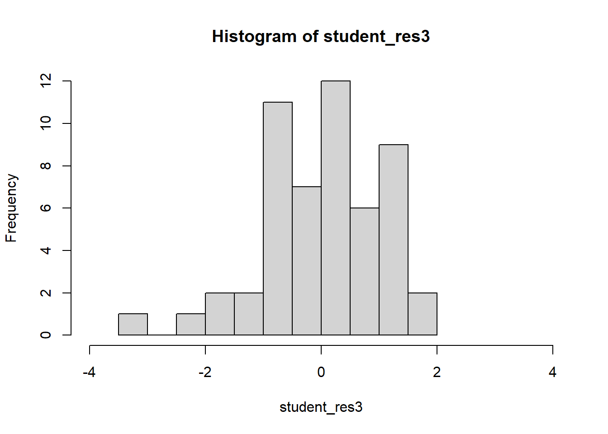

```r
hist(student_res3[-which.max(abs(student_res3))],breaks=10,xlim=c(-2,2))
```

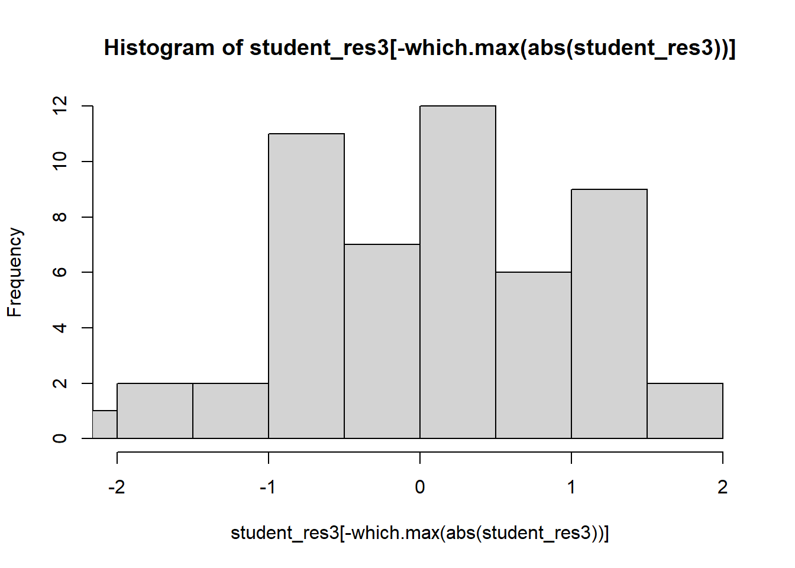

```r
plot(model3$fitted.values,student_res3,pch=22,bg=1,ylim=c(-3,3))
abline(h=0)
```

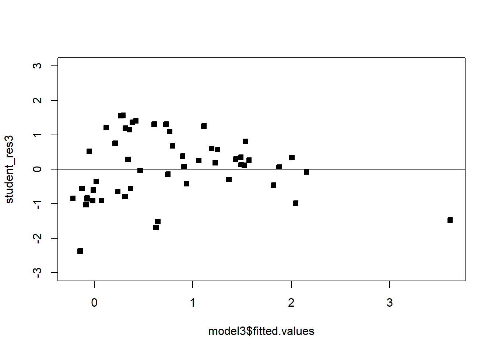

## 5.2 Linearizing the model

Moving on, we may suspect that the relationship between the regressors and the response is nonlinear, either through empirical evidence or theoretical justification. In some cases a nonlinear function can be linearized by using a suitable transformation. Such nonlinear models are called intrinsically linear. For example, consider the model \(Y=\beta_0e^{\beta_1 X}\epsilon\). Taking the log of both sides yields: \[\log(Y)=\log(\beta_0)+\beta_1 X+\log(\epsilon).\] Reparameterizing with \(Z=\log(Y)\), \(\alpha_0=\log(\beta_0)\) and \(\eta=\log(\epsilon)\), we have that

\[Z=\alpha_0+\beta_1 X+\eta.\] If we are willing to assume that \(\eta\) are symmetric about 0 with a constant variance, then we can run a linear regression with the model given above. To get estimates for the original units \(Y\), we can transform back as previously discussed. A model is linearizable if there exists some reparameterization which places the model in the form of the MLR.

**Exercise 5.1** Show the following models are linearizable - that is, find the linear reparameterization of the following models: 1. \(Y=\beta_0 X^\beta_1\) 2. \(Y=\beta_0 X^{\beta_1X}\) 3. \(Y=\beta_0+ \log X\) 4. \(Y=X/(\beta_0 X-\beta_1)\)

**Example 5.3** A research engineer is investigating the use of a windmill to generate electricity. He has collected data on the DC output from his windmill and the corresponding wind velocity. See below. Find a well-fitting regression model for this data.

```r
########### Windmill data

# Create the data frame
df_wind <- data.frame(
  WindVelocity_mph = c(5.00, 6.00, 3.40, 2.70, 10.00, 9.70, 9.55, 3.05, 8.15, 6.20, 
                       2.90, 6.35, 4.60, 5.80, 7.40, 3.60, 7.85, 8.80, 7.00, 5.45, 
                       9.10, 10.20, 4.10, 3.95, 2.45),
  DCOutput = c(1.582, 1.822, 1.057, 0.500, 2.236, 2.386, 2.294, 0.558, 2.166, 1.866,
               0.653, 1.930, 1.562, 1.737, 2.088, 1.137, 2.179, 2.112, 1.800, 1.501,
               2.303, 2.310, 1.194, 1.144, 0.123)
)

###############

par(mfrow=c(1,1))
plot(df_wind)
```

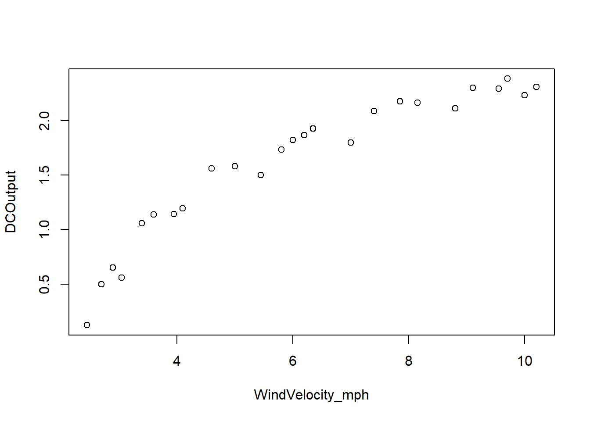

```r
summary(df_wind)
```

```
 WindVelocity_mph    DCOutput    
 Min.   : 2.450   Min.   :0.123  
 1st Qu.: 3.950   1st Qu.:1.144  
 Median : 6.000   Median :1.800  
 Mean   : 6.132   Mean   :1.610  
 3rd Qu.: 8.150   3rd Qu.:2.166  
 Max.   :10.200   Max.   :2.386  
```

```r
plot(df_wind,pch=22,bg=1)
```

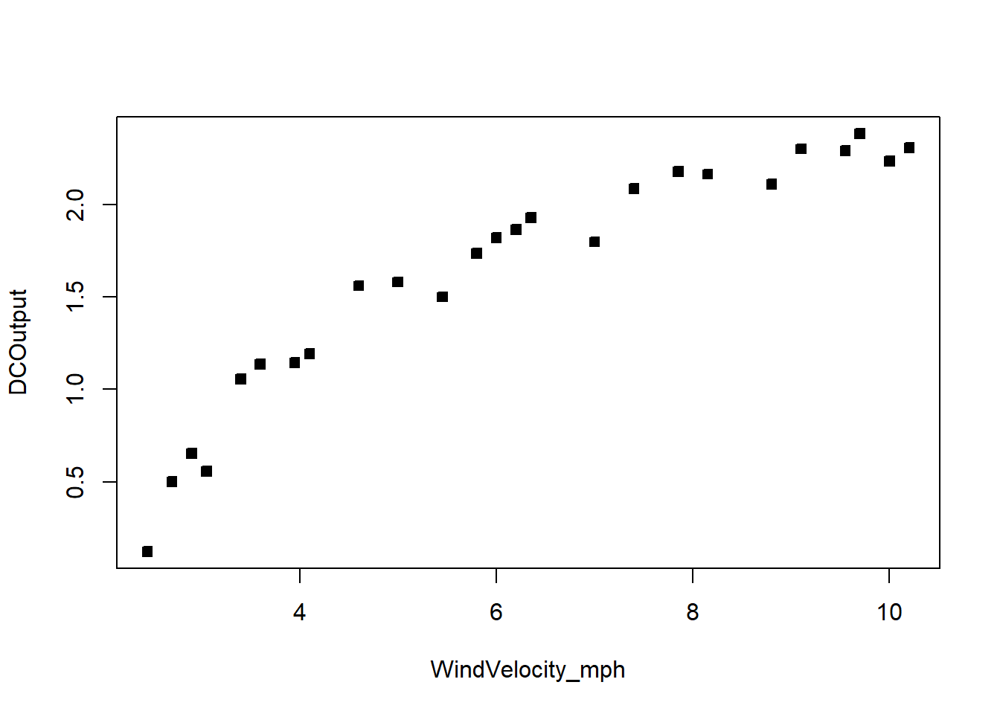

```r
model=lm(DCOutput~WindVelocity_mph, df_wind)
model
```

```

Call:
lm(formula = DCOutput ~ WindVelocity_mph, data = df_wind)

Coefficients:
     (Intercept)  WindVelocity_mph  
          0.1309            0.2411  
```

```r
summ=summary(model); summ
```

```

Call:
lm(formula = DCOutput ~ WindVelocity_mph, data = df_wind)

Residuals:
     Min       1Q   Median       3Q      Max 
-0.59869 -0.14099  0.06059  0.17262  0.32184 

Coefficients:
                 Estimate Std. Error t value Pr(>|t|)    
(Intercept)       0.13088    0.12599   1.039     0.31    
WindVelocity_mph  0.24115    0.01905  12.659 7.55e-12 ***
---
Signif. codes:  0 '***' 0.001 '**' 0.01 '*' 0.05 '.' 0.1 ' ' 1

Residual standard error: 0.2361 on 23 degrees of freedom
Multiple R-squared:  0.8745,    Adjusted R-squared:  0.869 
F-statistic: 160.3 on 1 and 23 DF,  p-value: 7.546e-12
```

```r
student_res=rstudent(model)

MSE=summ$sigma^2
qqnorm(student_res,pch=22,bg=1)
abline(0,1)
```

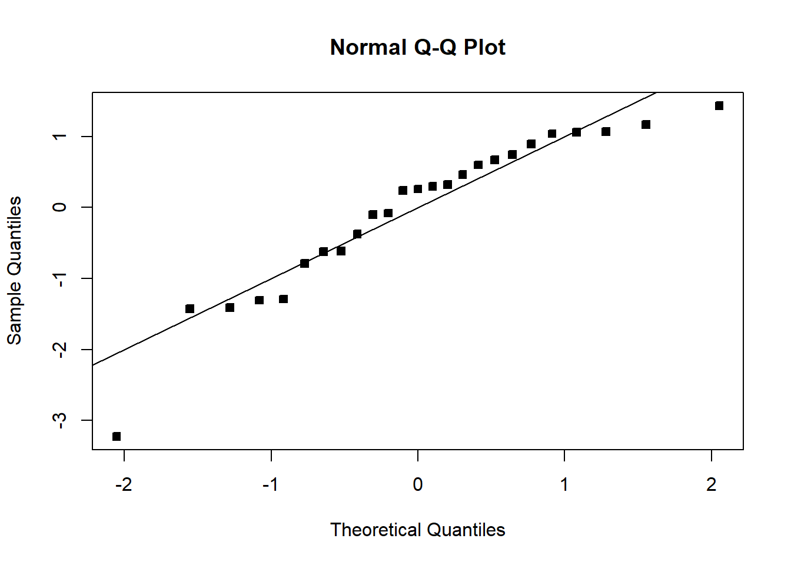

```r
hist(student_res,breaks=10,xlim=c(-4,4))
```

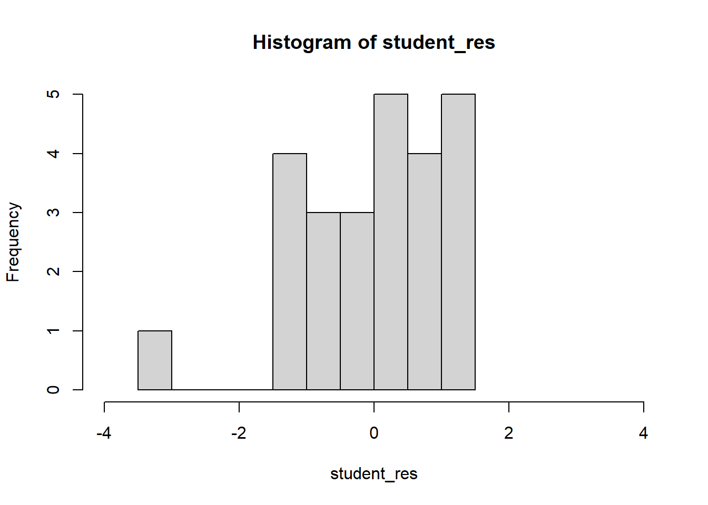

```r
plot(model$fitted.values,student_res,pch=22,bg=1)
abline(h=0)
```

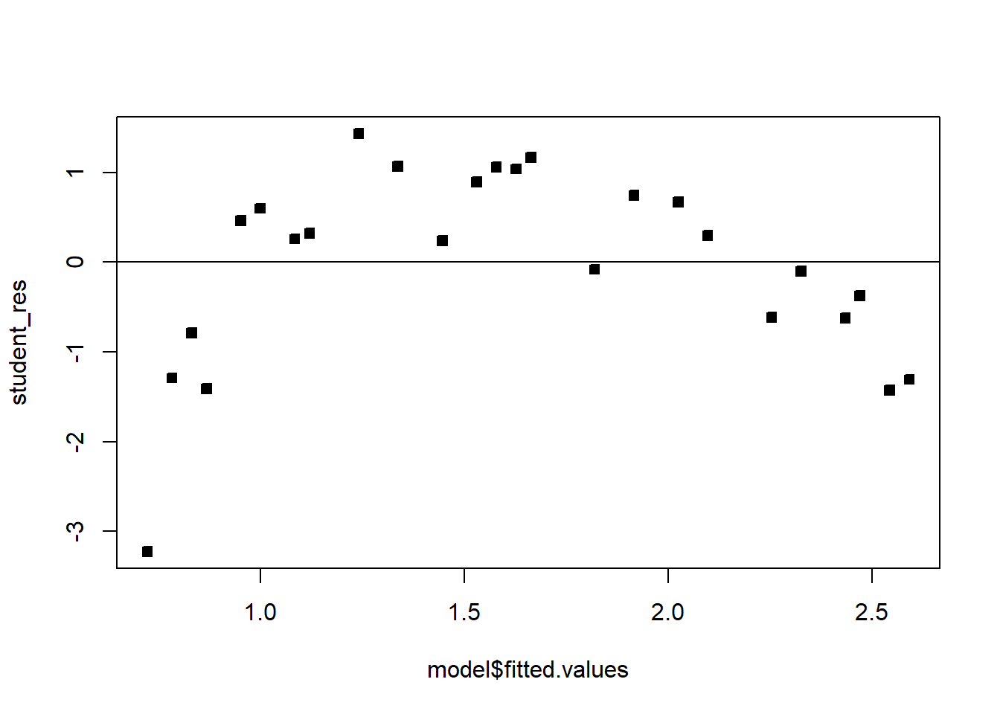

The fit is not good. Looking at the scatterplot, we might initially consider using a quadratic model to account for the pictured curvature. However, the scatterplot suggests that as wind speed increases, DC output approaches an upper limit of approximately 2.5. This is also consistent with the theory of windmill operation. Since the quadratic model will eventually bend downward as wind speed increases, it would not be appropriate for these data. A more reasonable model for the windmill data that incorporates an upper asymptote would be based on \(1/X\).

```r
plot(df_wind$DCOutput,1/df_wind$WindVelocity_mph,pch=22,bg=1)
```

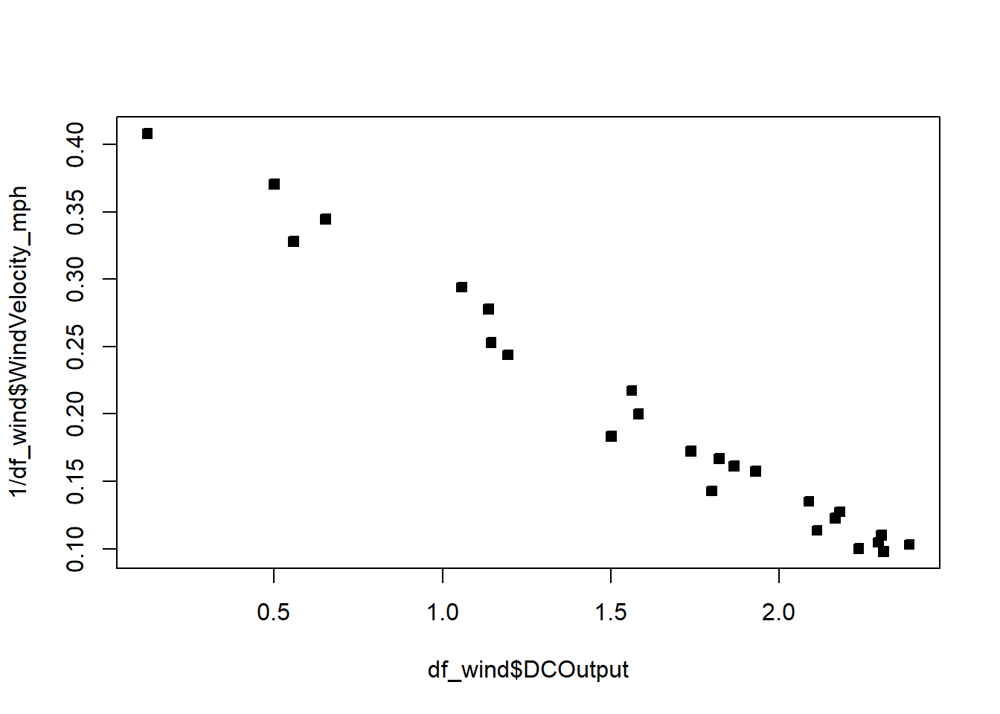

```r
# plot(df$DCOutput,log(df$WindVelocity_mph))
df_wind$WindVelocity_mph_inv=1/df_wind$WindVelocity_mph
model2=lm(DCOutput~WindVelocity_mph_inv, df_wind)
model2
```

```

Call:
lm(formula = DCOutput ~ WindVelocity_mph_inv, data = df_wind)

Coefficients:
         (Intercept)  WindVelocity_mph_inv  
               2.979                -6.935  
```

```r
summ=summary(model2); summ
```

```

Call:
lm(formula = DCOutput ~ WindVelocity_mph_inv, data = df_wind)

Residuals:
     Min       1Q   Median       3Q      Max 
-0.20547 -0.04940  0.01100  0.08352  0.12204 

Coefficients:
                     Estimate Std. Error t value Pr(>|t|)    
(Intercept)            2.9789     0.0449   66.34   <2e-16 ***
WindVelocity_mph_inv  -6.9345     0.2064  -33.59   <2e-16 ***
---
Signif. codes:  0 '***' 0.001 '**' 0.01 '*' 0.05 '.' 0.1 ' ' 1

Residual standard error: 0.09417 on 23 degrees of freedom
Multiple R-squared:   0.98, Adjusted R-squared:  0.9792 
F-statistic:  1128 on 1 and 23 DF,  p-value: < 2.2e-16
```

```r
student_res=rstudent(model2)
MSE=summ$sigma^2
qqnorm(student_res,pch=22,bg=1)
abline(0,1)
```

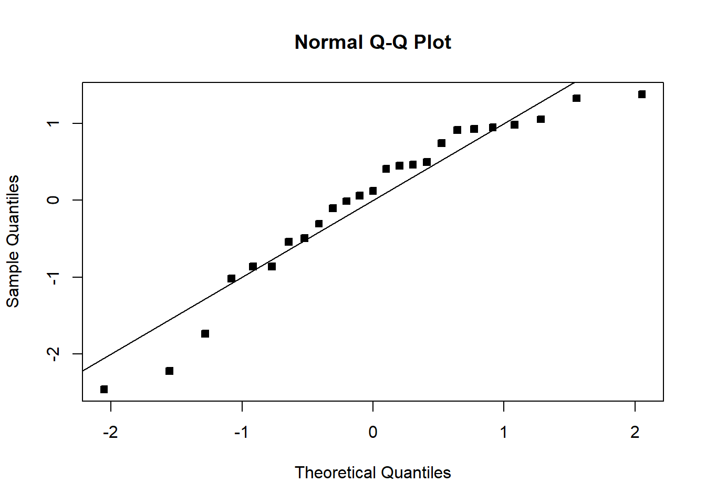

```r
hist(student_res,xlim=c(-4,4))
```

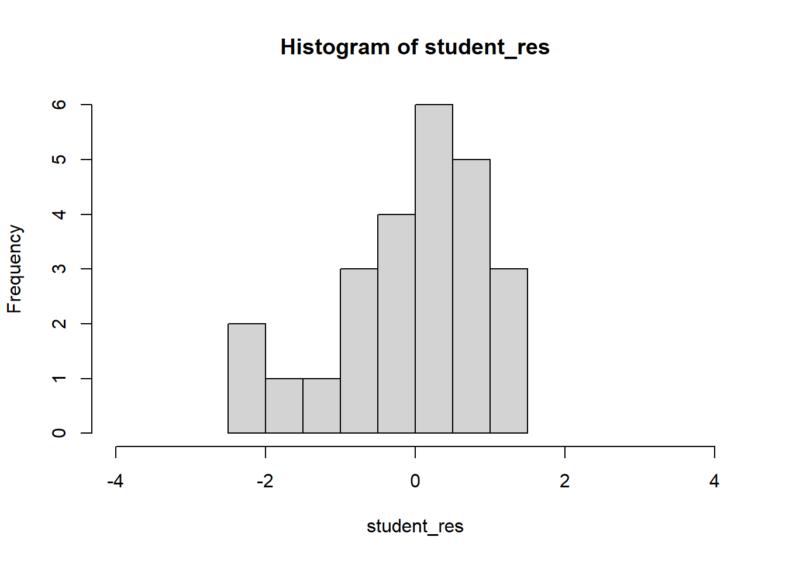

```r
plot(model2$fitted.values,student_res,pch=22,bg=1,ylim=c(-2,2))
abline(h=0)
```

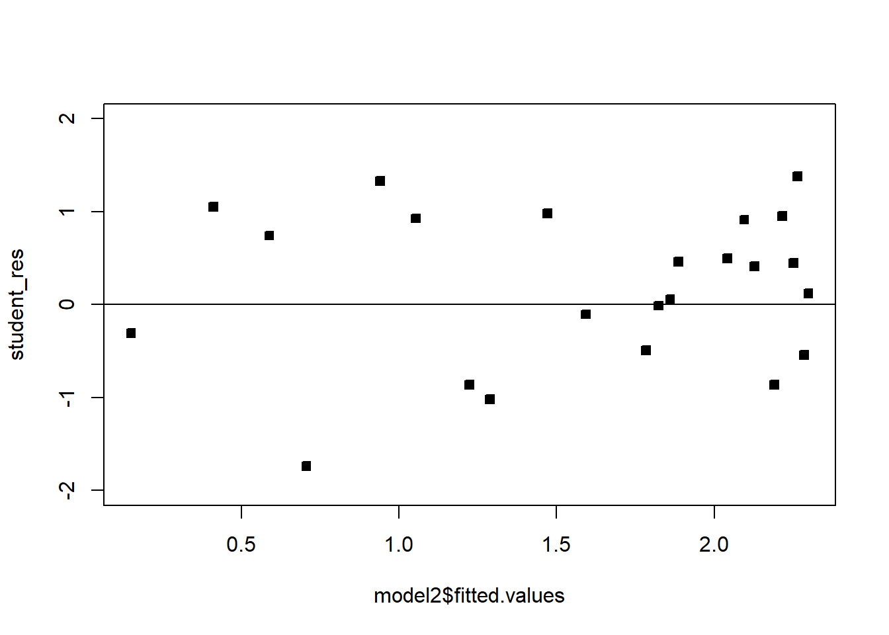

## 5.3 Box Cox Transformations

One technique is to use the data to estimate which transformation is best, a popular instance is the Box-Cox transformation. Consider the class of transformations: \(\{y^\lambda\colon \lambda\in\mathbb{R}\}\). The regression model and \(\lambda\) can be estimated simultaneously using the method of maximum likelihood. Recall that we used the method of least squares to estimate the model parameters - maximum likelihood is an alternative estimation strategy. Think of \(\lambda\) like an extra model parameter, on top of \(\beta\) and \(\sigma\) that we need to estimate.

Let \[\begin{align*}
    \tilde y&=\log^{-1}(1/n\sum_{i=1}^n\log y_i)\\
    y_\lambda&=
\begin{cases}
\dfrac{y^\lambda-1}{\lambda\tilde y^{\lambda-1}}& \lambda\neq 0\\
\tilde y\log y& \lambda= 0
\end{cases}.
\end{align*}\]

We then fit the following model \[y_\lambda=X\beta+\epsilon.\]

Even though \(y^\lambda \neq y_\lambda\), we use \(y^\lambda\) (or \(\log y\) if \(\lambda=0\)) as the final response - as it is more interpretable. It is entirely acceptable to use \(y_\lambda\) as the response for the final model - this model will have a scale difference and an origin shift in comparison to the model using \(y^\lambda\) (or \(\log y\)). Usually the final \(\lambda\) used in the model is rounded to a nice number for interpretation. A computational procedure is used for estimating \(\lambda\), which we will not cover here. In general, we can compute a confidence interval for \(\lambda\), and if it contains 1 then we may not need to transform.

**Example 5.4** Let’s apply the Box-Cox transformation to the two previous examples.

The R function `boxcox` from the `MASS` package can be used to execute the Box-Cox transformation. It requires you to specify a grid of points for \(\lambda\), given below by `seq(-2, 2, 1/10)`. We can set the `plotit` parameter to `TRUE` in order to see if this grid is big enough. We should see a peak or mode in the log-likelihood function that is plotted. If we don’t, we can expand the grid on the side which has the largest value of the log-likelihood. Observe below that we need to include points higher than 2 on the grid, as the function is still increasing for at \(\lambda=2\):

```r
# You need the MASS package. 
# install.packages('MASS')

bc=MASS::boxcox(DCOutput~WindVelocity_mph,data=df_wind,    
       lambda = seq(-2, 2, 1/10), 
       plotit = TRUE,         
       eps = 1/50,     
       xlab = expression(lambda), 
       ylab = "log-Likelihood") 
```

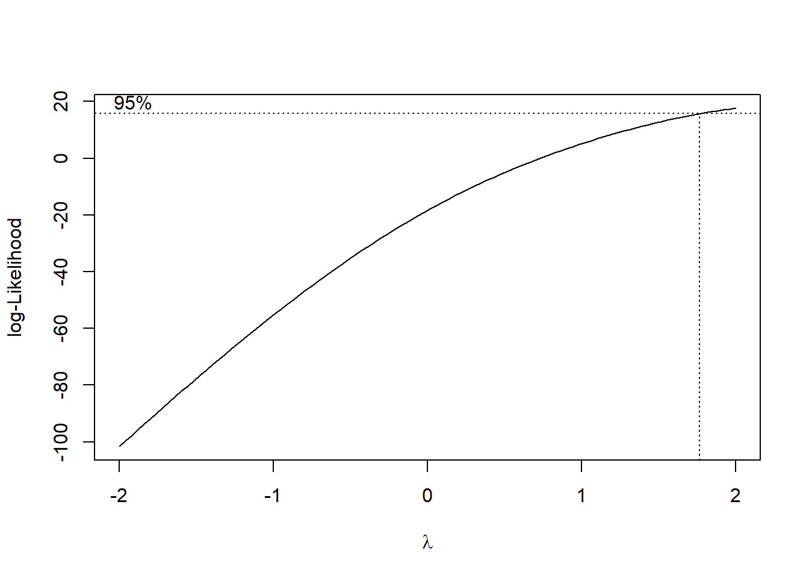

```r
# bc

#Observe that 

bc=MASS::boxcox(DCOutput~WindVelocity_mph,data=df_wind,    
                lambda = seq(0, 5, 1/10), 
                plotit = TRUE,         
                eps = 1/50,     
                xlab = expression(lambda), 
                ylab = "log-Likelihood") 
```

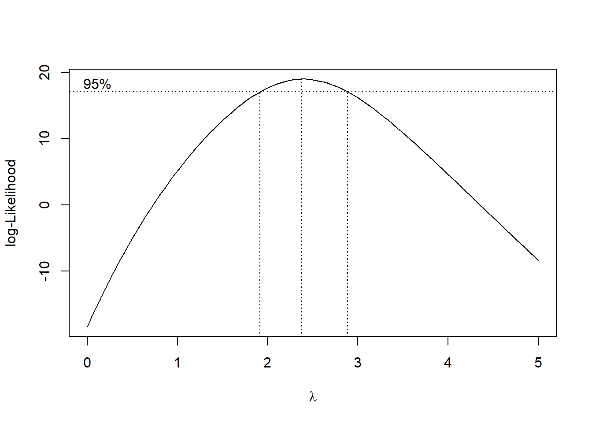

```r
# bc

#Seems like we should try lambda=2 
```

The confidence interval goes from just below 2 to just below 3. Let’s pick a round number, and try the transformation \(\lambda=2\).

```r
# plot(df$DCOutput,log(df$WindVelocity_mph))
model3=lm(DCOutput^2~WindVelocity_mph, df_wind)
model3
```

```

Call:
lm(formula = DCOutput^2 ~ WindVelocity_mph, data = df_wind)

Coefficients:
     (Intercept)  WindVelocity_mph  
         -1.3585            0.7107  
```

```r
summ3=summary(model3); summ3
```

```

Call:
lm(formula = DCOutput^2 ~ WindVelocity_mph, data = df_wind)

Residuals:
     Min       1Q   Median       3Q      Max 
-0.74840 -0.31027  0.05951  0.30793  0.57072 

Coefficients:
                 Estimate Std. Error t value Pr(>|t|)    
(Intercept)      -1.35851    0.21239  -6.396 1.58e-06 ***
WindVelocity_mph  0.71066    0.03211  22.130  < 2e-16 ***
---
Signif. codes:  0 '***' 0.001 '**' 0.01 '*' 0.05 '.' 0.1 ' ' 1

Residual standard error: 0.3979 on 23 degrees of freedom
Multiple R-squared:  0.9551,    Adjusted R-squared:  0.9532 
F-statistic: 489.7 on 1 and 23 DF,  p-value: < 2.2e-16
```

```r
plot(df_wind$WindVelocity_mph,df_wind$DCOutput^2,pch=22,bg=1)
```

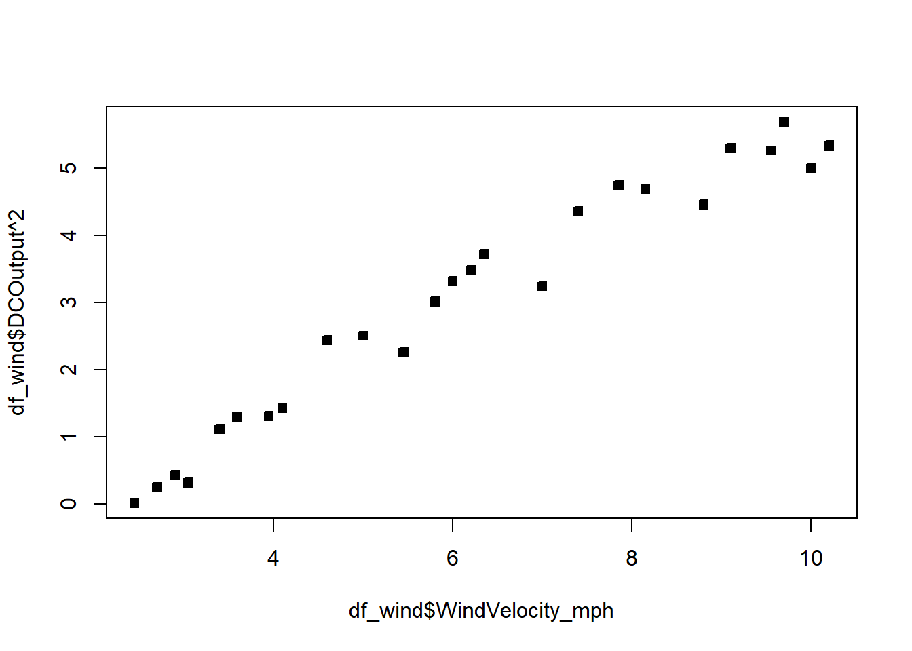

```r
student_res=rstudent(model3)
MSE=summ3$sigma^2
qqnorm(student_res,pch=22,bg=1)
abline(0,1)
```

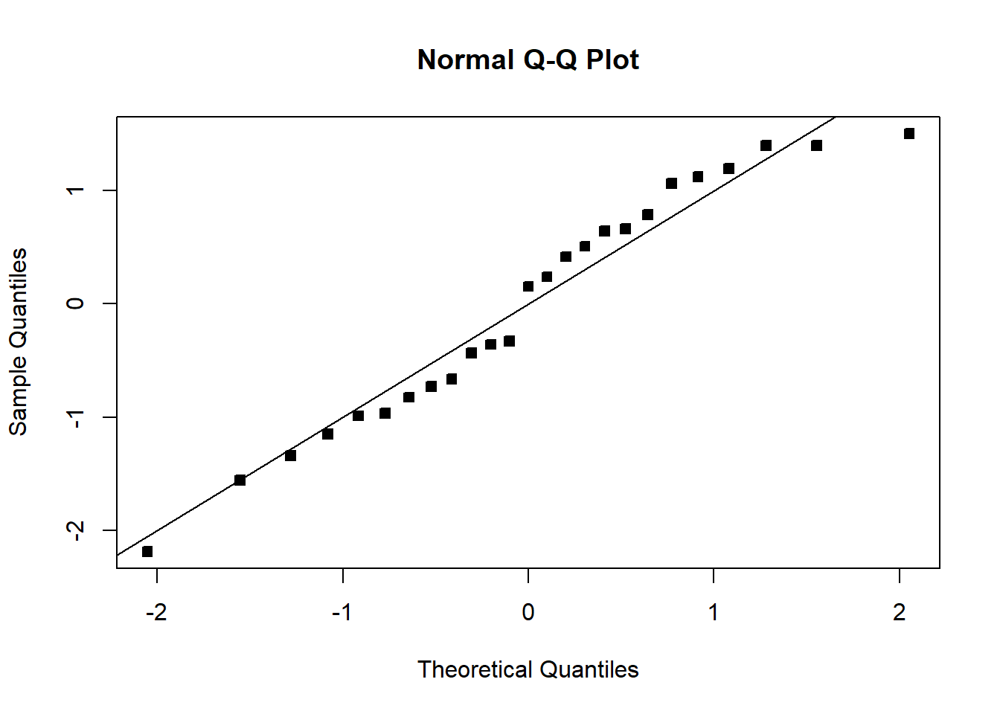

```r
hist(student_res,xlim=c(-4,4))
```

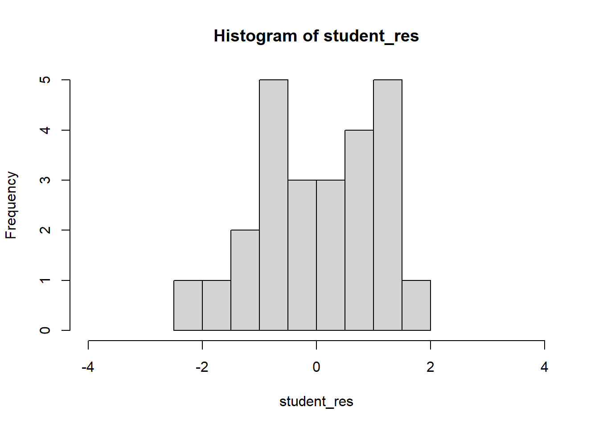

```r
plot(model3$fitted.values,student_res,pch=22,bg=1,ylim=c(-2,2))
abline(h=0)
```

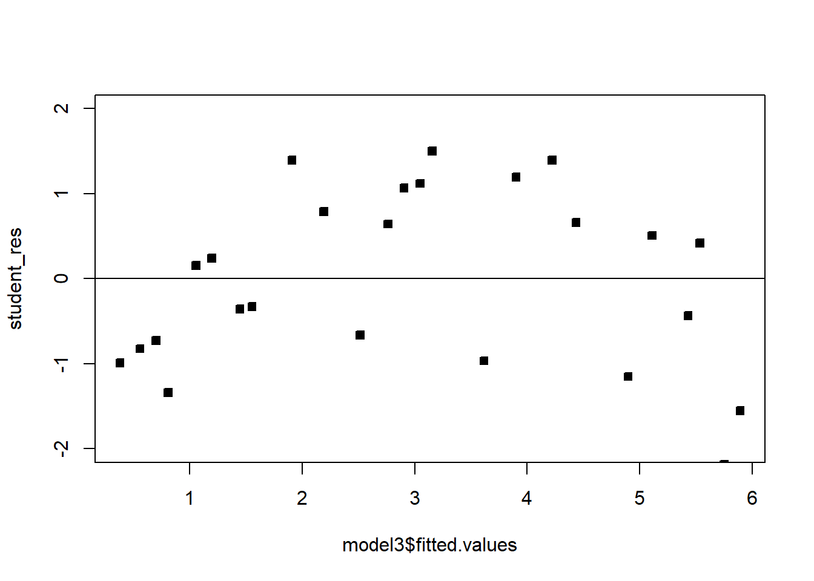

The fit is not bad. The \(R^2\) is very high. There is a pattern in the QQplot and a slight pattern in the residuals plot. For knowing nothing about wind velocity, it is not bad.

The electricity data clearly points to the square root transformation - matching the analysis we did previously.

```r
## Electricity

model=lm(y_kW~x_kWh, df)

bc=MASS::boxcox(y_kW~x_kWh,data=df,    
                lambda = seq(-2, 2, 1/10), 
                plotit = TRUE,         
                eps = 1/50,     
                xlab = expression(lambda), 
                ylab = "log-Likelihood") 
abline(v=0.5)
```

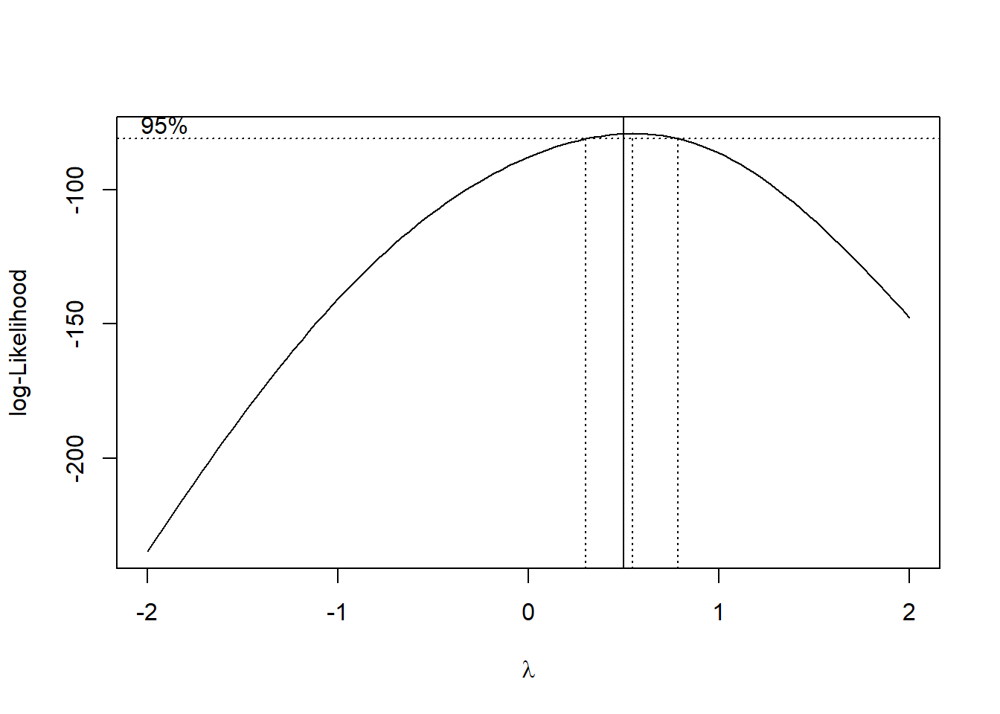

```r
# bc
```

## 5.4 Homework stop

Complete the assigned Chapter 5 questions and complete assignment 2.

Miller, Don M. 1984.
“Reducing Transformation Bias in Curve Fitting.”
The American Statistician
38 (2): 124–26.
http://www.jstor.org/stable/2683247
.
