# Unit_5 - Indicator Variables

# 6 Indicator Variables

Often we will have regressors that are categorical. We now discuss how to include those in a regression model. In general, categorical variables can be included in a regression model via **indicator variables**.

## 6.1 What are indicator variables?

If a regressor has two categories \(A\) and \(B\), that regressor can be included in the model as

\[\begin{equation*}
z= \begin{cases}0 & \text { if the observation is type A } \\ 1 & \text { if the observation is type B }\end{cases}
\end{equation*}\] Sometimes people choose \[\begin{equation*}
z= \begin{cases}-1 & \text { if the observation is type A } \\ 1 & \text { if the observation is type B }\end{cases}.
\end{equation*}\]

The variable \(z\) is an indicator variable. Indicator variables are in numeric form, and can therefore be included in the design matrix \(X\) in the usual way we do for continuous regressors.

**Example 6.1** Let’s recall [Example 3.1](Unit_2.html#exm-3-1-1) and suppose we have some new data as follows:

It is difficult to accurately determine a person’s body fat percentage without immersing them in water. However, we can easily obtain the weight of a person. A researcher would like to know if weight and body fat percentage are related? They also suspect that sex plays a role in the prediction. This researcher collected the following data:

| Individual | 1 | 2 | 3 | 4 | 5 | 6 | 7 | 8 | 9 | 10 |
| --- | --- | --- | --- | --- | --- | --- | --- | --- | --- | --- |
| Weight (lb) | 175 | 181 | 200 | 159 | 196 | 192 | 205 | 173 | 187 | 188 |
| Body Fat (%) | 6 | 21 | 15 | 6 | 22 | 31 | 32 | 21 | 25 | 30 |
| Sex | F | M | F | F | M | F | F | M | M | F |
| ———— | —– | —– | —– | —– | —– | —– | —– | —– | —– | —– |
| Individual | 11 | 12 | 13 | 14 | 15 | 16 | 17 | 18 | 19 | 20 |
| Weight (lb) | 188 | 240 | 175 | 168 | 246 | 160 | 215 | 159 | 146 | 219 |
| Body Fat (%) | 10 | 20 | 22 | 9 | 38 | 10 | 27 | 12 | 10 | 28 |
| Sex | F | F | M | M | F | F | M | F | F | M |

Write out the appropriate indicator variable for Sex. Interpret the resulting regression equation for regressing Body fat against weight and sex. Interpret the coefficient that corresponds to the Sex variable.

We have that \[\begin{equation*}
X_{2i}= \begin{cases}0 & \text { if the subject $i$ is male } \\ 1 &  \text { if the subject $i$ is female }\end{cases}.
\end{equation*}\]

The regression equation is then \[Y_i|X=\beta_0+\beta_1X_{i1}+\beta_2X_{i2}+\epsilon_i,\] where \(X_{i1}\) is the weight of individual \(i\).

When \(X_{i2}=0\), then the regression equation for males is given by \(Y_i|X=\beta_0+\beta_1X_{i1}+\epsilon_i\). Therefore, the expected body fat percentage for males is \({\textrm{E}}\left[Y_i|X\right]=\beta_0+\beta_1X_{i1}\). Additionally, when \(X_{i2}=1\), then the regression equation for females is given by \(Y_i|X=\beta_0+\beta_1X_{i1}+\beta_2+\epsilon_i\). It follows that the expected body fat percentage for females is \({\textrm{E}}\left[Y_i|X\right]=\beta_0+\beta_1X_{i1}+\beta_2\). Thus, we have that the expected body fat percentage for females is \(\beta_2\) higher than for males, holding weight constant. This is the interpretation of the coefficient for the dummy variable in this case. Observe that for males and females, the regression lines are parallel. The model says that sex accounts for a constant shift in your expected body fat, but the slope (the coefficient for weight) of the regression line remains the same.

Let’s observe.

```r
# Make the data frame
Weight=c(175 , 181 , 200 , 159 , 196 , 192 , 205 , 173 , 187 , 188 , 
         188 , 240 , 175 , 168 , 246 , 160 , 215 , 159 , 146 , 219 )
BodyFat =c(6 , 21 , 15 , 6 , 22 , 31 , 32 ,21 , 25 , 30 , 
           10 , 20 , 22 , 9 , 38 , 10 , 27 , 12 , 10 , 28 )
Sex=c("F","M","F","F","M","F","F","M","M","F","F","F","M","M","F","F","M","F","F","M")

df=data.frame(Weight=Weight,BodyFat=BodyFat,Sex=Sex,stringsAsFactors = T)

df$Sex=relevel(df$Sex,"M")

mod=lm(BodyFat~Weight+Sex,data=df)
summary(mod)
```

```

Call:
lm(formula = BodyFat ~ Weight + Sex, data = df)

Residuals:
     Min       1Q   Median       3Q      Max 
-11.2198  -5.3804  -0.1767   3.6719  11.7136 

Coefficients:
             Estimate Std. Error t value Pr(>|t|)    
(Intercept) -25.17526   11.73681  -2.145 0.046695 *  
Weight        0.24861    0.06061   4.102 0.000743 ***
SexF         -3.27233    3.21493  -1.018 0.323014    
---
Signif. codes:  0 '***' 0.001 '**' 0.01 '*' 0.05 '.' 0.1 ' ' 1

Residual standard error: 7.042 on 17 degrees of freedom
Multiple R-squared:  0.5149,    Adjusted R-squared:  0.4578 
F-statistic: 9.021 on 2 and 17 DF,  p-value: 0.002137
```

```r
plot(df$Weight,df$BodyFat,bg=((df$Sex=="M")+1),pch=21)
abline(coef(mod)[1],coef(mod)[2],col=2)
abline(coef(mod)[1]+coef(mod)[3],coef(mod)[2],col=1)
```

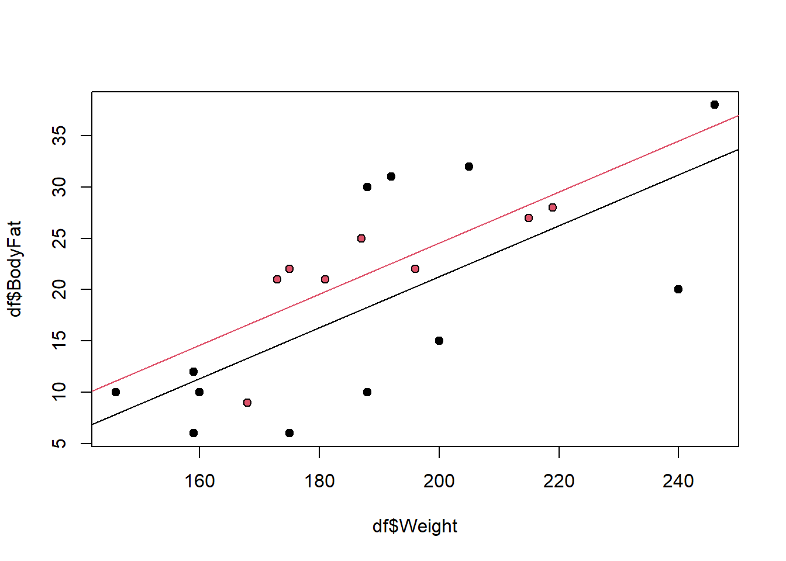

We can generalize this idea out of this example. In the case of two categories, the interpretation of the coefficient for the dummy variable is given as follows: Holding other regressors constant, on average, the change in response attributed to the case where the dummy variable is 1, relative to the case where the dummy variable is 0, is given by the coefficient for the dummy variable.

Moving on, a regressor that has \(k\) categories can be represented by \(k-1\) indicator variables:

| \(x_1\) | \(x_2\) | \(\ldots\) | \(x_{k-1}\) | Category |
| --- | --- | --- | --- | --- |
| 0 | 0 | \(\ldots\) | 0 | 1 |
| 1 | 0 | \(\ldots\) | 0 | 2 |
| 0 | 1 | \(\ldots\) | 0 | 3 |
| \(\vdots\) | \(\vdots\) | \(\ldots\) | \(\vdots\) | \(\vdots\) |
| 0 | 0 | \(\ldots\) | 1 | \(k\) |

In this case, the category, or level, where all dummy variables are equal to 0 is the **reference category**. The reference category is the baseline we will compare all other categories to. You may want to choose this carefully. In this case, the interpretation of each of the \(k-1\) coefficients is going to be as follows: Holding other regressors constant, on average, the change in response attributed to the case where the dummy variable corresponding to the coefficient is 1, relative to the reference category, is given by the coefficient for the dummy variable. Note that the reference category has no variable associated with it.

**Example 6.2** When evaluating factors that affect the price of real estate, we may wish to consider location, while adjusting for lot size, year built and finished square feet. The data set `clean_data.csv` contains the prices of various types of real estate, as well as several important regressors. Regress the sale price on location, lot size, year built and finished square feet. Interpret the coefficient related to District 14. According to the model, holding other variables constant, what district has the highest priced properties? the lowest? Observe that District 7 has a non significant coefficient. In this case, what does it mean for District 7 to have a coefficient of 0?

```r
####### Packages needed  ##############

library(lubridate) 
```

```
Warning: package 'lubridate' was built under R version 4.5.2
```

```

Attaching package: 'lubridate'
```

```
The following objects are masked from 'package:base':

    date, intersect, setdiff, union
```

```r
# Example: We would like to see how sale price of a home is related to
# various factors

####### Loading data  ##############

df_clean2=read.csv('clean_data.csv',stringsAsFactors = T)
df_clean2$District=as.factor(df_clean2$District)

# The first level is the reference category
attributes(df_clean2$District)$levels[1]
```

```
[1] "1"
```

```r
####### Fitting the model  ##############
model=lm(Sale_price~District+Fin_sqft+Lotsize+Year_Built,df_clean2)

summ=summary(model); summ
```

```

Call:
lm(formula = Sale_price ~ District + Fin_sqft + Lotsize + Year_Built, 
    data = df_clean2)

Residuals:
    Min      1Q  Median      3Q     Max 
-399923  -25360     426   23383 1580056 

Coefficients:
              Estimate Std. Error t value Pr(>|t|)    
(Intercept) -9.170e+05  4.175e+04 -21.963  < 2e-16 ***
District2    1.335e+04  2.312e+03   5.772 7.92e-09 ***
District3    1.815e+05  2.462e+03  73.723  < 2e-16 ***
District4   -3.525e+04  4.777e+03  -7.378 1.66e-13 ***
District5    5.552e+04  1.988e+03  27.923  < 2e-16 ***
District6    1.202e+04  2.849e+03   4.218 2.47e-05 ***
District7   -4.300e+03  2.482e+03  -1.732  0.08327 .  
District8    1.732e+04  2.708e+03   6.396 1.62e-10 ***
District9    2.810e+04  2.474e+03  11.361  < 2e-16 ***
District10   6.363e+04  2.073e+03  30.699  < 2e-16 ***
District11   7.032e+04  1.990e+03  35.333  < 2e-16 ***
District12   1.014e+04  3.240e+03   3.129  0.00175 ** 
District13   6.877e+04  2.057e+03  33.430  < 2e-16 ***
District14   1.026e+05  2.086e+03  49.212  < 2e-16 ***
District15  -3.375e+04  3.050e+03 -11.066  < 2e-16 ***
Fin_sqft     6.519e+01  6.525e-01  99.899  < 2e-16 ***
Lotsize      3.906e+00  1.228e-01  31.812  < 2e-16 ***
Year_Built   4.506e+02  2.153e+01  20.930  < 2e-16 ***
---
Signif. codes:  0 '***' 0.001 '**' 0.01 '*' 0.05 '.' 0.1 ' ' 1

Residual standard error: 55680 on 24604 degrees of freedom
Multiple R-squared:  0.5889,    Adjusted R-squared:  0.5886 
F-statistic:  2073 on 17 and 24604 DF,  p-value: < 2.2e-16
```

```r
coef(model)[which.max(coef(model))]
```

```
District3 
 181495.9 
```

```r
coef(model)[order(coef(model))[1:3]]
```

```
(Intercept)   District4  District15 
 -916960.88   -35245.83   -33748.17 
```

1. Interpret the coefficient for District 14: Holding lot size, finished square feet and year built constant, on average, the change in the price of a property in District 14, relative to District 1, is 102 600.
2. According to the model, holding other variables constant, what district has the highest priced properties on average? the lowest? The highest coefficient is District 3, and it is positive, so,holding other variables constant, on average District 3 has the highest priced properties. The lowest coefficient is District 4, and it is negative, so, holding other variables constant, on average District 4 has the lowest priced properties.
3. Observe that District 7 has a non significant coefficient. In this case, what does it mean for District 7 to have a coefficient of 0? This means that there is not enough evidence to show that District 1 and District 7 have different prices, holding other variables constant, on average.

Note
If all coefficients for the dummy variables are positive, then the reference category has the lowest average value of the response. Analogously, if all coefficients for the dummy variables are negative, then the reference category has the highest average value of the response. Why? Use the interpretation of the coefficients to answer this question.

Note
ANOVA is Regression!- In one-way ANOVA, recall that we test for a difference in group means for a continuous response. We can represent the treatment groups with dummy variables and view this as a regression problem. That is, regressing the outcome on the dummy variables. It turns out that the regression ANOVA, that is, the overall \(F\)-test, applied to these dummy variables is equivalent to the one-way ANOVA (see Section 8.3 of the textbook.)

## 6.2 Interaction effects

An interaction effect occurs when the effect of one regressor on the response depends on the value of another regressor. In other words, the combined effect of two variables is not simply additive; the value of one variable modifies the impact of the other. In linear regression, this means that the coefficient of one regressor depends on the other.

We now give a simple example:

Suppose we are studying the effect of hours studied (\(X_1\)) and attendance (\(X_2\)) on exam scores (\(Y\)). An interaction effect between \(X_1\) and \(X_2\) would imply that the effect of studying on exam scores is different depending on the level of attendance. This can be modeled by including an interaction term (\(X_1 \times X_2\)) in the regression equation:

\[Y_i = \beta_0 + \beta_1 X_{1i} + \beta_2 X_{2i} + \beta_3 (X_{1i} \times X_{2i}) + \epsilon_i.\]

The coefficient \(\beta_3\) represents the interaction effect between X1 and X2. For instance, if \(\beta_3>0\), then the more the student has attended the course, the more beneficial the student’s hours studied will be.

Some examples of how interaction effects are applied in real life are given by:

- **Psychology**: Studying how different treatments and demographic factors interact to influence behavior.
- **Marketing**: Analyzing how different marketing strategies and customer demographics interact to affect sales.
- **Medicine**: Investigating how different drugs and patient characteristics interact to affect health outcomes.

**Example 6.3** Let’s recall [Example 6.1](#exm-6-1-1) and suppose the researcher would like you to include the interaction effect between Weight and Sex. Explain how the regression line changes with a non-zero interaction effect. Interpret the estimated interaction effect. Is it significant?

The regression equation is \[Y_i|X=\beta_0+\beta_1X_{i1}+\beta_2X_{i2}+\beta_3X_{i1}X_{i2}+\epsilon_i.\] If \(\beta_3\neq 0\) then we proceed as follows. When \(X_{i2}=0\), then the regression equation for males is still given by \(Y_i|X=\beta_0+\beta_1X_{i1}+\epsilon_i\). Therefore, the expected body fat percentage for males is \({\textrm{E}}\left[Y_i|X\right]=\beta_0+\beta_1X_{i1}\). Additionally, when \(X_{i2}=1\), then the regression equation for females is given by \[Y_i|X=\beta_0+\beta_1X_{i1}+\beta_2+\beta_3X_{i1}+\epsilon_i=\beta_0+(\beta_1+\beta_3)X_{i1}+\beta_2+\epsilon_i.\] It follows that the expected body fat percentage for females is \({\textrm{E}}\left[Y_i|X\right]=\beta_0+(\beta_1+\beta_3)X_{i1}+\beta_2\). Thus, adding an interaction effect allows the model to generate a completely different regression line, that is a different slope **and** intercept for females. The expected body fat percentage for females is then \(\beta_2+\beta_3X_{i1}\) higher than for males, holding weight constant. Adding an interaction effect allows the slope to also vary, depending on whether the subject is male or female.

Let’s observe.

```r
# Make the data frame
Weight=c(175 , 181 , 200 , 159 , 196 , 192 , 205 , 173 , 187 , 188 , 
         188 , 240 , 175 , 168 , 246 , 160 , 215 , 159 , 146 , 219 )
BodyFat =c(6 , 21 , 15 , 6 , 22 , 31 , 32 ,21 , 25 , 30 , 
           10 , 20 , 22 , 9 , 38 , 10 , 27 , 12 , 10 , 28 )
Sex=c("F","M","F","F","M","F","F","M","M","F","F","F","M","M","F","F","M","F","F","M")

df=data.frame(Weight=Weight,BodyFat=BodyFat,Sex=Sex,stringsAsFactors = T)

df$Sex=relevel(df$Sex,"M")

mod=lm(BodyFat~Weight+Sex+Weight*Sex,data=df)
summary(mod)
```

```

Call:
lm(formula = BodyFat ~ Weight + Sex + Weight * Sex, data = df)

Residuals:
     Min       1Q   Median       3Q      Max 
-11.4171  -5.3084   0.1178   3.4912  11.7087 

Coefficients:
             Estimate Std. Error t value Pr(>|t|)
(Intercept) -22.13450   27.12486  -0.816    0.426
Weight        0.23255    0.14269   1.630    0.123
SexF         -7.02921   30.18090  -0.233    0.819
Weight:SexF   0.01987    0.15869   0.125    0.902

Residual standard error: 7.255 on 16 degrees of freedom
Multiple R-squared:  0.5153,    Adjusted R-squared:  0.4245 
F-statistic: 5.671 on 3 and 16 DF,  p-value: 0.007662
```

```r
plot(df$Weight,df$BodyFat,bg=((df$Sex=="M")+1),pch=21)
abline(coef(mod)[1],coef(mod)[2],col=2)
abline(coef(mod)[1]+coef(mod)[3],coef(mod)[2]+coef(mod)[4],col=1)
```

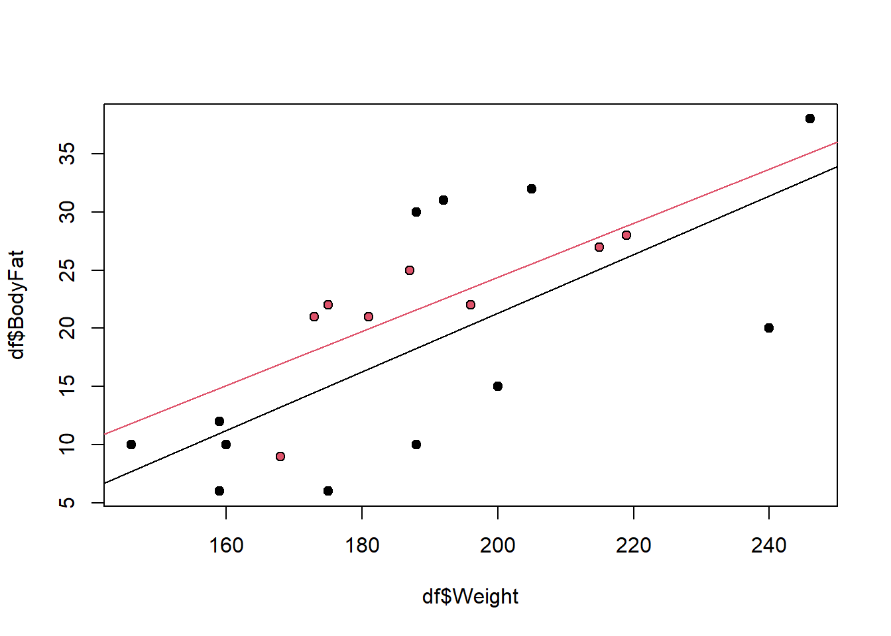

Notice how the slopes of the regression lines differ! Now, the estimated interaction effect is `0.01987`. Let’s interpret it. We have that, on average, for every one lb increase in weight, the body fat percentage of a female increases by 0.01987 more than that of a male.

(In this case, the term is not significant, so we would probably drop it.)

Note
We can include interaction effects in the regression model in R by adding `variable_1*variable_2` to the right-hand side of the formula equation.

**Example 6.4** When evaluating factors that affect the price of real estate, we may wish to consider location, while adjusting for lot size, year built and finished square feet. The data set `clean_data.csv` contains the prices of various types of real estate, as well as several important regressors. Regress the sale price on location, lot size, year built and finished square feet. Add an interaction term between year built and location. Interpret the interaction term for District 14.

```r
####### Fitting the model  ##############
model=lm(Sale_price~District+Fin_sqft+Lotsize+Year_Built+Year_Built*District,df_clean2)

summ=summary(model); summ
```

```

Call:
lm(formula = Sale_price ~ District + Fin_sqft + Lotsize + Year_Built + 
    Year_Built * District, data = df_clean2)

Residuals:
    Min      1Q  Median      3Q     Max 
-400250  -24589     441   23005 1569420 

Coefficients:
                        Estimate Std. Error t value Pr(>|t|)    
(Intercept)           -1.567e+06  2.215e+05  -7.077 1.52e-12 ***
District2              9.848e+05  3.594e+05   2.740 0.006148 ** 
District3             -2.929e+05  2.723e+05  -1.076 0.282044    
District4              6.838e+05  3.573e+05   1.914 0.055676 .  
District5              1.551e+06  2.634e+05   5.888 3.97e-09 ***
District6              5.445e+05  2.683e+05   2.029 0.042446 *  
District7             -7.242e+05  3.234e+05  -2.239 0.025139 *  
District8              8.463e+05  3.000e+05   2.821 0.004790 ** 
District9             -5.339e+04  3.041e+05  -0.176 0.860634    
District10             8.690e+05  2.602e+05   3.339 0.000842 ***
District11             1.899e+05  2.660e+05   0.714 0.475313    
District12             1.282e+06  2.994e+05   4.283 1.85e-05 ***
District13             6.296e+05  2.557e+05   2.463 0.013799 *  
District14             1.502e+06  2.392e+05   6.278 3.49e-10 ***
District15             5.815e+04  2.610e+05   0.223 0.823727    
Fin_sqft               6.497e+01  6.659e-01  97.556  < 2e-16 ***
Lotsize                3.989e+00  1.237e-01  32.256  < 2e-16 ***
Year_Built             7.850e+02  1.139e+02   6.891 5.68e-12 ***
District2:Year_Built  -4.986e+02  1.841e+02  -2.708 0.006770 ** 
District3:Year_Built   2.547e+02  1.409e+02   1.807 0.070772 .  
District4:Year_Built  -3.703e+02  1.858e+02  -1.993 0.046287 *  
District5:Year_Built  -7.666e+02  1.352e+02  -5.668 1.46e-08 ***
District6:Year_Built  -2.727e+02  1.388e+02  -1.965 0.049443 *  
District7:Year_Built   3.734e+02  1.667e+02   2.240 0.025118 *  
District8:Year_Built  -4.278e+02  1.555e+02  -2.751 0.005938 ** 
District9:Year_Built   3.721e+01  1.555e+02   0.239 0.810891    
District10:Year_Built -4.146e+02  1.340e+02  -3.093 0.001985 ** 
District11:Year_Built -6.285e+01  1.366e+02  -0.460 0.645462    
District12:Year_Built -6.608e+02  1.555e+02  -4.251 2.14e-05 ***
District13:Year_Built -2.887e+02  1.314e+02  -2.198 0.027981 *  
District14:Year_Built -7.231e+02  1.232e+02  -5.869 4.43e-09 ***
District15:Year_Built -4.403e+01  1.347e+02  -0.327 0.743706    
---
Signif. codes:  0 '***' 0.001 '**' 0.01 '*' 0.05 '.' 0.1 ' ' 1

Residual standard error: 55410 on 24590 degrees of freedom
Multiple R-squared:  0.5931,    Adjusted R-squared:  0.5925 
F-statistic:  1156 on 31 and 24590 DF,  p-value: < 2.2e-16
```

Observe that the interaction term between year built and District 14 is -723.1$. In addition, note that year built has a positive coefficient of 785$. We can interpret the interaction effect as follows: Holding finished square feet and lot size constant, a one year increase in year built for a home in District 14 results in an increase in price that is \(723.1\) lower than that of District 1. We can also reword this to make it a little more clear - Holding finished square feet and lot size constant, a one year increase in year built for a home in District 1 results in an increase in price that is \(723.1\) higher than that of District 14.

To see this observe that for a one unit increase in year built in District 14, we have that the price goes up by 785.0-723.1=61.9 on average, holding other variables constant. On the other hand, in District 1, the price goes up by 785.0 on average, holding other variables constant. Therefore, in general, newer homes are much more valuable in District 1.

**Exercise 6.1** Interpret the main effects and the interaction effect with year built for Districts 2-4. (The main effects are the coefficients for Districts 2-4.)

Warning
Including interaction effects changes the interpretation of the main effects. When a variable is involved in an interaction term, its main effect no longer represents its overall marginal association with the response. Instead, the main effect must be interpreted at the level where the interacting variable is equal to 0 (i.e., at the reference or baseline value used in the model).

**Note:** Including interaction effects changes how we interpret the main effects.

When a variable is involved in an interaction term, its main effect no longer represents its overall marginal association with the response. Instead, the main effect is interpreted **at the level where the interacting variable equals 0** (the baseline level used in the model).

---

Suppose we fit the model

\[
\text{ExamScore} = \beta_0 + \beta_1 \text{StudyHours} + \beta_2 \text{ProgramStats} +
\beta_3(\text{StudyHours} \times \text{ProgramStats}) + \varepsilon,
\]

where `ProgramStats = 1` for Stats students and `0` for the baseline group (Math students).

This model includes an interaction between **StudyHours** and **Program**.

- 
    **Interpretation of \(\beta_1\)** (main effect of StudyHours):

\(\beta_1\) is *not* the overall effect of increasing StudyHours.

It is the effect **only for Math students**, because Math is coded as 0 for `ProgramStats`.

In other words, \(\beta_1\) is the slope of StudyHours **when ProgramStats = 0**.

- 
    **Interpretation of \(\beta_2\)** (main effect of ProgramStats):

\(\beta_2\) is *not* the overall difference between Stats and Math students.

It compares Stats vs. Math **when StudyHours = 0**, because the interaction term equals 0 at StudyHours = 0.

---

This example shows that once an interaction is included, the main effects must be interpreted **at the point where the other interacting variable is 0**.

Warning
The interpretation for interaction effects is difficult and nuanced. Make sure you study this topic carefully.

## 6.3 Increasing codes and quantitative regressors via dummy variables

Another approach to the treatment of a qualitative variable in regression is to measure the levels of the variable by an allocated code. Suppose we model the effect of the number of bedrooms on real estate price by its numerical value, instead of categorical value. Let’s see what happens to the regression equation. In general, ordinal variables may be better represented by dummy variables/indicators - however, dummy variables increase the complexity of the model, which we may not have enough data to support, and could lead to overfitting.

**Example 6.5** When evaluating factors that affect the price of real estate, we may wish to consider the unadjusted effect of the number of bedrooms. Regress the sale price on number of bedrooms treating number of bedrooms as a continuous variable. Then, regress the sale price on number of bedrooms treating number of bedrooms as a categorical variable. Compare and contrast the two models, and the resulting fits.

```r
####### Fitting the model  ##############
unique(df_clean2$Bdrms)
```

```
 [1] >8 2  0  4  7  3  1  6  8  5 
Levels: >8 0 1 2 3 4 5 6 7 8
```

```r
# Drop these rows
df_clean3=df_clean2[df_clean2$Bdrms!='>8',]
df_clean3$Bdrms=droplevels(df_clean3$Bdrms)
df_clean3$Bdrms=relevel(df_clean3$Bdrms,"0")
# Add new continuous variable
df_clean3$Bdrms2=as.numeric(df_clean3$Bdrms)-1

boxplot(Sale_price~Bdrms,df_clean3)
```

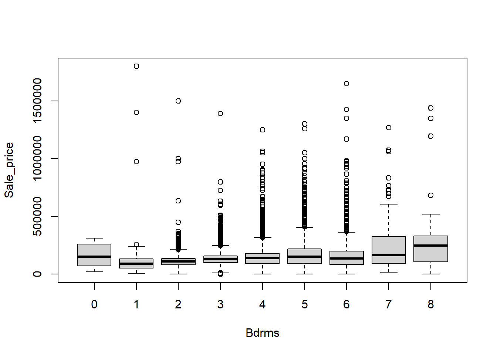

```r
model_ca=lm(Sale_price~Bdrms,df_clean3)
model_co=lm(Sale_price~Bdrms2,df_clean3)

summ=summary(model_ca); summ
```

```

Call:
lm(formula = Sale_price ~ Bdrms, data = df_clean3)

Residuals:
    Min      1Q  Median      3Q     Max 
-271312  -43342   -6342   26658 1672084 

Coefficients:
            Estimate Std. Error t value Pr(>|t|)    
(Intercept)   161825      29764   5.437 5.47e-08 ***
Bdrms1        -33909      30818  -1.100 0.271216    
Bdrms2        -53113      29800  -1.782 0.074712 .  
Bdrms3        -28483      29774  -0.957 0.338758    
Bdrms4        -15157      29785  -0.509 0.610830    
Bdrms5         24156      29852   0.809 0.418414    
Bdrms6          6826      29861   0.229 0.819189    
Bdrms7         81735      30717   2.661 0.007798 ** 
Bdrms8        109487      31332   3.494 0.000476 ***
---
Signif. codes:  0 '***' 0.001 '**' 0.01 '*' 0.05 '.' 0.1 ' ' 1

Residual standard error: 84190 on 24586 degrees of freedom
Multiple R-squared:  0.05675,   Adjusted R-squared:  0.05644 
F-statistic: 184.9 on 8 and 24586 DF,  p-value: < 2.2e-16
```

```r
summ=summary(model_co); summ
```

```

Call:
lm(formula = Sale_price ~ Bdrms2, data = df_clean3)

Residuals:
    Min      1Q  Median      3Q     Max 
-224144  -43153   -6651   26849 1705343 

Coefficients:
            Estimate Std. Error t value Pr(>|t|)    
(Intercept)  76159.0     1849.3   41.18   <2e-16 ***
Bdrms2       18498.1      522.4   35.41   <2e-16 ***
---
Signif. codes:  0 '***' 0.001 '**' 0.01 '*' 0.05 '.' 0.1 ' ' 1

Residual standard error: 84540 on 24593 degrees of freedom
Multiple R-squared:  0.04851,   Adjusted R-squared:  0.04847 
F-statistic:  1254 on 1 and 24593 DF,  p-value: < 2.2e-16
```

Observe that the continuous model says that for every additional bedroom, on average the price increases by 18 498$. On the other hand, the categorical model says that the change in price depends on the number of bedrooms. For example, going from 0 bedrooms to 1 bedroom, we actually see a reduction in price of -33 909$. Let’s graph the expected price for each number of bedrooms from both models:

```r
####### Fitting the model  ##############
new_dat=data.frame('Bdrms'=sort(unique(df_clean3$Bdrms)))
new_dat2=data.frame('Bdrms2'=0:8)
# predict(model_ca,new_dat)
# predict(model_co,new_dat2)

observed_means=aggregate(Sale_price~Bdrms,data=df_clean3, FUN = "mean")
plot(observed_means[,1],observed_means[,2],pch=25,bg=1,cex=3,ylim=c( 70000,300000))
points(x=observed_means[,1],predict(model_ca,new_dat),pch=21,bg=2,cex=2)
points(x=observed_means[,1],predict(model_co,new_dat2),pch=22,bg=3,cex=2)
legend("topleft",legend=c("Observed means","Cat. model","Cont. model"),pch=c(21,21,22),pt.bg=c(1,2,3),cex=1.2)
```

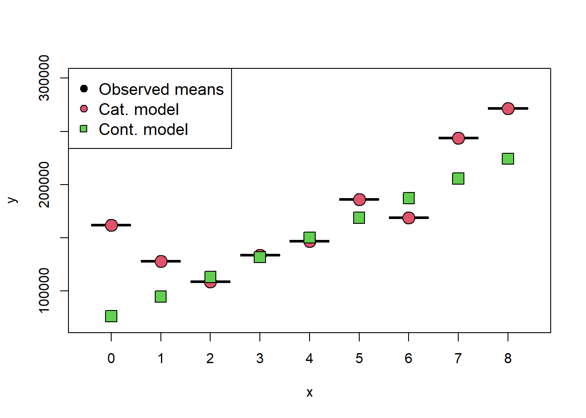

Observe that the continuous model does not match the data at all, while the categorical model is able to model the **non-linear** relationship between the number of bedrooms and the sale price! Why is this the case? Treating a regressor as continuous implies that there is a linear relationship between that regressor and the response. On the other hand, modelling the variable with indicators does not place any assumption on the relationship between the regressor and the response. The drawback, is that we need 7 more parameters in the model.

Warning
When deciding to treat continuous or ordinal variables as continuous, it is critical that you evaluate whether it is acceptable to assume a linear relationship between the regression and the response. If you cannot verify this assumption, or it seems invalid, it is best to treat the regressor as categorical.

Quantitative regressors can also be represented by indicator variables. Sometimes this is necessary because it is difficult to collect accurate information on the quantitative regressor, or the exact values are obscured for privacy reasons. Treating a quantitative factor as a qualitative one increases the complexity of the model. This approach also reduces the degrees of freedom for error. However, the indicator variable approach does not require the analyst to make any prior assumptions about the functional form of the relationship between the response and the regressor variable, as previously discussed.

## 6.4 A larger scale example

It is a good time to stop introducing new material and do a larger scale example.

**Example 6.6** Explore the pricing data, and evaluate what factors influence the price of a property. Be sure to assess the fit of the model and check assumptions.

```r
####### Packages needed  ##############

library(lubridate) 

# Example: We would like to see how sale price 
# of a home is related to
# various factors

####### Loading data  ##############

df_clean2=read.csv('C:/Users/12RAM/OneDrive - York University/Teaching/Courses/Math 3330 Regression/Lecture Codes/clean_data.csv',stringsAsFactors = T)

####### Analyzing the data via EDA  ##############

names(df_clean2)
```

```
 [1] "District"   "Extwall"    "Stories"    "Year_Built" "Fin_sqft"  
 [6] "Units"      "Bdrms"      "Fbath"      "Lotsize"    "Sale_date" 
[11] "Sale_price"
```

```r
df_clean2$District=as.factor(df_clean2$District)

df_clean2=df_clean2[,c('Sale_price','Fin_sqft',
                       'District','Sale_date','Year_Built','Lotsize')]

# Sale price, as a fn of sq ft, Distict, Sale_date, Year_Built, Lotsize

model=lm(Sale_price~Fin_sqft+District+Sale_date+ Year_Built+ Lotsize,data=df_clean2)
summary(model)
```

```

Call:
lm(formula = Sale_price ~ Fin_sqft + District + Sale_date + Year_Built + 
    Lotsize, data = df_clean2)

Residuals:
    Min      1Q  Median      3Q     Max 
-396057  -25416     299   23393 1582073 

Coefficients:
              Estimate Std. Error t value Pr(>|t|)    
(Intercept) -9.956e+05  4.193e+04 -23.744  < 2e-16 ***
Fin_sqft     6.495e+01  6.500e-01  99.928  < 2e-16 ***
District2    1.372e+04  2.303e+03   5.959 2.58e-09 ***
District3    1.818e+05  2.452e+03  74.145  < 2e-16 ***
District4   -3.407e+04  4.758e+03  -7.161 8.23e-13 ***
District5    5.587e+04  1.980e+03  28.219  < 2e-16 ***
District6    1.231e+04  2.837e+03   4.340 1.43e-05 ***
District7   -4.386e+03  2.472e+03  -1.774  0.07603 .  
District8    1.804e+04  2.697e+03   6.691 2.27e-11 ***
District9    2.796e+04  2.463e+03  11.352  < 2e-16 ***
District10   6.393e+04  2.064e+03  30.973  < 2e-16 ***
District11   7.048e+04  1.982e+03  35.560  < 2e-16 ***
District12   9.987e+03  3.226e+03   3.096  0.00197 ** 
District13   6.867e+04  2.049e+03  33.519  < 2e-16 ***
District14   1.031e+05  2.077e+03  49.614  < 2e-16 ***
District15  -3.352e+04  3.037e+03 -11.037  < 2e-16 ***
Sale_date    4.705e+00  3.256e-01  14.449  < 2e-16 ***
Year_Built   4.514e+02  2.144e+01  21.056  < 2e-16 ***
Lotsize      3.906e+00  1.223e-01  31.953  < 2e-16 ***
---
Signif. codes:  0 '***' 0.001 '**' 0.01 '*' 0.05 '.' 0.1 ' ' 1

Residual standard error: 55440 on 24603 degrees of freedom
Multiple R-squared:  0.5923,    Adjusted R-squared:  0.592 
F-statistic:  1986 on 18 and 24603 DF,  p-value: < 2.2e-16
```

```r
resid=rstudent(model)

car::qqPlot(resid)
```

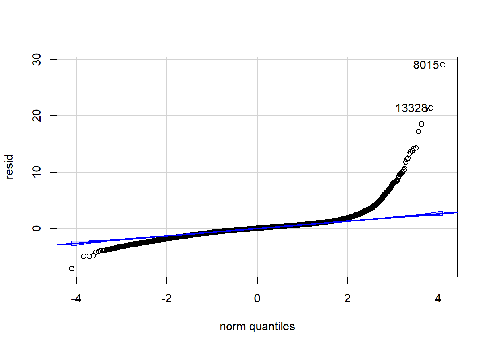

```
[1]  8015 13328
```

```r
# roblm
plot(model$fitted.values,resid )
abline(h=0)
```

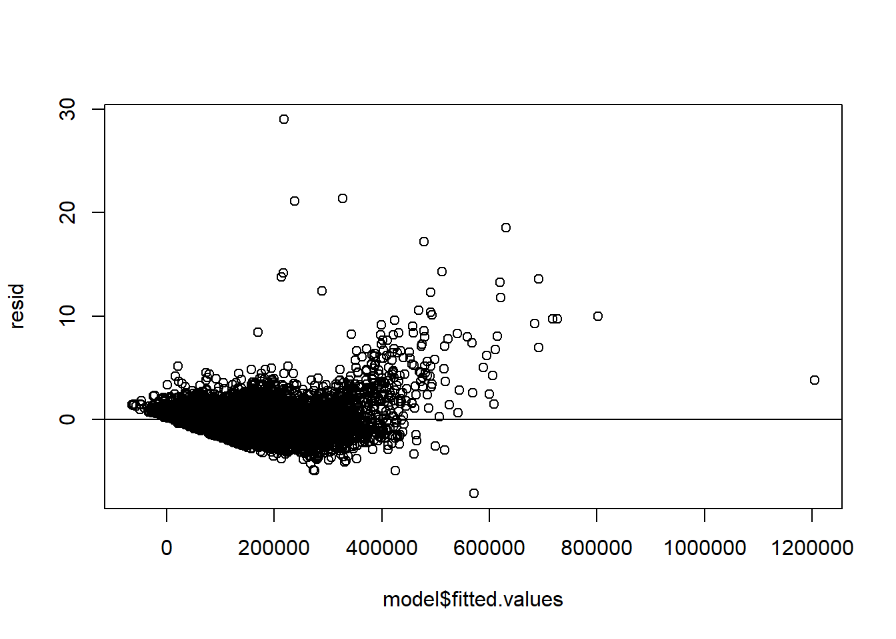

```r
plot(model$fitted.values,resid,ylim=c(-10,10) )
abline(h=0)
```

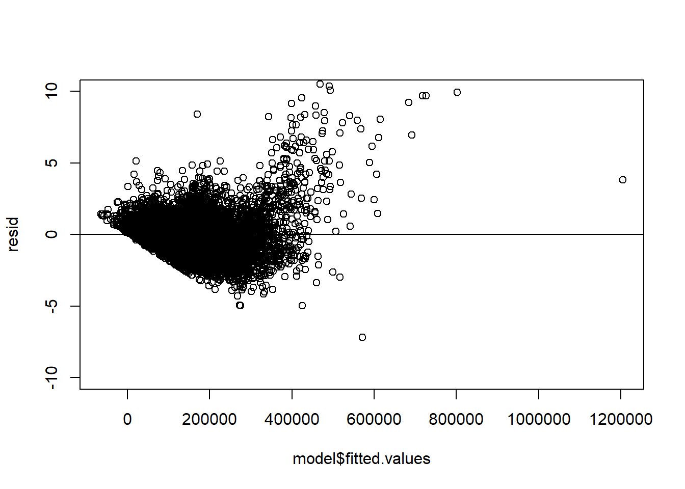

```r
df_clean2[which.max(resid),]
```

```
     Sale_price Fin_sqft District Sale_date Year_Built Lotsize
8015    1800000     1330        3     15949       1928       0
```

```r
plot(model$fitted.values,resid,ylim=c(-10,10) )
abline(h=0)
```


```r
sum(df_clean2$Lotsize==0)
```

```
[1] 146
```

```r
par(pch=22,bg='white')
plot(model$fitted.values,resid,bg=as.numeric(df_clean2$Lotsize==0)+1 )
abline(h=0)
```

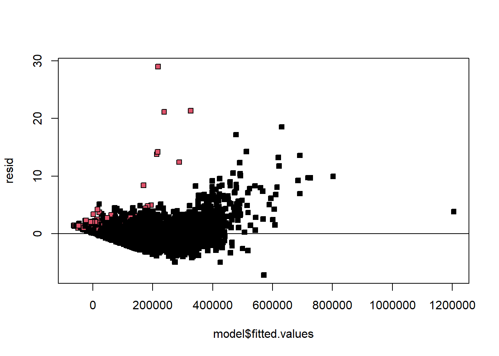

```r
# remove those with 0 lot size
df3=df_clean2[df_clean2$Lotsize>0,]
model=lm(Sale_price~Fin_sqft+District+Sale_date+ Year_Built+ Lotsize,data=df3)
summary(model)
```

```

Call:
lm(formula = Sale_price ~ Fin_sqft + District + Sale_date + Year_Built + 
    Lotsize, data = df3)

Residuals:
    Min      1Q  Median      3Q     Max 
-406081  -25101     616   23636 1017694 

Coefficients:
              Estimate Std. Error t value Pr(>|t|)    
(Intercept) -1.011e+06  3.987e+04 -25.350  < 2e-16 ***
Fin_sqft     6.575e+01  6.185e-01 106.305  < 2e-16 ***
District2    1.351e+04  2.179e+03   6.200 5.73e-10 ***
District3    1.771e+05  2.328e+03  76.060  < 2e-16 ***
District4   -3.517e+04  4.516e+03  -7.788 7.05e-15 ***
District5    5.554e+04  1.873e+03  29.646  < 2e-16 ***
District6    9.986e+03  2.703e+03   3.695 0.000221 ***
District7   -4.296e+03  2.340e+03  -1.836 0.066382 .  
District8    1.699e+04  2.572e+03   6.607 3.99e-11 ***
District9    2.675e+04  2.332e+03  11.474  < 2e-16 ***
District10   6.401e+04  1.954e+03  32.766  < 2e-16 ***
District11   7.027e+04  1.875e+03  37.472  < 2e-16 ***
District12   6.017e+03  3.114e+03   1.932 0.053354 .  
District13   6.814e+04  1.939e+03  35.145  < 2e-16 ***
District14   1.030e+05  1.966e+03  52.371  < 2e-16 ***
District15  -3.472e+04  2.890e+03 -12.011  < 2e-16 ***
Sale_date    4.611e+00  3.089e-01  14.928  < 2e-16 ***
Year_Built   4.585e+02  2.038e+01  22.492  < 2e-16 ***
Lotsize      4.210e+00  1.162e-01  36.239  < 2e-16 ***
---
Signif. codes:  0 '***' 0.001 '**' 0.01 '*' 0.05 '.' 0.1 ' ' 1

Residual standard error: 52450 on 24457 degrees of freedom
Multiple R-squared:  0.617, Adjusted R-squared:  0.6167 
F-statistic:  2189 on 18 and 24457 DF,  p-value: < 2.2e-16
```

```r
resid=rstudent(model)

car::qqPlot(resid)
```

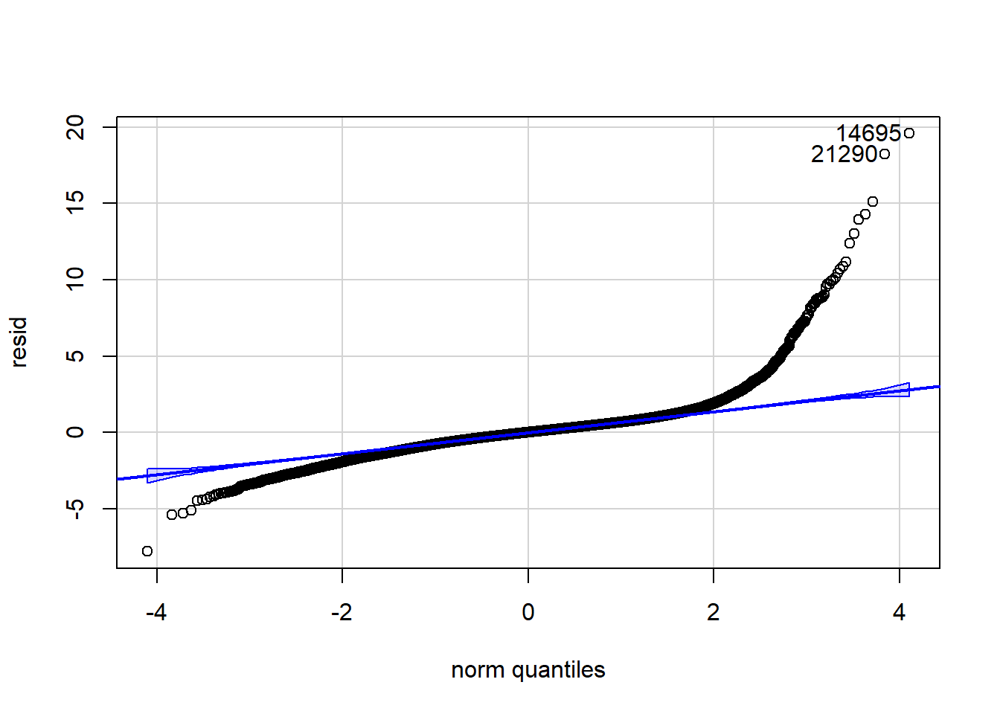

```
14695 21290 
14619 21161 
```

```r
# roblm
plot(model$fitted.values,resid )
abline(h=0)
```

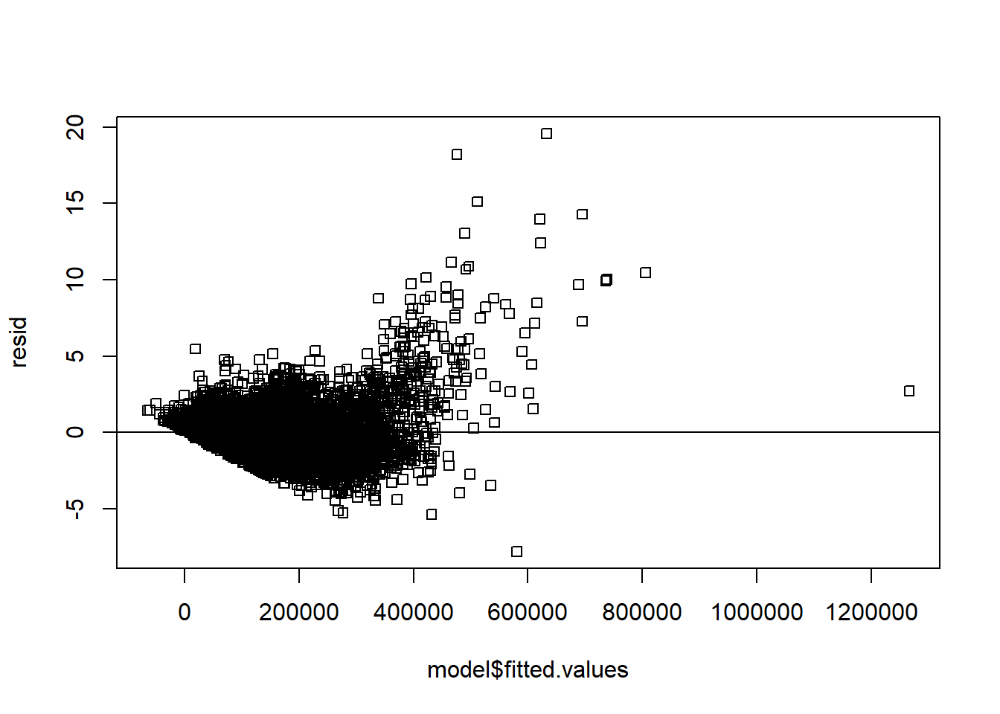

```r
plot(model$fitted.values,resid,ylim=c(-10,10) )
abline(h=0)
```

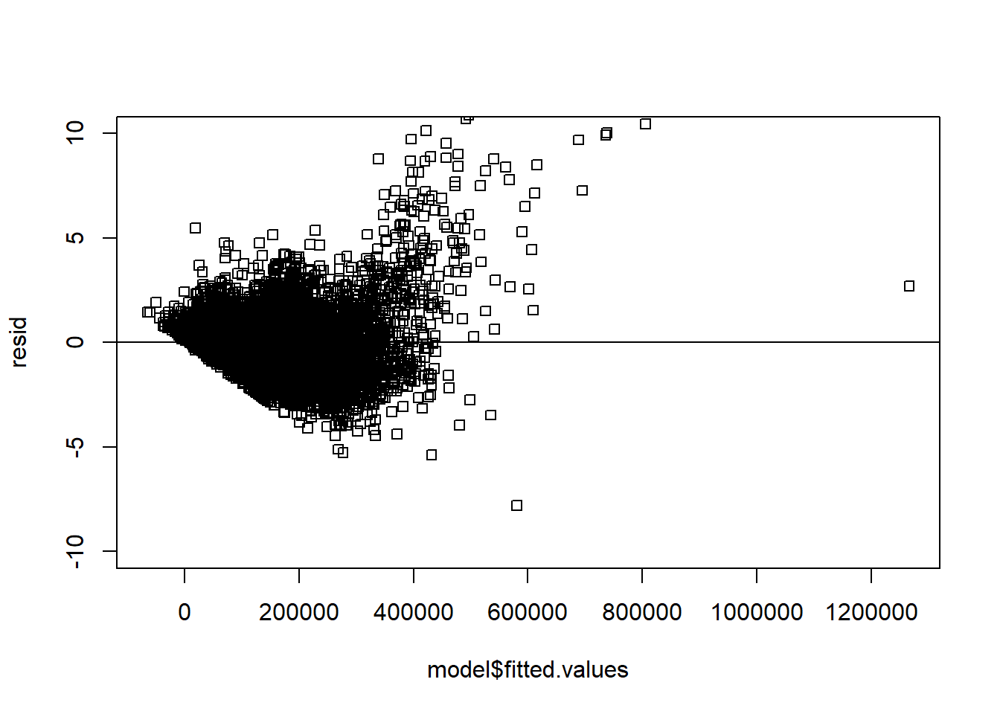

```r
plot(df3$Fin_sqft,resid )
abline(h=0)
```

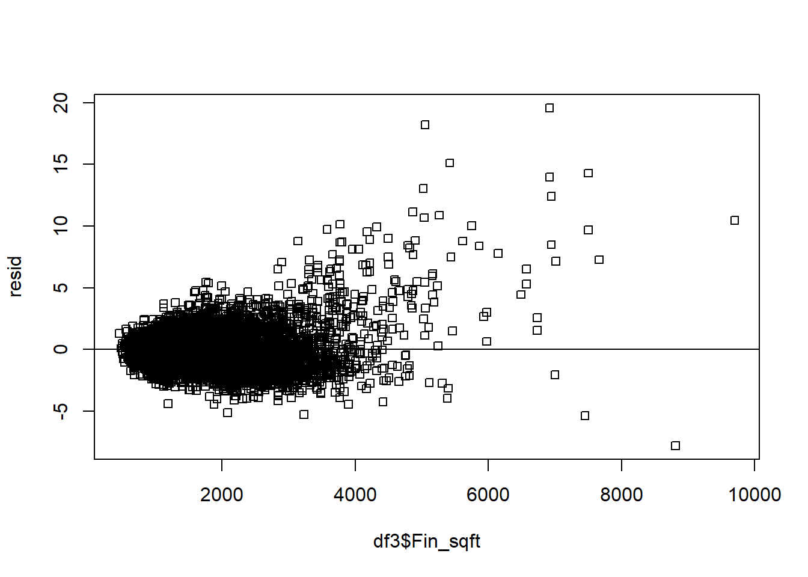

```r
# just for comparison, we look at the 
# plot(df3$Fin_sqft,model$residuals )
# abline(h=0)

plot(df3$Lotsize,resid )
abline(h=0)
```

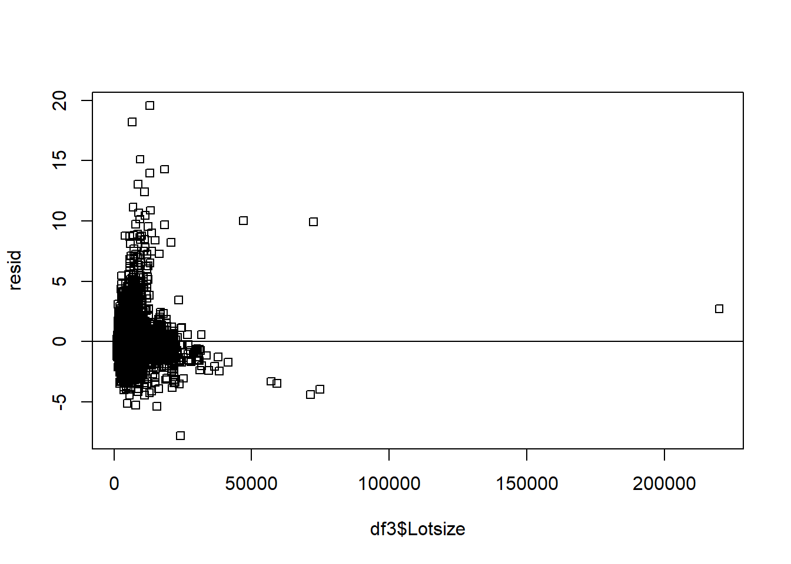

```r
# remove largest lot size
plot(df3$Lotsize,resid ,xlim=c(0,50000),col=df3$District)
abline(h=0)
```

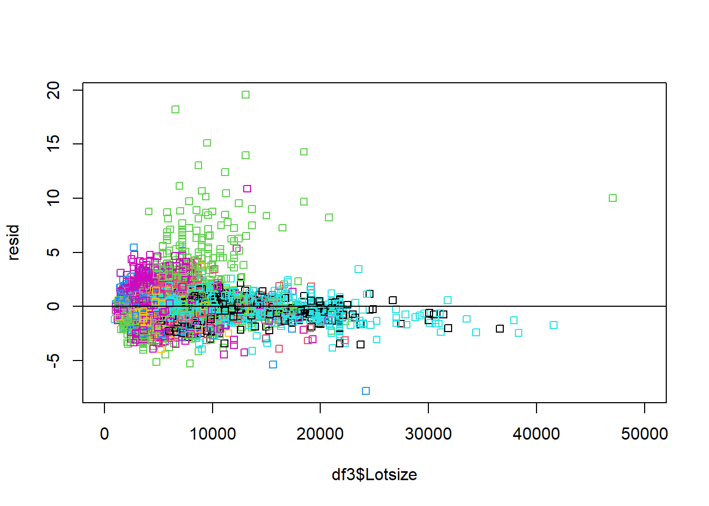

```r
plot(df3$Lotsize,df3$Sale_price ,xlim=c(0,50000),col=df3$District)
abline(h=0)
```

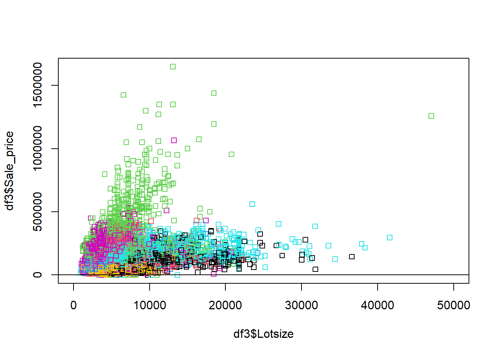

```r
# non constant variance

plot(df3$Year_Built,resid )
abline(h=0)
```

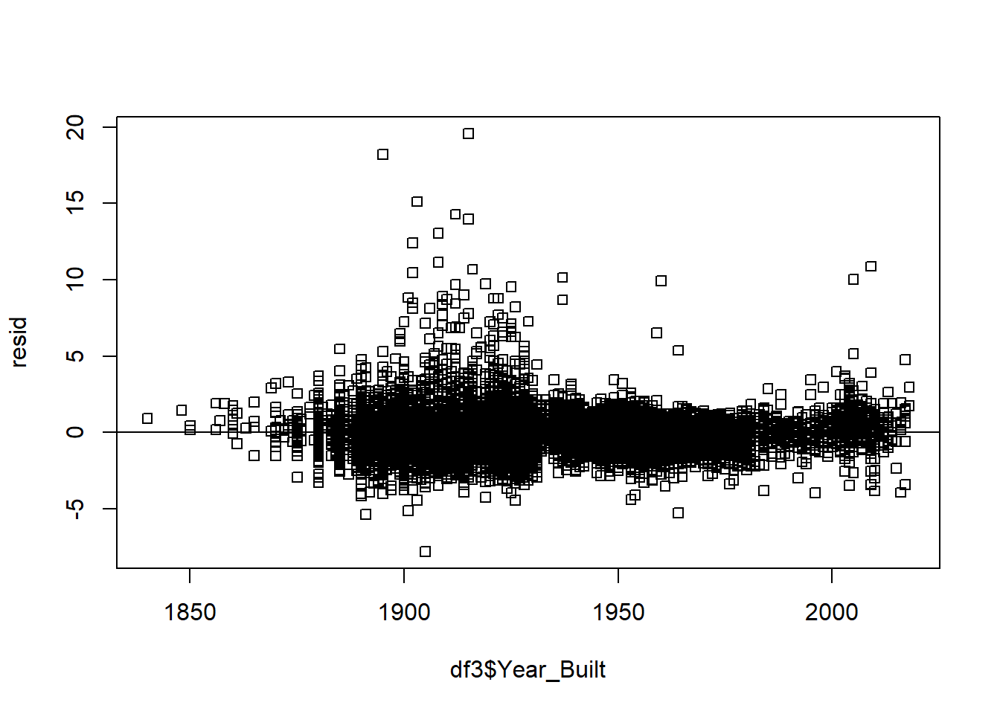

```r
plot(df3$Year_Built,resid ,col=df3$District)
abline(h=0)
```

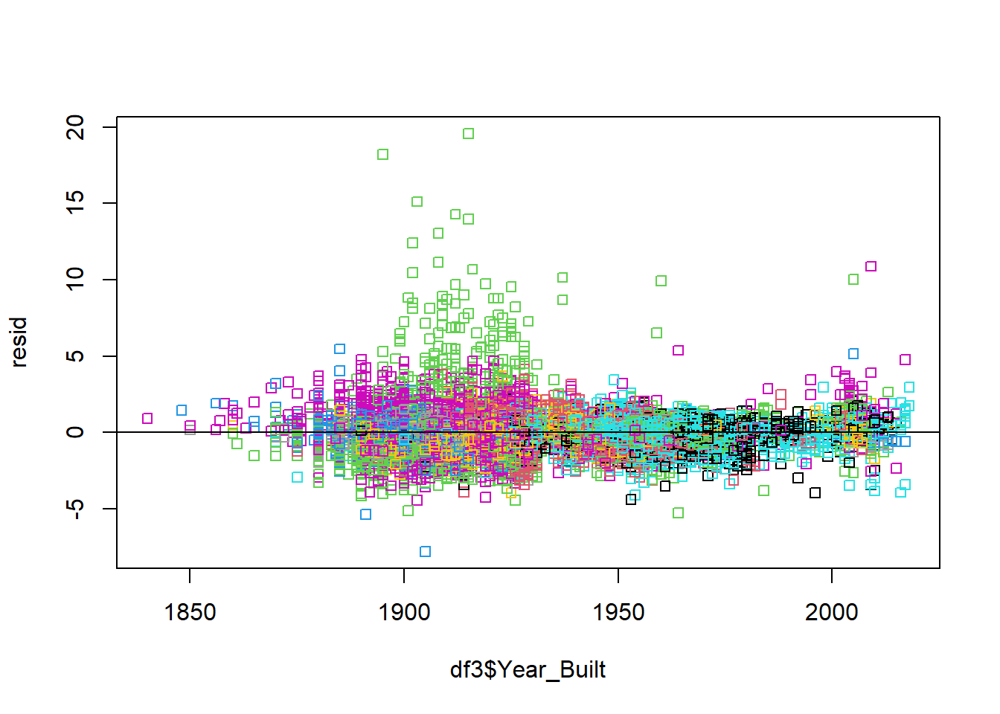

```r
plot(df3$Year_Built,df3$Sale_price ,col=df3$District)
abline(h=0)
```

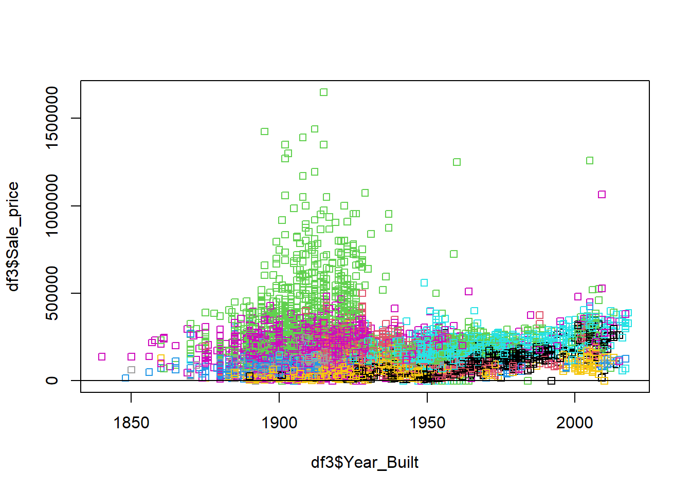

```r
# non constant variance

rdf=df3
rdf=cbind(df3,resid)
boxplot(resid~District,rdf )
abline(h=0)
```

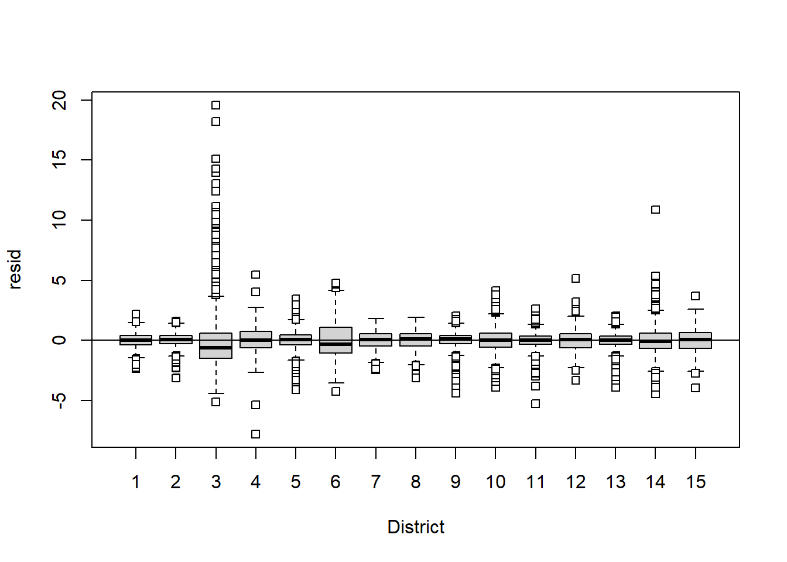

```r
df4=df3[df3$Lotsize<150000,]
model=lm(Sale_price~Fin_sqft+District+Sale_date+ Year_Built+ Lotsize+District*Lotsize,data=df4)
summary(model)
```

```

Call:
lm(formula = Sale_price ~ Fin_sqft + District + Sale_date + Year_Built + 
    Lotsize + District * Lotsize, data = df4)

Residuals:
     Min       1Q   Median       3Q      Max 
-1132285   -24249      -82    22444   929557 

Coefficients:
                     Estimate Std. Error t value Pr(>|t|)    
(Intercept)        -9.614e+05  3.784e+04 -25.410  < 2e-16 ***
Fin_sqft            5.921e+01  5.943e-01  99.633  < 2e-16 ***
District2           2.503e+04  5.435e+03   4.605 4.15e-06 ***
District3           5.552e+04  4.593e+03  12.088  < 2e-16 ***
District4           2.608e+04  9.017e+03   2.892 0.003826 ** 
District5           7.135e+04  4.185e+03  17.049  < 2e-16 ***
District6           3.378e+04  6.030e+03   5.602 2.15e-08 ***
District7          -9.708e+03  7.684e+03  -1.263 0.206444    
District8           2.851e+04  7.687e+03   3.709 0.000209 ***
District9           4.723e+04  5.124e+03   9.218  < 2e-16 ***
District10          4.150e+04  5.273e+03   7.870 3.69e-15 ***
District11          7.638e+04  4.802e+03  15.906  < 2e-16 ***
District12          3.550e+04  8.201e+03   4.329 1.50e-05 ***
District13          7.622e+04  4.412e+03  17.276  < 2e-16 ***
District14          1.107e+05  4.783e+03  23.143  < 2e-16 ***
District15         -4.977e+04  7.708e+03  -6.457 1.09e-10 ***
Sale_date           4.737e+00  2.873e-01  16.489  < 2e-16 ***
Year_Built          4.379e+02  1.923e+01  22.768  < 2e-16 ***
Lotsize             3.766e+00  5.439e-01   6.923 4.52e-12 ***
District2:Lotsize  -1.691e+00  7.689e-01  -2.199 0.027894 *  
District3:Lotsize   2.507e+01  6.915e-01  36.252  < 2e-16 ***
District4:Lotsize  -1.053e+01  1.478e+00  -7.126 1.06e-12 ***
District5:Lotsize  -2.097e+00  5.835e-01  -3.593 0.000327 ***
District6:Lotsize  -4.761e+00  1.060e+00  -4.490 7.16e-06 ***
District7:Lotsize   1.248e+00  1.359e+00   0.918 0.358648    
District8:Lotsize  -2.561e+00  1.621e+00  -1.579 0.114313    
District9:Lotsize  -1.867e+00  6.278e-01  -2.973 0.002947 ** 
District10:Lotsize  4.395e+00  8.530e-01   5.152 2.59e-07 ***
District11:Lotsize -8.301e-01  6.770e-01  -1.226 0.220133    
District12:Lotsize -7.806e+00  1.906e+00  -4.096 4.22e-05 ***
District13:Lotsize -1.021e+00  6.088e-01  -1.676 0.093669 .  
District14:Lotsize -1.625e+00  7.793e-01  -2.085 0.037118 *  
District15:Lotsize  3.720e+00  1.380e+00   2.696 0.007012 ** 
---
Signif. codes:  0 '***' 0.001 '**' 0.01 '*' 0.05 '.' 0.1 ' ' 1

Residual standard error: 48770 on 24442 degrees of freedom
Multiple R-squared:  0.6662,    Adjusted R-squared:  0.6657 
F-statistic:  1524 on 32 and 24442 DF,  p-value: < 2.2e-16
```

```r
resid=rstudent(model)

car::qqPlot(resid)
```

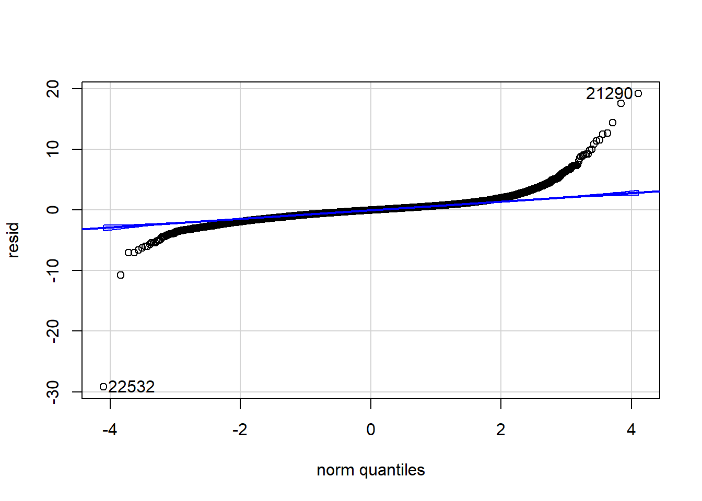

```
22532 21290 
22398 21160 
```

```r
# roblm
plot(model$fitted.values,resid )
abline(h=0)
```

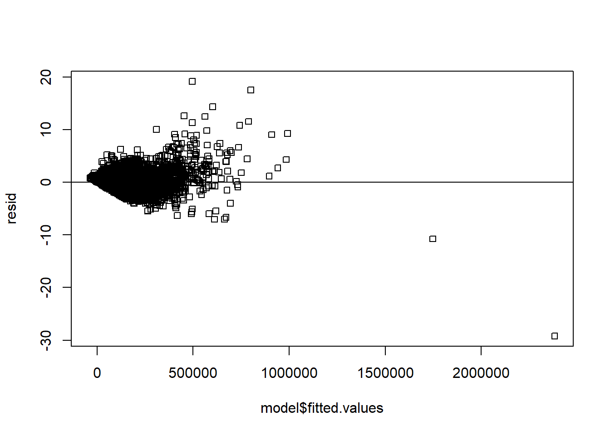

```r
plot(model$fitted.values,resid,ylim=c(-10,10) )
abline(h=0)
```

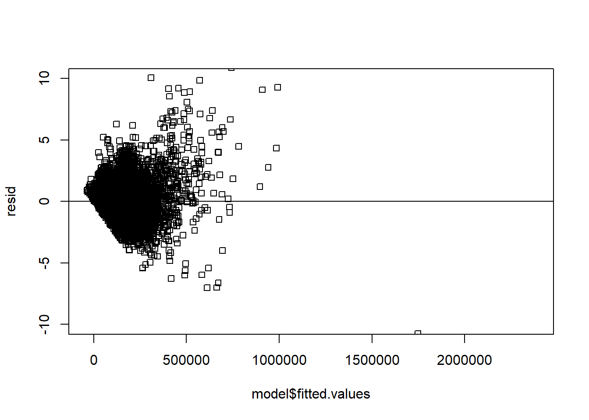

```r
plot(df4$Fin_sqft,resid )
abline(h=0)
```

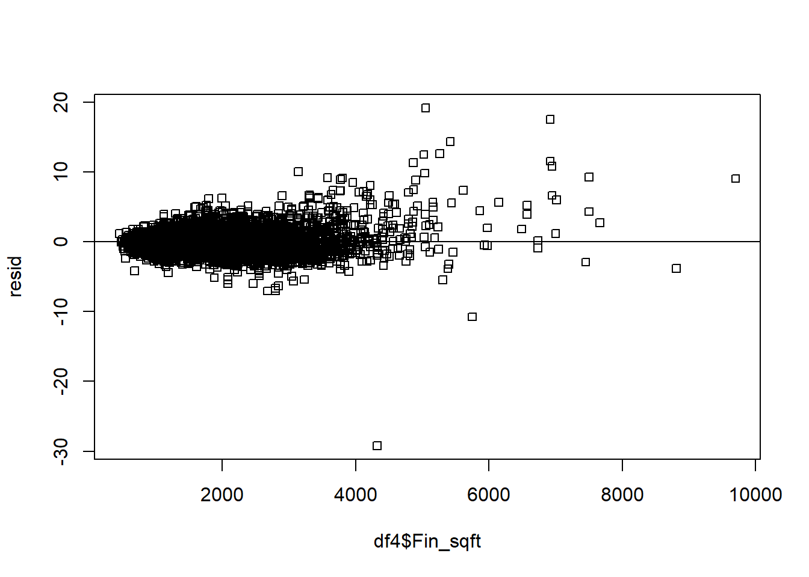

```r
# just for comparison, we look at the 
# plot(df3$Fin_sqft,model$residuals )
# abline(h=0)

plot(df4$Lotsize,resid )
abline(h=0)
```

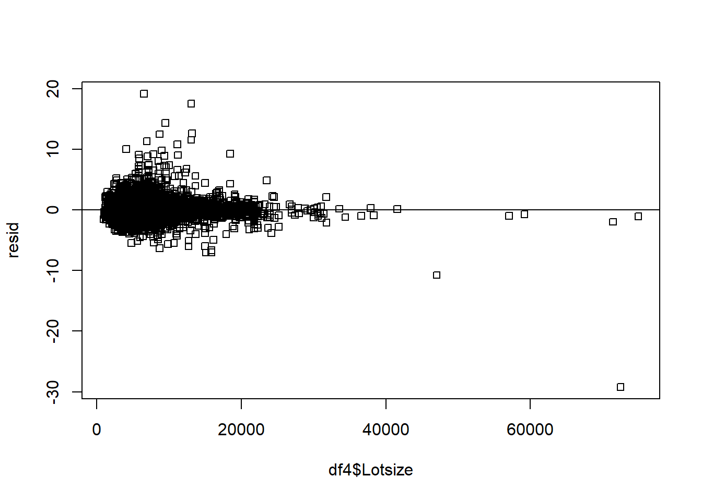

```r
# non constant variance

plot(df4$Year_Built,resid )
abline(h=0)
```

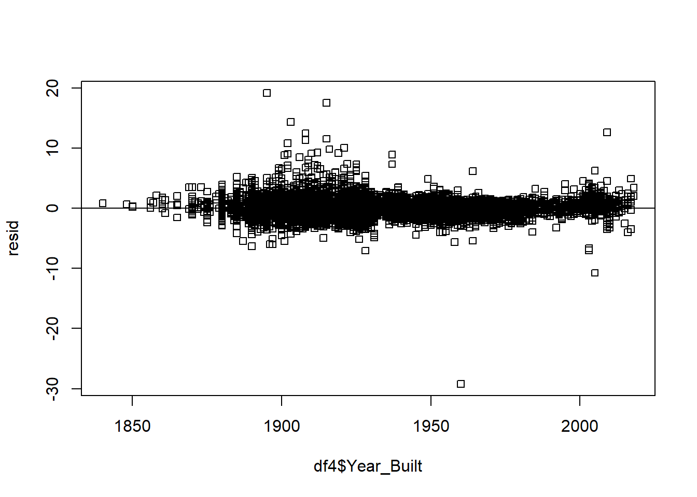

```r
plot(df4$Year_Built,resid ,col=df4$District)
abline(h=0)
```

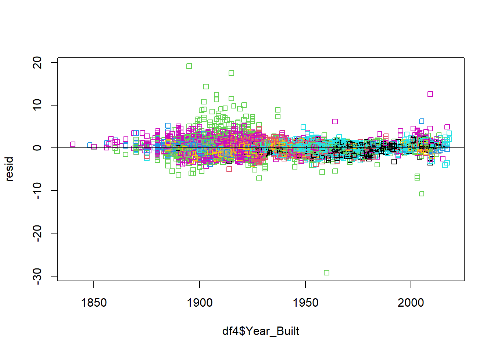

```r
plot(df4$Year_Built,df4$Sale_price ,col=df4$District)
abline(h=0)
```

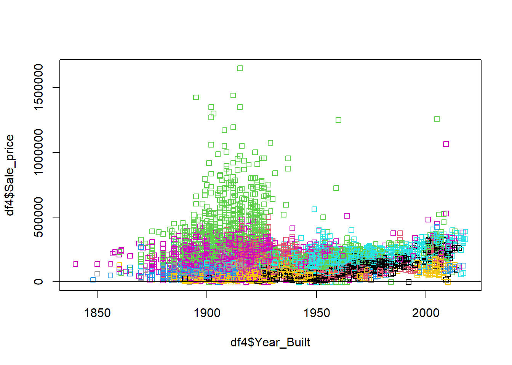

```r
# non constant variance

rdf=df4
rdf=cbind(df4,resid)
boxplot(resid~District,rdf )
abline(h=0)
```

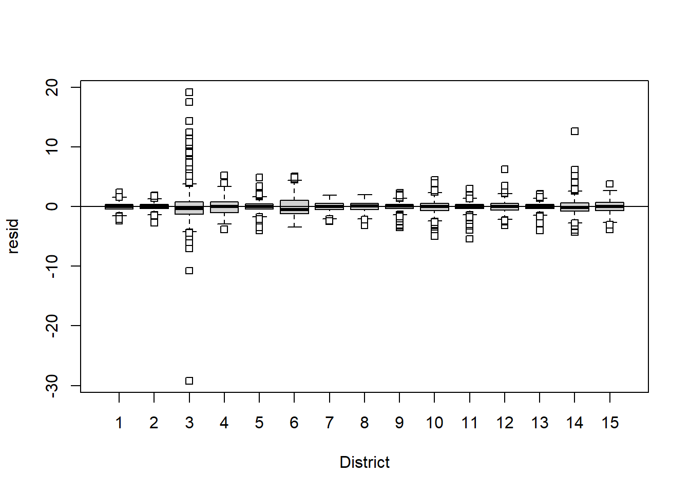

```r
df5=df4[df4$District!=3,]
df5$District=droplevels(df5$District)
model=lm(Sale_price~Fin_sqft+District+Sale_date+ Year_Built+ Lotsize+District*Lotsize,data=df5)
summary(model)
```

```

Call:
lm(formula = Sale_price ~ Fin_sqft + District + Sale_date + Year_Built + 
    Lotsize + District * Lotsize, data = df5)

Residuals:
    Min      1Q  Median      3Q     Max 
-236186  -23227   -1087   20835  661626 

Coefficients:
                     Estimate Std. Error t value Pr(>|t|)    
(Intercept)        -1.030e+06  3.219e+04 -32.007  < 2e-16 ***
Fin_sqft            4.467e+01  5.442e-01  82.089  < 2e-16 ***
District2           2.255e+04  4.483e+03   5.029 4.96e-07 ***
District4           2.893e+04  7.438e+03   3.889 0.000101 ***
District5           6.801e+04  3.452e+03  19.702  < 2e-16 ***
District6           3.885e+04  4.976e+03   7.807 6.12e-15 ***
District7          -2.871e+03  6.338e+03  -0.453 0.650602    
District8           2.776e+04  6.342e+03   4.377 1.21e-05 ***
District9           4.474e+04  4.227e+03  10.584  < 2e-16 ***
District10          4.320e+04  4.349e+03   9.933  < 2e-16 ***
District11          7.275e+04  3.961e+03  18.367  < 2e-16 ***
District12          3.594e+04  6.767e+03   5.311 1.10e-07 ***
District13          7.372e+04  3.639e+03  20.259  < 2e-16 ***
District14          1.137e+05  3.947e+03  28.808  < 2e-16 ***
District15         -4.184e+04  6.360e+03  -6.579 4.85e-11 ***
Sale_date           4.626e+00  2.437e-01  18.986  < 2e-16 ***
Year_Built          4.837e+02  1.637e+01  29.545  < 2e-16 ***
Lotsize             3.917e+00  4.486e-01   8.731  < 2e-16 ***
District2:Lotsize  -1.468e+00  6.342e-01  -2.315 0.020617 *  
District4:Lotsize  -7.717e+00  1.220e+00  -6.326 2.56e-10 ***
District5:Lotsize  -1.621e+00  4.813e-01  -3.369 0.000756 ***
District6:Lotsize  -3.913e+00  8.747e-01  -4.474 7.71e-06 ***
District7:Lotsize   8.121e-01  1.121e+00   0.724 0.468874    
District8:Lotsize  -6.929e-01  1.338e+00  -0.518 0.604459    
District9:Lotsize  -1.688e+00  5.178e-01  -3.259 0.001118 ** 
District10:Lotsize  4.870e+00  7.035e-01   6.922 4.58e-12 ***
District11:Lotsize -3.962e-01  5.584e-01  -0.710 0.477954    
District12:Lotsize -5.923e+00  1.572e+00  -3.767 0.000165 ***
District13:Lotsize -7.282e-01  5.021e-01  -1.450 0.147014    
District14:Lotsize -1.560e+00  6.428e-01  -2.427 0.015237 *  
District15:Lotsize  4.381e+00  1.138e+00   3.849 0.000119 ***
---
Signif. codes:  0 '***' 0.001 '**' 0.01 '*' 0.05 '.' 0.1 ' ' 1

Residual standard error: 40220 on 22888 degrees of freedom
Multiple R-squared:  0.5189,    Adjusted R-squared:  0.5183 
F-statistic: 822.8 on 30 and 22888 DF,  p-value: < 2.2e-16
```

```r
resid=rstudent(model)

car::qqPlot(resid)
```

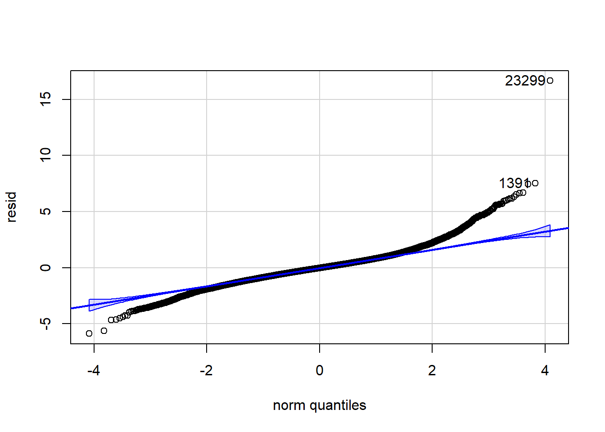

```
23299  1391 
21669  1327 
```

```r
# roblm
plot(model$fitted.values,resid )
abline(h=0)
```

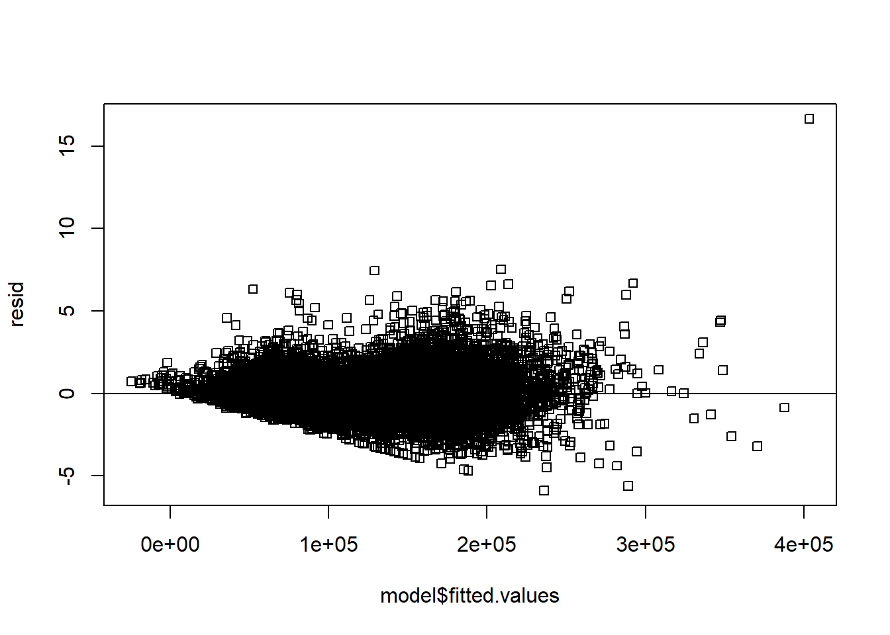

```r
plot(model$fitted.values,resid,ylim=c(-10,10) )
abline(h=0)
```

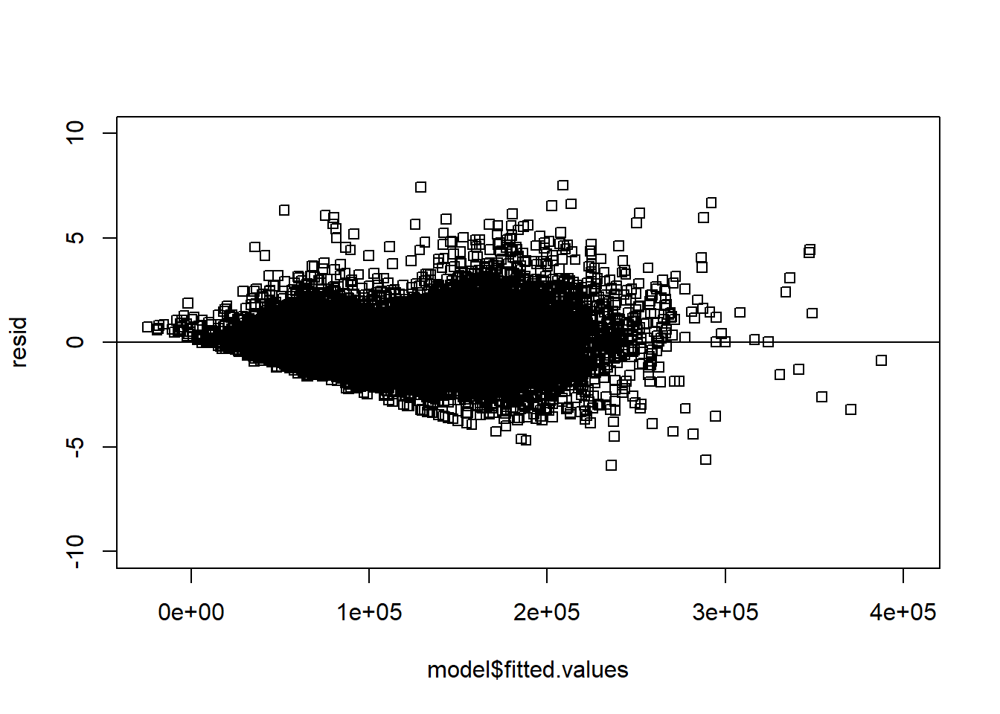

```r
plot(df5$Fin_sqft,resid )
abline(h=0)
```

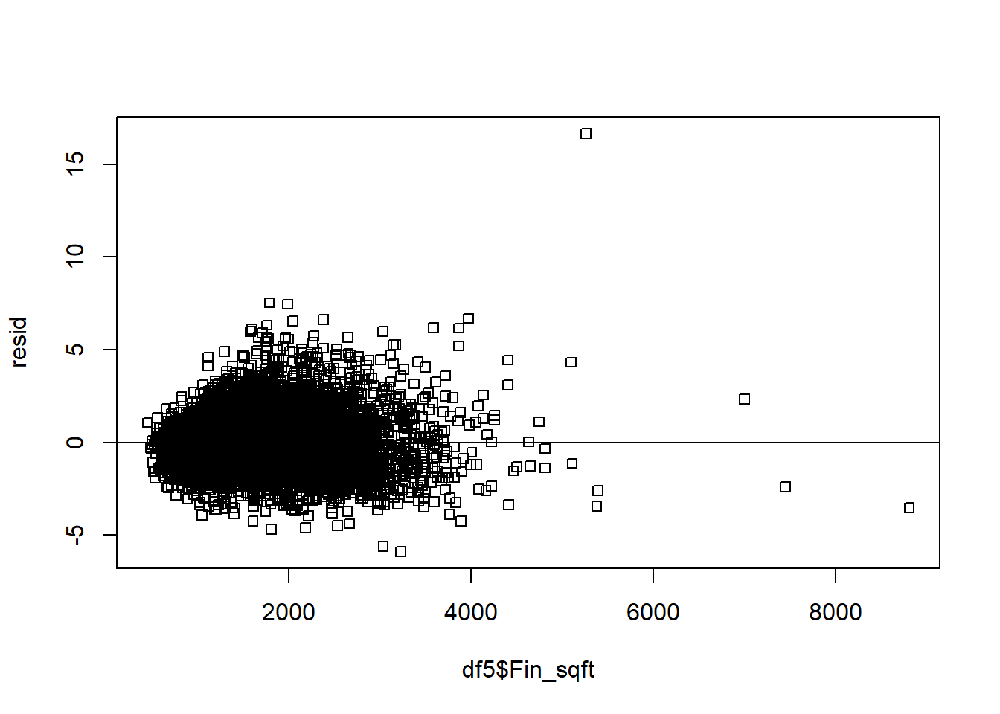

```r
# just for comparison, we look at the 
# plot(df3$Fin_sqft,model$residuals )
# abline(h=0)

plot(df5$Lotsize,resid )
abline(h=0)
```

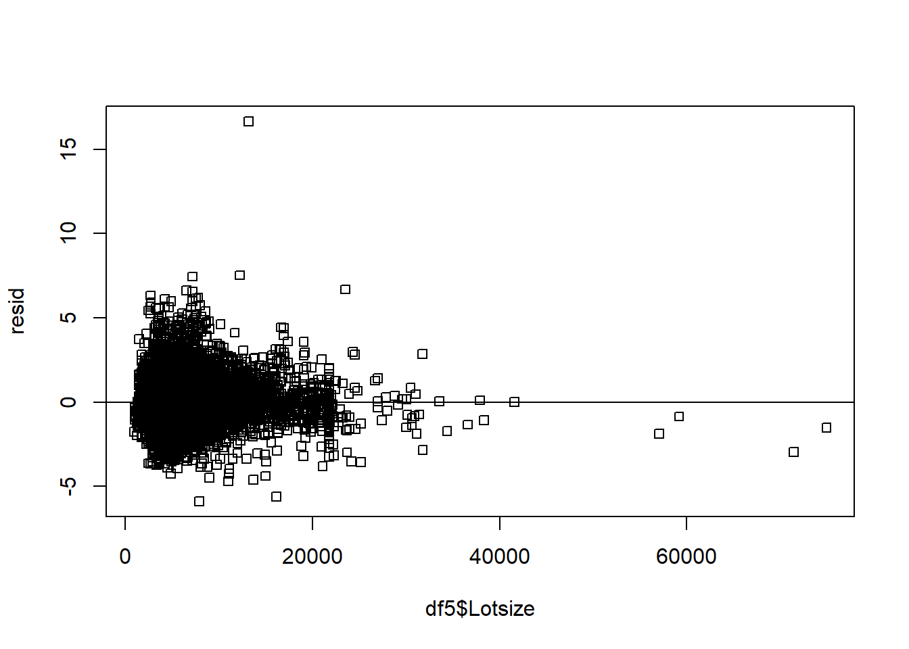

```r
# non constant variance

plot(df5$Year_Built,resid )
abline(h=0)
```

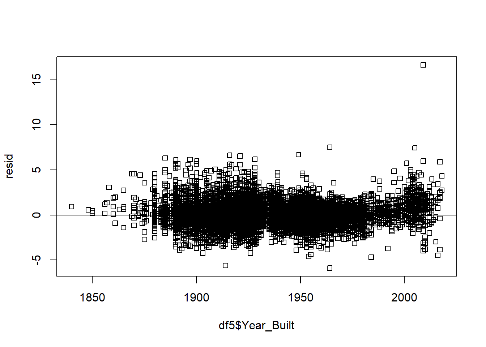

```r
plot(df5$Year_Built,df5$Sale_price ,col=df5$District)
abline(h=0)
```


```r
# non constant variance

rdf=df5
rdf=cbind(df5,resid)
boxplot(resid~District,rdf )
abline(h=0)
```

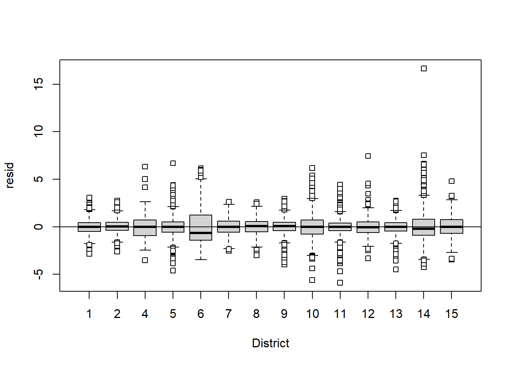

```r
##################

model=lm(sqrt(Sale_price)~Fin_sqft+District+Sale_date+ Year_Built+ Lotsize,data=df5)
summary(model)
```

```

Call:
lm(formula = sqrt(Sale_price) ~ Fin_sqft + District + Sale_date + 
    Year_Built + Lotsize, data = df5)

Residuals:
    Min      1Q  Median      3Q     Max 
-493.55  -31.58    1.65   32.78  338.94 

Coefficients:
              Estimate Std. Error t value Pr(>|t|)    
(Intercept) -1.325e+03  4.517e+01 -29.335  < 2e-16 ***
Fin_sqft     5.738e-02  7.698e-04  74.538  < 2e-16 ***
District2    2.832e+01  2.384e+00  11.879  < 2e-16 ***
District4   -1.029e+01  4.958e+00  -2.075    0.038 *  
District5    9.542e+01  2.049e+00  46.558  < 2e-16 ***
District6    1.722e+01  2.968e+00   5.802 6.63e-09 ***
District7    2.445e+00  2.562e+00   0.954    0.340    
District8    4.274e+01  2.824e+00  15.137  < 2e-16 ***
District9    5.978e+01  2.560e+00  23.348  < 2e-16 ***
District10   1.084e+02  2.140e+00  50.640  < 2e-16 ***
District11   1.140e+02  2.051e+00  55.606  < 2e-16 ***
District12   1.822e+01  3.417e+00   5.333 9.75e-08 ***
District13   1.125e+02  2.121e+00  53.040  < 2e-16 ***
District14   1.555e+02  2.155e+00  72.134  < 2e-16 ***
District15  -3.837e+01  3.174e+00 -12.087  < 2e-16 ***
Sale_date    6.408e-03  3.473e-04  18.449  < 2e-16 ***
Year_Built   7.087e-01  2.312e-02  30.660  < 2e-16 ***
Lotsize      3.560e-03  1.486e-04  23.953  < 2e-16 ***
---
Signif. codes:  0 '***' 0.001 '**' 0.01 '*' 0.05 '.' 0.1 ' ' 1

Residual standard error: 57.35 on 22901 degrees of freedom
Multiple R-squared:  0.5259,    Adjusted R-squared:  0.5256 
F-statistic:  1494 on 17 and 22901 DF,  p-value: < 2.2e-16
```

```r
model=lm(sqrt(Sale_price)~Fin_sqft+District+Sale_date+ Year_Built+ Lotsize+District*Lotsize,data=df5)
summary(model)
```

```

Call:
lm(formula = sqrt(Sale_price) ~ Fin_sqft + District + Sale_date + 
    Year_Built + Lotsize + District * Lotsize, data = df5)

Residuals:
    Min      1Q  Median      3Q     Max 
-494.63  -31.21    1.80   32.67  325.84 

Coefficients:
                     Estimate Std. Error t value Pr(>|t|)    
(Intercept)        -1.332e+03  4.561e+01 -29.200  < 2e-16 ***
Fin_sqft            5.776e-02  7.710e-04  74.919  < 2e-16 ***
District2           5.082e+01  6.350e+00   8.002 1.28e-15 ***
District4           4.973e+01  1.054e+01   4.719 2.38e-06 ***
District5           1.290e+02  4.890e+00  26.382  < 2e-16 ***
District6           5.545e+01  7.050e+00   7.865 3.84e-15 ***
District7          -1.012e+01  8.979e+00  -1.127 0.259839    
District8           4.534e+01  8.985e+00   5.046 4.54e-07 ***
District9           9.039e+01  5.989e+00  15.094  < 2e-16 ***
District10          9.443e+01  6.162e+00  15.326  < 2e-16 ***
District11          1.350e+02  5.611e+00  24.060  < 2e-16 ***
District12          5.489e+01  9.586e+00   5.726 1.04e-08 ***
District13          1.351e+02  5.155e+00  26.212  < 2e-16 ***
District14          1.855e+02  5.592e+00  33.180  < 2e-16 ***
District15         -8.533e+01  9.010e+00  -9.471  < 2e-16 ***
Sale_date           6.393e-03  3.452e-04  18.520  < 2e-16 ***
Year_Built          6.996e-01  2.319e-02  30.166  < 2e-16 ***
Lotsize             7.269e-03  6.355e-04  11.438  < 2e-16 ***
District2:Lotsize  -3.485e-03  8.984e-04  -3.879 0.000105 ***
District4:Lotsize  -1.073e-02  1.728e-03  -6.209 5.42e-10 ***
District5:Lotsize  -5.059e-03  6.819e-04  -7.420 1.22e-13 ***
District6:Lotsize  -6.919e-03  1.239e-03  -5.583 2.39e-08 ***
District7:Lotsize   3.263e-03  1.588e-03   2.054 0.039982 *  
District8:Lotsize   1.260e-03  1.895e-03   0.665 0.505954    
District9:Lotsize  -4.381e-03  7.336e-04  -5.973 2.37e-09 ***
District10:Lotsize  3.349e-03  9.967e-04   3.360 0.000781 ***
District11:Lotsize -3.274e-03  7.911e-04  -4.139 3.51e-05 ***
District12:Lotsize -7.268e-03  2.227e-03  -3.263 0.001103 ** 
District13:Lotsize -3.528e-03  7.113e-04  -4.960 7.12e-07 ***
District14:Lotsize -5.048e-03  9.107e-04  -5.543 3.01e-08 ***
District15:Lotsize  1.043e-02  1.612e-03   6.471 9.95e-11 ***
---
Signif. codes:  0 '***' 0.001 '**' 0.01 '*' 0.05 '.' 0.1 ' ' 1

Residual standard error: 56.98 on 22888 degrees of freedom
Multiple R-squared:  0.5323,    Adjusted R-squared:  0.5317 
F-statistic: 868.3 on 30 and 22888 DF,  p-value: < 2.2e-16
```

```r
model=lm(sqrt(Sale_price)~Fin_sqft+District+Sale_date+ Year_Built,data=df5)
summary(model)
```

```

Call:
lm(formula = sqrt(Sale_price) ~ Fin_sqft + District + Sale_date + 
    Year_Built, data = df5)

Residuals:
    Min      1Q  Median      3Q     Max 
-498.58  -32.16    1.67   33.23  335.25 

Coefficients:
              Estimate Std. Error t value Pr(>|t|)    
(Intercept) -1.531e+03  4.490e+01 -34.094  < 2e-16 ***
Fin_sqft     6.123e-02  7.622e-04  80.335  < 2e-16 ***
District2    2.779e+01  2.413e+00  11.515  < 2e-16 ***
District4   -1.469e+01  5.016e+00  -2.930 0.003398 ** 
District5    9.645e+01  2.075e+00  46.493  < 2e-16 ***
District6    1.261e+01  2.999e+00   4.205 2.62e-05 ***
District7   -2.070e+00  2.587e+00  -0.800 0.423680    
District8    3.695e+01  2.848e+00  12.974  < 2e-16 ***
District9    6.851e+01  2.566e+00  26.702  < 2e-16 ***
District10   1.047e+02  2.161e+00  48.438  < 2e-16 ***
District11   1.147e+02  2.076e+00  55.245  < 2e-16 ***
District12   1.169e+01  3.449e+00   3.389 0.000703 ***
District13   1.146e+02  2.145e+00  53.425  < 2e-16 ***
District14   1.510e+02  2.174e+00  69.468  < 2e-16 ***
District15  -4.390e+01  3.205e+00 -13.697  < 2e-16 ***
Sale_date    6.402e-03  3.516e-04  18.206  < 2e-16 ***
Year_Built   8.237e-01  2.289e-02  35.984  < 2e-16 ***
---
Signif. codes:  0 '***' 0.001 '**' 0.01 '*' 0.05 '.' 0.1 ' ' 1

Residual standard error: 58.06 on 22902 degrees of freedom
Multiple R-squared:  0.5141,    Adjusted R-squared:  0.5137 
F-statistic:  1514 on 16 and 22902 DF,  p-value: < 2.2e-16
```

```r
resid=rstudent(model)

car::qqPlot(resid)
```

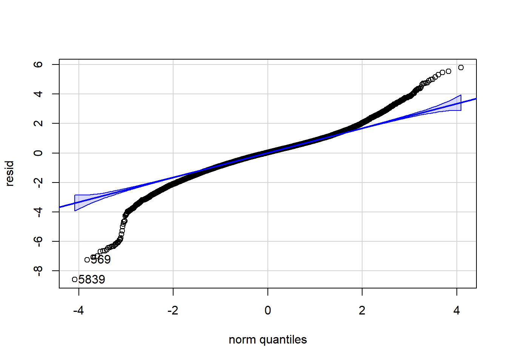

```
5839  569 
5501  529 
```

```r
# roblm
plot(model$fitted.values,resid )
abline(h=0)
```

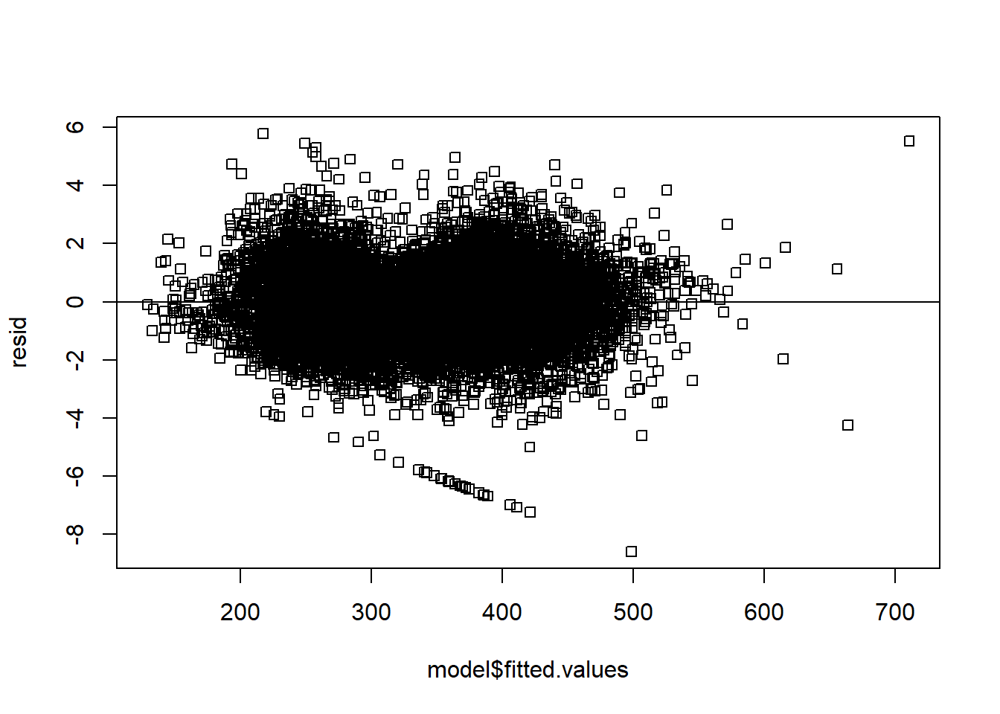

```r
plot(model$fitted.values,resid,col=df5$District )
abline(h=0)
```

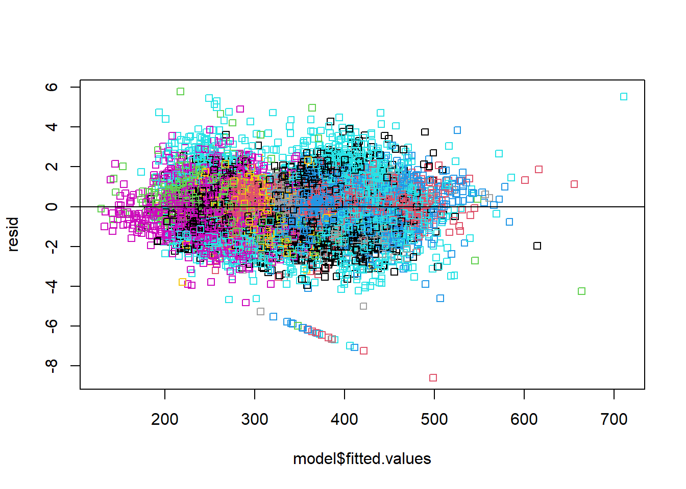

```r
plot(model$fitted.values,resid,ylim=c(-10,10) )
abline(h=0)
```

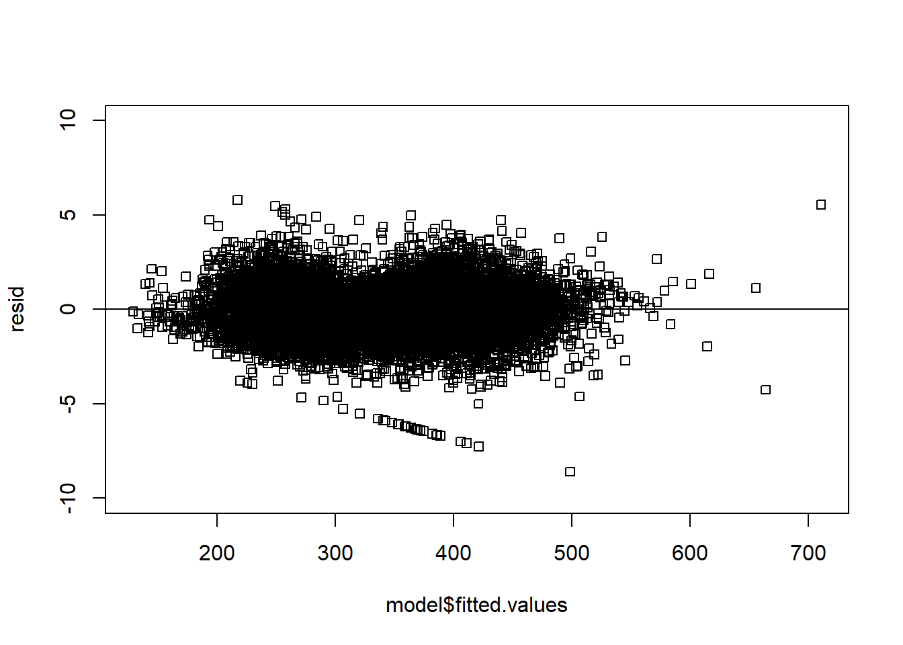

```r
plot(df5$Fin_sqft,resid )
abline(h=0)
```

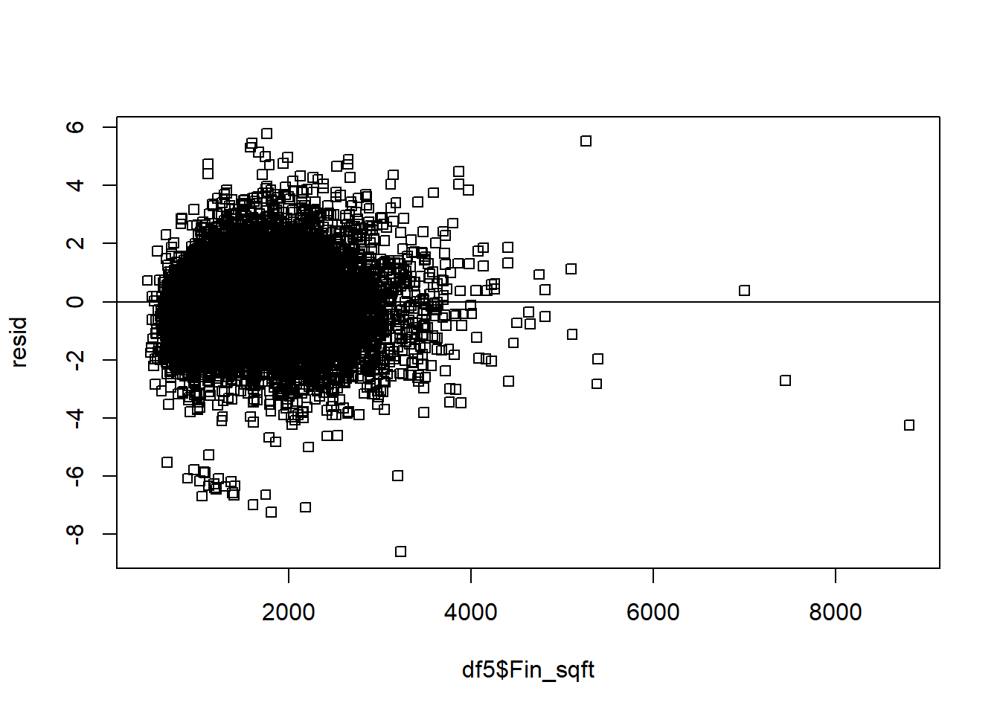

```r
# just for comparison, we look at the 
# plot(df3$Fin_sqft,model$residuals )
# abline(h=0)

plot(df5$Lotsize,resid )
abline(h=0)
```

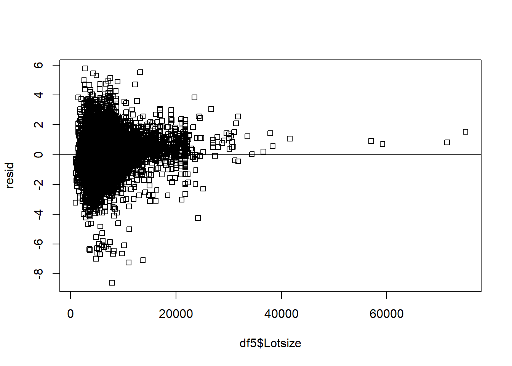

```r
# non constant variance

plot(df5$Year_Built,resid )
abline(h=0)
```

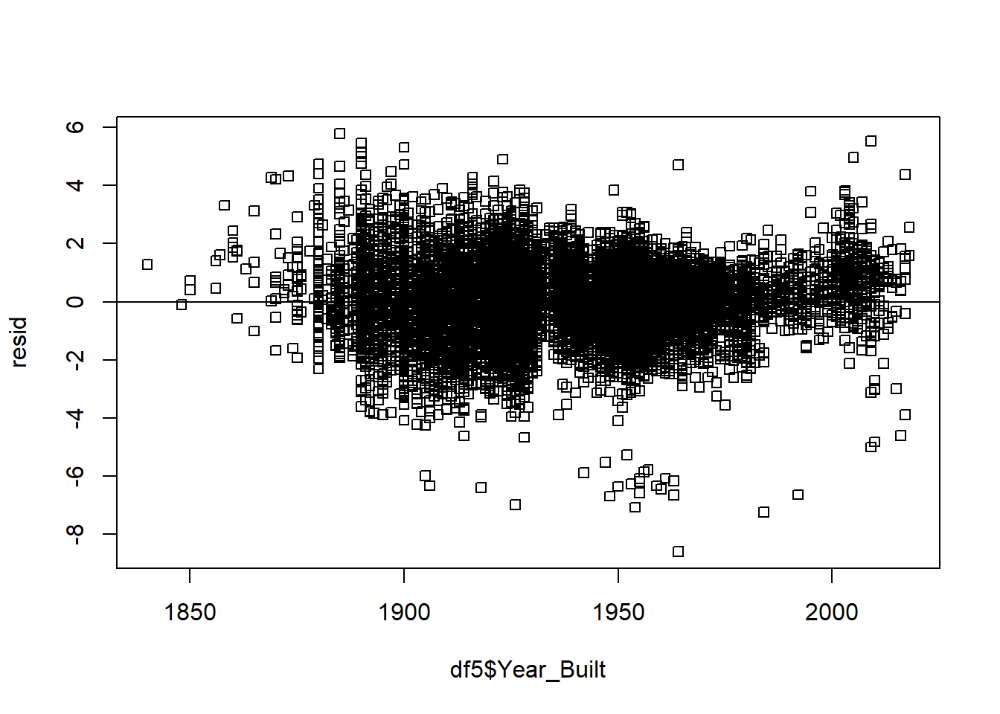

```r
plot(df5$Year_Built,resid ,col=df5$District)
abline(h=0)
```

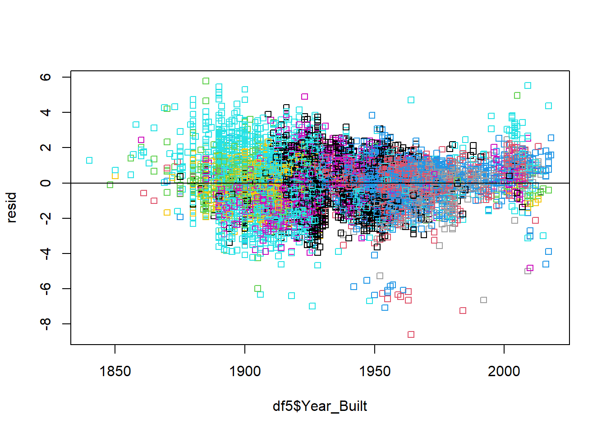

```r
plot(df5$Year_Built,df5$Sale_price ,col=df5$District)
abline(h=0)
```

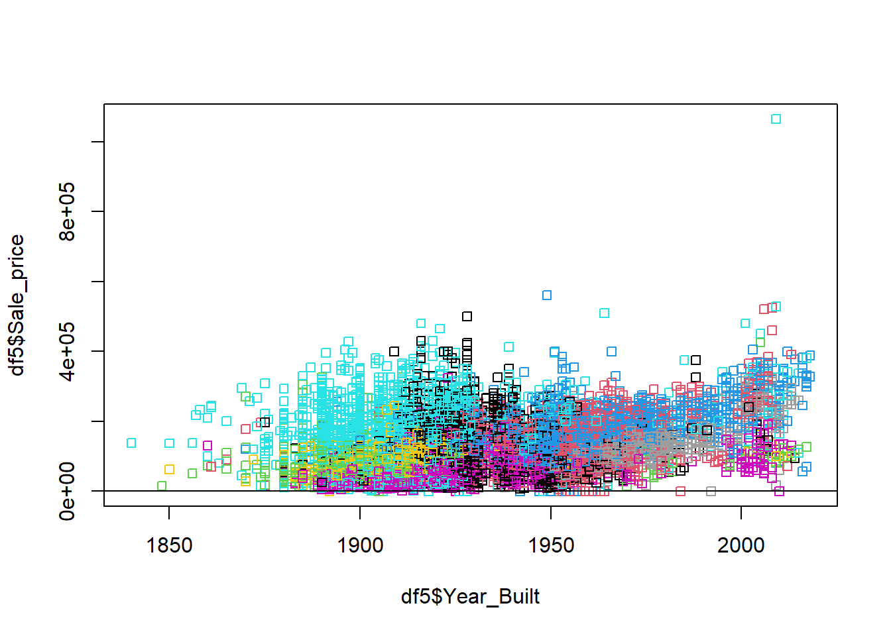

```r
# non constant variance

rdf=df5
rdf=cbind(df5,resid)
boxplot(resid~District,rdf )
abline(h=0)
```

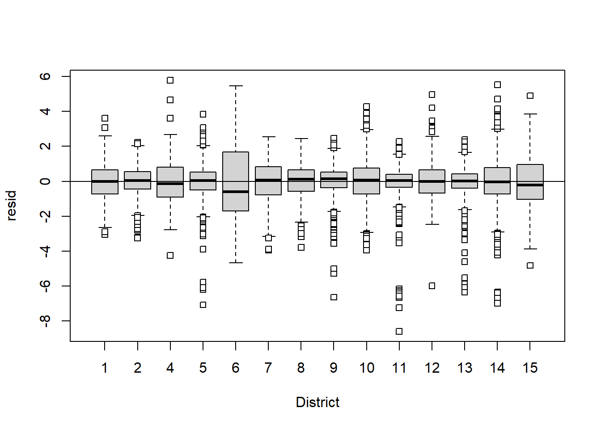

## 6.5 Homework questions

**Exercise 6.2** Consider a ML regression model for bread quality against bake time and 3 types of yeast (A, B and C). Write out the dummy variables for the variable yeast type. What is the interpretation of the coefficient of each of the dummy variables, in this context?

**Exercise 6.3** Suppose we regress real estate price against number of bathrooms. What is the difference in interpretation between representing number of bedrooms with dummy variables versus a continuous variable?

**Exercise 6.4** Consider a ML regression model for bread quality against bake time and 3 types of yeast (A, B and C). Write out the regression equation that includes an interaction between yeast and bake time. What is the interpretation of the coefficient for each of the interaction effects? Compare and contrast the regression model in [Exercise 6.2](#exr-6-6-1) to this one.

Complete the Chapter 8 questions.
