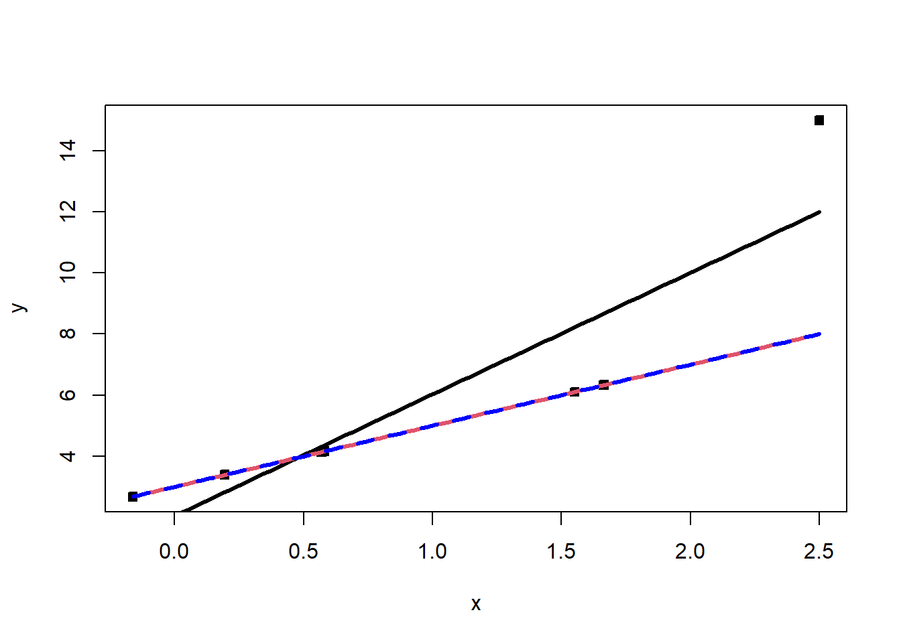
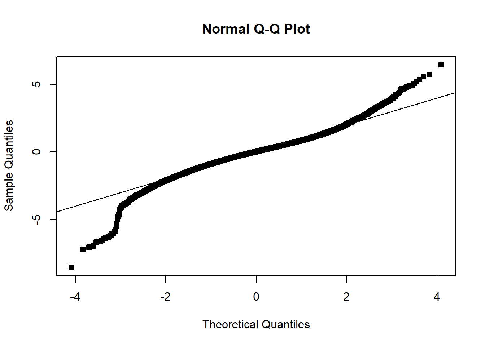
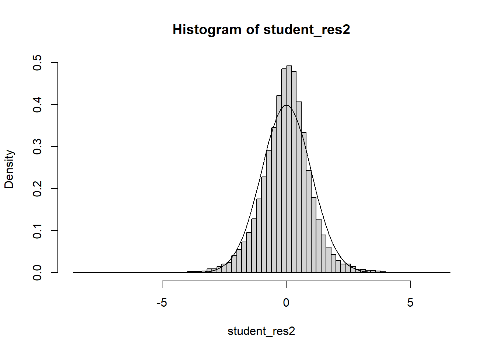
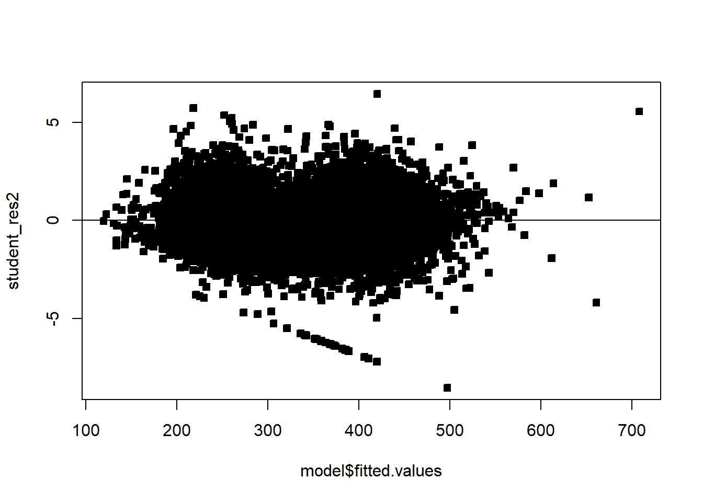
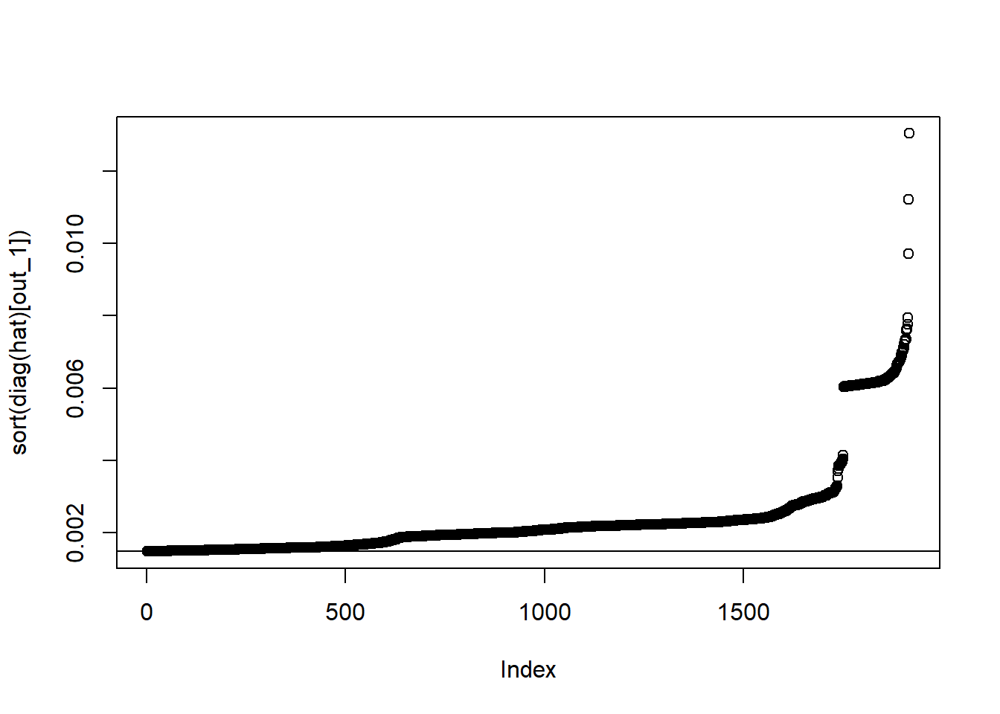
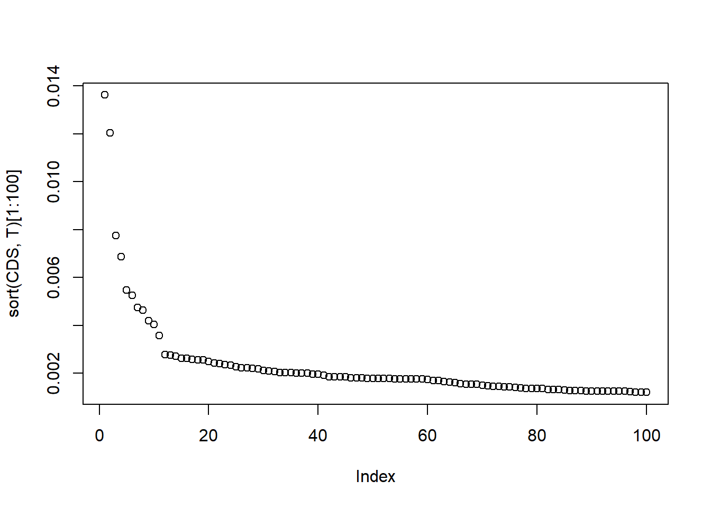
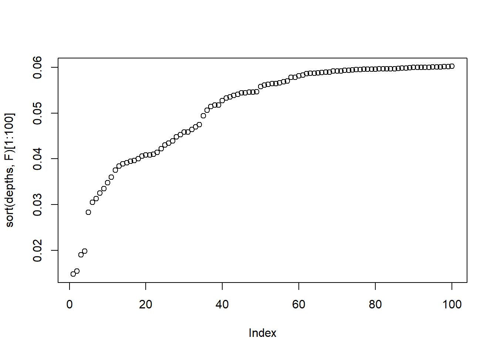
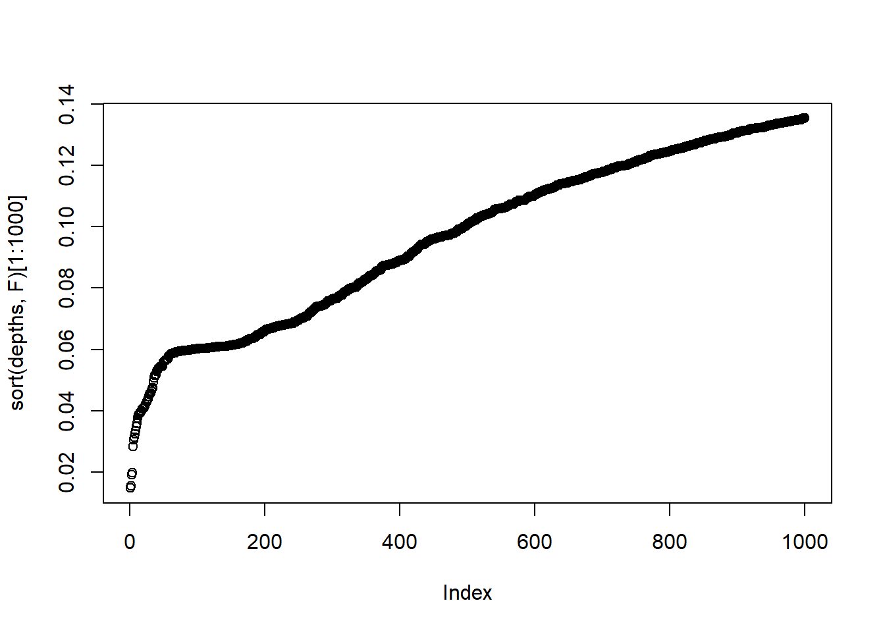
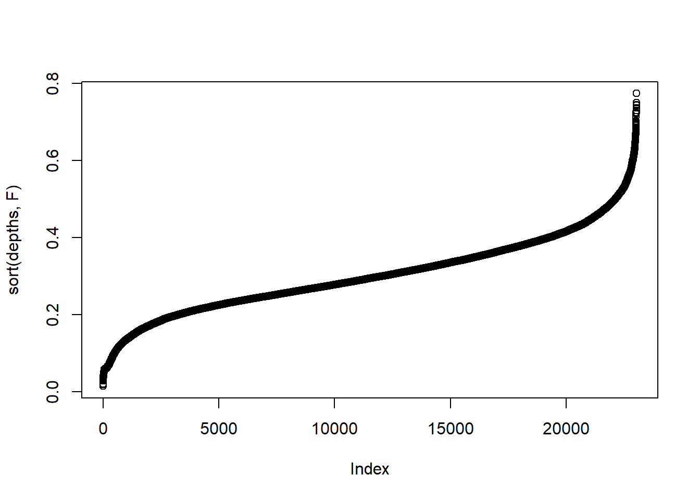
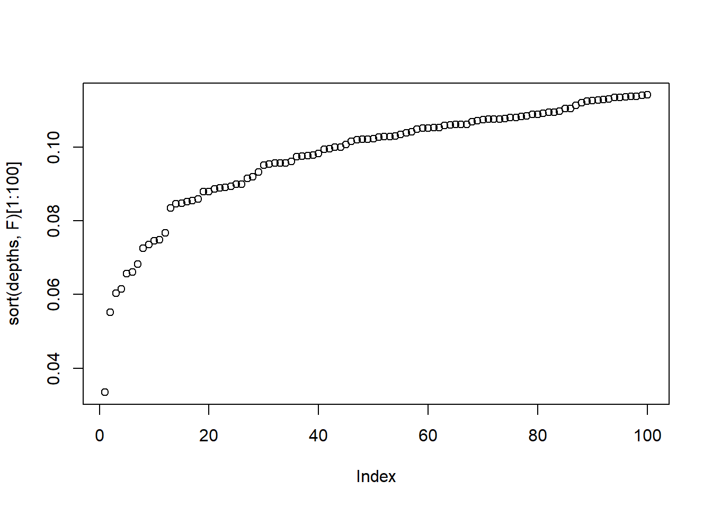

# Unit_6 - Leverage and Influence

# 7 Leverage and Influence

## 7.1 Influential observations and leverage

Recall that violations of model assumptions are more likely at remote points, and these violations may be hard to detect from inspection of the ordinary residuals because their residuals will usually be smaller. Points that are outlying in the \(x\)-direction are known as **leverage points**. **Influential points** are not only remote in terms of the specific values for the regressors, but the observed response is not consistent with the values that would be predicted based on only the other data points. It is important to find these influential points and assess their impact on the model.

Below gives an example of an influential point. The seventh point in the data set is outlying in the \(x\)-direction, and it’s response value is not consistent with the regression line based on the other six observations:

```r
set.seed(330)
x=c(rnorm(6),2.5)
y=x*2+3
y[7]=y[7]+7
plot(x,y,pch=22,bg=1)
a=lm(y~x)
curve(a$coefficients[1]+x*a$coefficients[2],add=T,lwd=3)
curve(x*2+3,add=T,col=2,lwd=3)

a2=lm(y[-7]~x[-7])
curve(a2$coefficients[1]+x*a2$coefficients[2],add=T,lwd=3,col='blue',lty=2)
```



```r
a$coefficients
```

```
(Intercept)           x 
   2.048937    3.979977 
```

Sometimes we find that a regression coefficient may have a sign that does not make engineering or scientific sense, a regressor known to be important may be statistically insignificant, or a model that fits the data well and that is logical from an application – environment perspective may produce poor predictions. These situations may be the result of one or, perhaps, a few influential observations.

Recall the hat matrix \(H=X(X^\top X)^{-1}X^\top\), as well as that it holds that \({\textrm{Var}}\left[\hat\epsilon\right]=\sigma^2(I-H)\) and \({\textrm{Var}}\left[\hat Y\right]=\sigma^2 H\). Note that \(h_{ij}\) can be interpreted as the amount of leverage exerted by the \(ith\) observation \(y_i\) on the \(jth\) fitted value \(\hat y_j\). We usually focus attention on the diagonal elements \(h_{ii}\) of the hat matrix \(H\), which may be written as \[h_{ii}=x_i^\top (X^\top X)^{-1} x_i,\] where \(X_i^\top\) is the \(i\)th row of \(X\). The hat matrix diagonal is a standardized measure of the distance of the \(i\)th observation from the center (or centroid) of the \(x\)-space. Therefore, large values of \(h_{ii}\) implies that \(x_i\) is potentially influential. Furthermore, note that \(rank(H)=p\) since the trace of an idempotent matrix equals its rank, which means that \(\bar h= p/n\). It follows that values well above \(p/n\), say \(h_{ii}>2p/n\), can be called leverage points.

```r
X=as.matrix(cbind(rep(1,length(x)),x))
# or

X=model.matrix(a)
hat=X%*%solve(t(X)%*%X)%*%t(X)

diag(hat)
```

```
        1         2         3         4         5         6         7 
0.2027453 0.2288737 0.2596869 0.1751432 0.1735495 0.3887329 0.5712686 
```

```r
p=2
n=7
diag(hat)>2*p/n
```

```
    1     2     3     4     5     6     7 
FALSE FALSE FALSE FALSE FALSE FALSE FALSE 
```

## 7.2 Cook’s Distance

Cook’s Distance is one way to incorporate both the \(X\) and \(Y\) values into an outlyingness measure:

\[
D_i\left(X^{\top} X, p, MSE\right) \equiv D_i=\frac{\left(\hat{\beta}_{(i)}-\hat{\beta}\right)^{\top} X^{\top} X\left(\hat{\beta}_{(i)}-\hat{\beta}\right)}{p MSE}, \  i\in [n],
\] where \(\hat{\beta}_{(i)}\) is the OLS estimator with the \(i\)th point removed.Large values of Cook’s distance signal a leverage point.

What do we mean by a large value? We can compare \(D_i\) to the 50th percentile of the \(F_{p,n-p}\) distribution. This gives the interpretation that deleting the \(i\)th point moves the estimate to the boundary of a 50% confidence interval. \(F_{p,n-p}\approx 1\), and so usually take \(D_i\geq 1\) to be large.

Observe that \[
D_i=\frac{r_i^2}{p} \frac{\operatorname{Var}\left(\hat{Y}_i\right)}{\operatorname{Var}\left(\hat\epsilon_i\right)}=\frac{r_i^2}{p} \frac{h_{i i}}{1-h_{i i}}, \quad i=1,2, \ldots, n,\] where it is important to recall that \(r_i\) is the studentized residual. Now, the quantity \(\frac{h_{i i}}{1-h_{i i}}\) can be shown to be the distance from the vector \(x_i\) to the centroid of the remaining data. Therefore, \(D_i\) is the product of outlyingness in both the \(X\) and \(Y\) directions. We may also write \(D_i\) as \[D_i=\frac{\left\lVert\hat{y}_{(i)}-\hat{y}\right\rVert^2}{p MSE},\] which allows for the interpretation: The Cook’s distance of the \(i\)th point is the normalized distance between the fitted value with and without point \(i\).

```r
#cut off
cooks.distance(a)
```

```
           1            2            3            4            5            6 
0.1708029420 0.2516095165 0.0180669722 0.0009569213 0.0011772793 0.2002829110 
           7 
3.3311562309 
```

```r
cooks.distance(a)>1
```

```
    1     2     3     4     5     6     7 
FALSE FALSE FALSE FALSE FALSE FALSE  TRUE 
```

```r
df=data.frame(cbind(y,x))
df[cooks.distance(a)>1,]
```

```
   y   x
7 15 2.5
```

## 7.3 Data depth functions

A more modern approach and nonparametric approach to outlier detection is through data depth. A data depth function gives meaning to centrality, order and outlyingness in spaces beyond \(\mathbb{R}\). A data depth function is a function which takes a sample and a point, and returns how central the point is, with respect to the sample. Depth functions can be written as \({\textrm{D}}\colon \mathbb{R}^{d}\times \text{Sample} \rightarrow \mathbb{R}^+\). There are different definitions of depth, so I will give a few.

Let \(S^{d-1}= \{x\in \mathbb{R}^{d}\colon \left\lVert x\right\rVert=1\}\) be the set of unit vectors in \(\mathbb{R}^{d}\), let \(\mathbb{X}_{n}=\{(Y_1,X_{1,1},\ldots,X_{1,p-1}),\ldots, (Y_n,X_{n,1},\ldots,X_{n,p-1})\}\), let \(\mathbb{X}_{n}^\top u\) be \(\mathbb{X}_{n}\) projected onto \(u\in S^{d-1}\) and let \(\widehat F_u\) be the empirical CDF with respect to \(\mathbb{X}_{n}^\top u\).

The halfspace depth \({\textrm{D}}_H\) of a point \(x\in \mathbb{R}^{d}\) with respect to a distribution \(F\) over \(\mathbb{R}^{d}\) is \[
{\textrm{D}}_H(x;F)=\inf_{u\in S^{d-1}} \widehat F_u(x^\top u)\wedge (1-F_u(x^\top u))=\inf_{u\in S^{d-1}}
F_u(x^\top u).
\]

Given a translation and scale equivariant location estimate \(\mu\) and a translation and scale invariant scale estimate \(\sigma\), the outlyingness at \(x\in\mathbb{R}^{d}\) is defined as \[O(x)=\sup _{u\in S^{d-1}} \frac{\left|x^\top u-\mu(\mathbb{X}_{n}^\top u)\right|}{\sigma(\mathbb{X}_{n}^\top u)}.\] Define projection depth as \[{\textrm{D}}_p(x)=(1+O(x))^{-1}.\]

In order to detect outliers, we look for observations that have low depth. See, continuing our toy example:

```r
# install.packages('ddalpha')
depths=ddalpha::depth.projection(cbind(x,y),cbind(x,y))
depths
```

```
[1] 0.276409011 0.255272074 0.500000000 0.973754328 0.973046927 0.338954415
[7] 0.001177815
```

```r
depths<0.015
```

```
[1] FALSE FALSE FALSE FALSE FALSE FALSE  TRUE
```

**Example 7.1** Recall example [Example 6.6](Unit_5.html#exm-6-4-1). Check for leverage and influential points in the proposed models. Compute all three measures of leverage/influence/outlyingness introduced in this lesson. What do you find?

I will load in the data below:

We can now analyze the data:

```r
####### Loading data  ##############

df_clean2=read.csv('C:/Users/12RAM/OneDrive - York University/Teaching/Courses/Math 3330 Regression/Lecture Codes/clean_data.csv',stringsAsFactors = T)

####### Analyzing the data via EDA  ##############

names(df_clean2)
```

```
 [1] "District"   "Extwall"    "Stories"    "Year_Built" "Fin_sqft"  
 [6] "Units"      "Bdrms"      "Fbath"      "Lotsize"    "Sale_date" 
[11] "Sale_price"
```

```r
# Convert to factors
df_clean2$District=as.factor(df_clean2$District)
df_clean2$Extwall=as.factor(df_clean2$Extwall)
df_clean2$Stories=as.factor(df_clean2$Stories)
df_clean2$Fbath=as.factor(df_clean2$Fbath)
df_clean2$Bdrms=as.factor(df_clean2$Bdrms)
df_clean2$Units=as.factor(df_clean2$Units)
# df_clean2=df_clean2[,c('Sale_price','Fin_sqft',
#                        'District','Sale_date','Year_Built','Lotsize')]

# We are not going to remove the outliers that we found earlier , and see if these diagnostics detect it
# remove those with 0 lot size
# df3=df_clean2[df_clean2$Lotsize>0,]
# df4=df3[df3$Lotsize<150000,]
df5=df_clean2[df_clean2$District!=3,]
df5$District=droplevels(df5$District)

# Old model
model=lm(sqrt(Sale_price)~Fin_sqft+District+Sale_date+ Year_Built,data=df5)
summary(model)
```

```

Call:
lm(formula = sqrt(Sale_price) ~ Fin_sqft + District + Sale_date + 
    Year_Built, data = df5)

Residuals:
    Min      1Q  Median      3Q     Max 
-497.28  -32.37    1.59   33.15  376.67 

Coefficients:
              Estimate Std. Error t value Pr(>|t|)    
(Intercept) -1.501e+03  4.491e+01 -33.426  < 2e-16 ***
Fin_sqft     6.069e-02  7.617e-04  79.682  < 2e-16 ***
District2    2.803e+01  2.427e+00  11.550  < 2e-16 ***
District4   -1.394e+01  5.029e+00  -2.772  0.00558 ** 
District5    9.666e+01  2.086e+00  46.328  < 2e-16 ***
District6    1.509e+01  2.995e+00   5.038 4.73e-07 ***
District7   -1.979e+00  2.601e+00  -0.761  0.44683    
District8    3.787e+01  2.841e+00  13.331  < 2e-16 ***
District9    6.892e+01  2.580e+00  26.712  < 2e-16 ***
District10   1.047e+02  2.173e+00  48.196  < 2e-16 ***
District11   1.149e+02  2.088e+00  55.000  < 2e-16 ***
District12   1.583e+01  3.399e+00   4.656 3.23e-06 ***
District13   1.149e+02  2.157e+00  53.271  < 2e-16 ***
District14   1.513e+02  2.185e+00  69.223  < 2e-16 ***
District15  -4.360e+01  3.204e+00 -13.610  < 2e-16 ***
Sale_date    6.514e-03  3.528e-04  18.461  < 2e-16 ***
Year_Built   8.079e-01  2.290e-02  35.284  < 2e-16 ***
---
Signif. codes:  0 '***' 0.001 '**' 0.01 '*' 0.05 '.' 0.1 ' ' 1

Residual standard error: 58.4 on 23020 degrees of freedom
Multiple R-squared:  0.5116,    Adjusted R-squared:  0.5112 
F-statistic:  1507 on 16 and 23020 DF,  p-value: < 2.2e-16
```

```r
# All variables - singular
# model=lm(sqrt(Sale_price)~.,data=df5)
s=summary(model)

# Compute residuals
student_res2=rstudent(model)
summ2=summary(model); summ2
```

```

Call:
lm(formula = sqrt(Sale_price) ~ Fin_sqft + District + Sale_date + 
    Year_Built, data = df5)

Residuals:
    Min      1Q  Median      3Q     Max 
-497.28  -32.37    1.59   33.15  376.67 

Coefficients:
              Estimate Std. Error t value Pr(>|t|)    
(Intercept) -1.501e+03  4.491e+01 -33.426  < 2e-16 ***
Fin_sqft     6.069e-02  7.617e-04  79.682  < 2e-16 ***
District2    2.803e+01  2.427e+00  11.550  < 2e-16 ***
District4   -1.394e+01  5.029e+00  -2.772  0.00558 ** 
District5    9.666e+01  2.086e+00  46.328  < 2e-16 ***
District6    1.509e+01  2.995e+00   5.038 4.73e-07 ***
District7   -1.979e+00  2.601e+00  -0.761  0.44683    
District8    3.787e+01  2.841e+00  13.331  < 2e-16 ***
District9    6.892e+01  2.580e+00  26.712  < 2e-16 ***
District10   1.047e+02  2.173e+00  48.196  < 2e-16 ***
District11   1.149e+02  2.088e+00  55.000  < 2e-16 ***
District12   1.583e+01  3.399e+00   4.656 3.23e-06 ***
District13   1.149e+02  2.157e+00  53.271  < 2e-16 ***
District14   1.513e+02  2.185e+00  69.223  < 2e-16 ***
District15  -4.360e+01  3.204e+00 -13.610  < 2e-16 ***
Sale_date    6.514e-03  3.528e-04  18.461  < 2e-16 ***
Year_Built   8.079e-01  2.290e-02  35.284  < 2e-16 ***
---
Signif. codes:  0 '***' 0.001 '**' 0.01 '*' 0.05 '.' 0.1 ' ' 1

Residual standard error: 58.4 on 23020 degrees of freedom
Multiple R-squared:  0.5116,    Adjusted R-squared:  0.5112 
F-statistic:  1507 on 16 and 23020 DF,  p-value: < 2.2e-16
```

```r
summ2$adj.r.squared
```

```
[1] 0.5112154
```

```r
# Compute residual analysis

MSE2=summ2$sigma^2
qqnorm(student_res2,pch=22,bg=1)
abline(0,1)
```



```r
hist(student_res2,freq=F,breaks=100)
curve(dnorm(x,0,1),add=T)
```



```r
# hist(student_res2,freq=F,breaks=100)
# curve(dnorm(x,0,1),add=T)
plot(model$fitted.values,student_res2,pch=22,bg=1)
abline(h=0)
```



```r
# First measure

X=model.matrix(model)
hat=X%*%solve(t(X)%*%X)%*%t(X)

# diag(hat)
p=ncol(X)
n=nrow(X)
out_1=which(diag(hat)>2*p/n)
plot(sort(diag(hat)[out_1]))
abline(h=2*p/n)
```



```r
# I would still look at those after the elbow
# There is a large break

# Cooks distances

CDS=cooks.distance(model)
plot(sort(CDS,T)[1:100])
```



```r
which(CDS>1)
```

```
named integer(0)
```

```r
max(CDS)
```

```
[1] 0.01361538
```

```r
df[CDS>1,]
```

```
[1] y x
<0 rows> (or 0-length row.names)
```

```r
# I would still look at those two values that are 
# far from the other distances
# I would still look at those before the elbow

# We may only look at numeric values for depth functions - so we can either
numer=NULL

for(i in names(df5)){
  if(!is.factor(df5[1,i])){
    numer=c(numer,i)
  }
}
numer
```

```
[1] "Year_Built" "Fin_sqft"   "Lotsize"    "Sale_date"  "Sale_price"
```

```r
df_mat=as.matrix(df5[,numer])
depths=ddalpha::depth.projection(df_mat,df_mat)
which(depths<0.1)[1:10]
```

```
 [1]   4 178 324 555 599 629 691 694 705 780
```

```r
plot(sort(depths,F)[1:100])
```



```r
# Notice there is a crack around 0.035, I would look at those observations
plot(sort(depths,F)[1:1000])
```



```r
plot(sort(depths,F))
```



```r
# OR 
depths=ddalpha::depth.projection(cbind(X,df5$Sale_price),cbind(X,df5$Sale_price))
which(depths<0.1)[1:10]
```

```
 [1]    4  178 1063 1330 1460 2035 3004 3238 4095 4576
```

```r
plot(sort(depths,F)[1:100])
```



```r
which.max(diag(hat))
```

```
6764 
6377 
```

```r
which.max(CDS)
```

```
6764 
6377 
```

```r
which.min(depths)
```

```
[1] 21774
```

```r
# Hugely expensive home!
df5[which.min(depths),]
```

```
      District         Extwall Stories Year_Built Fin_sqft Units Bdrms Fbath
23299       14 Masonry / Frame       2       2009     5263     2     4     4
      Lotsize Sale_date Sale_price
23299   13200     17744    1065000
```

```r
# These have many rooms etc
df5[which.max(CDS),]
```

```
     District Extwall Stories Year_Built Fin_sqft Units Bdrms Fbath Lotsize
6764        4   Brick      >2       1905     8810     1    >8    >4   24192
     Sale_date Sale_price
6764     15737     175000
```

```r
df5[which.max(diag(hat)),]
```

```
     District Extwall Stories Year_Built Fin_sqft Units Bdrms Fbath Lotsize
6764        4   Brick      >2       1905     8810     1    >8    >4   24192
     Sale_date Sale_price
6764     15737     175000
```

```r
# what happens when we remove some variables?
model2=lm(sqrt(Sale_price)~Fin_sqft+District+Sale_date+Year_Built,data=df5[-order(CDS,decreasing = T)[1:100],])
summary(model)
```

```

Call:
lm(formula = sqrt(Sale_price) ~ Fin_sqft + District + Sale_date + 
    Year_Built, data = df5)

Residuals:
    Min      1Q  Median      3Q     Max 
-497.28  -32.37    1.59   33.15  376.67 

Coefficients:
              Estimate Std. Error t value Pr(>|t|)    
(Intercept) -1.501e+03  4.491e+01 -33.426  < 2e-16 ***
Fin_sqft     6.069e-02  7.617e-04  79.682  < 2e-16 ***
District2    2.803e+01  2.427e+00  11.550  < 2e-16 ***
District4   -1.394e+01  5.029e+00  -2.772  0.00558 ** 
District5    9.666e+01  2.086e+00  46.328  < 2e-16 ***
District6    1.509e+01  2.995e+00   5.038 4.73e-07 ***
District7   -1.979e+00  2.601e+00  -0.761  0.44683    
District8    3.787e+01  2.841e+00  13.331  < 2e-16 ***
District9    6.892e+01  2.580e+00  26.712  < 2e-16 ***
District10   1.047e+02  2.173e+00  48.196  < 2e-16 ***
District11   1.149e+02  2.088e+00  55.000  < 2e-16 ***
District12   1.583e+01  3.399e+00   4.656 3.23e-06 ***
District13   1.149e+02  2.157e+00  53.271  < 2e-16 ***
District14   1.513e+02  2.185e+00  69.223  < 2e-16 ***
District15  -4.360e+01  3.204e+00 -13.610  < 2e-16 ***
Sale_date    6.514e-03  3.528e-04  18.461  < 2e-16 ***
Year_Built   8.079e-01  2.290e-02  35.284  < 2e-16 ***
---
Signif. codes:  0 '***' 0.001 '**' 0.01 '*' 0.05 '.' 0.1 ' ' 1

Residual standard error: 58.4 on 23020 degrees of freedom
Multiple R-squared:  0.5116,    Adjusted R-squared:  0.5112 
F-statistic:  1507 on 16 and 23020 DF,  p-value: < 2.2e-16
```

```r
# Notice that some of the coefficients moved several standard errors!! This is a huge change - recall that outside 2 SE is outside the confidence interval. 
sort(abs(model2$coefficients-model$coefficients)/s$coefficients[,2],T)
```

```
  District6   Sale_date (Intercept)  Year_Built   District4  District12 
 4.45849467  1.31275625  1.14789619  0.99472519  0.95484626  0.64271066 
  District9    Fin_sqft  District15   District8  District11  District10 
 0.54351424  0.33354506  0.31519160  0.30775318  0.21754140  0.14803702 
 District14  District13   District2   District7   District5 
 0.14756268  0.13380072  0.10805161  0.09331690  0.07037254 
```

How should we treat influential observations? The easiest course of action is removal. If there are many influential observations, then you might want to try robust model fitting methods, which automatically account for outliers and influential observations.

## 7.4 Homework questions

Complete the Chapter 6 textbook questions.

**Exercise 7.1** What are the three methods we have learned for detecting influential/leverage points?

**Exercise 7.2** Compute the hat values, Cook’s distances and the depth values for the body weight example. Are there any influential/leverage points/outliers?

**Exercise 7.3** Compute the hat values, Cook’s distances and the depth values for the cars example. Are there any outliers/influential/leverage points?

**Exercise 7.4** Fit a model without location to the real estate data of your choosing. Compute the hat values, Cook’s distances and the depth values for the cars example. Are there any influential/leverage points/outliers? Print out the influential/leverage points/outliers. Why do you think they are outlying? Should we remove them?
