# Unit_7 - Multicollinearity

# 8 Multicollinearity

## 8.1 Multicollinearity and the problems it creates

A serious problem that may dramatically impact the usefulness of a regression model is multicollinearity, or near-linear dependence among the regression variables. That is multicollinearity refers to near-linear dependence among the regressors. The regressors are the columns of the \(X\) matrix, so clearly an exact linear dependence among the regressors would result in a singular \(X^\top X\). This will impact our ability to estimate \(\beta\).

To elaborate, assume that the regressor variables and the response have been centered and scaled to unit length. The matrix \(X^\top X\) is then a \(p\times p\) correlation matrix (of the vector of regressors) and \(X^\top Y\) is the vector of correlations between the regressors and response. Recall that a set of vectors \(v_1,\ldots,v_n\) are linearly dependent if there exists \(c\neq 0\) such that \(\sum_{i=1}^nc_iv_i=0\). If the columns of \(X\) are linearly dependent, then \(X^\top X\) is not invertible! We say there is multicollinearity if there exists \(c\) such that \(||c||>k\) and that \(||\sum_{i=1}^p c_ix_i||<\epsilon\) for some small \(\epsilon\) and some large enough \(k\). Here \(x_i\) are the columns of the \(X\) matrix.

Multicollinearity results in large variances and covariances for the least - squares estimators of the regression coefficients. Let \(A=(X^\top X)^{-1}\), where the regressors have been centered and scaled to unit length. That is, columns \(2,\ldots,p\) of \(X\) have their mean subtracted and are divided by their respective norms. Then \[A_{jj}=(1-R^2_j)^{-1},\] where \(R^2_j\) is the coefficient of multiple determination from the regression of \(X_j\) on the remaining \(p - 1\) regressor variables. Now, recall that \({\textrm{Var}}\left[\hat\beta_j\right]=A_{jj}\sigma^2\). What happens when the correlation is approximately 1 between \(X_j\) and another regressor? It is easy to see that the the variance of coefficient \(j\) goes to \(\infty\) as \({\textrm{corr}}\left[X_j,X_i\right]\to 1\).

This huge variance results in large magnitude of the least squares estimators of the regression coefficients. We have that \({\textrm{E}}\left[\left\lVert\hat\beta-\beta\right\rVert^2\right]=\sum_{i=1}^p {\textrm{Var}}\left[\hat\beta_i\right]=\sigma^2 \mathop{\mathrm{trace}}(X^\top X)^{-1}\). Recall! \(\mathop{\mathrm{trace}}(A)\) is the sum of its eigenvalues. If \(X^\top X\) has near linearly dependent columns, then some of the eigenvalues \(\lambda_1,\ldots,\lambda_p\) will be near 0 (why?). Thus, \[{\textrm{E}}\left[\left\lVert\hat\beta-\beta\right\rVert^2\right]=\sigma^2\mathop{\mathrm{trace}}(X^\top X)^{-1}=\sigma^2\sum_{i=1}^p\frac{1}{\lambda_i}.\] We can also show that \[{\textrm{E}}\left[\hat{\beta}^{\top} \hat{\beta}\right]=\beta^{\top} \beta+\sigma^2 \operatorname{Tr}\left(X^{\top} X\right)^{-1},\] which gives the same interpretation.

We can also observe this empirically.

```r
# Let's simulate data from a regression model with highly correlated regressors. 
simulate_coef=function(){
  n=100
  X=rnorm(n)
  X2=2*X+rnorm(n,0,0.01)
  Y=1+2*X+X2*2+rnorm(n)
  return(coef(lm(Y~X+X2)))
}

# See the HUGE variance in the estimated coefficients? 0 this is from MCL!
CF=replicate(1000,simulate_coef())
hist(CF[1,],xlab='Coef 1')
```

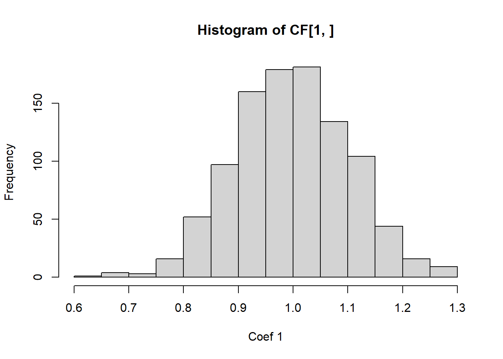

```r
hist(CF[2,],xlab='Coef 2')
```

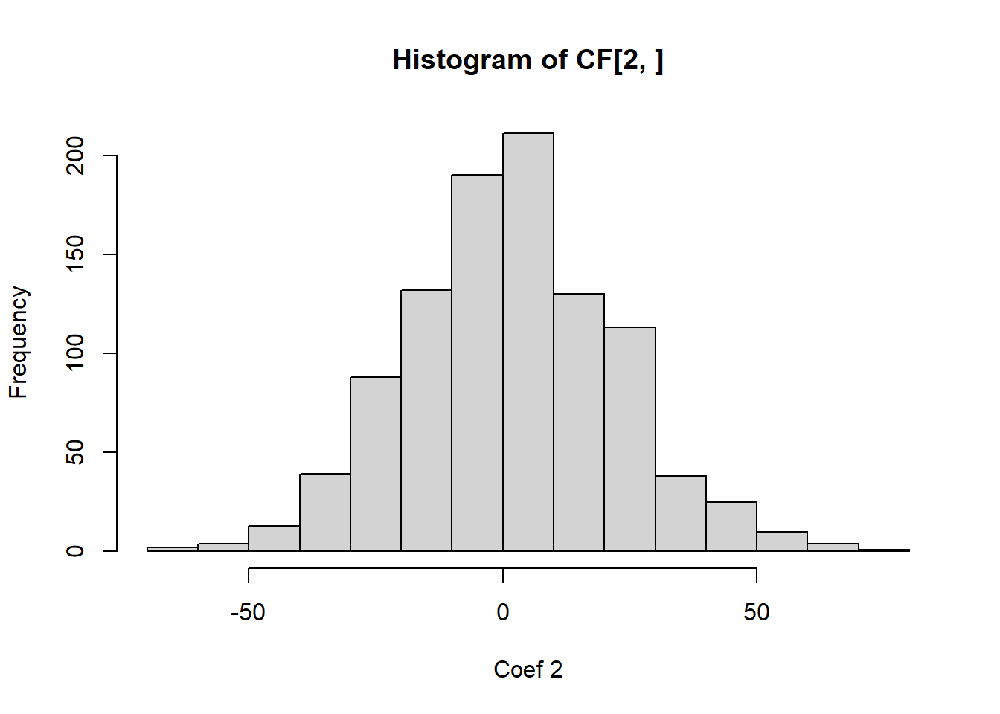

```r
hist(CF[3,],xlab='Coef 3')
```

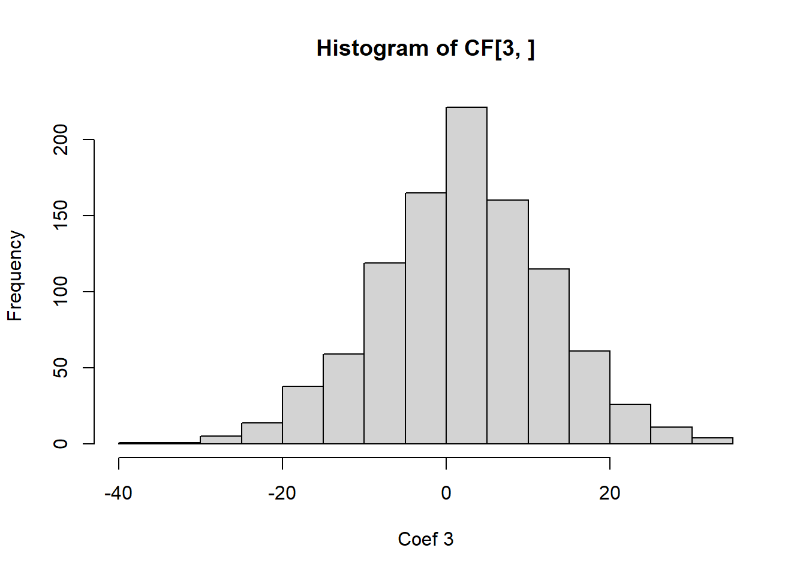

It is easy to see from this analysis that multicollinearity is a serious problem, and we should check for it in regression modelling.

## 8.2 Multicollinearity Diagnostics

### 8.2.1 VIF

We need some diagnostics to detect multicollinearity. The first of which is the **correlation matrix**, which is good for detecting pairwise correlations, but not so much for more complicated dependencies! To correct this, a popular diagnostic is the **variance inflation factor** (VIF): these are the diagonals of \((X^\top X)^{-1}\). A VIF that exceeds 3, 5 or 10 is an indication that the associated regression coefficients are poorly estimated because of multicollinearity. The variance inflation factor can be written as \((1-R^2_j)^{-1}\), where \(R^2_j\) is the coefficient of determination obtained from regressing \(x_j\) on the other regressor variables. For categorical variables, we may look at their VIF together, instead of for the individual dummy variables. This is done via the [generalized VIF (GVIF)](https://www.tandfonline.com/doi/abs/10.1080/01621459.1992.10475190#.U2jkTFdMzTo), which was developed by our very own Georges Monette and John Fox ([Fox and Monette 1992](references.html#ref-Monette1992)). We can consider the \((GVIF^{(1/(2\text{number of dummy variables})))}\). However, we want to compare these to the square root of our rules of thumb, so \(\sqrt{3},\sqrt{5},\sqrt{10}\). The values \((GVIF^{(1/(2\text{number of dummy variables})))}\) are computed automatically in R. When your model has interaction effects, or polynomial terms, it is best to exclude those and compute the VIFs. In summary:

- Compare the VIF of continuous variables to 3, 5 or 10, above those values signals multicollinearity
- Compare the \((GVIF^{(1/(2\text{number of dummy variables})))}\) of categorical variables to \(\sqrt{3},\sqrt{5},\text{ or }\sqrt{10}\), above those values signals multicollinearity
- When computing VIF and GVIF, it is best to exclude interaction effects and or polynomial terms
- The given thresholds are rules of thumb, and we should not discard evidence of multicollinearity of we are very close to a threshold, e.g., 9.9.

### 8.2.2 Condition number

One can also look at the eigenvalues of \(X^\top X\), where the regressors are centered and normalized to unit length. If the eigenvalues are small, this indicates multicollinearity. One metric computed from the eigenvalues is the **condition number** of \(X^\top X\): \(\kappa=\max \lambda_j/\min \lambda_j\), where the regressors are centered and normalized to unit length. Condition numbers between 100 and 1000 imply moderate to strong multicollinearity, and if \(\kappa\) exceeds 1000, severe multicollinearity is indicated. Diagonalizing via \(X^\top X=\Lambda D \Lambda^\top\) yields the eigenvectors, which help us determine the exact dependence between variables is. You can check the eigenvectors associated with the small eigenvalues. Components that are large in the eigenvector indicate that that variable is contributing to the multicollinearity. Again, for this computation, it is best to exclude interaction effects and or polynomial terms.

Note
While the method of least squares will generally produce poor estimates of the individual model parameters when strong multicollinearity is present, this does not necessarily imply that the fitted model is a poor predictor.

1. If predictions are confined to regions of the \(X\)-space where the multicollinearity holds approximately, the fitted model often produces satisfactory predictions.
2. The linear combinations \(X\beta\) may be estimated well, even if \(\beta\) is not.

**Example 8.1** Recall example [Example 6.6](Unit_5.html#exm-6-4-1). Check for multicollinearity in the proposed models.

I will load in the data below:

```r
####### Analyzing the data via EDA  ##############

names(df_clean2)
```

```
 [1] "District"   "Extwall"    "Stories"    "Year_Built" "Fin_sqft"  
 [6] "Units"      "Bdrms"      "Fbath"      "Lotsize"    "Sale_date" 
[11] "Sale_price"
```

```r
# Convert to factors
df_clean2$District=as.factor(df_clean2$District)
df_clean2$Extwall=as.factor(df_clean2$Extwall)
df_clean2$Stories=as.factor(df_clean2$Stories)
df_clean2$Fbath=as.factor(df_clean2$Fbath)
df_clean2$Bdrms=as.factor(df_clean2$Bdrms)
df_clean2$Units=as.factor(df_clean2$Units)
# df_clean2=df_clean2[,c('Sale_price','Fin_sqft',
#                        'District','Sale_date','Year_Built','Lotsize')]

# We are not going to remove the outliers that we found earlier , and see if these diagnostics detect it
# remove those with 0 lot size
df3=df_clean2[df_clean2$Lotsize>0,]
df4=df3[df3$Lotsize<150000,]
df5=df_clean2[df_clean2$District!=3,]
df5$District=droplevels(df5$District)
df=df5
# Old model
# model2=lm(sqrt(Sale_price)~Fin_sqft+District+Sale_date+ Year_Built,data=df5)
# summary(model2)
# More variables, which might be related
model2=lm(sqrt(Sale_price)~Fin_sqft+District+Sale_date+ Year_Built+Units+Bdrms+Fbath+Extwall,data=df5)

s=summary(model2)
s
```

```

Call:
lm(formula = sqrt(Sale_price) ~ Fin_sqft + District + Sale_date + 
    Year_Built + Units + Bdrms + Fbath + Extwall, data = df5)

Residuals:
    Min      1Q  Median      3Q     Max 
-471.88  -28.67    2.10   30.51  366.97 

Coefficients:
                         Estimate Std. Error t value Pr(>|t|)    
(Intercept)            -1.181e+03  4.847e+01 -24.374  < 2e-16 ***
Fin_sqft                8.565e-02  1.164e-03  73.587  < 2e-16 ***
District2               3.085e+01  2.193e+00  14.066  < 2e-16 ***
District4              -2.670e+01  4.595e+00  -5.811 6.30e-09 ***
District5               8.931e+01  1.887e+00  47.324  < 2e-16 ***
District6               1.171e+01  2.722e+00   4.302 1.70e-05 ***
District7              -7.729e+00  2.350e+00  -3.289 0.001005 ** 
District8               3.756e+01  2.570e+00  14.616  < 2e-16 ***
District9               6.685e+01  2.340e+00  28.570  < 2e-16 ***
District10              9.604e+01  1.965e+00  48.870  < 2e-16 ***
District11              1.114e+02  1.888e+00  59.013  < 2e-16 ***
District12              2.154e+01  3.081e+00   6.991 2.81e-12 ***
District13              1.102e+02  1.950e+00  56.496  < 2e-16 ***
District14              1.461e+02  1.980e+00  73.803  < 2e-16 ***
District15             -4.363e+01  2.901e+00 -15.043  < 2e-16 ***
Sale_date               6.867e-03  3.203e-04  21.441  < 2e-16 ***
Year_Built              5.165e-01  2.158e-02  23.929  < 2e-16 ***
Units1                  2.362e+01  9.744e+00   2.424 0.015359 *  
Units2                 -4.792e+01  9.730e+00  -4.925 8.48e-07 ***
Units3                 -7.944e+01  1.052e+01  -7.550 4.50e-14 ***
Bdrms0                  1.186e+02  2.301e+01   5.155 2.56e-07 ***
Bdrms1                  8.658e+01  1.371e+01   6.315 2.76e-10 ***
Bdrms2                  9.214e+01  1.260e+01   7.312 2.72e-13 ***
Bdrms3                  1.033e+02  1.253e+01   8.240  < 2e-16 ***
Bdrms4                  9.367e+01  1.249e+01   7.502 6.53e-14 ***
Bdrms5                  8.904e+01  1.249e+01   7.127 1.06e-12 ***
Bdrms6                  6.985e+01  1.251e+01   5.584 2.38e-08 ***
Bdrms7                  4.501e+01  1.352e+01   3.328 0.000876 ***
Bdrms8                  2.732e+01  1.504e+01   1.816 0.069317 .  
Fbath0                  1.075e+02  2.368e+01   4.540 5.64e-06 ***
Fbath1                  8.894e+01  2.059e+01   4.319 1.57e-05 ***
Fbath2                  1.118e+02  2.055e+01   5.440 5.39e-08 ***
Fbath3                  1.223e+02  2.050e+01   5.965 2.48e-09 ***
Fbath4                  1.066e+02  2.144e+01   4.973 6.65e-07 ***
ExtwallBlock           -4.583e+00  4.512e+00  -1.016 0.309733    
ExtwallBrick            7.014e+00  8.879e-01   7.899 2.93e-15 ***
ExtwallFiber-Cement     5.247e+01  4.798e+00  10.936  < 2e-16 ***
ExtwallFrame           -3.386e+00  1.242e+00  -2.727 0.006394 ** 
ExtwallMasonry / Frame  9.203e+00  2.165e+00   4.250 2.15e-05 ***
ExtwallPrem Wood        2.286e+01  6.930e+00   3.299 0.000971 ***
ExtwallStone            1.942e+01  1.867e+00  10.404  < 2e-16 ***
ExtwallStucco           8.629e+00  2.908e+00   2.968 0.003005 ** 
---
Signif. codes:  0 '***' 0.001 '**' 0.01 '*' 0.05 '.' 0.1 ' ' 1

Residual standard error: 52.61 on 22995 degrees of freedom
Multiple R-squared:  0.6041,    Adjusted R-squared:  0.6034 
F-statistic: 855.7 on 41 and 22995 DF,  p-value: < 2.2e-16
```

```r
# Correlations 
X=model.matrix(model2)
corrplot::corrplot(cor(X[,-1]))
```

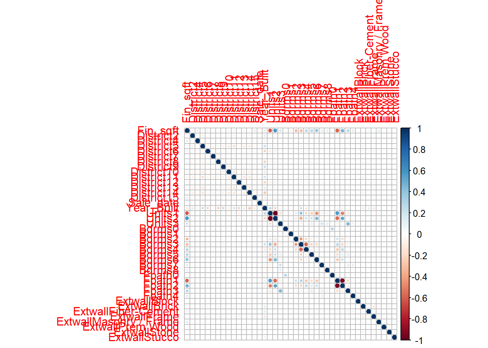

```r
# VIFS
# predictor removes the interactions
# car::vif(model2,type = 'predictor')
car::vif(model2)
```

```
               GVIF Df GVIF^(1/(2*Df))
Fin_sqft   3.230637  1        1.797397
District   2.567955 13        1.036939
Sale_date  1.018171  1        1.009045
Year_Built 2.086281  1        1.444396
Units      3.383703  3        1.225271
Bdrms      3.972579  9        1.079647
Fbath      2.886231  5        1.111817
Extwall    1.435525  8        1.022853
```

```r
# Correlations 
# X=X[,-1]
X2=apply(X,2,function(x){(x-mean(x))/sqrt(sum((x-mean(x))^2))}); dim(X2)
```

```
[1] 23037    42
```

```r
X2[,1]=X[,1]
X=X2
A=eigen(t(X)%*%X)

plot(sort(A$values)[1:10])
```

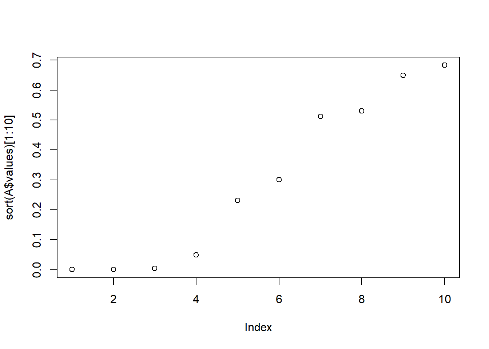

```r
which.min(A$values)
```

```
[1] 42
```

```r
dim(A$vectors)
```

```
[1] 42 42
```

```r
#Condition number 
max(A$values)/min(A$values)
```

```
[1] 41193554
```

```r
rownames(A$vectors)=names(model2$coefficients)

# Which components are important here

A$vectors[,which.min(A$values)]
```

```
           (Intercept)               Fin_sqft              District2 
          0.000000e+00           5.491915e-03          -8.098975e-05 
             District4              District5              District6 
          3.813210e-04          -3.033597e-04          -3.076636e-05 
             District7              District8              District9 
         -3.568751e-04           9.509119e-05          -3.373675e-04 
            District10             District11             District12 
         -4.972892e-04          -3.424186e-05          -6.326595e-05 
            District13             District14             District15 
         -1.667758e-04          -2.711893e-04          -7.357368e-06 
             Sale_date             Year_Built                 Units1 
         -2.642462e-04           2.794659e-04           2.411565e-02 
                Units2                 Units3                 Bdrms0 
          2.234835e-02           5.572644e-03          -4.237411e-03 
                Bdrms1                 Bdrms2                 Bdrms3 
         -1.479639e-02          -8.098271e-02          -1.185489e-01 
                Bdrms4                 Bdrms5                 Bdrms6 
         -1.002262e-01          -5.147474e-02          -4.994474e-02 
                Bdrms7                 Bdrms8                 Fbath0 
         -1.304716e-02          -7.847541e-03           4.286290e-02 
                Fbath1                 Fbath2                 Fbath3 
          6.787509e-01           6.656176e-01           2.278607e-01 
                Fbath4           ExtwallBlock           ExtwallBrick 
          7.126118e-02           3.336024e-05          -4.642255e-04 
   ExtwallFiber-Cement           ExtwallFrame ExtwallMasonry / Frame 
          3.683410e-04          -2.689623e-04          -8.592603e-04 
      ExtwallPrem Wood           ExtwallStone          ExtwallStucco 
         -2.336143e-04          -1.897784e-04          -1.970389e-04 
```

```r
# round(A$vectors[,which.min(A$values)],1)
round(A$vectors[,which.min(A$values)][abs(round(A$vectors[,which.min(A$values)],1))>0],1)
```

```
Bdrms2 Bdrms3 Bdrms4 Bdrms5 Fbath1 Fbath2 Fbath3 Fbath4 
  -0.1   -0.1   -0.1   -0.1    0.7    0.7    0.2    0.1 
```

```r
min_4=order(A$values)[1:4]
A$vectors[,min_4]
```

```
                                [,1]          [,2]          [,3]          [,4]
(Intercept)             0.000000e+00  0.000000e+00  0.000000e+00  0.0000000000
Fin_sqft                5.491915e-03 -9.224010e-03  1.188401e-02  0.0270844981
District2              -8.098975e-05 -7.171369e-04 -1.364305e-05 -0.2573525470
District4               3.813210e-04 -1.859440e-03  7.085189e-03 -0.0963354134
District5              -3.033597e-04  5.655736e-05 -6.190680e-04 -0.3970814791
District6              -3.076636e-05  1.020858e-03 -6.159903e-04 -0.1914688618
District7              -3.568751e-04  9.361818e-05  1.316327e-04 -0.2253975020
District8               9.509119e-05  5.218008e-04  2.282725e-04 -0.2069464707
District9              -3.373675e-04 -3.686650e-04 -1.918909e-04 -0.2340610079
District10             -4.972892e-04  1.014931e-03 -2.130468e-03 -0.3532344163
District11             -3.424186e-05 -2.199029e-04 -2.207701e-04 -0.3917050101
District12             -6.326595e-05  4.419550e-04  2.435144e-03 -0.1562487436
District13             -1.667758e-04  2.422701e-04  7.871931e-06 -0.3494070580
District14             -2.711893e-04  6.587700e-04 -1.882882e-03 -0.3573976462
District15             -7.357368e-06 -2.576823e-04 -1.104466e-03 -0.1676543070
Sale_date              -2.642462e-04 -2.658862e-04 -6.529073e-03 -0.0023254038
Year_Built              2.794659e-04  6.532106e-04 -1.943358e-03 -0.0118159033
Units1                  2.411565e-02  8.847288e-02  6.999435e-01  0.0036367321
Units2                  2.234835e-02  8.723723e-02  6.844527e-01 -0.0054547343
Units3                  5.572644e-03  1.530008e-02  1.563099e-01 -0.0002375389
Bdrms0                 -4.237411e-03 -2.129747e-02  1.193029e-02  0.0003635227
Bdrms1                 -1.479639e-02 -7.811393e-02  1.190583e-02  0.0020197732
Bdrms2                 -8.098271e-02 -4.213334e-01  5.737300e-02  0.0006544043
Bdrms3                 -1.185489e-01 -6.081989e-01  8.083051e-02  0.0071750605
Bdrms4                 -1.002262e-01 -5.081361e-01  6.617640e-02 -0.0070335013
Bdrms5                 -5.147474e-02 -2.585338e-01  3.209195e-02 -0.0035521769
Bdrms6                 -4.994474e-02 -2.478403e-01  3.152195e-02 -0.0038765656
Bdrms7                 -1.304716e-02 -6.745185e-02  1.265355e-02 -0.0008841890
Bdrms8                 -7.847541e-03 -4.416656e-02  1.083602e-02 -0.0013029795
Fbath0                  4.286290e-02 -8.782624e-03 -3.455349e-03  0.0011804643
Fbath1                  6.787509e-01 -1.339772e-01 -3.588576e-03 -0.0030582423
Fbath2                  6.656176e-01 -1.302243e-01 -8.053043e-03  0.0018361163
Fbath3                  2.278607e-01 -4.623718e-02 -3.239153e-03 -0.0000608401
Fbath4                  7.126118e-02 -1.258407e-02  1.799572e-03 -0.0010827629
ExtwallBlock            3.336024e-05  3.801567e-04  1.892410e-03 -0.0024858229
ExtwallBrick           -4.642255e-04  9.304769e-04 -6.023996e-04 -0.0034608384
ExtwallFiber-Cement     3.683410e-04  7.593387e-04 -9.593496e-04  0.0002017397
ExtwallFrame           -2.689623e-04 -3.419082e-04  3.999955e-03 -0.0052695599
ExtwallMasonry / Frame -8.592603e-04  2.786953e-04 -1.443152e-03 -0.0053898525
ExtwallPrem Wood       -2.336143e-04  5.150836e-04 -4.476341e-04 -0.0030783990
ExtwallStone           -1.897784e-04  1.001401e-03 -7.036645e-04 -0.0056127691
ExtwallStucco          -1.970389e-04  4.980607e-04  1.245502e-05 -0.0019203399
```

```r
# round(A$vectors[,which.min(A$values)],1)
for(i in min_4)
  print(round(A$vectors[,i][abs(round(A$vectors[,i],1))>0],1))
```

```
Bdrms2 Bdrms3 Bdrms4 Bdrms5 Fbath1 Fbath2 Fbath3 Fbath4 
  -0.1   -0.1   -0.1   -0.1    0.7    0.7    0.2    0.1 
Units1 Units2 Bdrms1 Bdrms2 Bdrms3 Bdrms4 Bdrms5 Bdrms6 Bdrms7 Fbath1 Fbath2 
   0.1    0.1   -0.1   -0.4   -0.6   -0.5   -0.3   -0.2   -0.1   -0.1   -0.1 
Units1 Units2 Units3 Bdrms2 Bdrms3 Bdrms4 
   0.7    0.7    0.2    0.1    0.1    0.1 
 District2  District4  District5  District6  District7  District8  District9 
      -0.3       -0.1       -0.4       -0.2       -0.2       -0.2       -0.2 
District10 District11 District12 District13 District14 District15 
      -0.4       -0.4       -0.2       -0.3       -0.4       -0.2 
```

```r
# Everything seems good!
```

**Example 8.2** Example 9.1 from the textbook - The Acetylene Data. Below presents data concerning the percentage of conversion of \(n\) - heptane to acetylene and three explanatory variables. These are typical chemical process data for which a full quadratic response surface in all three regressors is often considered to be an appropriate tentative model. Let’s build the model and see how the extrapolation performs.

```r
########### Example 2 

df <- data.frame(
  Conversion_of_n_Heptane_to_Acetylene = c(49.0, 50.2, 50.5, 48.5, 47.5, 44.5, 28.0, 31.5, 34.5, 35.0, 38.0, 38.5, 15.0, 17.0, 20.5, 29.5),
  Reactor_Temperature_deg_C = c(1300, 1300, 1300, 1300, 1300, 1300, 1200, 1200, 1200, 1200, 1200, 1200, 1100, 1100, 1100, 1100),
  Ratio_of_H2_to_n_Heptane_mole_ratio = c(7.5, 9.0, 11.0, 13.5, 17.0, 23.0, 5.3, 7.5, 11.0, 13.5, 17.0, 23.0, 5.3, 7.5, 11.0, 17.0),
  Contact_Time_sec = c(0.0120, 0.0120, 0.0115, 0.0130, 0.0135, 0.0120, 0.0400, 0.0380, 0.0320, 0.0260, 0.0340, 0.0410, 0.0840, 0.0980, 0.0920, 0.0860)
)

# Printing the dataframe
head(df)
```

```
  Conversion_of_n_Heptane_to_Acetylene Reactor_Temperature_deg_C
1                                 49.0                      1300
2                                 50.2                      1300
3                                 50.5                      1300
4                                 48.5                      1300
5                                 47.5                      1300
6                                 44.5                      1300
  Ratio_of_H2_to_n_Heptane_mole_ratio Contact_Time_sec
1                                 7.5           0.0120
2                                 9.0           0.0120
3                                11.0           0.0115
4                                13.5           0.0130
5                                17.0           0.0135
6                                23.0           0.0120
```

```r
# For standardizing via Z scores
unit_norm=function(x){
  x=x-mean(x)
  return(sqrt(length(x)-1)*x/sqrt(sum(x^2)))
}

df2=df

#standardizing the regressors
df2[,2:4]=apply(df[,2:4],2,unit_norm)

df2=data.frame(df2)
corrplot::corrplot(cor(df2))
```

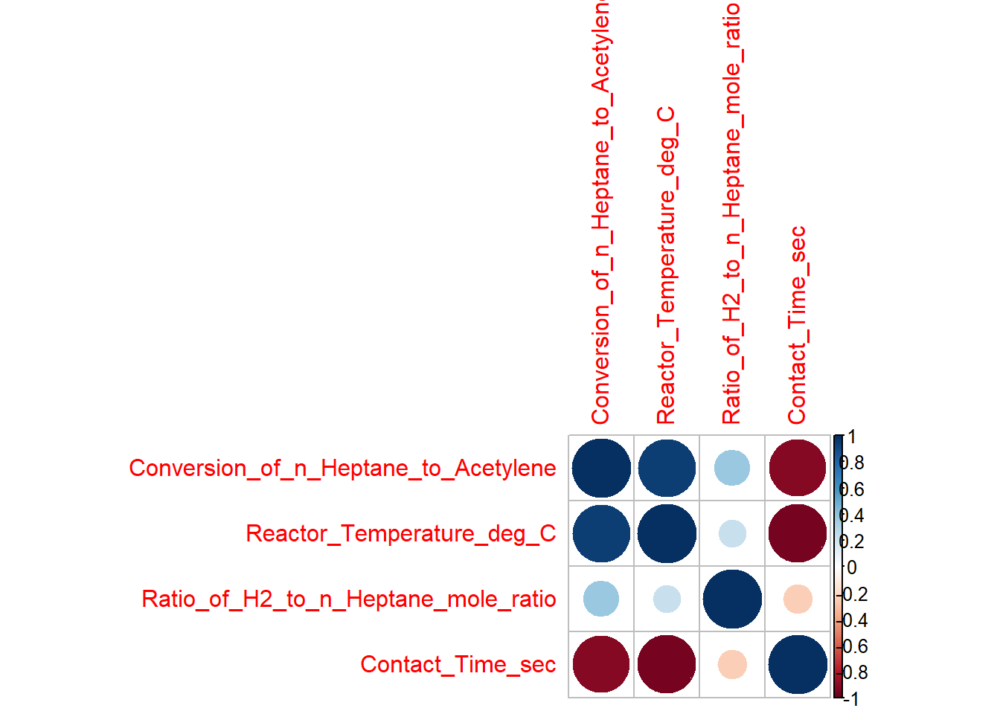

```r
# Observe the high correlations between Contact time and Reactor temperature
plot(df2$Reactor_Temperature_deg_C,df2$Contact_Time_sec,pch=22,bg=1)
```

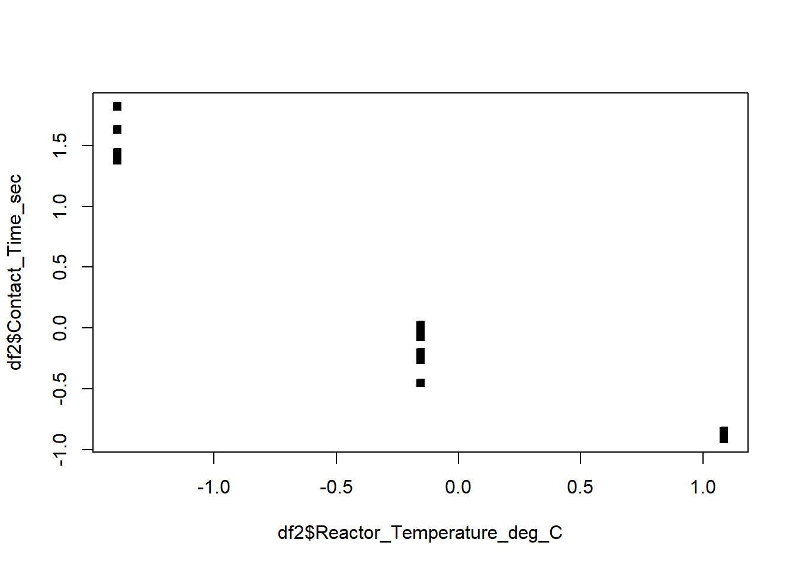

```r
orig=names(df2)
names(df2)=c('P','t','H','C')

df2$t2=df2$t^2
df2$H2=df2$H^2
df2$C2=df2$C^2

RS=lm(P~t+H+C+t*H+t*C+C*H+t2+H2+C2  ,df2)
summary(RS)
```

```

Call:
lm(formula = P ~ t + H + C + t * H + t * C + C * H + t2 + H2 + 
    C2, data = df2)

Residuals:
    Min      1Q  Median      3Q     Max 
-1.3499 -0.3411  0.1297  0.5011  0.6720 

Coefficients:
            Estimate Std. Error t value Pr(>|t|)    
(Intercept)  35.8958     1.0916  32.884 5.26e-08 ***
t             4.0038     4.5087   0.888 0.408719    
H             2.7783     0.3071   9.048 0.000102 ***
C            -8.0423     6.0707  -1.325 0.233461    
t2          -12.5236    12.3238  -1.016 0.348741    
H2           -0.9727     0.3746  -2.597 0.040844 *  
C2          -11.5932     7.7063  -1.504 0.183182    
t:H          -6.4568     1.4660  -4.404 0.004547 ** 
t:C         -26.9804    21.0213  -1.283 0.246663    
H:C          -3.7681     1.6553  -2.276 0.063116 .  
---
Signif. codes:  0 '***' 0.001 '**' 0.01 '*' 0.05 '.' 0.1 ' ' 1

Residual standard error: 0.9014 on 6 degrees of freedom
Multiple R-squared:  0.9977,    Adjusted R-squared:  0.9943 
F-statistic: 289.7 on 9 and 6 DF,  p-value: 3.225e-07
```

```r
# Crazy high VIF
car::vif(RS)
```

```
there are higher-order terms (interactions) in this model
consider setting type = 'predictor'; see ?vif
```

```
          t           H           C          t2          H2          C2 
 375.247759    1.740631  680.280039 1762.575365    3.164318 1156.766284 
        t:H         t:C         H:C 
  31.037059 6563.345193   35.611286 
```

```r
car::vif(RS,type='predictor')
```

```
GVIFs computed for predictors
```

```
           GVIF Df GVIF^(1/(2*Df)) Interacts With Other Predictors
t  51654.740516  6        2.470354           H, C       t2, H2, C2
H  51654.740516  6        2.470354           t, C       t2, H2, C2
C  51654.740516  6        2.470354           t, H       t2, H2, C2
t2  1762.575365  1       41.983037           --    t, H, C, H2, C2
H2     3.164318  1        1.778853           --    t, H, C, t2, C2
C2  1156.766284  1       34.011267           --    t, H, C, t2, H2
```

```r
# hidden extrapolation - be careful

# Create a grid to extrapolate over
c_grid=seq(-2,2,l=100)
t_grid=seq(-2,2,l=100)
g=expand.grid(t_grid,c_grid)

# Adding a fixed value of H=-0.6082179
g=cbind(g,rep(-0.6082179,nrow(g)))
# Adding H^2
g=cbind(g,g^2)

# Making new dataframe for predictions
new_dat=data.frame(g)
names(new_dat)=c("t","C","H","t2","C2","H2")

# Predicting the values on the grid
Z=predict.lm(RS,new_dat)

contour(c_grid,t_grid,matrix(Z, ncol = length(t_grid)),lwd=2,labcex=2,ylim=c(-1,1)*2,xlim=c(-1,1)*2)
points(df2$t,df2$C,pch=22,bg=1)
```

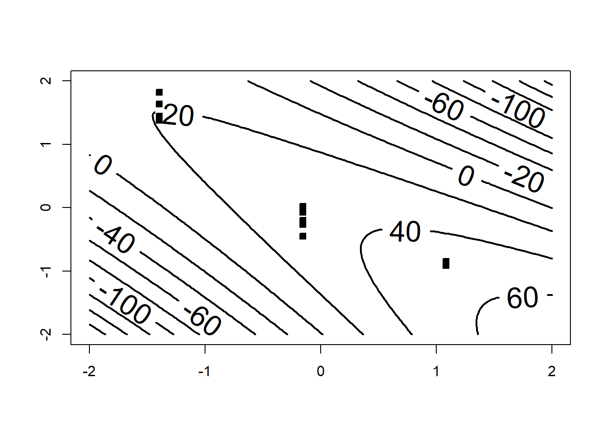

```r
## Notice that as soon as we leave the region with data, the response becomes negative. 
# Recall that it is a percentage and can't be negative
## This shows that mild extrapolation dangerous!
```

**Example 8.3** Use the NFL data from the textbook - regress the number of wins against all variables. Check for multicollinearity. Propose a method to resolve the multicollinearity.

```r
#####################################################
#
#              
#
#           NFL DATA EXAMPLE
#                        
#
#####################################################

df=MPV::table.b1
# Note

df
```

```
    y   x1   x2   x3   x4  x5   x6   x7   x8   x9
1  10 2113 1985 38.9 64.7   4  868 59.7 2205 1917
2  11 2003 2855 38.8 61.3   3  615 55.0 2096 1575
3  11 2957 1737 40.1 60.0  14  914 65.6 1847 2175
4  13 2285 2905 41.6 45.3  -4  957 61.4 1903 2476
5  10 2971 1666 39.2 53.8  15  836 66.1 1457 1866
6  11 2309 2927 39.7 74.1   8  786 61.0 1848 2339
7  10 2528 2341 38.1 65.4  12  754 66.1 1564 2092
8  11 2147 2737 37.0 78.3  -1  761 58.0 1821 1909
9   4 1689 1414 42.1 47.6  -3  714 57.0 2577 2001
10  2 2566 1838 42.3 54.2  -1  797 58.9 2476 2254
11  7 2363 1480 37.3 48.0  19  984 67.5 1984 2217
12 10 2109 2191 39.5 51.9   6  700 57.2 1917 1758
13  9 2295 2229 37.4 53.6  -5 1037 58.8 1761 2032
14  9 1932 2204 35.1 71.4   3  986 58.6 1709 2025
15  6 2213 2140 38.8 58.3   6  819 59.2 1901 1686
16  5 1722 1730 36.6 52.6 -19  791 54.4 2288 1835
17  5 1498 2072 35.3 59.3  -5  776 49.6 2072 1914
18  5 1873 2929 41.1 55.3  10  789 54.3 2861 2496
19  6 2118 2268 38.2 69.6   6  582 58.7 2411 2670
20  4 1775 1983 39.3 78.3   7  901 51.7 2289 2202
21  3 1904 1792 39.7 38.1  -9  734 61.9 2203 1988
22  3 1929 1606 39.7 68.8 -21  627 52.7 2592 2324
23  4 2080 1492 35.5 68.8  -8  722 57.8 2053 2550
24 10 2301 2835 35.3 74.1   2  683 59.7 1979 2110
25  6 2040 2416 38.7 50.0   0  576 54.9 2048 2628
26  8 2447 1638 39.9 57.1  -8  848 65.3 1786 1776
27  2 1416 2649 37.4 56.3 -22  684 43.8 2876 2524
28  0 1503 1503 39.3 47.0  -9  875 53.5 2560 2241
```

```r
summary(df)
```

```
       y                x1             x2             x3              x4       
 Min.   : 0.000   Min.   :1416   Min.   :1414   Min.   :35.10   Min.   :38.10  
 1st Qu.: 4.000   1st Qu.:1896   1st Qu.:1714   1st Qu.:37.38   1st Qu.:52.42  
 Median : 6.500   Median :2111   Median :2106   Median :38.85   Median :57.70  
 Mean   : 6.964   Mean   :2110   Mean   :2127   Mean   :38.64   Mean   :59.40  
 3rd Qu.:10.000   3rd Qu.:2303   3rd Qu.:2474   3rd Qu.:39.70   3rd Qu.:68.80  
 Max.   :13.000   Max.   :2971   Max.   :2929   Max.   :42.30   Max.   :78.30  
       x5               x6               x7              x8      
 Min.   :-22.00   Min.   : 576.0   Min.   :43.80   Min.   :1457  
 1st Qu.: -5.75   1st Qu.: 710.5   1st Qu.:54.77   1st Qu.:1848  
 Median :  1.00   Median : 787.5   Median :58.65   Median :2050  
 Mean   :  0.00   Mean   : 789.9   Mean   :58.16   Mean   :2110  
 3rd Qu.:  6.25   3rd Qu.: 869.8   3rd Qu.:61.10   3rd Qu.:2320  
 Max.   : 19.00   Max.   :1037.0   Max.   :67.50   Max.   :2876  
       x9      
 Min.   :1575  
 1st Qu.:1913  
 Median :2101  
 Mean   :2128  
 3rd Qu.:2328  
 Max.   :2670  
```

```r
names(df)
```

```
 [1] "y"  "x1" "x2" "x3" "x4" "x5" "x6" "x7" "x8" "x9"
```

```r
names(df)=c("Wins","RushY","PassY",
            "PuntA","FGP","TurnD",
            "PenY","PerR","ORY","OPY")
summary(df)
```

```
      Wins            RushY          PassY          PuntA            FGP       
 Min.   : 0.000   Min.   :1416   Min.   :1414   Min.   :35.10   Min.   :38.10  
 1st Qu.: 4.000   1st Qu.:1896   1st Qu.:1714   1st Qu.:37.38   1st Qu.:52.42  
 Median : 6.500   Median :2111   Median :2106   Median :38.85   Median :57.70  
 Mean   : 6.964   Mean   :2110   Mean   :2127   Mean   :38.64   Mean   :59.40  
 3rd Qu.:10.000   3rd Qu.:2303   3rd Qu.:2474   3rd Qu.:39.70   3rd Qu.:68.80  
 Max.   :13.000   Max.   :2971   Max.   :2929   Max.   :42.30   Max.   :78.30  
     TurnD             PenY             PerR            ORY      
 Min.   :-22.00   Min.   : 576.0   Min.   :43.80   Min.   :1457  
 1st Qu.: -5.75   1st Qu.: 710.5   1st Qu.:54.77   1st Qu.:1848  
 Median :  1.00   Median : 787.5   Median :58.65   Median :2050  
 Mean   :  0.00   Mean   : 789.9   Mean   :58.16   Mean   :2110  
 3rd Qu.:  6.25   3rd Qu.: 869.8   3rd Qu.:61.10   3rd Qu.:2320  
 Max.   : 19.00   Max.   :1037.0   Max.   :67.50   Max.   :2876  
      OPY      
 Min.   :1575  
 1st Qu.:1913  
 Median :2101  
 Mean   :2128  
 3rd Qu.:2328  
 Max.   :2670  
```

```r
plot(df)
```

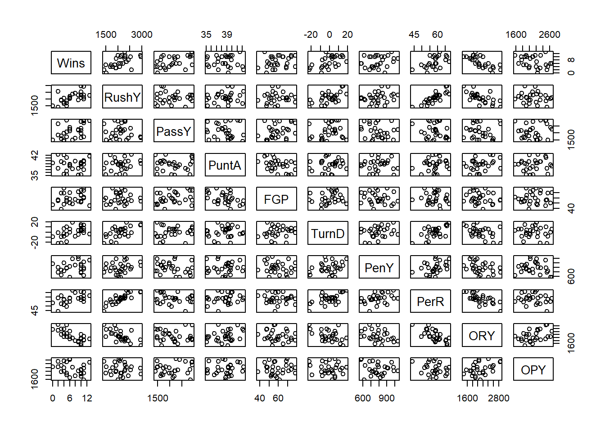

```r
model=lm(Wins~.,data=df)
################## Multicollinearity

###### Corr plot
corrplot::corrplot(cor(df))
```

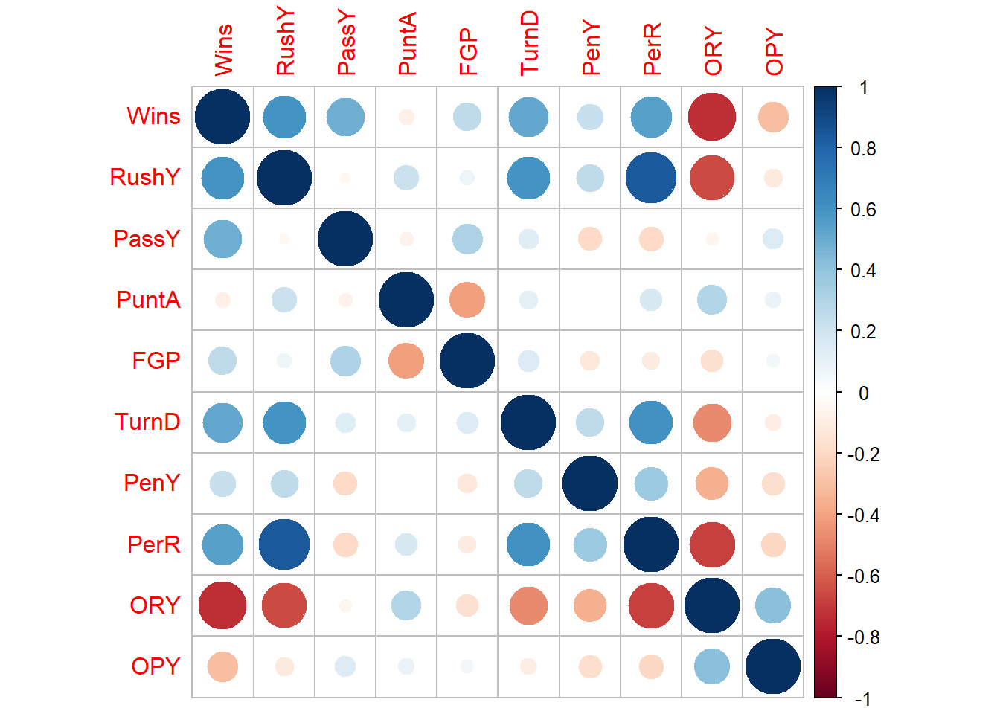

```r
###### VIF
car::vif(model)
```

```
   RushY    PassY    PuntA      FGP    TurnD     PenY     PerR      ORY 
4.827645 1.420161 2.126597 1.566107 1.924035 1.275979 5.414572 4.535643 
     OPY 
1.423390 
```

```r
# recalculating via the X'X matrix
X=model.matrix(model)
dim(X)
```

```
[1] 28 10
```

```r
#standardizing
X2=apply(X,2,function(x){(x-mean(x))/sqrt(sum((x-mean(x))^2))}); dim(X2)
```

```
[1] 28 10
```

```r
#replacing with column of ones again 
X2[,1]=X[,1]
X=X2
diag(solve(t(X)%*%X))
```

```
(Intercept)       RushY       PassY       PuntA         FGP       TurnD 
 0.03571429  4.82764538  1.42016105  2.12659726  1.56610698  1.92403474 
       PenY        PerR         ORY         OPY 
 1.27597850  5.41457162  4.53564335  1.42338989 
```

```r
# observe that
model2=lm(RushY~.,data=df[,-1])
s=summary(model2)
(1-s$r.squared)^(-1)
```

```
[1] 4.827645
```

```r
###### Condition Number / Eigenvalue / Eigenvector
X=model.matrix(model)
dim(X)
```

```
[1] 28 10
```

```r
#standardizing
X2=apply(X,2,function(x){(x-mean(x))/sqrt(sum((x-mean(x))^2))}); dim(X2)
```

```
[1] 28 10
```

```r
X2[,1]=X[,1]
X=X2

ev=eigen(t(X)%*%X)
xev=ev$values
condition_number=max(xev)/min(xev)
condition_number
```

```
[1] 233.7211
```

```r
sort(xev)
```

```
 [1]  0.1198009  0.1304874  0.4141227  0.5381718  0.7373652  0.8232571
 [7]  1.3144026  1.6989984  3.2233940 28.0000000
```

```r
#index of minimum eigenvalue
minn=which.min(xev)
ev$vectors[,minn]
```

```
 [1]  6.411542e-17  7.011800e-01 -4.340761e-02 -2.023407e-01 -1.758354e-01
 [6]  8.685752e-02  5.157060e-02 -6.211992e-01  1.784152e-01 -8.172072e-02
```

```r
rownames(ev$vectors)=names(model$coefficients)
ev$vectors
```

```
                     [,1]          [,2]          [,3]          [,4]
(Intercept)  1.000000e+00  3.518928e-17 -5.957417e-17  1.278524e-16
RushY       -4.202100e-17  4.860110e-01  2.451343e-02 -2.455854e-01
PassY       -1.925274e-17 -5.329696e-02 -4.452387e-01 -4.271630e-01
PuntA        1.730021e-16  3.402877e-02  5.385783e-01 -4.700037e-01
FGP          6.535596e-18  1.901803e-02 -6.336115e-01 -8.166060e-02
TurnD        3.688423e-19  4.092389e-01 -1.005237e-01 -3.161027e-01
PenY        -4.790976e-17  2.794600e-01  1.564396e-01  2.830480e-01
PerR        -4.979902e-17  5.088988e-01  1.310716e-01 -7.932060e-02
ORY         -9.388117e-17 -4.644587e-01  2.405543e-01 -2.073852e-01
OPY          1.355701e-16 -1.978859e-01 -2.649024e-03 -5.480057e-01
                     [,5]          [,6]          [,7]          [,8]
(Intercept)  1.782040e-17 -2.201849e-17 -1.424289e-18 -4.578376e-17
RushY        6.132520e-03  2.463905e-01  9.603526e-02  3.317999e-01
PassY        3.347492e-01 -5.954589e-01  2.990445e-01  1.261423e-01
PuntA        2.806944e-01 -1.156065e-01 -3.606368e-01  3.469809e-01
FGP         -1.667771e-01  2.190348e-01 -6.039025e-01  3.465457e-01
TurnD       -1.494452e-02 -1.216896e-01 -3.373137e-01 -7.555812e-01
PenY        -5.278556e-01 -6.731568e-01 -1.866976e-01  2.100622e-01
PerR        -4.210781e-02  2.029121e-01  1.700649e-01  2.906163e-02
ORY         -9.651613e-02 -1.380667e-02 -3.481051e-01 -1.326596e-01
OPY         -7.009694e-01  1.186045e-01  3.284156e-01 -5.920606e-03
                     [,9]         [,10]
(Intercept) -1.895581e-16  6.411542e-17
RushY       -1.765417e-01  7.011800e-01
PassY       -2.064018e-01 -4.340761e-02
PuntA        3.229883e-01 -2.023407e-01
FGP          2.303085e-03 -1.758354e-01
TurnD        1.234429e-01  8.685752e-02
PenY        -6.244479e-02  5.157060e-02
PerR        -5.088703e-01 -6.211992e-01
ORY         -7.094290e-01  1.784152e-01
OPY          2.013172e-01 -8.172072e-02
```

```r
# names(model$coefficients)[abs(round(ev$vectors[,minn],1))>0]
round(ev$vectors[,minn],1)
```

```
(Intercept)       RushY       PassY       PuntA         FGP       TurnD 
        0.0         0.7         0.0        -0.2        -0.2         0.1 
       PenY        PerR         ORY         OPY 
        0.1        -0.6         0.2        -0.1 
```

```r
# What should we do?
# Try dropping one or create a new variable

# New variable
# we can try rushing yards adjusted by the percentage of rushing plays 
# This would be yards per percentage rushing,
df$RushPP=df$RushY/df$PerR

# paste(names(df),collapse='+')

model=lm(Wins~PassY+PuntA+FGP+TurnD+PenY+OPY+RushPP,data=df)
summary(model)
```

```

Call:
lm(formula = Wins ~ PassY + PuntA + FGP + TurnD + PenY + OPY + 
    RushPP, data = df)

Residuals:
    Min      1Q  Median      3Q     Max 
-4.9688 -0.7444  0.5091  1.0653  4.4616 

Coefficients:
              Estimate Std. Error t value Pr(>|t|)   
(Intercept)  1.1913914 12.5388398   0.095  0.92525   
PassY        0.0033599  0.0009656   3.480  0.00236 **
PuntA       -0.2151444  0.2657707  -0.810  0.42775   
FGP         -0.0007235  0.0515376  -0.014  0.98894   
TurnD        0.0744762  0.0507446   1.468  0.15775   
PenY         0.0048413  0.0039483   1.226  0.23437   
OPY         -0.0036345  0.0015513  -2.343  0.02959 * 
RushPP       0.3018399  0.1274578   2.368  0.02806 * 
---
Signif. codes:  0 '***' 0.001 '**' 0.01 '*' 0.05 '.' 0.1 ' ' 1

Residual standard error: 2.312 on 20 degrees of freedom
Multiple R-squared:  0.673, Adjusted R-squared:  0.5586 
F-statistic: 5.881 on 7 and 20 DF,  p-value: 0.0008225
```

```r
corrplot::corrplot(cor(df))
```

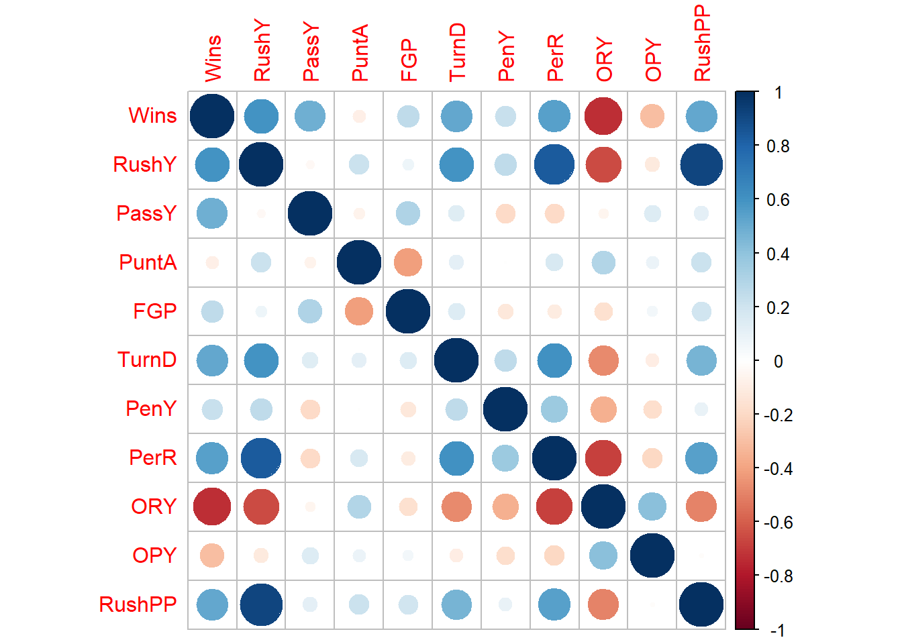

```r
car::vif(model)
```

```
   PassY    PuntA      FGP    TurnD     PenY      OPY   RushPP 
1.173227 1.403668 1.505937 1.415294 1.181830 1.068924 1.412990 
```

```r
# Dropping

# paste(names(df),collapse='+')

model=lm(Wins~PassY+PuntA+FGP+TurnD+PenY+OPY+RushY,data=df)
summary(model)
```

```

Call:
lm(formula = Wins ~ PassY + PuntA + FGP + TurnD + PenY + OPY + 
    RushY, data = df)

Residuals:
    Min      1Q  Median      3Q     Max 
-4.7636 -1.1496  0.3967  0.7301  3.7040 

Coefficients:
              Estimate Std. Error t value Pr(>|t|)    
(Intercept)  1.1782213 11.0207807   0.107 0.915926    
PassY        0.0037776  0.0008564   4.411 0.000269 ***
PuntA       -0.2237663  0.2303610  -0.971 0.342965    
FGP          0.0090954  0.0442921   0.205 0.839374    
TurnD        0.0244775  0.0490619   0.499 0.623285    
PenY         0.0036710  0.0034965   1.050 0.306277    
OPY         -0.0033525  0.0013680  -2.451 0.023589 *  
RushY        0.0047817  0.0013226   3.615 0.001725 ** 
---
Signif. codes:  0 '***' 0.001 '**' 0.01 '*' 0.05 '.' 0.1 ' ' 1

Residual standard error: 2.034 on 20 degrees of freedom
Multiple R-squared:  0.7468,    Adjusted R-squared:  0.6582 
F-statistic: 8.428 on 7 and 20 DF,  p-value: 7.995e-05
```

```r
corrplot::corrplot(cor(df))
car::vif(model)
```

```
   PassY    PuntA      FGP    TurnD     PenY      OPY    RushY 
1.191923 1.361884 1.436428 1.708554 1.196951 1.073562 1.697535 
```

There are four primary sources/causes of multicollinearity :

- The data collection method employed: In this case, some of the variables are typically confounded and/or the experiment/study was not well-designed.
- Constraints on the model or in the population: Sometimes, only certain combinations of levels of variables can be observed together.
- Model specification: Sometimes you have two or more variables in your model that are measuring the same thing.
- An overdefined model: You have too many variables in your model.

Make sure to check for each of these. Sometimes, regression coefficients have the wrong sign. This is likely due to one of the following:

- The range of some of the regressors is too small – if the range of some of the regressors is too small, then the variance of \(\hat\beta\) is high.
- Important regressors have not been included in the model.
- **Multicollinearity is present.**
- Computational errors have been made.

Multicollinearity can be cured with:

1. more data (lol often not possible),
2. model re-specification: Can you include a function of the variables that preserves the information, but aren’t linearly dependent? Can you remove a variable?
3. Or, a modified version of regression, one of Lasso, ridge or elastic net regression.

## 8.3 Homework questions

Complete the Chapter 9 textbook questions.

**Exercise 8.1** Check for multicollinearity in all of our past examples.

**Exercise 8.2** Summarize the 3 multicollinearity diagnostics.

Fox, John, and Georges Monette. 1992.
“Generalized Collinearity Diagnostics.”
Journal of the American Statistical Association
87 (417): 178–83.
https://doi.org/10.1080/01621459.1992.10475190
.
