# Unit_8 - Variable-Model Selection

# 9 Variable/Model Selection

## 9.1 Variable Selection

In the preceding lessons we have assumed that the regressor variables included in the model are known to be important. Our focus was on techniques to ensure that the functional form of the model was correct and that the underlying assumptions were not violated. In previous lessons, we have employed the classical approach to regression model selection, which assumes that we have a very good idea of the basic form of the model and that we know all (or nearly all) of the regressors that should be used.

Our approach so far can be summarized as follows:

- Fit the full model.
- Perform a thorough analysis of this model, including a full residual analysis and investigation of multicollinearity.
- Determine if transformations of the response or of some of the regressors are necessary.
- Use the \(t\)-tests/\(F\)-tests on the individual regressors to edit the model.
- Perform a thorough analysis of the edited model, especially a residual analysis, to determine the model’s adequacy.

In many problems the analyst has a rather large pool of possible candidate regressors, of which only a few are likely to be important. Finding an appropriate subset of regressors for the model is often called the **variable selection** problem .

Note
Variable selection can address multicollinearity, through the removal of unnecessary variables.

Building a regression model that includes only a subset of the available regressors involves two conflicting objectives:

1. We would like the model to include as many regressors as possible so that the information about \(Y\) contained in these factors can influence the predicted value of \(Y\).
2. We want the model to include as few regressors as possible because the variance of \(\hat Y\) increases as the number of regressors increases. Also the more regressors there are in a model, the greater the costs of data collection and model maintenance.

Therefore, we seek a model that is a compromise between these two objectives. There are several algorithms that can be used for variable selection, and these procedures frequently specify different subsets of the candidate regressors as best.

Variable selection is often developed in an idealized setting: Assumed that the correct functional specification of the regressors is known, and no outliers are present. In practice – it’s messy. Residual analysis is useful in revealing functional forms of regressors that might be investigated, in pointing out new candidate regressors, and for identifying defects in the data such as outliers. The effect of influential observations should also be determined. Although ideally these problems should be solved simultaneously, an iterative approach is often employed, in which (1) a particular variable selection strategy is employed and then (2) the resulting subset model is checked for correct functional specification, outliers, and influential observations. This may indicate that step 1 must be repeated. Several iterations may be required to produce an adequate model.

None of the variable selection procedures described are guaranteed to produce the best model for a given data set. In fact, there is usually not a single best model but rather several equally good ones. Variable selection algorithms are heavily algorithmic so it is tempting to place a lot of confidence in the results of a particular procedure. Beware of this - experience, professional judgment and subjective considerations are also critical to the variable selection problem. Variable selection procedures should be used in conjunction with these.

Two key aspects of the variable selection problem are:

1. Generating the subset models.
2. Deciding if one subset is better than another.

## 9.2 Deciding if one subset is better than another

### 9.2.1 Coefficients of determination

Recall that \[R^2=\frac{SSModel}{SST}=1-\frac{SSE}{SST}.\] We know that \(R^2\) increases as \(p\) increases, so we cannot choose the model with the largest \(R^2\). However, we could add variables one at a time until the marginal increase in \(R^2\) is small.

**Example 9.1** Recall example [Example 6.6](Unit_5.html#exm-6-4-1). Consider instead regressing the logged price per square foot onto the remaining variables. Investigate the \(R^2\) and adjusted \(R^2\) curve through adding the regressors into the regression model one at a time.

```r
df=df_clean2
df['ppsq']=log(df$Sale_price/df$Fin_sqft)
df['LLS']=log(df$Lotsize)
df=df[df['Lotsize']>0, ]
df=df[df['Sale_price']>10000,]
df=df[df['Fin_sqft']>500,]
df$District=as.factor(df$District)
df2=df
```

```r
var_list=c('District' ,  'Extwall' ,'Stories','Year_Built','Units','LLS','Bdrms','Fbath','Sale_date')
#previous... 
full_model=lm(ppsq~ District +  Extwall +     
            Stories  +    Year_Built  +   
            Units   +     Bdrms   +    
            Fbath  +    LLS   + Sale_date,df2)

###########

# R2
r2=c()
for(i in 1:length(var_list)){
  vars=c(var_list[1:i],"ppsq")
  model2=lm(ppsq~.,df2[,vars])
  sm=summary(model2)
  r2=c(r2,sm$r.squared)
}
plot(r2,type='l',lwd=2,ylab="R2",xlab="# variables")
```


```r
var_list[1:6]
```

```
[1] "District"   "Extwall"    "Stories"    "Year_Built" "Units"     
[6] "LLS"       
```

Notice how the curve levels off at 6 variables. This would indicate that we are not gaining much explained variation beyond the first 6 variables. These variables are printed above.

Recall that \[\bar R^2=1-\frac{n-1}{n-p}(1- R^2).\] The \(\bar R^2\) statistic does not necessarily increase as additional regressors are introduced into the model. In fact, it can be shown that if \(s\) regressors are added to the model, the new \(\bar R^2\) will exceed the original \(\bar R^2\) if and only if the partial \(F\) statistic for testing the significance of the \(s\) additional regressors exceeds 1. Consequently, one criterion for selection of an optimum subset model is to choose the model that has a maximum \(\bar R^2\). In addition, note that maximizing \(\bar R^2\) is equivalent to choosing the model with the minimum \(MSE\).

```r
# R2 adjusted 
r2=c()
for(i in 1:length(var_list)){
  vars=c(var_list[1:i],"ppsq")
  model2=lm(ppsq~.,df2[,vars])
  sm=summary(model2)
  r2=c(r2,sm$adj.r.squared)
}
plot(r2,type='l',lwd=2,ylab="R2",xlab="# variables")
```

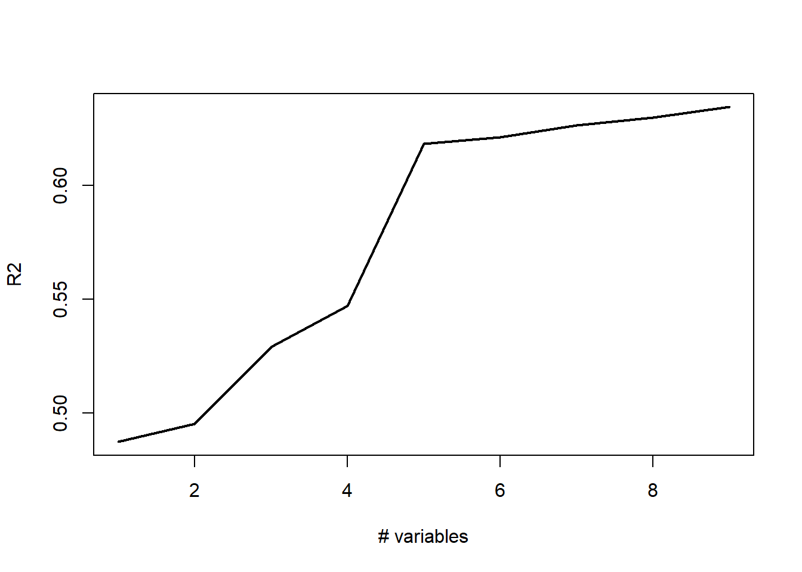

```r
var_list[1:6]
```

```
[1] "District"   "Extwall"    "Stories"    "Year_Built" "Units"     
[6] "LLS"       
```

### 9.2.2 Mallows \(C_k\) criterion

Consider the complete model: \[
Y = \beta_1 + \beta_2 X_1 + \cdots + \beta_p X_{p-1} + \epsilon
\] and a reduced model with \((k-1)\) explanatory variables: \[
Y = \beta_1 + \beta_2 X_1 + \cdots + \beta_{k} X_{k-1} + \epsilon.
\] Mallows (1973) defined the \(C_k\) statistic as \[
C_k = \frac{SSE_R}{MSE_C} - (n - 2k)
\] where \(k\) is the number of columns in \(X\) in the reduced model.

Observe that if \(k = p\) then \[C_k = C_{p} = dfE_C - [n - 2p] = p = k.\]

Let \(\operatorname{Bias}={\textrm{E}}\left[\hat Y_i\right]-{\textrm{E}}\left[Y_i\right]\) where \(\hat Y_i\) are generated from the reduced model. It can be shown that \[E\left[C_k \mid \operatorname{Bias}=0\right]=k.\] That is, if the regression model based on the subset of \(k-1\) predictors is unbiased, (that is, the model’s average predictions match the true values), then we expect \(C_k\) to be roughly \(k\). In addition, if there is bias, then \(E[C_k ]>k\). **Therefore, it is suggested that from all possible models, we choose the model with \(C_k\) close to \(k\) and \(C_k \leq k\).** Sometimes this is a little bit subjective: For example, the smallest \(C_k\) is \(C_4 = 4.1\) and the next smallest is \(C_5 = 4.7\). \(C_4\) is smallest but \(C_4>4\) – the model may be biased. Now, \(C_5\) is the second smallest, \(C_5<5\) implies the model is likely not biased.

**Example 9.2** Recall example [Example 6.6](Unit_5.html#exm-6-4-1). Investigate the Mallows \(C_k\) of the models considered in [Example 9.9](#exm-8-1-1). In addition, compare the `model_1` and `model_2` below, using `full_model` as the complete model.

```r
# Mallows C
# install.packages('olsrr')

# Recall the complete model
full_model=lm(ppsq~ District +  Extwall +     
            Stories  +    Year_Built  +   
            Units   +     Bdrms   +    
            Fbath  +    LLS+Sale_date+District*LLS,df2)

# Potential models
model_1=lm(ppsq~ District   +LLS+ Sale_date+District*LLS ,df2)

model_2=lm(ppsq~ District +  Extwall +LLS+     
                Stories  + Sale_date +District*LLS,df2)

olsrr::ols_mallows_cp(model_1,full_model)
```

```
[1] 8936.742
```

```r
olsrr::ols_mallows_cp(model_2,full_model)
```

```
[1] 6119.472
```

```r
for(i in 1:length(var_list)){
  vars=c(var_list[1:i],"ppsq")
  model=lm(ppsq~.+District*LLS,df2[,c(vars,'LLS')])
  print(paste0("k" ,i," mallows C_k ",
    olsrr::ols_mallows_cp(model,full_model),sep=""))
}
```

```
[1] "k1 mallows C_k 9141.49419283673"
[1] "k2 mallows C_k 8678.09518529921"
[1] "k3 mallows C_k 6378.76523011382"
[1] "k4 mallows C_k 5535.80914135633"
[1] "k5 mallows C_k 973.360231533108"
[1] "k6 mallows C_k 975.360231533108"
[1] "k7 mallows C_k 618.530222838901"
[1] "k8 mallows C_k 385.448019709613"
[1] "k9 mallows C_k 62"
```

If every potential model has a high value for Mallows \(C_k\), this is an indication that some important predictor variables are likely missing from each model. Therefore, we may wish to revaluate the real estate model.

**Example 9.3** Use the NFL data from the textbook - Consider the following models provided below. Select the best model from `model`, `model_1` and `model_2` given below, using each of the coefficient of determination criteria and Mallows \(C_k\).

```r
df=MPV::table.b1
# Note
names(df)=c("Wins","RushY","PassY",
            "PuntA","FGP","TurnD",
            "PenY","PerR","ORY","OPY")
summary(df)
```

```
      Wins            RushY          PassY          PuntA            FGP       
 Min.   : 0.000   Min.   :1416   Min.   :1414   Min.   :35.10   Min.   :38.10  
 1st Qu.: 4.000   1st Qu.:1896   1st Qu.:1714   1st Qu.:37.38   1st Qu.:52.42  
 Median : 6.500   Median :2111   Median :2106   Median :38.85   Median :57.70  
 Mean   : 6.964   Mean   :2110   Mean   :2127   Mean   :38.64   Mean   :59.40  
 3rd Qu.:10.000   3rd Qu.:2303   3rd Qu.:2474   3rd Qu.:39.70   3rd Qu.:68.80  
 Max.   :13.000   Max.   :2971   Max.   :2929   Max.   :42.30   Max.   :78.30  
     TurnD             PenY             PerR            ORY      
 Min.   :-22.00   Min.   : 576.0   Min.   :43.80   Min.   :1457  
 1st Qu.: -5.75   1st Qu.: 710.5   1st Qu.:54.77   1st Qu.:1848  
 Median :  1.00   Median : 787.5   Median :58.65   Median :2050  
 Mean   :  0.00   Mean   : 789.9   Mean   :58.16   Mean   :2110  
 3rd Qu.:  6.25   3rd Qu.: 869.8   3rd Qu.:61.10   3rd Qu.:2320  
 Max.   : 19.00   Max.   :1037.0   Max.   :67.50   Max.   :2876  
      OPY      
 Min.   :1575  
 1st Qu.:1913  
 Median :2101  
 Mean   :2128  
 3rd Qu.:2328  
 Max.   :2670  
```

```r
head(df)
```

```
  Wins RushY PassY PuntA  FGP TurnD PenY PerR  ORY  OPY
1   10  2113  1985  38.9 64.7     4  868 59.7 2205 1917
2   11  2003  2855  38.8 61.3     3  615 55.0 2096 1575
3   11  2957  1737  40.1 60.0    14  914 65.6 1847 2175
4   13  2285  2905  41.6 45.3    -4  957 61.4 1903 2476
5   10  2971  1666  39.2 53.8    15  836 66.1 1457 1866
6   11  2309  2927  39.7 74.1     8  786 61.0 1848 2339
```

```r
# plot(df)

model=lm(Wins~PassY+PuntA+FGP+TurnD+PenY+OPY+RushY,data=df)
model_1=lm(Wins~ TurnD+PenY+PerR+ORY+OPY ,df)
model_2=lm(Wins~ TurnD+PenY+ORY+OPY,df)

#  R2
print("m1")
```

```
[1] "m1"
```

```r
summary(model_1)$r.squared
```

```
[1] 0.5848535
```

```r
print("m2")
```

```
[1] "m2"
```

```r
summary(model_2)$r.squared
```

```
[1] 0.5843435
```

```r
print("fm")
```

```
[1] "fm"
```

```r
summary(model)$r.squared
```

```
[1] 0.7468129
```

```r
# ADJ R2
print("m1")
```

```
[1] "m1"
```

```r
summary(model_1)$adj.r.squared
```

```
[1] 0.490502
```

```r
print("m2")
```

```
[1] "m2"
```

```r
summary(model_2)$adj.r.squared
```

```
[1] 0.5120555
```

```r
print("fm")
```

```
[1] "fm"
```

```r
summary(model)$adj.r.squared
```

```
[1] 0.6581974
```

```r
##### Mallows C
print("m1")
```

```
[1] "m1"
```

```r
olsrr::ols_mallows_cp(model_1,model) # k=6
```

```
[1] 16.79365
```

```r
print("m2")
```

```
[1] "m2"
```

```r
olsrr::ols_mallows_cp(model_2,model) # k=5
```

```
[1] 14.83393
```

```r
print("fm")
```

```
[1] "fm"
```

```r
olsrr::ols_mallows_cp(model,model)
```

```
[1] 8
```

We would select `model` as the final model, since it has the lowest values of the Mallows \(C_k\) that is close to the number of variables. In addition, the \(R^2\) jumps significantly when moving from either `model_1` or `model_2` to `model`, so again, we would select `model`. Lastly, the adjusted \(R^2\) is the highest for `model`.

### 9.2.3 Akaike information criterion

- Akaike proposed an information criterion, AIC, based on maximizing the expected **entropy** of the model.
- Entropy is simply a measure of the expected information, in this case the Kullback – Leibler divergence.
- \[AIC=n\log\frac{SSE}{n}+2p+constant\]
- The decrease in \(SSE\) is balanced by the \(2p\) penalty
- \(AIC\) can be computed for other models, but should only be compared within model classes

### 9.2.4 Bayesian information criterion/Schwartz information criterion

- Sawa and Schwartz extended AIC, both called BIC.
- This criterion places a greater penalty on adding regressors as the sample size increases.
- \[BIC=n\log\frac{SSE}{n}+p\log n+constant\]
- \(BIC\) can be computed for other models, but should only be compared within model classes

**Example 9.4** Recall example [Example 6.6](Unit_5.html#exm-6-4-1). Investigate the AIC and BIC of the models considered in [Example 9.9](#exm-8-1-1). In addition, compare the `model_1`, `model_2` and the `full_model` using AIC and BIC.

```r
# Mallows C
# install.packages('olsrr')

# We can consider
full_model=lm(ppsq~ District +  Extwall +     
            Stories  +    Year_Built  +   
            Units   +     Bdrms   +    
            Fbath  +    LLS+Sale_date+District*LLS,df2)

# Potential models
model_1=lm(ppsq~ District   +LLS+ Sale_date+District*LLS ,df2)

model_2=lm(ppsq~ District +  Extwall +LLS+     
                Stories  + Sale_date +District*LLS,df2)
# Aic
print('fm')
```

```
[1] "fm"
```

```r
AIC(full_model)
```

```
[1] 14436.28
```

```r
print('m1')
```

```
[1] "m1"
```

```r
AIC(model_1)
```

```
[1] 22006.87
```

```r
print('m2')
```

```
[1] "m2"
```

```r
AIC(model_2)
```

```
[1] 19853
```

```r
for(i in 1:length(var_list)){
  vars=c(var_list[1:i],"ppsq")
  model=lm(ppsq~.,df2[,vars])
  print(paste0("k" ,i," AIC ",
               AIC(model),sep=""))
}
```

```
[1] "k1 AIC 23263.7908086697"
[1] "k2 AIC 22892.2355569629"
[1] "k3 AIC 21206.6115714333"
[1] "k4 AIC 20259.4527688361"
[1] "k5 AIC 16091.4785165542"
[1] "k6 AIC 15904.1437297787"
[1] "k7 AIC 15579.3879301724"
[1] "k8 AIC 15363.6578186034"
[1] "k9 AIC 15053.7804753495"
```

```r
# Bic
print('fm')
```

```
[1] "fm"
```

```r
BIC(full_model)
```

```
[1] 14930.48
```

```r
print('m1')
```

```
[1] "m1"
```

```r
BIC(model_1)
```

```
[1] 22266.13
```

```r
print('m2')
```

```
[1] "m2"
```

```r
BIC(model_2)
```

```
[1] 20201.37
```

```r
for(i in 1:length(var_list)){
  vars=c(var_list[1:i],"ppsq")
  model=lm(ppsq~.,df2[,vars])
  print(paste0("k" ,i," AIC ",
               BIC(model),sep=""))
}
```

```
[1] "k1 AIC 23393.4170718241"
[1] "k2 AIC 23086.6749516944"
[1] "k3 AIC 21425.3558905063"
[1] "k4 AIC 20486.2987293563"
[1] "k5 AIC 16342.6294014158"
[1] "k6 AIC 16163.3962560873"
[1] "k7 AIC 15911.5552295054"
[1] "k8 AIC 15736.3333251722"
[1] "k9 AIC 15434.5576233654"
```

We would select `full_model` as the final model, since it has the lowest values of both AIC and BIC.

**Example 9.5** Use the NFL data from the textbook - Consider the following models provided below. Select the best model from `model`, `model_1` and `model_2` given below, using each of AIC and BIC.

```r
model=lm(Wins~PassY+PuntA+FGP+TurnD+PenY+OPY+RushY,data=df)
model_1=lm(Wins~ TurnD+PenY+PerR+ORY+OPY ,df)
model_2=lm(Wins~ TurnD+PenY+ORY+OPY,df)

# Bic
BIC(model)
```

```
[1] 139.803
```

```r
BIC(model_1)
```

```
[1] 146.9846
```

```r
BIC(model_2)
```

```
[1] 143.6868
```

```r
# Aic
AIC(model)
```

```
[1] 127.8131
```

```r
AIC(model_1)
```

```
[1] 137.6592
```

```r
AIC(model_2)
```

```
[1] 135.6936
```

We would select `model` as the final model, since it has the lowest values of both AIC and BIC.

## 9.3 Algorithms for model selection

We now discuss algorithms which auto select the “best” model.

### 9.3.1 All subsets regression

All subsets regression, also known as best subsets regression, is one way to select the best subset of regressors. This technique proceeds as the name implies - it involves evaluating all possible combinations of regressors to identify the model that best fits the data according to a chosen criterion. For instance, if the criterion is AIC, then we may compute the AIC for all possible \(2^p\) models. All subsets regression would choose the model with the lowest AIC. Any of the four criterion (AIC, BIC, Mallows \(C_k\) or adjusted \(R^2\)) can be used for all subsets regression.

All subsets regression considers all possible subsets of regressors, ensuring that the best model is not missed by the algorithm. However, this has some downsides. First, it can be very computationally intensive for data sets with a large number of regressors. Second, if not properly controlled, examining many models can lead to **overfitting**, especially with small data sets.

Overfitting is when the model fits the data set so well, that it misses the underlying relationship between the independent and dependent variables. This results in a model that fits the data set well, but performs poorly at predicting new, unseen data due to its overly complex structure.

We can observe this in the example below:

```r
library(ggplot2)

set.seed(4265)

# Generate sample data
n = 50
x = runif(n, min = 0, max = 10)
y = 1 + x + rnorm(n, sd = 5)

# Create a data frame
data = data.frame(x = x, y = y)
plot(data,pch=22,bg=1)
```

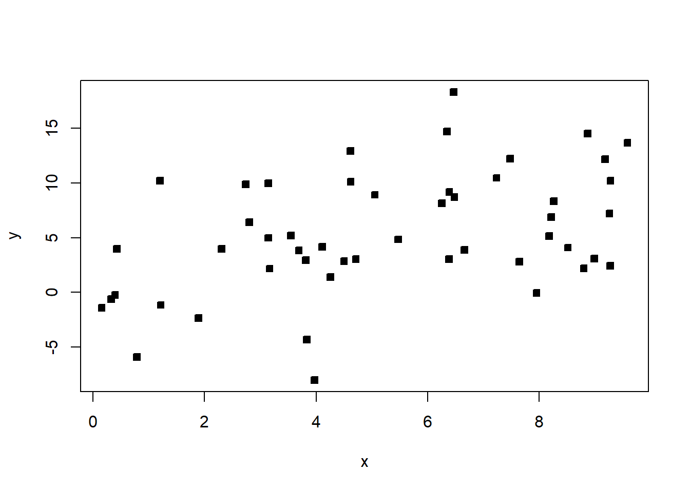

```r
# complexity of the model 
complexity=9

# Fit a linear regression model
linear_model = lm(y ~ x, data = data)

# Fit a polynomial regression model (degree = complexity) This model has more terms. 
poly_model = lm(y ~ poly(x, complexity), data = data)

# Make predictions
linear_predictions = predict(linear_model, data)
poly_predictions = predict(poly_model, data)

# Calculate mean squared error (MSE)
linear_mse = mean((data$y - linear_predictions)^2)
poly_mse = mean((data$y - poly_predictions)^2)

# Print MSE values
cat("Linear Model MSE:", linear_mse, "\n")
```

```
Linear Model MSE: 24.03022 
```

```r
cat("Polynomial Model MSE:", poly_mse, "\n")
```

```
Polynomial Model MSE: 19.69118 
```

```r
# Notice how the squared error is lower for the more complex model?

# Plot the results - this is GG plot, another way to plot in R
ggplot(data, aes(x, y)) +
  geom_point() +
  geom_smooth(method = "lm", se = FALSE, color = "blue", formula = y ~ x) +
  geom_smooth(method = "lm", se = FALSE, color = "red", formula = y ~ poly(x,complexity)) +
  labs(title = "Linear vs. Polynomial Regression (Degree 9)",
       x = "X", y = "Y")
```

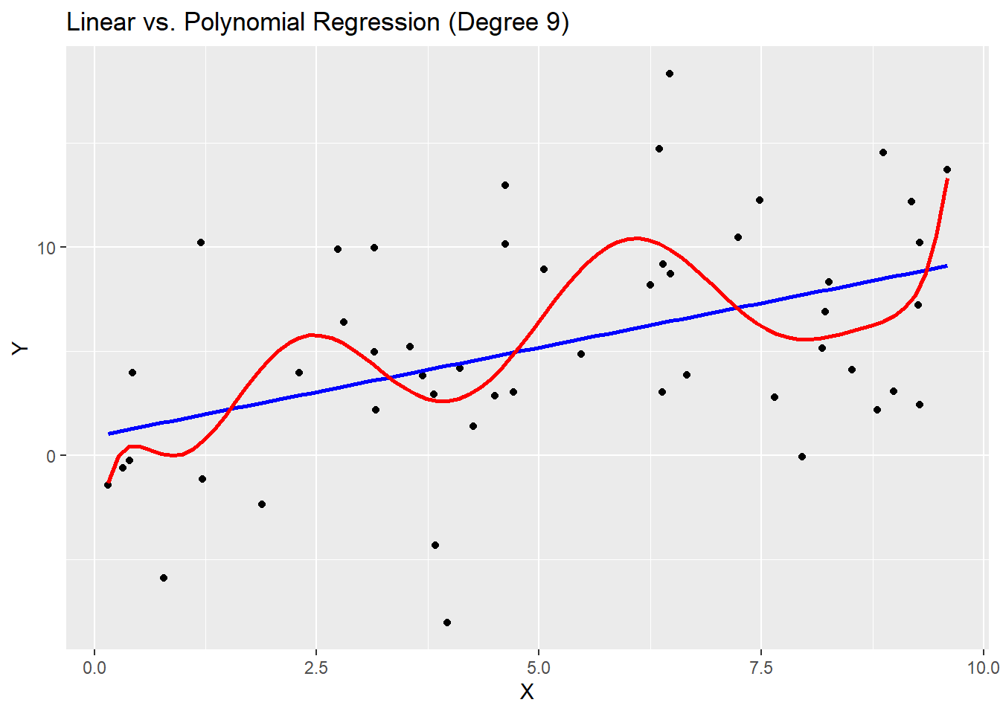

```r
# Generate new data from the same process
N = 500
xx = runif(n, min = 0, max = 10)
yy = 1 + x + rnorm(n, sd = 5)
nd = data.frame('x'=xx,'y'=yy)

gen_linear_predictions = predict(linear_model, nd)
gen_poly_predictions = predict(poly_model, nd)

# Calculate mean squared error (MSE)
gen_linear_mse = mean((data$y - gen_linear_predictions)^2)
gen_poly_mse = mean((data$y - gen_poly_predictions)^2)

# Print MSE values
cat("Linear Model MSE:", gen_linear_mse, "\n")
```

```
Linear Model MSE: 45.06416 
```

```r
cat("Polynomial Model MSE:", gen_poly_mse, "\n")
```

```
Polynomial Model MSE: 50.40172 
```

```r
# Notice how the generalized error is lower for the linear model?
```

Above, we fit two models to the data. One that allows for polynomial functions of degree at most 9 (not just linear functions), and one that only allows linear functions. It is clear that the polynomial model has a lower error on the data set at hand. However, when we generate new data from the same process, the polynomial model has a much higher error. This is an example of overfitting - the complex model does not generalize well beyond the current data set.

**Example 9.6** Use the NFL data from the textbook - Perform all subsets regression with each of the comparison metrics described in the previous section.

```r
# install.packages('leaps')

all=leaps::regsubsets(Wins~PassY+PuntA+FGP+TurnD+PenY+RushY+ORY+OPY,data=df,nvmax=10,method='exhaustive')

# 2^8

plot(all,scale='r2')
```

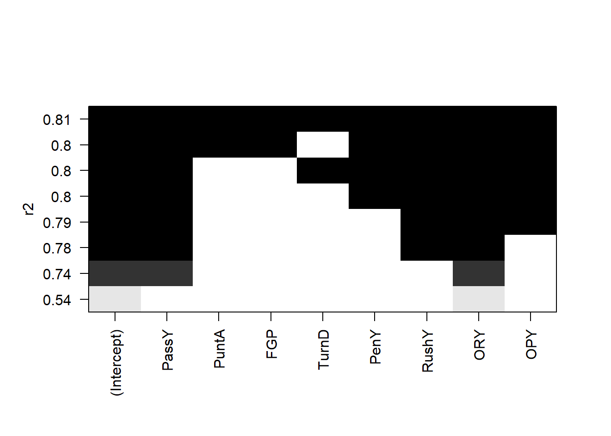

```r
plot(all,scale='adjr2')
```

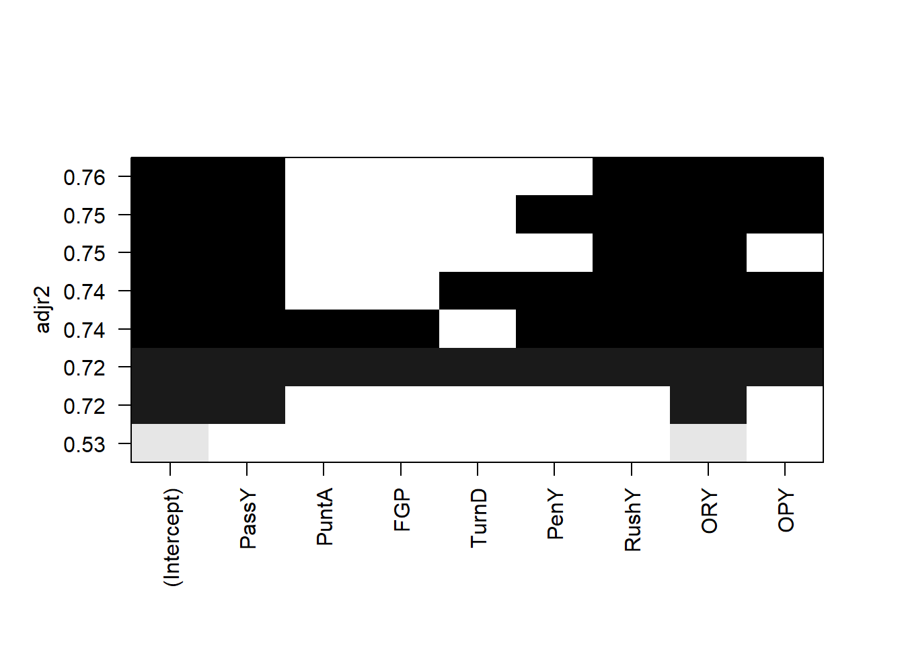

```r
plot(all,scale='Cp')
```

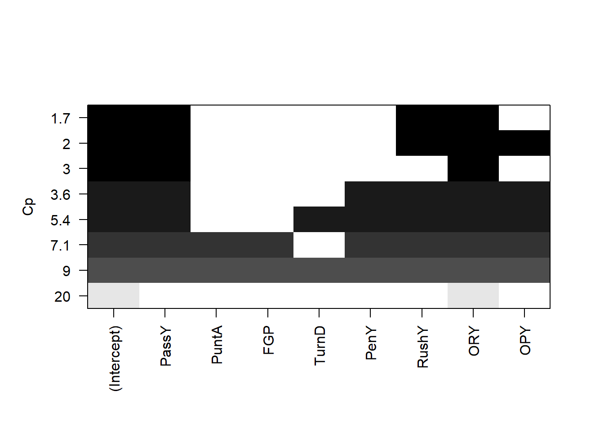

```r
plot(all,scale='bic')
```

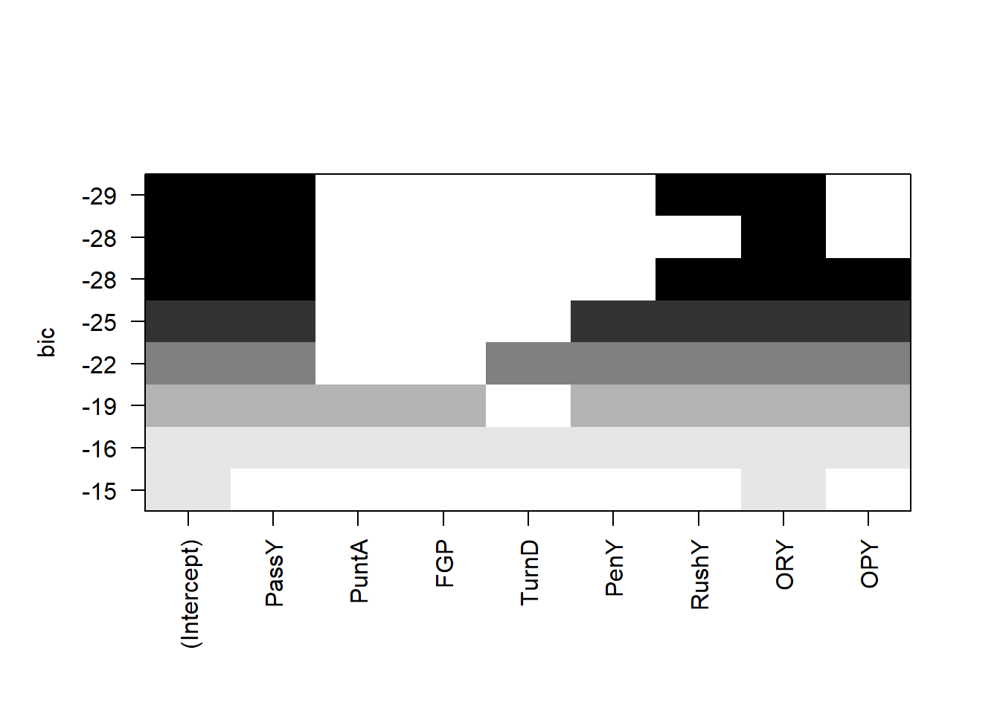

The `leaps` package allows us to do all subsets regression. We see that (with the exception of the \(R\)-squared) the best model under all criterion contains passing yards, rushing yard differential, and opponent passing yards.

We can do the same thing on the real estate data:

```r
# install.packages('leaps')
# If you run this, you will get the following error: 
# all=leaps::regsubsets(ppsq~ District +  Extwall +     
#             Stories  +    Year_Built  + Fin_sqft  +   
#             Units   +     Bdrms   +    
#             Fbath  +    Lotsize   + Sale_date +District*Lotsize,data=df2,nvmax=10,method='exhaustive')
# "Error in leaps.exhaustive(a, really.big) : Exhaustive search will be S L O W, must specify really.big=T"
# This shows how this can quickly become computationally intensive

# You will see that running the following code takes very long!
all=leaps::regsubsets(ppsq~ District + 
            Stories  +    Year_Built  +    Bdrms   +
            Fbath  +    LLS   + Sale_date+District*Lotsize,data=df2,nvmax=10,really.big=T,method='exhaustive')

plot(all,scale='r2')
```


```r
plot(all,scale='adjr2')
```

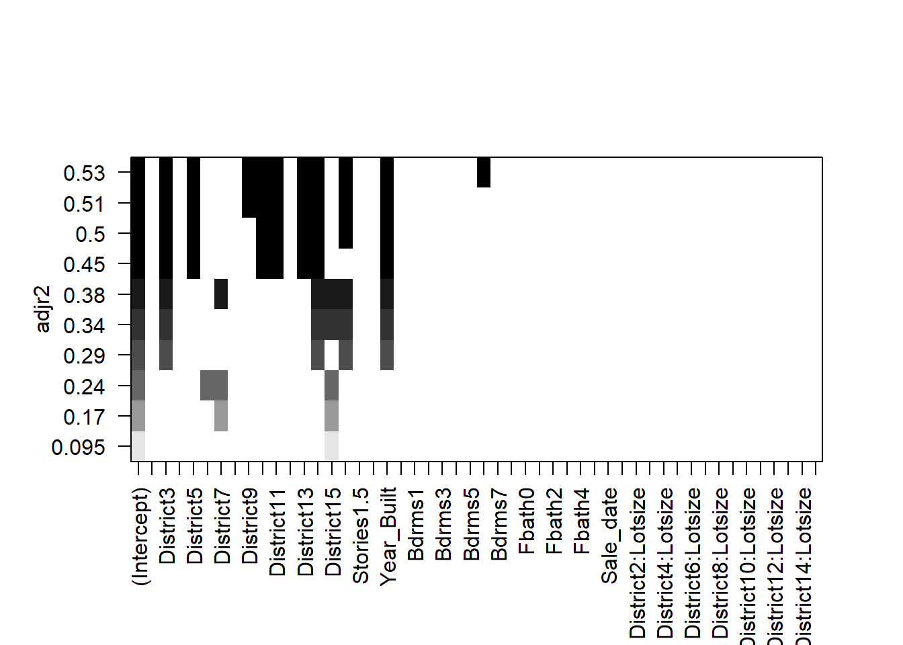

```r
plot(all,scale='Cp')
```

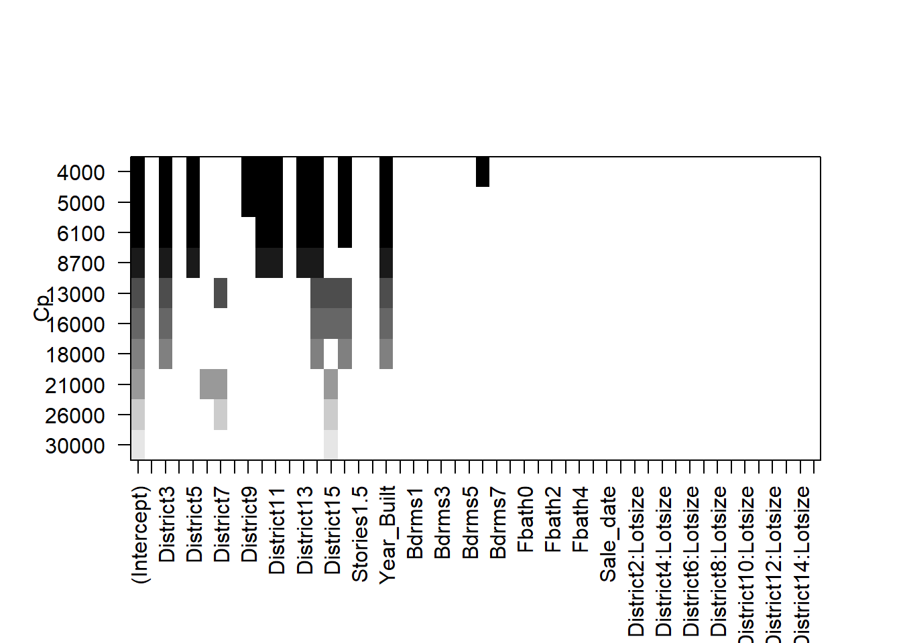

```r
plot(all,scale='bic')
```

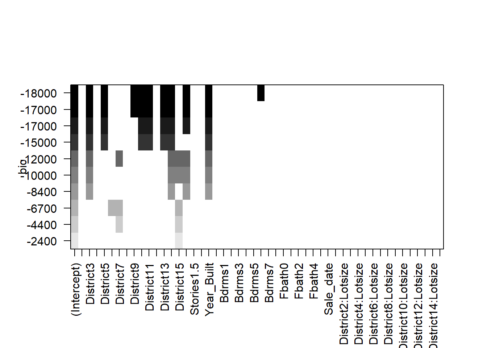

The selected models appear fairly sparse!

### 9.3.2 Forward selection

Forward selection is another common algorithm used to select the best model. It involves adding regressors one by one until adding more regressors becomes unhelpful. Essentially, we find the most “significant” regressor to be added to the model, and add it if it is “significant enough”. We keep adding regressors, until none are significant enough. However, forward selection is “greedy”, in the sense that it does not consider all possible subsets of regressors. This means that it is possible that the “best” model is missed by the algorithm.

The algorithm proceeds as follows:

1. Choose \(\alpha_{entry}\), which is the significance level for a regressor to enter the model. Set the current model to be \(Y = \beta_0 + \epsilon\).
2. Among all regressors \(X_i\) not in the current model, test \(H_0: X_i\) not entered versus \(H_a: X_i\) entered.
3. Choose the covariate with smallest \(p\)-value, i.e. the most likely \(X_i\) to be entered. Say the \(p\)-value for testing \(H_0: \beta_1 =0\) is the smallest.
4. If the chosen \(p\)-value is \(\geq \alpha_{entry}\), then \(X_1\) is not entered, and the current model is chosen as the final model and the process terminates. Otherwise, \(X_1\) is entered and the new current model is set to the current model, with the addition of \(X_1\).
5. Return to step 2.

- Now $X_1$ is in the model, then among all the models with 2 explanatory
variables ($X_1$ must be one of them)
i.e. $Y = \beta_0 + \beta_1 X_1 + \beta_i X_i + \epsilon \ i=2, \ldots, p$
- Test $H_0: X_i$ not entered versus $H_a: X_i$ entered
i.e. $H_0: \beta_i =0$ versus $H_a: \beta_i \ne 0$
- Choose the model with smallest $p$-value
i.e. the most likely $X_i$ to be entered
- Say $p$-value for testing $H_0: \beta_2 =0$ is smallest
- If the chosen $p$-value $\ge  \alpha_{entry}$, then $X_2$ is not entered,
and the model is $Y = \beta_0 + \beta_1 X_1 + \epsilon$
and the process STOP
- Otherwise, $X_2$ is entered and the model is $Y = \beta_0 + \beta_1 X_1 +
\beta_2 X_2 + \epsilon$ and continue to the next step
Note that once an explanatory variable is entered, it will never leave the model.

**Example 9.7** Suppose that we have 3 explanatory variables and \(\alpha_{entry}\) is chosen to be 0.05. The following is how we would proceed.

Iteration 1:

| Model | \(H_a:\) | \(p\)-value |
| --- | --- | --- |
| \(Y = \beta_0 + \beta_1 X_1 + \epsilon\) | \(\beta_1 \ne 0\) | 0.00033 |
| \(Y = \beta_0 + \beta_2 X_2 + \epsilon\) | \(\beta_2 \ne 0\) | 0.00490 |
| \(Y = \beta_0 + \beta_3 X_3 + \epsilon\) | \(\beta_3 \ne 0\) | 0.00101 |

Since 0.00033 is the smallest \(p\)-value and it is less than \(\alpha_{entry}\), the chosen model is \(Y = \beta_0 + \beta_1 X_1 + \epsilon\), and we continue to the next iteration.

Iteration 2:

| Model | \(H_a:\) | \(p\)-value |
| --- | --- | --- |
| \(Y = \beta_0 + \beta_1 X_1 + \beta_2 X_2 + \epsilon\) | \(\beta_2 \ne 0\) | 0.01330 |
| \(Y = \beta_0 + \beta_1 X_1 + \beta_3 X_3 + \epsilon\) | \(\beta_3 \ne 0\) | 0.1125 |

Since 0.01330 is the smallest \(p\)-value and it is less than \(\alpha_{entry}\), the chosen model is \(Y = \beta_0 + \beta_1 X_1 + \beta_2 X_2 + \epsilon\), and we continue to the next iteration.

Iteration 3:

| Model | \(H_a:\) | \(p\)-value |
| --- | --- | --- |
| \(Y = \beta_0 + \beta_1 X_1 + \beta_2 X_2 + \beta_3 X_3 + \epsilon\) | \(\beta_3 \ne 0\) | 0.36145 |

Since \(0.36145\) is the smallest \(p\)-value and it is greater than \(\alpha_{entry}\), the chosen model is \(Y = \beta_0 + \beta_1 X_1 + \beta_2 X_2 + \epsilon\), and STOP.

If \(\alpha_{entry}\) is chosen to be 0.01, observe that we will stop at Step 2 and the chosen model is \(Y = \beta_0 + \beta_1 X_1 + \epsilon\). As you can see, the chosen model is easily affected by the chosen \(\alpha_{entry}\) value.

Caution
Backward, forward and stepwise selection are useful for exploring the important variables associated with the regressor. However, because the model was selected based on p-values, or related quantities, all \(t\) and \(F\) test p-values are no longer valid. Therefore, where testing is of primary interest, as in many scientific studies, one should select the variables that make the most sense from a scientific/domain knowledge perspective. That model, and related p-values should then be used. Another alternative is LASSO or elastic net regression, which automatically selects variables of interest, and are useful when we have many explanatory variables/regressors.

### 9.3.3 Backward elimination/selection

In Backward elimination, otherwise known as backward selection, we start with the largest model, i.e., the one with all of the regressors, and eliminate regressors one by one until nothing can be eliminated. Like forward selection, backward selection is also greedy, and therefore, suffers from the same drawbacks.

For \(p-1\) regressors, the algorithm proceeds as follows:

1. Choose: \(\alpha_{stay}\), which is the significance level for an explanatory variable to **stay** in the model. Set the current model to be \(Y = \beta_0 + \beta_1 X_1 + \ldots + \beta_{p-1} X_{p-1} + \epsilon\).
2. Test \(H_0: X_i\) eliminated versus \(H_a: X_i\) not eliminated, i.e. \(H_0: \beta_i =0\) versus \(H_a: \beta_i \ne 0\) with respect to the current model.
3. Choose the regressor with the largest \(p\)-value – i.e., the most likely \(X_i\) to be eliminated. Say \(p\)-value for testing \(H_0: \beta_p =0\) is the largest.
4. If the chosen \(p\)-value is \(< \alpha_{stay}\), then \(X_p\) is not eliminated, and the chosen model is the current model and the process terminates. Otherwise, \(X_p\) is eliminated and the current model is set to be the old current model, with \(X_p\) removed.
5. If there are no regressors in the current model, terminate. Otherwise, go back to step 2.

**Example 9.8** Suppose that we have 3 explanatory variables and \(\alpha_{stay}\) is chosen to be 0.05. The following is how we would proceed.

The current model is \(Y = \beta_0 + \beta_1 X_1 + \beta_2 X_2 + \beta_3 X_3 + \epsilon\).

Iteration 1:

| \(H_a:\) | \(p\)-value |
| --- | --- |
| \(\beta_1 \ne 0\) | 0.0176 |
| \(\beta_2 \ne 0\) | 0.05627 |
| \(\beta_3 \ne 0\) | 0.36145 |

Since 0.36145 is the largest \(p\)-value and it is greater than \(\alpha_{stay}\), the current model is set to be \(Y = \beta_0 + \beta_1 X_1 + \beta_2 X_2 + \epsilon\), and we continue to the next iteration.

Iteration 2:

Model is \(Y = \beta_0 + \beta_1 X_1 + \beta_2 X_2 + \epsilon\).

| \(H_a:\) | \(p\)-value |
| --- | --- |
| \(\beta_1 \ne 0\) | 0.00139 |
| \(\beta_2 \ne 0\) | 0.01330 |

Since 0.01330 is the smallest \(p\)-value and it is less than \(\alpha_{stay}\), the final model is \(Y = \beta_0 + \beta_1 X_1 + \beta_2 X_2 + \epsilon\), and the process terminates.

If \(\alpha_{stay}\) is chosen to be 0.01, then we will continue the process and eventually, the chosen model is \(Y = \beta_0 + \beta_1 X_1 + \epsilon\). Again, the chosen model is easily affected by the chosen \(\alpha_{stay}\) value.

In forward selection, once a regressor is entered, it will be in the final model. In backward elimination, once a regressor is eliminated, it will not be in the final model. A combination of these two processes, that allows for variables to enter and exit the model is called **stepwise Regression**.

### 9.3.4 Stepwise regression

In stepwise regression, we start the model from smallest model, \(Y=\beta_0+\epsilon\), and we keep adding and eliminating regressors one by one such that added regressors can be eliminated later and eliminated regressors can be added later. Like forward selection and backward selection, stepwise regression is also greedy, and therefore, suffers from the same drawbacks.

For \(p-1\) regressors, the algorithm proceeds as follows:

1. Choose: \(\alpha_{enter}\) and \(\alpha_{stay}\). Set the current model to be \(Y = \beta_0 + \epsilon\).
2. Set the old model to be the current model. Perform steps 2-4 of forward selection.
3. Suppose in the previous step, \(X_1\) was added to the current model. Next, with the current model, apply steps 2-5 of backward elimination.
4. If \(X_1\) is eliminated in backward elimination, then do not remove \(X_1\) from the current model and set the current model to be the final model. The process then terminates. If the current model equals the old model, terminate. Otherwise, go back to step 2.

The stopping rule for stepwise regression is when we run into infinite loop (the same variable being added and eliminated) OR when we have nothing to add **and** nothing to eliminate.

Note
1. One way to avoid the infinite loop is to choose \(\alpha_{stay} \neq \alpha_{entry}\).
2. Some books suggest “easy to enter” and “tough to eliminate” strategy for selecting \(\alpha_{stay}, \alpha_{entry}\) but there is no strict rule.
3. `R` is using the AIC criterion for entering and eliminating, rather than the \(F\) test. This is also acceptable.

**Example 9.9** Recall the real estate example - [Example 6.6](Unit_5.html#exm-6-4-1). Run forward selection, backward selection and stepwise regression using AIC as the criterion, including all regressors. (AIC is done automatically in R.)

```r
# ########### Automated methods ###########

############ Forward selection with AIC ###########

df3=df2[,c('District','Extwall','Stories','Year_Built','Units','Bdrms','Fbath','Sale_date','ppsq','LLS' )]

#define intercept-only model
intercept_only = lm(ppsq~ 1, data=df3)

# define model with all predictors
all = lm(ppsq~ ., data=df3)

# perform forward stepwise regression
forward = step(intercept_only, direction='forward', scope=formula(all), trace=0)

#view results of forward stepwise regression
forward$anova
```

```
          Step  Df   Deviance Resid. Df Resid. Dev       AIC
1               NA         NA     24382   7225.476 -29654.39
2   + District -14 3523.76321     24368   3701.712 -45934.17
3      + Units  -3  825.50754     24365   2876.205 -52080.58
4 + Year_Built  -1  100.56239     24364   2775.642 -52946.36
5  + Sale_date  -1   35.95794     24363   2739.684 -53262.30
6      + Bdrms  -9   35.60684     24354   2704.078 -53563.27
7      + Fbath  -5   32.74525     24349   2671.332 -53850.34
8        + LLS  -1   21.55485     24348   2649.778 -54045.89
9    + Extwall  -8   12.84896     24340   2636.929 -54148.41
```

```r
#view final model
names(forward$coefficients)
```

```
 [1] "(Intercept)"            "District2"              "District3"             
 [4] "District4"              "District5"              "District6"             
 [7] "District7"              "District8"              "District9"             
[10] "District10"             "District11"             "District12"            
[13] "District13"             "District14"             "District15"            
[16] "Units1"                 "Units2"                 "Units3"                
[19] "Year_Built"             "Sale_date"              "Bdrms0"                
[22] "Bdrms1"                 "Bdrms2"                 "Bdrms3"                
[25] "Bdrms4"                 "Bdrms5"                 "Bdrms6"                
[28] "Bdrms7"                 "Bdrms8"                 "Fbath0"                
[31] "Fbath1"                 "Fbath2"                 "Fbath3"                
[34] "Fbath4"                 "LLS"                    "ExtwallBlock"          
[37] "ExtwallBrick"           "ExtwallFiber-Cement"    "ExtwallFrame"          
[40] "ExtwallMasonry / Frame" "ExtwallPrem Wood"       "ExtwallStone"          
[43] "ExtwallStucco"         
```

```r
# ###################### Backward selection with AIC ######################
#define intercept-only model
intercept_only = lm(ppsq~ 1, data=df3)

#define model with all predictors
all = lm(ppsq~ ., data=df3)

#perform backward stepwise regression
backward = step(all, direction='backward', scope=formula(all), trace=0)

#view results of backward stepwise regression
backward$anova
```

```
       Step Df  Deviance Resid. Df Resid. Dev       AIC
1           NA        NA     24337   2636.737 -54144.18
2 - Stories  3 0.1911574     24340   2636.929 -54148.41
```

```r
#view final model

names(backward$coefficients)
```

```
 [1] "(Intercept)"            "District2"              "District3"             
 [4] "District4"              "District5"              "District6"             
 [7] "District7"              "District8"              "District9"             
[10] "District10"             "District11"             "District12"            
[13] "District13"             "District14"             "District15"            
[16] "ExtwallBlock"           "ExtwallBrick"           "ExtwallFiber-Cement"   
[19] "ExtwallFrame"           "ExtwallMasonry / Frame" "ExtwallPrem Wood"      
[22] "ExtwallStone"           "ExtwallStucco"          "Year_Built"            
[25] "Units1"                 "Units2"                 "Units3"                
[28] "Bdrms0"                 "Bdrms1"                 "Bdrms2"                
[31] "Bdrms3"                 "Bdrms4"                 "Bdrms5"                
[34] "Bdrms6"                 "Bdrms7"                 "Bdrms8"                
[37] "Fbath0"                 "Fbath1"                 "Fbath2"                
[40] "Fbath3"                 "Fbath4"                 "Sale_date"             
[43] "LLS"                   
```

```r
########### Stepwise Regression with AIC ###########
# Define intercept-only model
intercept_only = lm(ppsq~ 1, data=df3)

# Define model with all predictors
all = lm(ppsq~ ., data=df3)

#perform stepwise regression
both = step(intercept_only, direction='both', scope=formula(all), trace=0)

#view results of Stepwise regression
both$anova
```

```
          Step  Df   Deviance Resid. Df Resid. Dev       AIC
1               NA         NA     24382   7225.476 -29654.39
2   + District -14 3523.76321     24368   3701.712 -45934.17
3      + Units  -3  825.50754     24365   2876.205 -52080.58
4 + Year_Built  -1  100.56239     24364   2775.642 -52946.36
5  + Sale_date  -1   35.95794     24363   2739.684 -53262.30
6      + Bdrms  -9   35.60684     24354   2704.078 -53563.27
7      + Fbath  -5   32.74525     24349   2671.332 -53850.34
8        + LLS  -1   21.55485     24348   2649.778 -54045.89
9    + Extwall  -8   12.84896     24340   2636.929 -54148.41
```

```r
#view final model
names(both$coefficients)
```

```
 [1] "(Intercept)"            "District2"              "District3"             
 [4] "District4"              "District5"              "District6"             
 [7] "District7"              "District8"              "District9"             
[10] "District10"             "District11"             "District12"            
[13] "District13"             "District14"             "District15"            
[16] "Units1"                 "Units2"                 "Units3"                
[19] "Year_Built"             "Sale_date"              "Bdrms0"                
[22] "Bdrms1"                 "Bdrms2"                 "Bdrms3"                
[25] "Bdrms4"                 "Bdrms5"                 "Bdrms6"                
[28] "Bdrms7"                 "Bdrms8"                 "Fbath0"                
[31] "Fbath1"                 "Fbath2"                 "Fbath3"                
[34] "Fbath4"                 "LLS"                    "ExtwallBlock"          
[37] "ExtwallBrick"           "ExtwallFiber-Cement"    "ExtwallFrame"          
[40] "ExtwallMasonry / Frame" "ExtwallPrem Wood"       "ExtwallStone"          
[43] "ExtwallStucco"         
```

These methods retain many more variables. It is interesting, considering all subsets contained very few.

**Example 9.10** Use the NFL data from the textbook - Run forward selection and backward selection including all regressors using the \(F\) statistic criterion.

```r
############ Forward selection by F value
# Threshold for p-value to determine variable inclusion
thresh = 0.05

# Initialize an empty vector to store currently selected variables
curr_vars = c()

# Create a vector of variable names excluding the dependent variable 'Wins' and 'PerR'
vars_left = names(df)[2:10]
vars_left = vars_left[vars_left != 'PerR']

# Initialize the passed flag to TRUE
passed = TRUE

# Loop until no more variables can be added (passed is FALSE) or there are no more variables left
while(passed && length(vars_left) > 0) {
  
  # Initialize an empty vector to store p-values of models
  pvals = c()
  
  # Loop through each remaining variable
  for(var in vars_left) {
    # Create a temporary dataframe with current variables and the new candidate variable
    df_tmp = df[, c(curr_vars, var, 'Wins')]
    
    # Fit a linear model with 'Wins' as the dependent variable
    model = lm(Wins ~ ., df_tmp)
    
    # Get the summary of the model
    s = summary(model)
    
    # Calculate the p-value of the F-statistic for the model
    pval = 1 - pf(s$fstatistic[1], s$fstatistic[2], s$fstatistic[3])
    
    # Append the p-value to the pvals vector
    pvals = c(pvals, pval)
  }
  
  # Find the index of the minimum p-value
  min_index = which.min(pvals)
  
  # Get the minimum p-value
  mp = pvals[min_index]
  
  # Check if the minimum p-value is less than the threshold
  passed = mp < thresh
  
  if(passed) {
    # If passed, get the corresponding variable name
    new_var = vars_left[min_index]
    
    # Add the new variable to the current variables list
    curr_vars = c(curr_vars, new_var)
    
    # Remove the new variable from the remaining variables list
    vars_left = vars_left[vars_left != new_var]
    
    # Print the p-value and the variable being added
    print('pvalue')
    print(mp)
    print('adding')
    print(new_var)
  }
}
```

```
[1] "pvalue"
       value 
7.380709e-06 
[1] "adding"
[1] "ORY"
[1] "pvalue"
       value 
4.151848e-08 
[1] "adding"
[1] "PassY"
[1] "pvalue"
       value 
5.286139e-08 
[1] "adding"
[1] "RushY"
[1] "pvalue"
       value 
1.237473e-07 
[1] "adding"
[1] "OPY"
[1] "pvalue"
       value 
5.151486e-07 
[1] "adding"
[1] "PenY"
[1] "pvalue"
       value 
2.098536e-06 
[1] "adding"
[1] "TurnD"
[1] "pvalue"
       value 
7.894081e-06 
[1] "adding"
[1] "PuntA"
[1] "pvalue"
      value 
2.52811e-05 
[1] "adding"
[1] "FGP"
```

```r
# Print the final list of selected variables
print(curr_vars)
```

```
[1] "ORY"   "PassY" "RushY" "OPY"   "PenY"  "TurnD" "PuntA" "FGP"  
```

```r
# Threshold for p-value to determine variable exclusion
thresh = 0.05

# Initialize a vector of variable names excluding the dependent variable 'Wins' and 'PerR'
vars_left = names(df)[2:10]
vars_left = vars_left[vars_left != 'PerR']

# Initialize the passed flag to TRUE
passed = TRUE

# Loop until no more variables need to be removed (passed is FALSE) or there are no more variables left
while(passed && length(vars_left) > 0) {
  # Create a temporary dataframe with remaining variables and the dependent variable 'Wins'
  df_tmp = df[, c(vars_left, 'Wins')]
  
  # Fit a linear model with 'Wins' as the dependent variable
  model = lm(Wins ~ ., df_tmp)
  
  # Get the summary of the model
  s = summary(model)
  
  # Extract the p-values of the t-statistics for the coefficients
  tv = coef(s)[, "Pr(>|t|)"]
  
  # Remove the intercept p-value
  tv = tv[-1]
  
  # Find the index of the maximum p-value
  max_index = which.max(tv)
  
  # Get the maximum p-value
  mp = tv[max_index]
  
  # Print the maximum p-value
  print(mp)
  
  # Check if the maximum p-value is greater than the threshold
  passed = mp > thresh
  
  if(passed) {
    # If passed, get the corresponding variable name to be removed
    rem_var = names(max_index)
    
    # Remove the variable from the remaining variables list
    vars_left = vars_left[vars_left != rem_var]
    
    # Print the p-value and the variable being removed
    print('pvalue')
    print(mp)
    print('removing')
    print(rem_var)
  }
}
```

```
    TurnD 
0.7312364 
[1] "pvalue"
    TurnD 
0.7312364 
[1] "removing"
[1] "TurnD"
      FGP 
0.5679556 
[1] "pvalue"
      FGP 
0.5679556 
[1] "removing"
[1] "FGP"
    PuntA 
0.6919653 
[1] "pvalue"
    PuntA 
0.6919653 
[1] "removing"
[1] "PuntA"
     PenY 
0.5147875 
[1] "pvalue"
     PenY 
0.5147875 
[1] "removing"
[1] "PenY"
      OPY 
0.1752231 
[1] "pvalue"
      OPY 
0.1752231 
[1] "removing"
[1] "OPY"
     RushY 
0.06663316 
[1] "pvalue"
     RushY 
0.06663316 
[1] "removing"
[1] "RushY"
       PassY 
0.0001775241 
```

```r
# Print the final list of remaining variables
print(vars_left)
```

```
[1] "PassY" "ORY"  
```

**Exercise 9.1** Use the NFL data from the textbook - modify the above code to perform stepwise regression, including all regressors using the \(F\) statistic criterion.

## 9.4 Cross Validation

We may be mainly interested in predictive performance of our model. To assess the performance of our model’s predictive ability, it would be ideal to test its ability to predict the response. We could test our model out on our dataset, but our model has already `seen’ this dataset. Previously, we saw that the model’s predictive ability on the dataset at hand does not neccessarily mean it will output good predictions for new data from the same population. This means that the predictive ability of the model on the current observations won’t reflect the model’s ability to predict observations it hasn’t seen. It would be ideal to have some new data in order to measure predictive performance, but it is also ideal to use all data in building the model. **Cross validation** allows us to obtain an estimate of a given model’s out of sample predictive performance.

Cross-validation is a technique where we repeatedly fit our model using a subset of the dataset and then compute its predictive performance on the complementary subset of the dataset. We then average these predictive performances and use this to estimate our model’s overall predictive performance.

Here is an overview of the algorithm:

1. Partition the data \(\mathbb{Z}\) into \(k\) groups of size about \(n/k\) uniformly at random. Denoted \(\mathbb{Z}_1,\ldots, \mathbb{Z}_k\).
2. For each; \(\mathbb{Z}_j\), fit the regression model on \(\mathbb{Z}\backslash \mathbb{Z}_j\).
3. For each observation in the left out group \(\mathbb{Z}_j\), use the previously computed model to produce a prediction \(\hat Y_{j,1},\ldots, \hat Y_{j,n/k}\), resulting in \(n/k\) predictions.
4. For each prediction, compute the predictive error \((y_{j,i}- \hat y_{j,i})^2\) (Can also use absolute error).
5. Repeat steps 2-3 for each group \(1,\ldots,k\).
6. Average the \(n\) predictive errors.
7. Repeat for all candidate models and choose the model with the lowest prediction error.

To highlight the choice of \(k\), we say \(k\)-fold Cross Validation – Each of the \(k\) subsets are known as folds. What do we choose for \(k\)? LOOCV (Leave One Out Cross Validation) is a popular technique. Here, \(k=n\). This is where each run, one observation is left out of the model. This gives a low bias, but high variation estimate of the prediction error. It also has a high run time. As a result, often, \(k\) is taken to be 5 or 10. Taking lower values of \(k\) gives a result similar to that of splitting the data into training and test sets, while higher values of \(k\) gives a result similar to LOOCV. The choice of the number of folds in cross validation is a bias-variance tradeoff: too few folds may result in high bias, while too many folds may result in high variance. (This is why \(k\) is taken between 1 and \(n\).)

**Example 9.11** Using the real estate data, run cross validation in a forward selection manner. That is, run the cross validation procedure for the model with the first variable, the first and the second variable, the first three variables etc. Which model has the lowest error?

The `caret` package can be used to perform 5-fold CV.

```r
########### Cross Validation Regression ###########
# install.packages('caret')
library(caret)
```

```
Warning: package 'caret' was built under R version 4.5.2
```

```
Loading required package: lattice
```

```r
#specify the cross-validation method 5 fold in this case. 
ctrl = trainControl(method = "cv", number = 5)

#fit a regression model and use k-fold CV to evaluate performance
model = train(ppsq~., data = df3, method = "lm", trControl = ctrl)

for(i in 1:length(var_list)){
  vars=c(var_list[1:i],"ppsq")
  model = train(ppsq~., data = df3[,vars], method = "lm", trControl = ctrl)
  print(paste0("k" ,i," CV Result ", model$results$RMSE,sep=""))
}
```

```
[1] "k1 CV Result 0.39011859000292"
[1] "k2 CV Result 0.387043371742809"
[1] "k3 CV Result 0.373888622047606"
[1] "k4 CV Result 0.366761298812602"
[1] "k5 CV Result 0.336828521829276"
[1] "k6 CV Result 0.335315694585366"
[1] "k7 CV Result 0.333114794995401"
[1] "k8 CV Result 0.332012297761635"
[1] "k9 CV Result 0.329958007819844"
```

```r
#view summary of k-fold CV               
print(model)
```

```
Linear Regression 

24383 samples
    9 predictor

No pre-processing
Resampling: Cross-Validated (5 fold) 
Summary of sample sizes: 19506, 19506, 19507, 19507, 19506 
Resampling results:

  RMSE      Rsquared   MAE      
  0.329958  0.6330707  0.2384547

Tuning parameter 'intercept' was held constant at a value of TRUE
```

```r
# We see that all of the variables minimize the prediction error. 
```

**Example 9.12** Use the NFL data from the textbook. 1. Compare the model `Wins~.` to the model `Wins~PassY+PuntA+FGP+TurnD+PenY+OPY+RushY`. 2. Run cross validation in a forward selection manner. That is, run the cross validation procedure for the model with the first variable, the first and the second variable, the first three variables etc. Which model has the lowest error? 3. Run cross validation for all subsets. Which model has the lowest error? Does it match the result in step 2?

```r
########### Cross Validation Regression ###########
set.seed(1251)

#specify the cross-validation method
ctrl = trainControl(method = "cv", number = 5)

#fit a regression model and use k-fold CV to evaluate performance
model_cv_1 = train(Wins~., data = df, method = "lm", trControl = ctrl)
model_cv_1
```

```
Linear Regression 

28 samples
 9 predictor

No pre-processing
Resampling: Cross-Validated (5 fold) 
Summary of sample sizes: 21, 22, 22, 24, 23 
Resampling results:

  RMSE      Rsquared   MAE     
  1.962945  0.5925805  1.686354

Tuning parameter 'intercept' was held constant at a value of TRUE
```

```r
model_cv_2 = train(Wins~PassY+PuntA+FGP+TurnD+PenY+OPY+RushY, data = df, method = "lm", trControl = ctrl)
model_cv_2
```

```
Linear Regression 

28 samples
 7 predictor

No pre-processing
Resampling: Cross-Validated (5 fold) 
Summary of sample sizes: 23, 21, 23, 23, 22 
Resampling results:

  RMSE      Rsquared   MAE     
  2.666742  0.5425439  2.048828

Tuning parameter 'intercept' was held constant at a value of TRUE
```

```r
for(i in 2:ncol(df)){
  # reg=sample(2:10,sample(1:9,1))
  vars=c(names(df)[2:i],'Wins')
  model = train(Wins~., data = df[,vars], method = "lm", trControl = ctrl)
  print(paste0("k=" ,i-1," vars ",paste(vars,collapse=' ')," CV Result ",
               round(model$results$RMSE,1),sep=""))
}
```

```
[1] "k=1 vars RushY Wins CV Result 2.9"
[1] "k=2 vars RushY PassY Wins CV Result 2.3"
[1] "k=3 vars RushY PassY PuntA Wins CV Result 2.2"
[1] "k=4 vars RushY PassY PuntA FGP Wins CV Result 2.4"
[1] "k=5 vars RushY PassY PuntA FGP TurnD Wins CV Result 2.6"
[1] "k=6 vars RushY PassY PuntA FGP TurnD PenY Wins CV Result 2.5"
[1] "k=7 vars RushY PassY PuntA FGP TurnD PenY PerR Wins CV Result 2.5"
[1] "k=8 vars RushY PassY PuntA FGP TurnD PenY PerR ORY Wins CV Result 2.5"
[1] "k=9 vars RushY PassY PuntA FGP TurnD PenY PerR ORY OPY Wins CV Result 2"
```

```r
# Select model k=9 vars

# 
p = ncol(df)-1
l = rep(list(0:1), p)

models=expand.grid(l); dim(models)
```

```
[1] 512   9
```

```r
cv=RMSE=c()
for(i in 2:nrow(models)){
  reg=(2:(p+1))[models[i,]==1]
  vars=c(names(df)[reg],'Wins')
  model = train(Wins~., data = df[,vars], method = "lm", trControl = ctrl)
  RMSE=c(RMSE,model$results$RMSE)
  cv=c(cv,list(model))
  # print(paste0("k=" ,k," vars ",paste(vars,collapse=' ')," CV Result ",
               # round(model$results$RMSE,1),sep=""))
}

bottom_10=order(RMSE)[1:10]
RMSE[bottom_10]
```

```
 [1] 1.602365 1.619883 1.639797 1.662903 1.699846 1.733090 1.737918 1.740185
 [9] 1.749398 1.753767
```

```r
plot(sort(RMSE))
```

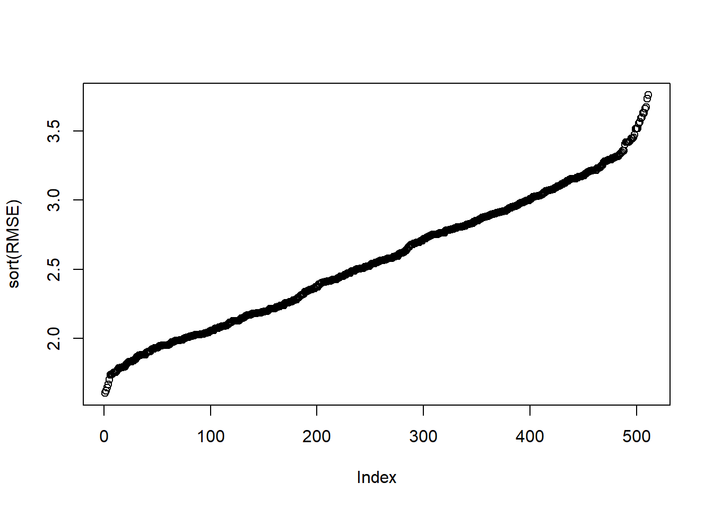

```r
m=which.min(RMSE)
cv[which.min(RMSE)]
```

```
[[1]]
Linear Regression 

28 samples
 6 predictor

No pre-processing
Resampling: Cross-Validated (5 fold) 
Summary of sample sizes: 23, 22, 21, 22, 24 
Resampling results:

  RMSE      Rsquared   MAE     
  1.602365  0.7865483  1.300662

Tuning parameter 'intercept' was held constant at a value of TRUE
```

```r
df[1,(2:(p+1))[unlist(models[m,])==1]]
```

```
  RushY PuntA PenY PerR  ORY  OPY
1  2113  38.9  868 59.7 2205 1917
```

```r
model = train(Wins~ PassY+PuntA+TurnD+PerR+OPY+RushY, data = df, method = "lm", trControl = ctrl)
RMSE=c(RMSE,model$results$RMSE)
```

## 9.5 LASSO Regression

Lasso regression (Least Absolute Shrinkage and Selection Operator) is a technique for linear models that adds a penalty term to the least squares loss function. \[\hat{\beta}_{LASSO}=\mathop{\mathrm{argmin}}_\beta\left\lVert Y-X\beta\right\rVert^2+\lambda\left\lVert\beta\right\rVert_1\] This penalty actually ``shrinks’’ some coefficients exactly to zero, effectively performing variable selection. Lasso is particularly useful when dealing with high-dimensional data where the number of predictors may exceed the number of observations. The parameter \(\lambda\) is a tuning parameter, which controls the amount of shrinkage. It is typically chosen via cross validation. It is great for variable selection and prediction problems, but obtaining p-values and other inferential quantities is not so straightforward.

```r
#.. 
library(glmnet)
```

```
Warning: package 'glmnet' was built under R version 4.5.2
```

```
Loading required package: Matrix
```

```
Loaded glmnet 4.1-10
```

```r
model=lm(Wins~., data = df)
X=model.matrix(model)
# Remove intercept
X=X[,-1]
cv_model = cv.glmnet(X, df$Wins, alpha = 1,nfolds=5)

best_lambda = cv_model$lambda.min
best_lambda
```

```
[1] 0.2704249
```

```r
# plot of test MSE by lambda
plot(cv_model)
```

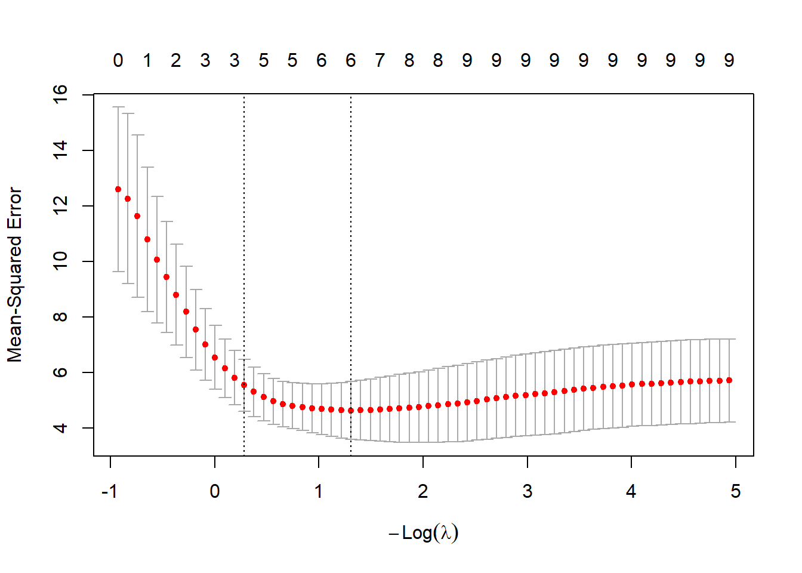

```r
# Coefficients:

coef(cv_model)
```

```
10 x 1 sparse Matrix of class "dgCMatrix"
               lambda.1se
(Intercept) 10.7211210917
RushY        0.0007812133
PassY        0.0016929743
PuntA        .           
FGP          .           
TurnD        .           
PenY         .           
PerR         .           
ORY         -0.0042682806
OPY          .           
```

We can also try the real estate data:

```r
# Our example from previous units:
df5=df2[df2$District!=3,]
df5$District=droplevels(df5$District)
df2=df5
model=lm(Sale_price~District+Extwall+Stories+Year_Built+Fin_sqft+Units+Bdrms+Fbath+Lotsize+Sale_date, data = df2)
X=model.matrix(model)
# Remove intercept
X=X[,-1]
cv_model = cv.glmnet(X, sqrt(df2$Sale_price), alpha = 1,nfolds=5)
best_lambda = cv_model$lambda.min
best_lambda
```

```
[1] 0.05266812
```

```r
# plot of test MSE by lambda
plot(cv_model)
```

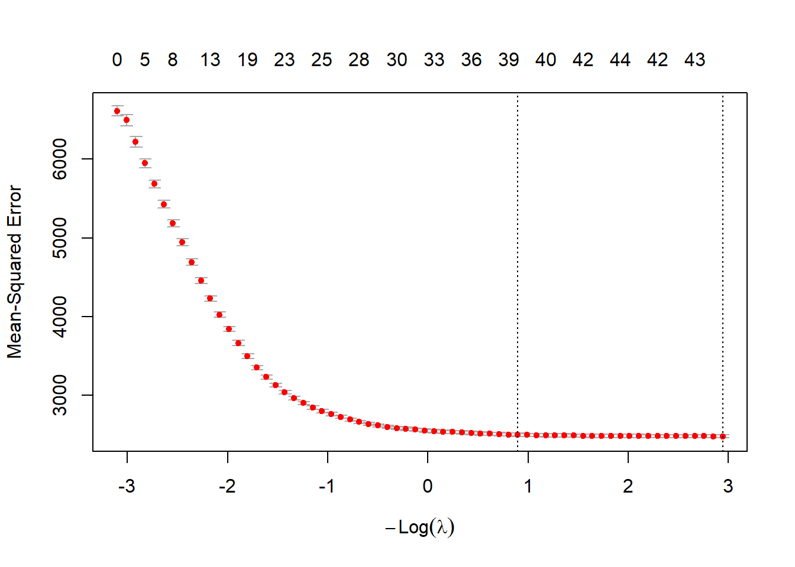

```r
# Coefficients:

coef(cv_model)
```

```
46 x 1 sparse Matrix of class "dgCMatrix"
                          lambda.1se
(Intercept)            -8.635785e+02
District2               1.134907e+01
District4              -4.028622e+01
District5               7.137695e+01
District6               .           
District7              -1.954226e+01
District8               1.880525e+01
District9               4.307692e+01
District10              7.934201e+01
District11              9.296592e+01
District12              2.317774e-01
District13              9.032709e+01
District14              1.284919e+02
District15             -5.282402e+01
ExtwallBlock           -3.589080e+00
ExtwallBrick            7.581600e+00
ExtwallFiber-Cement     4.809818e+01
ExtwallFrame           -3.851441e+00
ExtwallMasonry / Frame  2.764569e+00
ExtwallPrem Wood        8.357316e+00
ExtwallStone            1.751120e+01
ExtwallStucco           5.022336e+00
Stories1               -1.520187e+01
Stories1.5              .           
Stories2                1.598476e+00
Year_Built              4.653726e-01
Fin_sqft                7.077201e-02
Units1                  7.000043e+01
Units2                 -3.323116e+00
Units3                 -2.992420e+01
Bdrms0                  8.837086e+00
Bdrms1                 -1.482303e+01
Bdrms2                 -5.203189e+00
Bdrms3                  8.495290e+00
Bdrms4                  4.591476e-01
Bdrms5                  .           
Bdrms6                 -1.505946e+01
Bdrms7                 -2.745586e+01
Bdrms8                 -2.561850e+01
Fbath0                  .           
Fbath1                 -2.185965e+01
Fbath2                  .           
Fbath3                  8.628325e+00
Fbath4                  .           
Lotsize                 2.131218e-03
Sale_date               5.418531e-03
```

## 9.6 A final note

In modern statistics, forward/backward and stepwise are some what legacy methods for variable selection. They are easy to understand, but losing the meaning of the p-values often renders them not useful in many applications. It is better to choose one model based on scientific and domain knowledge, and interpret those p-values. This is not feasible for high dimensional data, and in that case, LASSO, elastic net regression are great for prediction and variable selection problems. P-values for high dimensional regression problems exist, but are not so straightforward to obtain readily at the current time.

## 9.7 Homework questions

Complete the Chapter 10 questions from the textbook.

**Exercise 9.2** Load car mileage data from [Example 3.8](Unit_2.html#exm-3-4-4) and run \(10\)-fold cross validation on all subset models. Which model is the best? Try LASSO regression. Try Forward and backaward selection.
