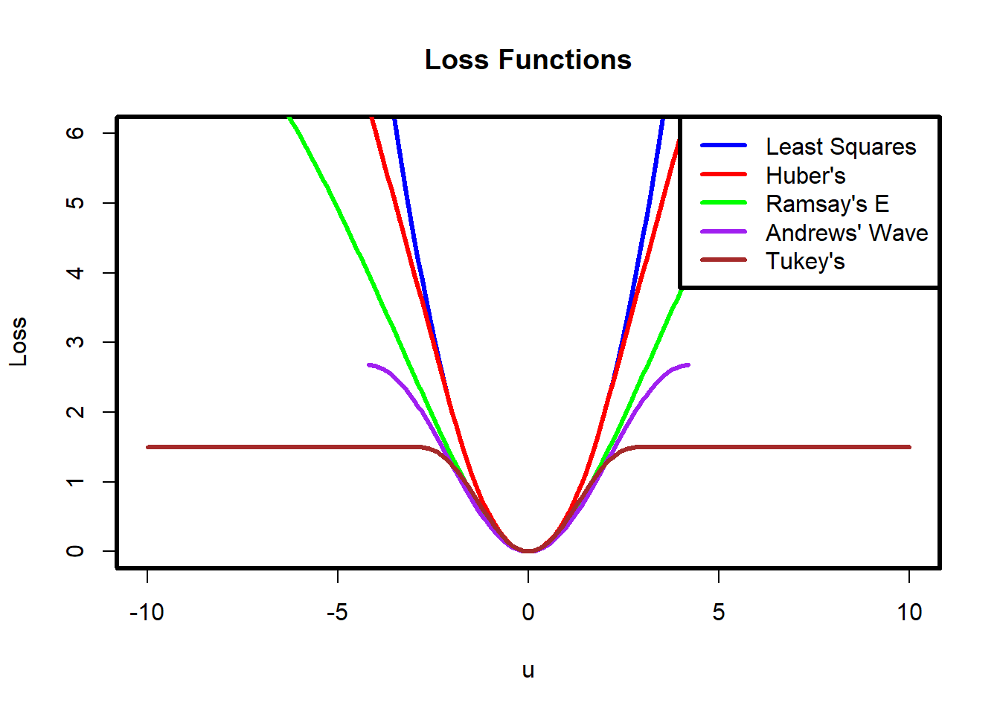
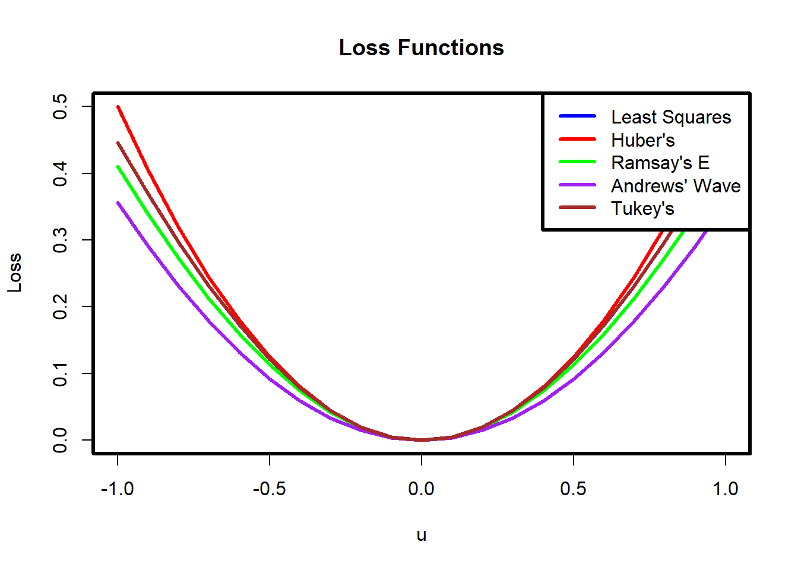
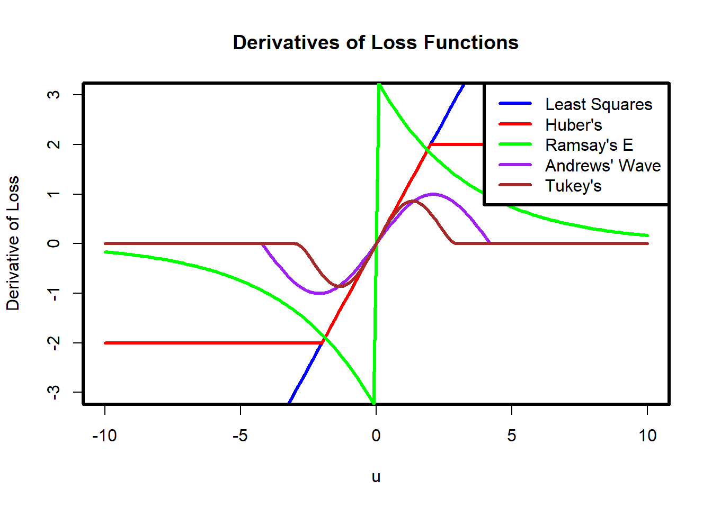
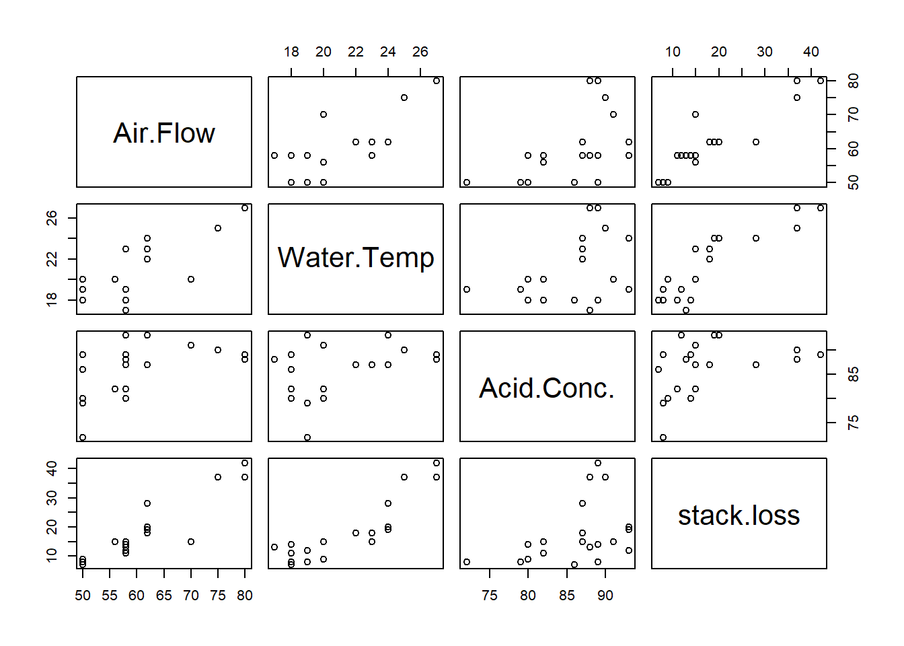
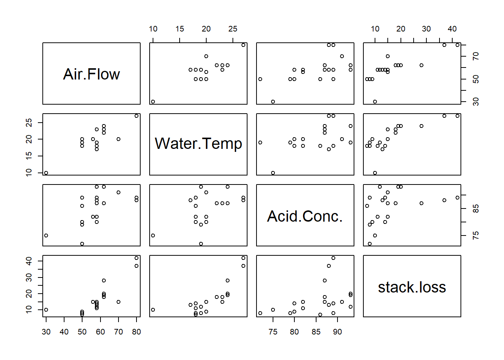

# Unit_9 - Robust Regression

# 10 Robust Regression

A serious problem that may dramatically impact the usefulness of a regression model is that of outlying observations. We have seen trying to locate and remove outliers, but an alternative technique is to use robust statistics. Robust statistics is a field of statistics that develops estimators that are not corrupted by outlying observations.

Recall that we minimize the squared error to obtain the least squares estimator. The best estimator was defined as the minimizer of \[C(\beta)=\sum_{i=1}^n (Y_i-\beta^\top X_i)^2.\] The squared error is an example of a **cost function**. The fact that the errors are squared implies that unusually large residuals will contribute significantly to the cost function. We may instead define the best estimator to minimize another cost function, say \[C(\beta)=\sum_{i=1}^n |Y_i-\beta^\top X_i|.\] The absolute value function grows linearly, thus, it is less affected by unusually large residuals. We can go a step further and design a cost function that is even less affected by unusually large residuals.

## 10.1 \(M\)-estimators

\(M\)-estimators are a group of estimators which can be defined as minimizers of cost functions. (The \(M\) stands for minimizers.) We can define an error function \(\rho\) as a function such that \(\rho(|x|)\) is non-negative, non-decreasing and \(\rho(0)=0\). We can then define the **\(M\)-estimator** with error function \(\rho\) as \[\hat\beta=\mathop{\mathrm{argmin}}_\beta C_\rho(\beta)=\mathop{\mathrm{argmin}}_\beta \sum_{i=1}^n\rho(Y_i-\beta^\top X_i)=\mathop{\mathrm{argmin}}_\beta \sum_{i=1}^n\rho(\hat\epsilon_i(\beta)),\] where \(\hat\epsilon_i(\beta)=Y_i-\beta^\top X_i\). Note that for arbitrary \(\rho\), the above may not have a unique minimizer, which may be problematic for computational algorithms and theoretical analysis. An \(M\)-estimator is an alternative to the OLS estimator. The idea is to define \(\rho\) so that large residuals \(\hat\epsilon_i(\beta)\) do not contribute more than they should to the cost function. To elaborate, we would like \(\rho(\hat\epsilon_i(\beta))\) to be somewhat large if \(\hat\epsilon_i(\beta)\) is large, because that signals that the model defined by \(\beta\) does not fit the data well at that point. On the other hand, if observation \(i\) is an outlier, than we don’t want to try too hard to make the model fit that point.

One drawback of \(M\)-estimators is that they are not necessarily scale invariant. For example, we have that \[Y=X\beta+\epsilon\implies aY=aX\beta+a\epsilon.\] Therefore, it is natural that we would expect the estimation procedure applied to \((X,Y)\) to produce the same estimator for \(\beta\) as the estimation procedure applied to \((aX,aY)\). Unfortunately, this is not always the case for \(M\)-estimators. One way to remedy this is to obtain a (robust) scale estimate \(s\), and then define the estimate as \[\mathop{\mathrm{argmin}}_\beta \sum_{i=1}^n\rho(\frac{Y_i-\beta^\top X_i}{s}).\] For example, the median absolute deviation divided by \(0.6745\) is often used.

## 10.2 Different \(\rho\) functions

Let \(\psi\) be the derivative of \(\rho\). Some common choices for \(\rho\) include the following:

### 10.2.1 Least Squares

Least squares loss, also known as quadratic loss, is the most common loss function in regression analysis. It is defined as the square of the residuals (the differences between observed and predicted values).

\[ \rho(u) = u^2, \qquad\qquad \psi(u)=2u. \]

It is highly sensitive to outliers because the squared term amplifies large residuals, making it less robust in the presence of outliers.

### 10.2.2 Huber’s Loss

Huber’s loss is a piecewise loss function that is quadratic for small residuals and linear for large residuals. It is less sensitive to outliers compared to least squares loss. This loss provides a compromise between least squares and absolute loss, offering robustness to outliers while retaining efficiency for small residuals.

\[ \rho(u) = \begin{cases}
u^2 / 2 & \text{if } |u| \leq \delta \\
\delta(|u| - \delta/2) & \text{if } |u| > \delta
\end{cases}, \qquad\qquad \psi(u)= \begin{cases}
u & \text{if } |u| \leq \delta \\
\delta \times sign(u) & \text{if } |u| > \delta
\end{cases}. \]

The next three losses offer even more robustness to outliers, potentially at the cost of efficiency.

### 10.2.3 Ramsay’s \(E\) Function

Ramsay’s \(E\) function is used to give higher influence to residuals near zero and less influence to large residuals.

\[ \rho(u) = \frac{1-(1+\delta |u|)\exp(-\delta |u|)}{\delta ^2},\qquad\qquad \psi(u)=sign(u)\exp(-\delta |u|)/\delta.\]

### 10.2.4 Andrews’ Wave Function

Andrews’ wave function is a loss function that limits the influence of large residuals more than Huber’s loss.

\[ \rho(u) = \delta \left(1 - \cos\left(\frac{u}{\delta}\right)\right),\qquad\qquad \psi(u)=\frac{\sin(u/\delta)}{u/\delta}. \]

### 10.2.5 Tukey’s Loss

Tukey’s loss function, also known as the biweight loss function, completely cuts off the influence of residuals beyond a certain point.

\[ \rho(u) = \begin{cases}
\frac{c^2}{6} \left[1 - \left(1 - \left(\frac{u}{c}\right)^2\right)^3\right] & \text{if } |u| \leq c \\
\frac{c^2}{6} & \text{if } |u| > c
\end{cases},\qquad\qquad \psi(u)=\begin{cases}
u \left(1 - \left(\frac{u}{c}\right)^2\right)^2 & \text{if } |u| \leq c \\
0 & \text{if } |u| > c
\end{cases}.\]

Let’s graph each of these functions:

```r
# Define the least squares loss function
least_squares_loss <- function(u) {
  return(u^2/2)
}

# Define Huber's loss function
hubers_loss <- function(u, delta=2) {
  return(ifelse(abs(u) <= delta, 0.5 * u^2, delta * (abs(u) - 0.5 * delta)))
}

# Define Ramsay's E function
ramsays_e_function <- function(u, delta=0.3) {
  return((1-(1+delta*abs(u))*exp(-delta*abs(u)))/(delta^2))
}

# Define Andrews' wave function
andrews_wave_function <- function(u, delta=1.339) {
  if(abs(u / delta)<pi)
    return(delta * (1 - cos(u / delta)))
  else
    return(NA)
}

# Define Tukey's loss function
tukeys_loss <- function(u, c=3) {
  abs_u <- abs(u)
  return(ifelse(abs_u <= c, (c^2 / 6) * (1 - (1 - (u / c)^2)^3), c^2 / 6))
}

u <- seq(-10,10, by = 0.1)

ls_loss <- sapply(u,least_squares_loss)
h_loss <- sapply(u,hubers_loss)
r_loss <- sapply(u,ramsays_e_function)
a_loss <- sapply(u,andrews_wave_function)
tukey_loss <- sapply(u,tukeys_loss)

par(lwd=3)
# Plotting example losses for visualization
plot(u, ls_loss, type = "l", col = "blue", ylim = c(0, 6), ylab = "Loss", xlab = "u", main = "Loss Functions")
lines(u, h_loss, col = "red")
lines(u, r_loss, col = "green")
lines(u, a_loss, col = "purple")
lines(u, tukey_loss, col = "brown")
legend("topright", legend = c("Least Squares", "Huber's", "Ramsay's E", "Andrews' Wave",  "Tukey's"), 
       col = c("blue", "red", "green", "purple", "brown"), lty = 1)
```



```r
#Zooming in 

u <- seq(-1, 1, by = 0.1)

ls_loss <- sapply(u,least_squares_loss)
h_loss <- sapply(u,hubers_loss)
r_loss <- sapply(u,ramsays_e_function)
a_loss <- sapply(u,andrews_wave_function)
tukey_loss <- sapply(u,tukeys_loss)

par(lwd=3)
# Plotting example losses for visualization
plot(u, ls_loss, type = "l", col = "blue", ylab = "Loss", xlab = "u", main = "Loss Functions",ylim=c(0,0.5))
lines(u, h_loss, col = "red")
lines(u, r_loss, col = "green")
lines(u, a_loss, col = "purple")
lines(u, tukey_loss, col = "brown")
legend("topright", legend = c("Least Squares", "Huber's", "Ramsay's E", "Andrews' Wave",  "Tukey's"), 
       col = c("blue", "red", "green", "purple", "brown"), lty = 1)
```



We see that the cost attributed to large residuals varies based on the chosen function. Most of the functions appear quadratic near 0, but have quite different behaviours at large values. Tukey and Andrew’s Wave function completely cut off the influence of large residuals, which the remaining functions just dampen the influence (except of course, the lease squares loss). Huber’s function and the least squares function are convex functions, which make computation of the minimzer considerably easier. Huber’s function is about as robust as we can be, while still maintaining a convex loss function. Data drawn from distributions with heavy tails (data with many “large” observations) require more robust loss functions, such as the Tukey biweight function.

The robustness of a regression procedure can be classified by the behavior of \(\psi\), the derivative of \(\rho\). The \(\psi\) function controls the weight given to each residual and is proportional to a central concept in robustness called the **influence function.** Unbounded influence functions are not desirable from a robustness perspective, as this means that one corrupted point is able to drag the estimated hyperplane arbitrarily far. The \(\psi\) function for least squares \(\rho\) is unbounded, and thus least squares tends to be “nonrobust” when used with data arising from a heavy - tailed distribution. On the other hand. the Huber loss function has a monotone \(\psi\) function and is not unbounded, making it more robust.

The other influence functions actually redescend as the residual becomes larger. Ramsay’s \(E\) function is a soft redescender, that is, the \(\psi\) function is approaches zero as \(|z|\to\infty\). Andrew’s wave function and Tukey loss are hard redescenders. That is, the \(\psi\) function equals zero for sufficiently large \(|z|\). Note that the \(\rho\) functions associated with the redescending \(\psi\) functions are nonconvex, and this in theory can cause convergence problems in the iterative estimation procedure. We graph the functions below with their common default tuning parameters:

```r
# Define the derivative of the least squares loss function
d_least_squares_loss <- function(u) {
  return(u)
}

# Define the derivative of Huber's loss function
d_hubers_loss <- function(u, delta = 2) {
  return(ifelse(abs(u) <= delta, u, delta * sign(u)))
}

# Define the derivative of Ramsay's E function
d_ramsays_e_function <- function(u, delta = 0.3) {
  return(sign(u)*exp(-delta*abs(u))/delta)
}

# Define the derivative of Andrews' wave function
d_andrews_wave_function <- function(u, delta = 1.339) {
  if(abs(u / delta) < pi)
    return(sin(u / delta))
  else
    return(NA)
}

# Define the derivative of Tukey's loss function
d_tukeys_loss <- function(u, c = 3) {
  abs_u <- abs(u)
  return(ifelse(abs_u <= c, u * (1 - (u / c)^2)^2, 0))
}

u <- seq(-10, 10, by = 0.1)

d_ls_loss <- sapply(u, d_least_squares_loss)
d_h_loss <- sapply(u, d_hubers_loss)
d_r_loss <- sapply(u, d_ramsays_e_function)
d_a_loss <- sapply(u, d_andrews_wave_function)
d_tukey_loss <- sapply(u, d_tukeys_loss)

par(lwd = 3)
# Plotting example derivatives for visualization
plot(u, d_ls_loss, type = "l", col = "blue", ylim = c(-3, 3), ylab = "Derivative of Loss", xlab = "u", main = "Derivatives of Loss Functions")
lines(u, d_h_loss, col = "red")
lines(u, d_r_loss, col = "green")
lines(u, d_a_loss, col = "purple")
lines(u, d_tukey_loss, col = "brown")
legend("topright", legend = c("Least Squares", "Huber's", "Ramsay's E", "Andrews' Wave",  "Tukey's"), 
       col = c("blue", "red", "green", "purple", "brown"), lty = 1)
```



## 10.3 Computing \(M\)-estimators

### 10.3.1 Iterated re-weighted least squares

Let \(\psi\) be the derivative of \(\rho\). A common way to compute the minimizer, of \(C_\rho(\beta)\) is to use [iterated re-weighted least squares](https://en.wikipedia.org/wiki/Iteratively_reweighted_least_squares). First, note that to find the minimizer, of \(C_\rho(\beta)\), we solve the following system of equations: \[\sum_{i=1}^n X_{ij} \psi\left(\frac{Y_i-X_i^{\top} \beta}{s}\right)=0, \quad j=0,1, \ldots, k.\] To do this, rewrite \[\begin{align*}
&\sum_{i=1}^n X_{i j} \psi\left(\frac{Y_i-X_i^{\top} \beta}{s}\right)\frac{Y_i-X_i^{\top} \beta}{s}\big /\frac{Y_i-X_i^{\top} \beta}{s}=0\\
&\text{ or, }\sum_{i=1}^n X_{i j} w_{i,\beta}\frac{Y_i-X_i^{\top} \beta}{s}=0,
\end{align*}\] where \[w_{i,\beta}= \psi\left(\frac{Y_i-X_i^{\top} \beta}{s}\right)\big /\frac{Y_i-X_i^{\top} \beta}{s}.\]

Next, one will propose an initial estimate of the parameters \(\alpha_0\) and consider \[\begin{align*}
\sum_{i=1}^n X_{i j} w_{i, \alpha_0}(Y_i-X_i^{\top} \beta)=0.
\end{align*}\] Equivalently, we have \(X^\top W_{\alpha_0} X\beta=X^\top W_{\alpha_0} Y\), where \(W_{\alpha_0}\) is an \(n \times n\) diagonal matrix of “weights” with diagonal elements \(w_{1, \alpha_0},\ldots, w_{n, \alpha_0}\). The algorithm proceeds as follows: iteratively compute \(\alpha_i=(X^\top W_{\alpha_{i-1}} X)^{-1}X^\top W_{\alpha_{i-1}} Y\) until \(\left\lVert\alpha_i-\alpha_{i-1}\right\rVert<\epsilon\) for small \(\epsilon\).

### 10.3.2 Gradient descent

We can also use [gradient descent](https://en.wikipedia.org/wiki/Gradient_descent) to compute the minimizer, of \(C_\rho(\beta)\). To do this given a step size \(\eta>0\), iteratively compute \[\alpha_{i}=\alpha_{i-1}-\eta\times\sum_{i=1}^n X_{i} \psi\left(\frac{Y_i-X_i^{\top} \alpha_{i-1}}{s}\right),\] until \(\left\lVert\alpha_i-\alpha_{i-1}\right\rVert<\epsilon\) for small \(\epsilon\).

**Example 10.1** Consider the stack loss data, it records the percentage of stack loss in the operation of a plant that uses the oxidation of ammonia to produce nitric acid. The data set contains four variables and 21 observations.

Variables - **Air.Flow**: Flow rate of cooling air (in cubic meters per hour) - **Water.Temp**: Cooling water inlet temperature (in degrees Celsius) - **Acid.Conc.**: Acid concentration (percentage) - **stack.loss**: Stack loss (percentage of the ammonia lost)

Regress stack loss on the remaining variables. Compare various robust regression estimates to the OLS estimates. Add a large outlier and repeat the process. What do you observe?

The `rlm` function in the `MASS` package allows us to run robust regression. Huber’s loss is used by default.

```r
# Computes how many standard errors coeficients are different by between models m1 and m2
compute_movement=function(m1,m2){
  vb=summary(m2)
  return(abs(coef(m2)-coef(m1))/vb$coef[,2])
}

library(MASS)

plot(stackloss)
```



```r
#fit robust regression model
# psi argument specifies psi... 
# run ?rlm for more details.
OLS1=lm(stack.loss ~ ., stackloss)
RR=rlm(stack.loss ~ ., stackloss)
summary(OLS1)
```

```

Call:
lm(formula = stack.loss ~ ., data = stackloss)

Residuals:
    Min      1Q  Median      3Q     Max 
-7.2377 -1.7117 -0.4551  2.3614  5.6978 

Coefficients:
            Estimate Std. Error t value Pr(>|t|)    
(Intercept) -39.9197    11.8960  -3.356  0.00375 ** 
Air.Flow      0.7156     0.1349   5.307  5.8e-05 ***
Water.Temp    1.2953     0.3680   3.520  0.00263 ** 
Acid.Conc.   -0.1521     0.1563  -0.973  0.34405    
---
Signif. codes:  0 '***' 0.001 '**' 0.01 '*' 0.05 '.' 0.1 ' ' 1

Residual standard error: 3.243 on 17 degrees of freedom
Multiple R-squared:  0.9136,    Adjusted R-squared:  0.8983 
F-statistic:  59.9 on 3 and 17 DF,  p-value: 3.016e-09
```

```r
summary(RR)
```

```

Call: rlm(formula = stack.loss ~ ., data = stackloss)
Residuals:
     Min       1Q   Median       3Q      Max 
-8.91753 -1.73127  0.06187  1.54306  6.50163 

Coefficients:
            Value    Std. Error t value 
(Intercept) -41.0265   9.8073    -4.1832
Air.Flow      0.8294   0.1112     7.4597
Water.Temp    0.9261   0.3034     3.0524
Acid.Conc.   -0.1278   0.1289    -0.9922

Residual standard error: 2.441 on 17 degrees of freedom
```

```r
compute_movement(RR,OLS1)
```

```
(Intercept)    Air.Flow  Water.Temp  Acid.Conc. 
 0.09304446  0.84335755  1.00313478  0.15530572 
```

```r
# Air flow and water temp moved one standard error. 

# We can compare the estimates to their standard errors. 

# Adding the outlier
stackloss2=stackloss
n=nrow(stackloss)
stackloss2[3,]=c(30,10,75,10)
plot(stackloss2)
```



```r
OLS=lm(stack.loss ~ ., stackloss2)
RR_Hu=rlm(stack.loss ~ ., stackloss2, maxit = 100)
RR_Ha=rlm(stack.loss ~ ., stackloss2, psi = psi.hampel, maxit = 100)
RR_Tu=rlm(stack.loss ~ ., stackloss2, psi = psi.bisquare, maxit = 100)
```

```
Warning in rlm.default(x, y, weights, method = method, wt.method = wt.method, :
'rlm' failed to converge in 100 steps
```

```r
# Error from uncorrupted estimates
error=rbind(compute_movement(OLS,OLS1),
compute_movement(RR_Hu,OLS1),
compute_movement(RR_Ha,OLS1),
compute_movement(RR_Tu,OLS1))
rownames(error)=c("OLS","Huber","Hampel","Tukey")
error
```

```
       (Intercept)    Air.Flow Water.Temp Acid.Conc.
OLS      2.3766707 1.317436984  1.4611311  0.4406644
Huber    0.5905931 0.006153154  1.4286807  0.2686428
Hampel   0.1180260 0.047197074  0.4429042  0.1073847
Tukey    0.2180443 0.716273230  2.0518634  0.5167066
```

```r
rowSums(error)
```

```
     OLS    Huber   Hampel    Tukey 
5.595903 2.294070 0.715512 3.502887 
```

```r
# summary(lm(stack.loss ~ ., stackloss2))
# summary(rlm(stack.loss ~ ., stackloss2))
# summary(rlm(stack.loss ~ ., stackloss2, psi = psi.hampel))
# summary(rlm(stack.loss ~ ., stackloss2, psi = psi.bisquare))

res=rbind(coef(OLS),
coef(RR_Hu),
coef(RR_Ha),
coef(RR_Tu),
coef(OLS1))
rownames(res)=c("OLS","Huber","Hampel","Tukey","Before Corruption")
res
```

```
                  (Intercept)  Air.Flow Water.Temp  Acid.Conc.
OLS                 -11.64681 0.5379730  0.7575544 -0.22099574
Huber               -32.89398 0.7164700  0.7694970 -0.11013524
Hampel              -38.51564 0.7220051  1.1322866 -0.13533894
Tukey               -37.32582 0.8122355  0.5401506 -0.07136436
Before Corruption   -39.91967 0.7156402  1.2952861 -0.15212252
```

## 10.4 Homework questions

Complete question 15.5 in the textbook.

**Exercise 10.1** In the previous examples given in class, add a large outlier and run both least squares and robust regression. How many standard errors did the coefficients move? How large does the outlier need to be for the regression to become corrupted? Repeat the process with a cluster of small outliers.

**Exercise 10.2** Why are the OLS estimators susceptible to outliers?

**Exercise 10.3** Implement gradient descent and IRLS in R for Huber’s loss function.
